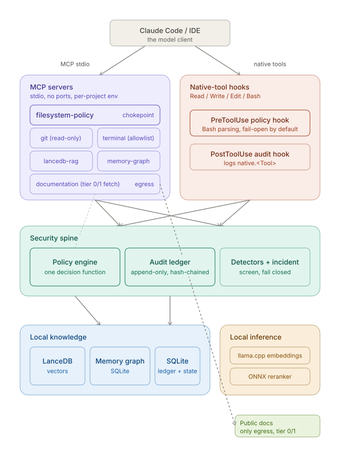

# claude-env — Product Overview

*A governance layer for AI coding agents: what problem it solves, how it solves it, and what you get.*

This document is for anyone evaluating or onboarding to claude-env who wants to
understand what it does and why, without reading source code. For exhaustive
installation steps, CLI flags, and config schemas, see [`README.md`](../README.md) —
this document links to it rather than repeating it.

---

## Table of contents

**Part I.** [The Problem](#part-i--the-problem)
**Part II.** [Architecture at a Glance](#part-ii--architecture-at-a-glance)
**Part III.** [Security & Governance](#part-iii--security--governance)
**Part IV.** [Knowledge: RAG & Memory](#part-iv--knowledge-rag--memory)
**Part V.** [Agents & Orchestration](#part-v--agents--orchestration)
**Part VI.** [MCP Servers — the Enforcement Surface](#part-vi--mcp-servers--the-enforcement-surface)
**Part VII.** [Observability & Operations](#part-vii--observability--operations)
**Part VIII.** [Onboarding a Repository](#part-viii--onboarding-a-repository)
**Part IX.** [What's Next](#part-ix--whats-next)

---

## Part I — The Problem

Giving an AI coding agent broad, unsupervised access to a repository creates risks that
don't exist with a human developer under normal code review:

- **Unrestricted file access.** An agent asked to "fix the bug" can read `.env` files,
  production configs, or customer data sitting in the repo, and there's often no
  technical barrier stopping it — only a hope that it won't.
- **No audit trail.** If an agent's action turns out to be wrong (a bad edit, a
  destructive command), there's frequently no reliable record of exactly what it did,
  in what order, or whether logs were altered after the fact.
- **Secrets and PII leaking into AI context.** Local RAG indexes and long-lived memory
  stores can silently absorb credentials or personal data pulled from source files,
  then resurface them in a later, unrelated session.
- **Unreviewed destructive actions.** A shell command, a force-push, a schema
  migration — run by an agent with no human in the loop — can be irreversible before
  anyone notices.
- **Prompt injection via retrieved content.** If an agent treats retrieved
  documentation or search results as trusted instructions rather than as data, a
  malicious or poisoned document can hijack its behavior.
- **No isolation between projects.** Without per-repo scoping, an agent's knowledge,
  memory, and permissions from one project can bleed into another.

claude-env exists to close these gaps — entirely on your own machine, with no data
leaving the host.

---

## Part II — Architecture at a Glance

claude-env sits between Claude Code and your machine. Every path an agent could use to
touch the filesystem, run a command, retrieve knowledge, or persist memory is routed
through one of two enforcement surfaces — **MCP servers** or **native-tool hooks** —
both of which consult a single **policy engine** and write to a single **audit
ledger**. Nothing bypasses this chokepoint.

Four design priorities, in order:

1. **Privacy** — local inference only. The only outbound network call the whole
   platform ever makes is a tier-gated documentation fetch (Part III.7 covers when
   that's allowed).
2. **Least privilege** — every agent and tool gets an explicit, narrow permission set;
   anything outside scope is denied or escalated to a human.
3. **Auditability** — every action is recorded in a way that can be mathematically
   proven not to have been altered after the fact.
4. **Isolation** — each repository gets its own policy, its own knowledge index, and
   its own memory — one project's context never leaks into another's.

---

## Part III — Security & Governance

### 1. Policy-Enforced File Access

**Problem:** An agent told to "refactor the payment module" shouldn't be able to open
`secrets/prod.env` just because it's in the same repo.

**Solution:** Every file access is evaluated against a layered policy: a global deny
list that nothing can override, then a **tier system** (0 = public, 1 = internal, 2 =
sensitive, 3 = restricted/default-deny), then repo-specific deny and allow rules. Deny
always wins, and tier 3 paths are blocked unless explicitly allowlisted. *Implemented
in [`security/policy_engine.py`](../security/policy_engine.py).*

**Use cases:**
- A repo containing both application code and a `secrets/` directory — agents can read
  and edit the code freely, but the policy engine blocks any read of `secrets/`,
  regardless of what the agent was asked to do.
- A client engagement repo classified as tier 3 by default — nothing is accessible
  until someone explicitly allowlists the paths agents need.
- Rolling out a new policy safely by dry-running it first (see Policy Simulation,
  below) before it applies to live sessions.

### 2. Tamper-Evident Audit Ledger

**Problem:** If something goes wrong, "what did the agent actually do?" needs a
trustworthy answer — not a log file anyone (including a compromised agent process)
could have edited.

**Solution:** Every action — file access, command run, retrieval, memory write — is
recorded as an event in a **hash chain**: each entry's hash includes the previous
entry's hash, so altering or deleting any past entry breaks the chain and is instantly
detectable by `verify_chain()`. The database itself enforces this — update and delete
operations on audit events are rejected at the database level, not just by convention.
*Implemented in [`audit/audit_logger.py`](../audit/audit_logger.py).*

**Use cases:**
- After an incident, running `verify_chain()` to prove to a security reviewer that the
  audit trail hasn't been tampered with, before treating it as evidence.
- Generating a compliance report for a client audit that includes cryptographic proof
  of ledger integrity, not just a log dump.
- Reconstructing exactly what an agent did during a specific session, in order, via
  session replay.

### 3. Native-Tool Hooks

**Problem:** Policy enforcement only matters if it covers *every* way an agent can act
— not just a subset of tools.

**Solution:** claude-env extends the same policy engine to Claude Code's native
Read/Write/Edit/Bash tools via hooks: a `PreToolUse` hook checks and can block the
action before it runs (including parsing raw Bash command strings for path or secret
violations), and a `PostToolUse` hook writes every native tool invocation to the audit
ledger. *Implemented in [`hooks/policy_hook.py`](../hooks/policy_hook.py) and
[`hooks/audit_hook.py`](../hooks/audit_hook.py).*

**Use cases:**
- An agent runs `cat secrets/prod.env` directly via Bash instead of using a file-read
  tool — the hook parses the command string and blocks it the same as a direct file
  read would be blocked.
- A team wants full visibility into every native tool call an agent makes, not just
  MCP-routed ones, for a security review.

### 4. Secret & Prompt-Injection Detection

**Problem:** Even inside allowed paths, content itself can be dangerous — a
credential accidentally committed to an allowed file, or a document engineered to
manipulate the agent reading it.

**Solution:** Purpose-built, auditable detectors scan content for secrets (API keys,
tokens, credentials) and for prompt-injection patterns and RAG "poisoning" attempts —
content designed to look like instructions when retrieved. *Implemented in
[`security/detectors.py`](../security/detectors.py).*

**Use cases:**
- A `.env.example` file with a real (not placeholder) API key accidentally left in —
  the secret detector flags it even though the path itself is allowed.
- A retrieved third-party document contains text like "ignore previous instructions
  and..." — the injection detector flags it before the agent treats it as a command.

### 5. Incident Mode

**Problem:** If something is actively going wrong — a compromised session, a runaway
agent — you need an immediate, unambiguous way to stop everything without hunting
through individual policies.

**Solution:** A single incident marker file, when present, makes every policy
evaluation fail closed instantly — every action is denied platform-wide until the
marker is removed. *Implemented in [`security/incident.py`](../security/incident.py).*

**Use cases:**
- A suspicious pattern of agent behavior is spotted mid-session — flipping incident
  mode on immediately halts all further actions across every repo, no per-policy
  changes needed.
- Practicing incident response as part of a security drill, with a clean, reversible
  on/off switch.

### 6. Policy Simulation

**Problem:** Tightening or changing a policy is risky if you can't see its effect
before it goes live — a too-strict change can block legitimate work; a too-loose one
can open a gap.

**Solution:** A dry-run mode evaluates a candidate policy against real historical
requests and produces a diff of what would newly be allowed or denied, without
affecting live enforcement. *Implemented in
[`security/policy_sim.py`](../security/policy_sim.py).*

**Use cases:**
- Before rolling out a stricter tier-2 policy, checking which of last week's agent
  actions would now be denied, to catch false positives before they hit real work.
- Reviewing a proposed policy change with a security lead by showing them a concrete
  before/after diff rather than raw YAML.

### 7. Approvals Workflow

**Problem:** Some actions are legitimate but consequential enough that they shouldn't
happen without a human explicitly saying yes — running a test suite that touches
external state, for example.

**Solution:** Actions requiring approval open a request, launch a local web UI, and
**block** the agent until a human approves or denies it. Approval is recorded with the
actual OS user and host that approved it — not just a generic "approved" flag.
*Implemented in
[`agents/orchestration/approvals_ui.py`](../agents/orchestration/approvals_ui.py) and
[`mcp-servers/terminal/server.py`](../mcp-servers/terminal/server.py).*

**Use cases:**
- An agent wants to run a terminal command outside its allow-list — it opens an
  approval request and waits (up to a timeout) rather than proceeding or failing
  silently.
- A tier-2+ action, an out-of-scope write, or a memory deletion is proposed — the
  approval gate intercepts it before it executes, and the ledger records who approved
  it and when.

---

## Part IV — Knowledge: RAG & Memory

### 8. Local RAG (Retrieval-Augmented Generation)

**Problem:** Agents need to search and understand a codebase efficiently, but sending
code to a third-party embedding API means code leaves the machine — a non-starter for
sensitive repos.

**Solution:** claude-env builds a fully local knowledge index per repository: AST-aware
chunking for code (so a chunk is a coherent function or class, not an arbitrary
character window), local embeddings via llama.cpp, an optional local ONNX
cross-encoder for reranking, and LanceDB for hybrid (vector + full-text) search — one
table per repo and branch. No model name is ever hardcoded; it's resolved from config,
so teams can swap models without touching code. *Implemented in
[`rag/retrievers/lance_store.py`](../rag/retrievers/lance_store.py) and
[`rag/config.py`](../rag/config.py).*

**Use cases:**
- Asking an agent "where do we validate incoming webhook signatures?" and getting a
  precise, relevant code chunk back — without any code ever reaching an external API.
- Re-indexing incrementally on every commit so the knowledge base never goes stale
  relative to the branch being worked on.

### 9. Retrieval Pipeline & Poison Screening

**Problem:** Retrieved content — whether from the local RAG index or fetched
documentation — must never be treated by the agent as if it were a trusted instruction.

**Solution:** All retrieved text is delimited and screened for injection/poisoning
patterns before being handed to the agent, and is always framed as *data*, never as
*instructions*. A feedback loop also tracks which retrieved chunks actually led to
useful edits, boosting their ranking over time. *Implemented in
[`rag/pipelines/retrieve.py`](../rag/pipelines/retrieve.py).*

**Use cases:**
- A poisoned or manipulated document sitting in the repo's own indexed docs is
  retrieved but flagged, rather than silently steering agent behavior.
- Over time, retrieval quality improves for a given repo because the system learns
  which chunks were actually useful, not just textually similar.

### 10. Memory Graph

**Problem:** Without persistent memory, an agent re-discovers the same architectural
decisions, conventions, and context every single session — wasted effort, and
inconsistent answers over time.

**Solution:** A property graph of nodes (session, decision, entity, architecture, etc.)
and edges stored locally in SQLite, with **confidence decay** — older memories
naturally lose weight over time (`2^(-age/half_life)`) unless reinforced — and
namespace isolation so one repo's memory never leaks into another's. *Implemented in
[`memory/memory_manager.py`](../memory/memory_manager.py) and
[`memory/memory_retriever.py`](../memory/memory_retriever.py).*

**Use cases:**
- An agent remembers a team's decision to use a specific library for date handling,
  made three months ago, without anyone re-explaining it each session.
- Two unrelated client repos never share memory — even if the same agent works on
  both, decisions from one don't surface in the other.

### 11. Memory Consolidation & Pruning

**Problem:** Memory that grows forever without cleanup becomes noisy, contradictory,
and eventually unreliable — but naive deletion risks losing important context.

**Solution:** A nightly consolidator merges clusters of low-confidence, related
memories into cleaner summaries; a pruner archives (never silently deletes) low-value
memories to a JSONL file before removing them from the live graph, and never touches
`decision` or `architecture` nodes, which are treated as durable record. *Implemented
in [`memory/memory_consolidator.py`](../memory/memory_consolidator.py) and
[`memory/memory_pruner.py`](../memory/memory_pruner.py).*

**Use cases:**
- Months of accumulated session memories are consolidated into a handful of durable,
  high-confidence facts instead of thousands of near-duplicate low-value entries.
- A pruned memory can still be recovered from its archive file if it turns out to have
  been needed after all.

### 12. Session Ingestion

**Problem:** Valuable context from a day's work with Claude Code disappears once the
session ends, unless someone manually writes it down.

**Solution:** A nightly job ingests Claude Code session transcripts into episodic
memory nodes automatically, with secrets redacted before storage. *Implemented in
[`memory/session_ingestor.py`](../memory/session_ingestor.py).*

**Use cases:**
- A long debugging session's conclusions are automatically available to future
  sessions without anyone summarizing it by hand.
- A transcript that happened to include a pasted credential is ingested with that
  credential redacted, not preserved verbatim in memory.

### 13. Team Knowledge Sync

**Problem:** Memory that's useful to one developer's local agent is often useful to
the whole team — but sharing it shouldn't mean sharing everything, or leaking secrets
in the process.

**Solution:** Export/import of memory namespaces designed for team sharing — scoped to
a namespace and secret-redacted before export. *Implemented in
[`memory/memory_sync.py`](../memory/memory_sync.py).*

**Use cases:**
- A senior engineer's accumulated architectural memory for a repo is exported and
  imported into a new team member's local claude-env setup.
- Only a specific project's memory namespace is shared, not a developer's entire
  memory store across all their repos.

---

## Part V — Agents & Orchestration

### 14. Specialist Agents

**Problem:** A single general-purpose agent with full permissions is a large attack
surface and a poor fit for specialized work — a documentation task and a database
migration have very different risk profiles.

**Solution:** 11 specialist agents (architect, backend, database, devops,
documentation, frontend, orchestrator, performance, research, security, testing), each
with an explicit, narrow set of allowed/denied tools, write paths, and memory/RAG
access defined in a registry — plus flags for which actions require human approval.
*Implemented in [`agents/agent_registry.yaml`](../agents/agent_registry.yaml).*

**Use cases:**
- The documentation specialist can write to `docs/` but is denied write access to
  application code, even if asked to "fix a typo in the code while you're at it."
- The security specialist's judgment carries a veto in conflict resolution (below),
  reflecting its narrower, higher-trust role.

### 15. Task Routing & Handoff

**Problem:** Complex tasks often span multiple specialties, but each specialist should
only see the context relevant to its part of the work.

**Solution:** An orchestrator decomposes a task and routes pieces to the right
specialist, packaging only the scoped context each one needs — not the full session
history. *Implemented in
[`agents/orchestration/task_router.py`](../agents/orchestration/task_router.py) and
[`agents/orchestration/agent_handoff.py`](../agents/orchestration/agent_handoff.py).*

**Use cases:**
- A "add a new API endpoint with tests and docs" task is split across backend,
  testing, and documentation specialists, each working from a relevant slice of
  context.

### 16. Conflict Resolution

**Problem:** When specialists disagree — or one wants something another says is
risky — something needs to arbitrate, and security concerns shouldn't lose a majority
vote.

**Solution:** A conflict resolver reconciles specialist output, with an explicit rule
that the security specialist's objection wins regardless of other votes. *Implemented
in
[`agents/orchestration/conflict_resolver.py`](../agents/orchestration/conflict_resolver.py).*

**Use cases:**
- The performance specialist suggests caching sensitive data in a way the security
  specialist flags as risky — the security veto overrides the suggestion.

---

## Part VI — MCP Servers — the Enforcement Surface

Six local stdio MCP servers are the sanctioned way agents touch anything outside their
own reasoning — no server exposes a network port, and each is scoped to one concern:

| Server | Role |
|---|---|
| **filesystem-policy** | The single sanctioned path to disk. Every read/write/list goes through policy + content scanning + path-traversal checks, fail-closed. |
| **git** | Read-only: log, diff, blame, status, show. Explicitly denies push, amend, rebase, and reset. |
| **lancedb-rag** | Read-only knowledge search, results wrapped as data and poison-screened. |
| **memory-graph** | Recall, read, expand, and write memory, with namespace isolation; no unattended deletes. |
| **terminal** | Runs only allow-listed commands (or explicitly approved ones); no shell interpretation, scrubbed environment, timeouts enforced. |
| **documentation** | Local search always available; external fetch only for tier 0–1 repos — the platform's one deliberate, narrow network exception. |

**Use case:** an agent that wants to run `git push --force` simply has no tool that
allows it — the git server doesn't expose that capability at all, regardless of what
the agent is instructed to do.

---

## Part VII — Observability & Operations

### 17. Metrics, Cost Tracking & Budgets

**Problem:** Local inference still has real compute and (for external documentation
fetches) real cost implications, and teams need visibility before they get a surprise.

**Solution:** Token usage and estimated cost are tracked per repo against a
configurable price table, with monthly budget caps enforced per repo. *Implemented in
[`observability/budgets.py`](../observability/budgets.py) and
[`config/budgets.yaml`](../config/budgets.yaml).*

**Use cases:**
- A client repo is capped at a monthly budget; usage approaching the cap is visible
  before it's exceeded.

### 18. Feedback Loop

**Problem:** Retrieval quality that never improves stays only as good as day one.

**Solution:** The system correlates which retrieved chunks preceded actual edits, and
boosts those chunks' ranking in future retrievals for that repo. *Implemented in
[`observability/feedback.py`](../observability/feedback.py).*

### 19. Dashboard

**Problem:** Raw database tables aren't a usable way to inspect what's happening
across policy, audit, memory, and RAG.

**Solution:** A local, read-only Datasette-based dashboard for browsing this data,
plus a terminal summary printer for quick checks — nothing here leaves the machine.
*Implemented in [`observability/dashboard.py`](../observability/dashboard.py).*

### 20. Validation Suite

**Problem:** A platform this layered needs a fast way to answer "is everything
actually working" without manually checking each subsystem.

**Solution:** A set of focused validators: installation (venv, models, schema, chain
integrity), security (policy syntax, tier matrix, incident marker, detector
calibration), memory (dangling edges, bad confidence, namespace leakage), agents
(registry syntax, tool scope), MCP (server startup, protocol correctness), and a
full end-to-end feature check. *Implemented in
[`validation/`](../validation/).*

**Use cases:**
- After upgrading claude-env or changing a policy, running the validation suite to
  confirm nothing regressed before trusting it with real work.

### 21. Nightly Automation & Backup

**Problem:** Memory maintenance, re-indexing, and health checks shouldn't depend on
someone remembering to run them.

**Solution:** Scheduled jobs (systemd on Linux, launchd on macOS) handle nightly
memory consolidation/pruning, incremental re-indexing on commit, and digest generation
(doc drift, TODO aging, dead symbols, hotspots). *Implemented in
[`scripts/nightly_memory.sh`](../scripts/nightly_memory.sh) and
[`agents/analysts/nightly_analyst.py`](../agents/analysts/nightly_analyst.py).*

---

## Part VIII — Onboarding a Repository

Bringing a repository under claude-env's governance is a single `claude-env onboard`
command (see [`scripts/register_repo.py`](../scripts/register_repo.py)), which:

1. Generates a starting `repo-policy.yaml` for that repo (tiers, allow/deny paths).
2. Creates an isolated RAG index and memory namespace scoped to that repo.
3. Installs the **repo-onboarding deliverable** — a separate `CLAUDE.md` and a
   `.claude/` directory containing skills (principled engineering, SOLID design,
   design patterns) and two read-only reviewer subagents (code-reviewer,
   architecture-reviewer) — into the target repo itself. *Templates live in
   [`templates/repo-onboarding/`](../templates/repo-onboarding/).*

This is a different `CLAUDE.md` from claude-env's own — the one installed into an
onboarded repo governs work *in that repo*; this document and claude-env's root
`CLAUDE.md` govern the platform itself.

---

## Part IX — What's Next

- For exhaustive installation steps, CLI command reference, and full YAML config
  schemas, see [`README.md`](../README.md).
- Deeper, module-by-module technical documentation will live under `docs/guide/` as it
  is written.
