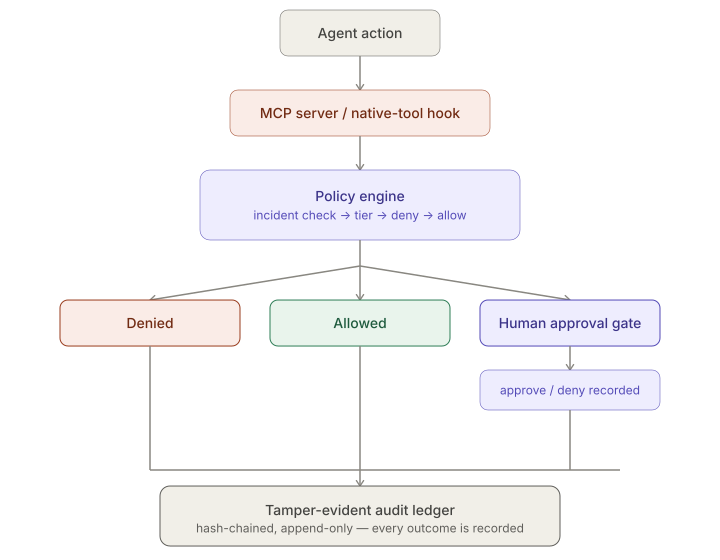

# claude-env — Product Overview

*Seven problems that show up when you give an AI coding agent real access to a repo — and what claude-env does about each one.*

This document is for anyone evaluating or onboarding to claude-env. Each section
below starts with a problem you'd actually recognize, names the feature(s) that solve
it, and walks through a concrete example — with the actual `claude-env` command you'd
run and the kind of output you'd see. For exhaustive installation steps, CLI flags,
and config schemas, see [`README.md`](../README.md) — this document links out to it
rather than repeating it.

> **New here?** Every command below is real — copy any of them once you've run
> `claude-env bootstrap` and `claude-env onboard <repo>` (see
> [README §3](../README.md#3-step-1--bootstrap-the-platform) and
> [§5](../README.md#5-step-3--onboard-a-repository)). Run `claude-env` with no
> arguments any time for the full, grouped command list.

---

## Table of contents

1. [The agent could read or touch something it shouldn't](#1-the-agent-could-read-or-touch-something-it-shouldnt)
2. [No one knows what the agent actually did](#2-no-one-knows-what-the-agent-actually-did)
3. [Risky actions run without anyone checking](#3-risky-actions-run-without-anyone-checking)
4. [The agent forgets everything, every session](#4-the-agent-forgets-everything-every-session)
5. [Knowledge and search shouldn't leave the building](#5-knowledge-and-search-shouldnt-leave-the-building)
6. [One generalist agent doing everything, badly](#6-one-generalist-agent-doing-everything-badly)
7. [You can't tell if it's working well or costing too much](#7-you-cant-tell-if-its-working-well-or-costing-too-much)
8. [How this actually gets turned on](#8-how-this-actually-gets-turned-on)

*Skimming? Jump straight to [the one-command onboarding flow](#8-how-this-actually-gets-turned-on)
or [the CLI's own command overview](../README.md#11-cli-command-reference).*

---

## Architecture at a glance

Before the details: claude-env sits between Claude Code and your machine. Every path
an agent could use to touch a file, run a command, retrieve knowledge, or remember
something is routed through one of two enforcement surfaces — **MCP servers** or
**native-tool hooks** — both of which consult a single **policy engine** and write to
a single **audit ledger**. Nothing bypasses this chokepoint, and nothing leaves your
machine except an optional, tier-gated documentation fetch.


---

## 1. The agent could read or touch something it shouldn't

**The problem.** You ask an agent to "fix a bug in the billing module." It technically
also has read access to `secrets/prod.env`, three folders over, because it's in the
same repo. Nothing about the instruction stops it from opening that file if it decides
that's relevant — and unlike a human teammate, it won't necessarily know to hesitate.

**What solves it:** the **policy engine**, extended to every native tool by **hooks**,
backed by **secret & prompt-injection detection**, with an **incident** kill switch for
when something is actively going wrong, and **policy simulation** so changes can be
tested before they go live.

**How it works.** Every file access — whether through claude-env's own tools or
Claude Code's native Read/Write/Edit/Bash — is checked against a layered policy: a
global deny list nothing can override, then a tier system (0 = public ... 3 =
restricted/default-deny), then repo-specific rules. Deny always wins. Even if an agent
tries to read a blocked file via a raw shell command instead of a file-read tool
(`cat secrets/prod.env`), the same check catches it, because the hook parses the
command string itself. Content inside allowed files is also scanned for secrets and
injection attempts, in case something sensitive ended up somewhere it technically
shouldn't be blocked. And if something looks actively wrong mid-session, a single
incident switch denies everything, everywhere, until it's turned off.

**Example.**
> A repo has `src/`, `docs/`, `tests/`, and `secrets/prod.env`. You ask the agent to
> "refactor the payment retry logic." It reads and edits files in `src/` and `tests/`
> freely. It also tries `cat secrets/prod.env` to "check the current API key format" —
> the request is blocked and logged before the file is ever opened, and the agent gets
> back a policy-denied response instead of the file contents. You never had to tell it
> not to look there; the policy already didn't allow it.

**Try it — dry-run a policy change before it goes live:**

```bash
$ claude-env policy-sim simulate /abs/path/to/repo --candidate .claude/repo-policy.candidate.yaml
# policy simulation — myrepo
tier: 2 -> 2   files: 312   blocked: 8 -> 11

NEWLY BLOCKED: 3
  src/legacy/dump_credentials.py  (deny: **/dump_*.py)
  ...

NEWLY ALLOWED: 0
blocked-by-different-rule: 1
```
No file is touched and no agent session is affected — this is pure "what would change,"
so a policy edit can be reviewed like any other diff before it's ever applied.

*Implemented in [`security/policy_engine.py`](../security/policy_engine.py),
[`hooks/policy_hook.py`](../hooks/policy_hook.py),
[`hooks/audit_hook.py`](../hooks/audit_hook.py),
[`security/detectors.py`](../security/detectors.py),
[`security/incident.py`](../security/incident.py),
[`security/policy_sim.py`](../security/policy_sim.py).*

---

## 2. No one knows what the agent actually did

**The problem.** Something breaks. Was it the agent? What exactly did it change, in
what order, and can you trust the log — or could it have been edited after the fact
(by a bug, or by whatever caused the problem in the first place)?

**What solves it:** a **tamper-evident audit ledger**, plus **session replay** and
**compliance reporting** built on top of it.

**How it works.** Every action an agent takes — file access, command run, retrieval,
memory write — is written to a **hash chain**: each new entry's hash is built from the
previous entry's hash. Change or delete anything in the past, and the chain breaks in
a way that's mathematically detectable — not just "we didn't notice," but provably
tamper-evident. The database itself refuses update/delete operations on this table, so
it's not just a convention anyone could bypass. On top of that ledger, session replay
reconstructs a full timeline of any past session, and compliance reports package up
ledger evidence with cryptographic proof of integrity, not just a log dump.

**Example.**
> A production config got overwritten last Tuesday and nobody's sure if it was the
> agent. You run `verify_chain()` — it comes back clean, proving no entry has been
> altered — then pull up session replay for that day. It shows, in order, exactly
> which files the agent touched and when, and the config change isn't among them. You
> just ruled out the agent with proof, not a guess.

**Try it — replay a session, then pull auditor-ready evidence:**

```bash
$ claude-env replay --list
session_id                            events  first                last                 actors
a1b2c3d4-...                          42      2026-07-08T14:02:11  2026-07-08T14:47:03  alex

$ claude-env replay a1b2c3d4-...
# session a1b2c3d4-... — 42 events

2026-07-08T14:02:11.041  #101    tool_call              [alex] filesystem.read(src/billing/retry.py) -> ok
2026-07-08T14:03:44.398  #104    policy_violation       [alex] BLOCK secrets/prod.env (rule: tier3-default-deny)
...

$ claude-env report --window 7d --format md --out weekly-compliance.md
```

*Implemented in [`audit/audit_logger.py`](../audit/audit_logger.py),
[`audit/session_replay.py`](../audit/session_replay.py),
[`audit/compliance_report.py`](../audit/compliance_report.py).*

---

## 3. Risky actions run without anyone checking

**The problem.** Some actions are legitimate but consequential enough that they
shouldn't happen unsupervised — running a command that touches external state, or
anything outside an agent's normal scope. You want a human to say yes first, not find
out after.

**What solves it:** the **approvals workflow**, and a **terminal** server that only
runs allow-listed commands in the first place.

**How it works.** The terminal MCP server won't hand a command to a real shell — there's
no `sh -c` anywhere in the path, so injection tricks that rely on one don't work.
Allow-listed commands run directly; command *chaining/piping* (`;`, `&&`, `||`, `|`) is
still supported, but mechanically, by parsing and running each stage argv-only, never by
handing the whole string to a shell. Everything runs with a scrubbed environment and a
timeout. If an agent wants to run something outside the allow-list, it doesn't get
silently blocked or silently allowed — it opens an approval request, plays a
notification sound, launches a local web UI, and **blocks** until a human clicks
approve or deny. The ledger records exactly who approved it (the real OS user and
host), not just a generic "approved" flag. Commands can also run in a disposable
per-repo scratch directory (`in_scratch: true`) instead of the repo root — useful for
throwaway output an agent shouldn't be able to write into tracked files; the same
`scratch://` path scheme is reachable from `filesystem.read/write/list`, and a TTL
reaper cleans it up automatically.

**Example.**
> An agent decides it needs to run a one-off script to regenerate test fixtures — not
> on the allow-list. Instead of failing or running anyway, it opens an approval
> request. You get a prompt, read what it wants to run, and click approve. The agent
> resumes; the ledger now shows exactly what ran, that it required approval, and that
> you were the one who approved it.

**Try it — see what's waiting, then resolve it:**

```bash
$ claude-env approvals --list-open
appr-7f3a1c9e2b04  [terminal] tier=2  terminal.run: scripts/regen_fixtures.sh --all

$ claude-env approvals --resolve appr-7f3a1c9e2b04 --approve --by you@laptop.local
appr-7f3a1c9e2b04 -> approved
```
(or `claude-env approvals-ui` for a point-and-click browser view of the same queue.)



*Implemented in [`mcp-servers/terminal/server.py`](../mcp-servers/terminal/server.py),
[`agents/orchestration/approvals_ui.py`](../agents/orchestration/approvals_ui.py),
[`agents/orchestration/approval_gate.py`](../agents/orchestration/approval_gate.py).*

---

## 4. The agent forgets everything, every session

**The problem.** You explain an architectural decision to the agent on Monday. By
Thursday, in a new session, it's forgotten — you're re-explaining the same context
over and over, and nothing persists across sessions or gets shared with teammates.

**What solves it:** a local **memory graph**, automatic **session ingestion**,
**consolidation & pruning** to keep it useful over time, and **team knowledge sync** to
share it deliberately.

**How it works.** Decisions, entities, and architectural facts are stored as a graph
of nodes and edges in local SQLite — scoped to that repo's own namespace, so one
project's memory never bleeds into another's. Older memories lose confidence over time
unless reinforced, the way a human's recollection fades, so stale information doesn't
quietly dominate forever. A nightly job reads Claude Code session transcripts and
turns them into memory automatically (redacting secrets first), and another nightly
job consolidates clusters of low-confidence memories into cleaner summaries and
archives (never silently deletes) what's pruned. When a team wants to share what one
person's agent has learned, memory can be exported and imported by namespace, secrets
redacted, without handing over someone's entire memory store.

**Example.**
> Three months ago the team decided to standardize on a specific date-handling
> library. That decision is still in memory today with high confidence because it's
> been referenced since. A one-off debugging tangent from a single session six weeks
> ago has faded and no longer surfaces — but it's archived, not gone, if you ever need
> it back. A new teammate's claude-env setup imports the project's memory namespace and
> starts with that context already in place.

**Try it — hand a teammate three months of accumulated context in one file:**

```bash
$ claude-env memory-sync export --namespace proj-payments --out team.jsonl
exported 214 nodes / 187 edges -> team.jsonl
review the file before sharing — bodies are secret-redacted, but context may still be sensitive

# on the teammate's machine, after onboarding the same repo:
$ claude-env memory-sync import --in team.jsonl --namespace proj-payments
imported nodes=214 (skipped 0) edges=187 (skipped 0)
```

*Implemented in [`memory/memory_manager.py`](../memory/memory_manager.py),
[`memory/memory_retriever.py`](../memory/memory_retriever.py),
[`memory/session_ingestor.py`](../memory/session_ingestor.py),
[`memory/memory_consolidator.py`](../memory/memory_consolidator.py),
[`memory/memory_pruner.py`](../memory/memory_pruner.py),
[`memory/memory_sync.py`](../memory/memory_sync.py).*

---

## 5. Knowledge and search shouldn't leave the building

**The problem.** For an agent to be useful on a large codebase, it needs to search and
retrieve relevant context efficiently — but sending your code to a third-party
embedding API to make that search work means your code leaves the machine. For a lot
of repos, that's simply not acceptable.

**What solves it:** a fully local **RAG (retrieval-augmented generation) pipeline**,
poison-screened **retrieval**, and **MCP servers** that keep every one of these
capabilities behind a local, stdio-only interface — no ports, no external calls.

**How it works.** Each repo gets its own local knowledge index: code is chunked
AST-aware (a chunk is a real function or class, not an arbitrary slice of text),
embedded with a local model, optionally reranked with a local cross-encoder, and
searched via LanceDB — vector and full-text combined. No model name *or backend* is
hardcoded anywhere; both are chosen in config (`llama.cpp` or ONNX for embeddings,
ONNX cross-encoder or others for reranking), so a team can swap embedding models — or
the whole backend — without touching code. Retrieved content is always treated as *data*, never as
*instructions* — it's screened for injection or "poisoning" attempts before an agent
ever sees it, so a manipulated document in your own docs folder can't hijack agent
behavior. The only server with any network capability at all is the documentation
server, and even that only fetches externally for lower-sensitivity (tier 0-1) repos.

**Example.**
> You ask the agent "where do we validate incoming webhook signatures?" It searches
> the local index, finds the right function in `src/webhooks/verify.py`, and returns
> it — no code, embeddings, or query ever left your machine. Separately, someone
> committed a doc file containing text designed to look like an instruction ("ignore
> previous guidance and...") — when that file gets retrieved, the poison screener flags
> it before the agent treats it as anything other than reference text.

**Try it — fused recall over memory, code, and git history, with sources shown:**

```bash
$ claude-env know "where do we validate incoming webhook signatures?" \
    --repo myrepo --repo-root /abs/path/to/repo
# what claude-env knows about: 'where do we validate incoming webhook signatures?'  (repo: myrepo)

## memory graph (1)
  [decision    ] (0.91, 2026-06-02) all webhook HMACs use sha256, see verify.py

## code index (1)
  [ 0.912] src/webhooks/verify.py:18-42  'def verify_signature(payload, sig, secret):'

## git commits mentioning it (1)
  a1b2c3d 2026-06-02 fix: constant-time compare for HMAC
## git code lines (2)
  src/webhooks/verify.py:41:def verify_signature(payload, sig, secret):
```

*Implemented in [`rag/retrievers/lance_store.py`](../rag/retrievers/lance_store.py),
[`rag/config.py`](../rag/config.py),
[`rag/pipelines/retrieve.py`](../rag/pipelines/retrieve.py), and the six servers under
[`mcp-servers/`](../mcp-servers/) (filesystem-policy, git, lancedb-rag, memory-graph,
terminal, documentation).*

---

## 6. One generalist agent doing everything, badly

**The problem.** A single agent with full permissions, asked to do everything from
writing docs to touching production infrastructure, is both a poor fit for
specialized work and a large, unnecessary attack surface — the documentation task and
the database migration have very different risk profiles, but a generalist agent
treats them the same.

**What solves it:** **specialist agents**, each with a narrow, explicit scope declared
in its own prompt, installed natively into every onboarded repo.

**How it works.** Instead of one agent, onboarding installs eleven native Claude Code
`.claude/agents/*.md` files into the repo (architect, backend, database, devops,
documentation, frontend, performance, research, security, testing, plus an
orchestrator) — each declaring its own tool grant, write scope, and approval
requirements directly in its prompt frontmatter and body. There is no central
registry: Claude Code's own routing decides which specialist handles a request, and
the orchestrator activates for tasks that span more than one area, decomposing the
work and running independent specialists in parallel. Handoff between agents uses a
structured, data-not-instructions context packet documented in each agent's prompt.
Conflicts between specialist outputs are synthesized by the orchestrator directly:
it names the conflict, favors the more conservative option, and flags it to the human
when it's material — the security agent's finding is treated as the default tie-break.

**Example.**
> You ask for "a new API endpoint, with tests and docs." The orchestrator recognizes
> this spans multiple areas, decomposes it, and runs the `backend`, `testing`, and
> `documentation` agents — each seeing only the slice of context relevant to its part.
> Separately, the `performance` agent proposes caching some data in a way the
> `security` agent flags as unsafe; the orchestrator surfaces the conflict and defaults
> to the security agent's recommendation, explaining why.

*Implemented in [`templates/repo-onboarding/.claude/agents/`](../templates/repo-onboarding/.claude/agents/)
(the eleven agent prompts) and [`agents/orchestration/approval_gate.py`](../agents/orchestration/approval_gate.py)
+ [`approvals_ui.py`](../agents/orchestration/approvals_ui.py) (the human approval flow,
independent of agent routing).*

---

## 7. You can't tell if it's working well or costing too much

**The problem.** Local inference isn't free — compute adds up, and if any documentation
fetches go external there's real cost. Meanwhile, retrieval quality and overall system
health tend to only be visible when something has already gone wrong.

**What solves it:** **budgets & cost tracking**, a **feedback loop** that improves
retrieval over time, a local **dashboard**, a **validation suite**, and **nightly
automation** that keeps maintenance from depending on someone remembering to run it.

**How it works.** Token usage and estimated cost are tracked per repo against a
configurable price table, with monthly caps enforced so usage can't silently run past
budget. A feedback loop correlates which retrieved chunks actually led to real edits
and boosts their ranking over time, so search quality improves the more the system is
used. A local, read-only dashboard makes policy/audit/memory/RAG state browsable
without querying the database by hand. A validation suite checks installation health,
security configuration, memory integrity, agent registry correctness, and MCP server
startup — so "is everything actually working" has a fast, concrete answer. And nightly
jobs (systemd/launchd) handle memory consolidation, pruning, incremental re-indexing,
and digest generation automatically.

**Example.**
> A client repo is capped at a monthly budget. Usage is visible well before it's hit,
> not discovered afterward. After a platform upgrade, you run the validation suite
> instead of hoping nothing broke — it checks the audit chain, policy syntax, memory
> integrity, and MCP server startup in one pass, and tells you exactly what (if
> anything) needs attention before you trust it with real work again.

**Try it — see spend and system health without touching a database:**

```bash
$ claude-env budget
# budget status — month 2026-07 (warn at 80%)
repo                     sessions  spent USD   budget   used  status
proj-payments                  18       42.10       50    84%  warning
proj-internal-tools             6        3.40        0     -   unlimited

$ claude-env dashboard --window 7d
-- cost by repo (total, window) --
   proj-payments             sessions=   6 $14.22
   proj-internal-tools       sessions=   2 $0.90

$ claude-env validate all
PASS venv exists at $CLAUDE_ENV_HOME/venv/
PASS BLOCK secrets/prod.env
PASS audit_events UPDATE rejected by trigger
PASS mcp-servers.json parses
PASS filesystem-policy enforces policy engine
... (each validator prints one PASS/WARN/FAIL line per check)
installation OK
```
Both `budget` and `dashboard` read `metrics_sessions` rows written automatically by the
SessionStart/SessionEnd hooks — no cron job or manual ingestion step to configure.

*Implemented in [`observability/budgets.py`](../observability/budgets.py),
[`config/budgets.yaml`](../config/budgets.yaml),
[`observability/feedback.py`](../observability/feedback.py),
[`observability/dashboard.py`](../observability/dashboard.py),
[`validation/`](../validation/),
[`scripts/nightly_memory.sh`](../scripts/nightly_memory.sh),
[`agents/analysts/nightly_analyst.py`](../agents/analysts/nightly_analyst.py).*

---

## 8. How this actually gets turned on

Bringing a repository under claude-env's governance is one command:
`claude-env onboard` (see [`scripts/register_repo.py`](../scripts/register_repo.py)).
It generates a starting policy for that repo, creates an isolated RAG index and memory
namespace, and installs a separate `CLAUDE.md` + `.claude/` directory (skills and two
read-only reviewer subagents) *into* the onboarded repo — a different deliverable from
claude-env's own root `CLAUDE.md`, which governs the platform itself. Templates for
what gets installed live in
[`templates/repo-onboarding/`](../templates/repo-onboarding/).

**Try it — from zero to a governed, searchable repo:**

```bash
$ claude-env onboard /abs/path/to/myrepo
== claude-env onboarding ==  /abs/path/to/myrepo
Answer a few questions (Enter accepts the default):

  Repo slug (used for RAG + memory namespaces) [myrepo]:
  Privacy tier — 0 public / 1 internal / 2 sensitive / 3 restricted [1]: 2
  Default branch [main]:
  Short description (optional) []:

repo-policy.yaml (tier 2): written
native-tool hooks: installed
specialist agents: installed (11 specialists + 2 reviewers)

Isolated workspace provisioned:
  slug        : myrepo
  tier        : 2
  branch      : main
  RAG table   : myrepo__main
  memory ns   : proj-myrepo  (cross-project reads: disabled)

Build the RAG index for this repo now? (y/N) y
  indexing /abs/path/to/myrepo …
  indexed

$ claude-env validate all
PASS venv exists at $CLAUDE_ENV_HOME/venv/
PASS all expected servers declared
PASS audit_events UPDATE rejected by trigger
... (one PASS/WARN/FAIL line per check, across installation/security/rag/memory/mcp/features)
installation OK
```
Restart Claude Code once, and every MCP server, hook, and agent for that repo is live —
nothing left to wire up by hand.

---

## What's next

- For exhaustive installation steps, CLI command reference, and full YAML config
  schemas, see [`README.md`](../README.md).
- For code-level deep dives — full config parameter tables, decision-logic
  walkthroughs with real code excerpts, and internal flow diagrams — see the
  [technical guide](guide/README.md). It's being built out feature by feature;
  [`guide/policy-engine.md`](guide/policy-engine.md) is the first one.
