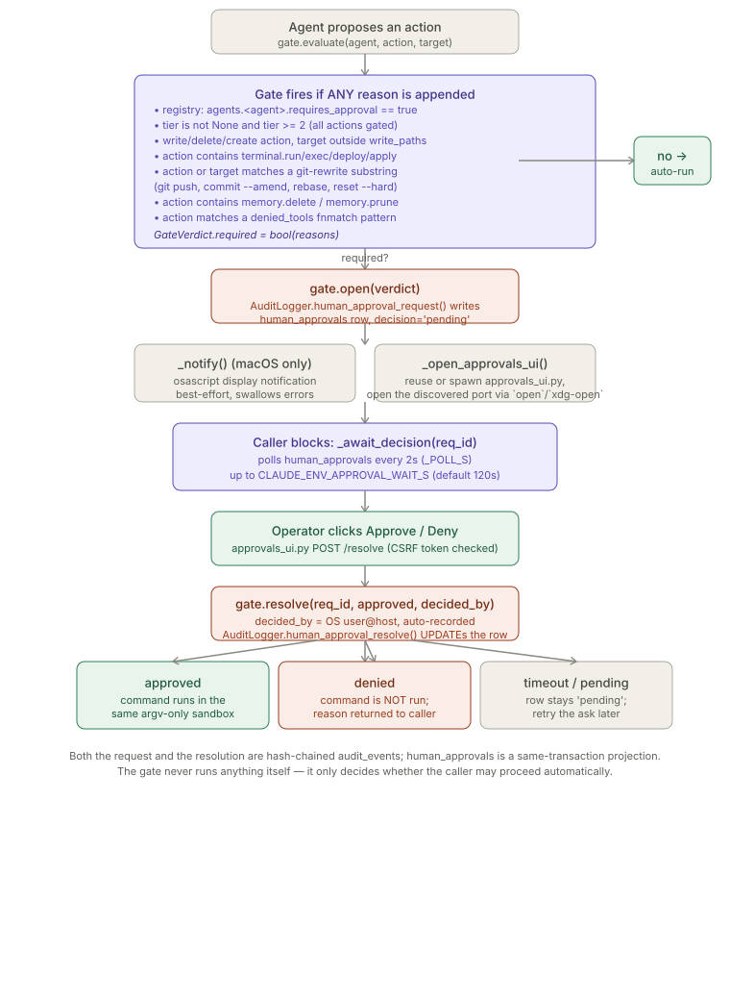
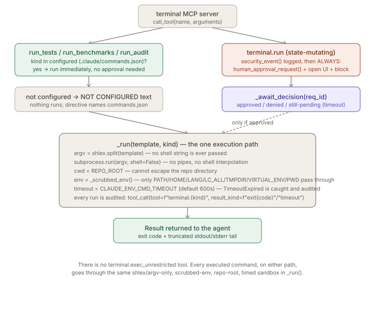

# Approvals Workflow

> Relates to: [OVERVIEW.md §3 — risky actions run without anyone checking](../OVERVIEW.md#3-risky-actions-run-without-anyone-checking)

**Source:** [`agents/orchestration/approval_gate.py`](../../agents/orchestration/approval_gate.py)
(227 lines), [`agents/orchestration/approvals_ui.py`](../../agents/orchestration/approvals_ui.py)
(268 lines), [`mcp-servers/terminal/server.py`](../../mcp-servers/terminal/server.py) (271 lines).

This doc covers the three modules that make "risky actions block for a human" true
end to end: the gate that decides *whether* to block, the local web UI a human
resolves requests in, and the one MCP server (`terminal`) that actually calls the
gate and blocks a live tool call on the result. The audit ledger these all write
through (`AuditLogger`, hash-chained `human_approvals` rows) is covered in
`audit-ledger.md` — this doc treats it as a dependency, not its subject.

---

## What it does (30-second version)

`ApprovalGate.evaluate()` looks at a proposed `(agent, action, target)` and returns a
`GateVerdict` — a list of reasons an action needs a human, or an empty list meaning
"proceed automatically." If any reason fired, `gate.open()` writes a `pending` row to
`human_approvals` (via `AuditLogger`, so it's hash-chained like everything else),
fires a best-effort macOS notification, and the caller opens
`approvals_ui.py` — a stdlib-only localhost web page listing every pending request as
a card with one-click Approve/Deny. The only MCP tool that currently calls this whole
chain and blocks a live tool call on it is `terminal.run` in
`mcp-servers/terminal/server.py`; `terminal.run_tests`/`run_benchmarks`/`run_audit`
never go through the gate at all — they run immediately if configured, or refuse if not.

---

## Configuration reference

### `ApprovalGate` construction and inputs (`agents/orchestration/approval_gate.py`)

| Input | Type | Source | Effect |
|---|---|---|---|
| `registry_path` | path | `agents/agent_registry.yaml` by default (`_ROOT / "agents" / "agent_registry.yaml"`) | Parsed once at construction into `self.agents` (dict) and `self.global_gates` (list, read but never checked against — see [Facts](#facts-invariants--edge-cases)). |
| `session_id` | str | caller-supplied | Passed straight through to the `AuditLogger` used for every write this gate makes. |
| `repo` / `tier` | str / int \| None | caller-supplied | `tier` is the single biggest lever — `tier >= 2` gates *every* action regardless of anything else. |
| `actor` | str | default `"orchestrator"` | Recorded on the underlying `AuditLogger`. |
| `agents.<name>.requires_approval` | bool | `agent_registry.yaml` | If true, every action by that agent is gated. `infra` is the only agent with this set (`agent_registry.yaml:67`, comment: "every action gated"). |
| `agents.<name>.write_paths` | list[glob] | `agent_registry.yaml` | Defines the agent's allowed write scope for `_within_scope()`. An agent with **no** `write_paths` key gates **every** write (`_within_scope` returns `False` when `scopes` is falsy). |
| `agents.<name>.denied_tools` | list[glob] | `agent_registry.yaml` | `fnmatch`'d against `action`; a match is a hard-stop reason, not a silent deny — it still surfaces as a gated approval request rather than an outright rejection. |
| `global_approval_gates` | list[str] | `agent_registry.yaml` (one entry: `"filesystem.write outside agent write_paths"`) | Loaded into `self.global_gates` but **not read anywhere in `evaluate()`** — see [Facts](#facts-invariants--edge-cases). |

### `approvals_ui.py` runtime knobs

| Flag / env | Default | Effect |
|---|---|---|
| `--port` | `8002` | Preferred port; `lib.services.bind_http` falls back to an OS-assigned free port if busy. |
| `--by` | OS `user@host` via `getpass.getuser()` + `socket.gethostname()` | Overrides the auto-recorded `decided_by`. Only exists for edge cases (docstring: "override with `--by` only if you need to"). |
| `TOKEN` | `secrets.token_urlsafe(24)`, generated once per process at import time | Per-process CSRF token embedded as a hidden form field in every card; not persisted, not configurable. |
| page auto-refresh | `<meta http-equiv="refresh" content="15">` | The page polls itself every 15s; there's no websocket/SSE push. |

### `mcp-servers/terminal/server.py` runtime knobs

| Env var | Default | Effect |
|---|---|---|
| `CLAUDE_ENV_REPO_ROOT` | `os.getcwd()` | `cwd` for every command; also the location of `.claude/commands.json` and `.claude/repo-policy.yaml`. |
| `CLAUDE_ENV_SESSION` | `"mcp-terminal"` | `session_id` on the module-level `AuditLogger`. |
| `CLAUDE_ENV_CMD_TIMEOUT` | `600` (seconds) | Hard `subprocess.run(..., timeout=...)` for every command that actually executes, on both the configured and `terminal.run` paths. |
| `CLAUDE_ENV_APPROVAL_WAIT_S` | `120` (seconds) | How long `terminal.run` blocks polling for a decision before giving up and reporting "still pending." |
| `CLAUDE_ENV_APPROVAL_PORT` | unset | Optional *preferred*-port hint passed to a freshly spawned `approvals_ui.py`; the actual port actually used is discovered from the service registry, not assumed. |
| `CLAUDE_ENV_APPROVAL_AUTO_UI` | `"true"` | Set to anything else to skip auto-opening the browser UI (the approval still gets created and still blocks — this only skips the `open`/`xdg-open` step). |
| `<repo>/.claude/commands.json` keys `run_tests`/`run_benchmarks`/`run_audit` | none (must be set explicitly) | The *only* way a command is "configured"; an unset key returns a `NOT CONFIGURED` directive and runs nothing — see `_run_configured` (`mcp-servers/terminal/server.py:214-223`). |
| `_ENV_ALLOW` (hardcoded, not env-configurable) | `{"PATH","HOME","LANG","LC_ALL","TMPDIR","VIRTUAL_ENV","PWD"}` | The complete environment allow-list passed to every subprocess; everything else (secrets, tokens) is stripped. |

---

## How to use it

```bash
# See every pending approval request across all agents/repos
claude-env approvals --list-open

# Resolve one by ID from a terminal session, no web UI needed
claude-env approvals --resolve <REQUEST_ID> --approve --by John

# ...or deny it, with the same flag shape
claude-env approvals --resolve <REQUEST_ID> --deny --by John

# Launch the local approvals web UI on a specific port (default: 8002,
# falls back to a free port automatically if that one's busy)
claude-env approvals-ui --port 8010
```

`--by` is optional on `--resolve` (defaults to `"operator"`) and on `approvals-ui`
(defaults to `getpass.getuser()@socket.gethostname()`) — supplying it is worth doing
when resolving on someone else's behalf or from a shared/service account, since it's
what lands in `decided_by` on the hash-chained `human_approvals` row. `--list-open` and
`--resolve` are mutually exclusive uses of the same `approval_gate.py` CLI entry point;
reaching for `--list-open` first to find a `REQUEST_ID` before resolving it is the
normal flow when you'd rather stay in a terminal than open the browser UI.

---

## How the logic works

### `ApprovalGate.evaluate()` — six independent trigger conditions

Every condition is additive: `evaluate()` never short-circuits, it appends a reason
string for each condition that matches, and gates iff `reasons` is non-empty.

```python
# agents/orchestration/approval_gate.py:86-116
def evaluate(self, agent: str, action: str,
             target: str | None = None) -> GateVerdict:
    reasons: list[str] = []
    cfg = self.agents.get(agent, {})

    if cfg.get("requires_approval"):
        reasons.append(f"agent '{agent}' is approval-gated by registry")

    if self.tier is not None and self.tier >= 2:
        reasons.append(f"tier-{self.tier} repository requires approval for all actions")

    if self._is_write(action) and target is not None:
        if not self._within_scope(cfg, target):
            reasons.append(f"write target '{target}' is outside agent write_paths")

    low = action.lower()
    if any(k in low for k in _STATE_MUTATING_TERMINAL):
        reasons.append("state-mutating terminal command")
    if any(k in low for k in _GIT_REWRITE) or (target and any(
            k in str(target).lower() for k in _GIT_REWRITE)):
        reasons.append("git history rewrite / push")
    if any(k in low for k in _MEMORY_DESTRUCTIVE):
        reasons.append("destructive memory operation")

    # denied tools are a hard stop, surfaced as a gate with a deny reason
    for denied in cfg.get("denied_tools", []):
        if fnmatch.fnmatch(action, denied):
            reasons.append(f"action matches denied_tool pattern '{denied}'")

    return GateVerdict(required=bool(reasons), agent=agent, action=action,
                       target=target, tier=self.tier, reasons=reasons)
```

The six conditions, verified against the code and their exact string constants
(`approval_gate.py:49-54`):

1. **Registry flag** — `agents.<agent>.requires_approval: true`. Only `infra` has this
   in the shipped `agent_registry.yaml` (line 67).
2. **Tier threshold** — `self.tier is not None and self.tier >= 2`. This is
   unconditional: a tier-2 or tier-3 repo gates *every* action from *every* agent,
   independent of write scope or action type.
3. **Out-of-scope write** — only checked `if self._is_write(action) and target is not
   None`. `_is_write()` (`approval_gate.py:118-121`) is a substring test: `"write" in
   a or "delete" in a or "create" in a or a.startswith("filesystem.write")`. Scope is
   `fnmatch`-based against `cfg["write_paths"]`, trying the pattern as-is, then with a
   trailing `/*` appended after stripping `/*`, then exact string equality
   (`approval_gate.py:123-133`). **An agent with no `write_paths` key at all fails
   scope for every write** — `_within_scope` returns `False` immediately when
   `scopes` is falsy (line 126-127), so declaring no write scope is the same as
   declaring an empty one.
4. **State-mutating terminal command** — substring match against `action.lower()` for
   any of `"terminal.run"`, `"terminal.exec"`, `"terminal.deploy"`,
   `"terminal.apply"` (`_STATE_MUTATING_TERMINAL`, line 49-51). Note this matches on
   the *action string itself*, independent of the terminal server's own internal
   gating — see [Facts](#facts-invariants--edge-cases) for how this can double-gate.
5. **Git history rewrite** — substring match against `action.lower()` **or**
   `target.lower()` for any of `"git push"`, `"git commit --amend"`, `"git rebase"`,
   `"git reset --hard"`, `"git.push"`, `"git.amend"`, `"git.rebase"`
   (`_GIT_REWRITE`, line 52-53). Plain `git commit` (no `--amend`) and `git checkout`
   are **not** in this list and do not trigger this condition.
6. **Destructive memory operation** — substring match for `"memory.delete"`,
   `"memory.prune"`, `"memory_pruner --apply"` (`_MEMORY_DESTRUCTIVE`, line 54).

A **seventh**, separate mechanism piggybacks on the same return value: any
`cfg["denied_tools"]` pattern (`fnmatch`) that matches `action` also appends a reason
— the code comment is explicit that this is deliberate: *"denied tools are a hard
stop, surfaced as a gate with a deny reason"* (line 110) — i.e. a nominally "denied"
tool doesn't hard-fail, it becomes a human-approval request like everything else.



### Lifecycle: `open()` → block → `resolve()`

```python
# agents/orchestration/approval_gate.py:136-167
def open(self, verdict: GateVerdict) -> str:
    """Persist a pending approval, return its request_id."""
    action_desc = f"{verdict.action} :: {'; '.join(verdict.reasons)}"
    if verdict.target:
        action_desc = f"{verdict.action} -> {verdict.target} :: " \
                      f"{'; '.join(verdict.reasons)}"
    req_id = self.audit.human_approval_request(
        agent=verdict.agent, action=action_desc, tier=verdict.tier)
    self._notify(req_id, verdict)
    return req_id
...
def resolve(self, request_id: str, approved: bool, decided_by: str) -> None:
    self.audit.human_approval_resolve(
        request_id, decision="approved" if approved else "denied",
        decided_by=decided_by)
```

`open()` itself does not block — it returns a `request_id` immediately after writing
the `pending` row and firing the notification. **Blocking is the caller's
responsibility**; `ApprovalGate` has no wait loop of its own. The only caller in this
codebase that blocks is `terminal.run` (below), via its own `_await_decision` poll
loop — `ApprovalGate.resolve()` is a thin wrapper that just writes the decision.

`_notify()` (`approval_gate.py:147-162`) is macOS-only (`if sys.platform != "darwin":
return`), shells out to `osascript` with a 5s timeout, and swallows all exceptions —
it is explicitly a "best-effort" nicety per its own docstring, never a dependency for
correctness.

### `approvals_ui.py` — the blocking mechanism, from the human side

The UI itself doesn't block anything — it's the thing a human uses to *unblock* a
waiting caller. Its job is: render pending rows as cards, accept a POST, call
`ApprovalGate.resolve()`, redirect back.

```python
# agents/orchestration/approvals_ui.py:218-236
def do_POST(self):  # noqa: N802
    if self.path != "/resolve":
        self._send(404, "not found")
        return
    length = int(self.headers.get("Content-Length", 0))
    form = parse_qs(self.rfile.read(length).decode())
    if form.get("token", [""])[0] != TOKEN:
        self._send(403, "bad token — reload the page")
        return
    rid = form.get("id", [""])[0]
    decision = form.get("decision", [""])[0]
    if rid and decision in ("approve", "deny"):
        gate = ApprovalGate(REGISTRY, session_id="approvals-ui",
                            actor="approvals-ui")
        gate.resolve(rid, approved=(decision == "approve"),
                     decided_by=DECIDED_BY)          # OS user@host, auto-recorded
    self.send_response(303)
    self.send_header("Location", "/")
    self.end_headers()
```

Key mechanics, all verified directly:

- **Server class:** `http.server.ThreadingHTTPServer` (stdlib only — the module
  docstring is explicit: *"no new dependencies"*, `approvals_ui.py:6-7`).
- **Bind address:** `lib.services.bind_http` is called with `args.port` (default
  `8002`); `bind_http` (`lib/services.py:88-99`) tries the preferred port and falls
  back to an OS-assigned free port (`ThreadingHTTPServer((host, 0), ...)`) on
  `OSError`. `_HOST` in `lib/services.py` is the localhost bind — the module
  docstring states the posture explicitly: *"binds 127.0.0.1 only — never an external
  interface"* (`approvals_ui.py:14`).
- **CSRF token:** `TOKEN = secrets.token_urlsafe(24)` generated once at module import
  (line 44) — a fresh, unpredictable value every process start, embedded as a hidden
  `<input type="hidden" name="token">` in every approve/deny form and checked with a
  strict `!=` comparison before any resolve happens.
- **`decided_by` — OS user@host, not user input:** `_default_decider()`
  (`approvals_ui.py:48-52`) computes `f"{getpass.getuser()}@{socket.gethostname()}"`
  once at import into the module global `DECIDED_BY`. The UI never presents a text
  field for who is deciding — the docstring states this is deliberate: *"decided_by is
  recorded automatically as the OS user @ host (no name is asked for)"*
  (`approvals_ui.py:16`). `--by` is the only override, intended for edge cases (e.g.
  running the UI under a shared service account).
- **No blocking primitive in this file.** `approvals_ui.py` never waits for anything
  — `srv.serve_forever()` just runs the HTTP server. The "block until resolved"
  behavior lives entirely in the *caller* (`terminal.run`'s poll loop) reading the
  `human_approvals` row this UI updates, from a separate process.
- **Registration for discovery:** `main()` calls `lib.services.register("approvals",
  port, extra={"decided_by": DECIDED_BY})` after binding, and `unregister("approvals")`
  in a `finally` block on shutdown — this is exactly the registry `terminal/server.py`
  reads via `lib.services.get("approvals")` to find a *running* UI instead of spawning
  a duplicate.

### `mcp-servers/terminal/server.py` — the only caller that actually blocks

Four tools, two execution philosophies:

```python
# mcp-servers/terminal/server.py:214-223
def _run_configured(cmds: dict, configured: set, kind: str) -> str:
    """Run a command only if the repo explicitly configured it; otherwise return
    a clear directive (never blindly run the toolchain-specific default)."""
    if kind not in configured:
        return (f"NOT CONFIGURED: no '{kind}' command is set for this repo. Add it to "
                f"{REPO_ROOT}/.claude/commands.json — e.g. "
                f'{{"run_tests": "go test ./..."}} (Go), "npm test" (JS), '
                f'"pytest -q" (Python), "cargo test" (Rust), or "make test". '
                f"(No command was run.)")
    return _run(cmds[kind], kind)
```

`run_tests`/`run_benchmarks`/`run_audit` never touch `ApprovalGate` at all — they are
gated only by whether the repo's `.claude/commands.json` explicitly set that key
(`_load_commands`, `server.py:80-96`); an unconfigured command runs *nothing*, not a
guessed default, specifically so a wrong-toolchain default (e.g. `pytest` on a Go
repo) can never execute silently.

`terminal.run` is the only tool that opens a real approval and blocks:

```python
# mcp-servers/terminal/server.py:236-259
if name == "terminal.run":
    command = str(arguments.get("command", "")).strip()
    if not command:
        return [TextContent(type="text", text="ERROR: empty command")]
    _audit.security_event(category="terminal_gate", severity="low",
                          detail=f"state-mutating command requested: {command}",
                          source="terminal.run")
    req_id = _audit.human_approval_request(
        agent="terminal", action=f"terminal.run: {command}", tier=_repo_tier())
    _open_approvals_ui()
    decision, by = await _await_decision(req_id)
    if decision == "approved":
        out = _run(command, "run")
        return [TextContent(type="text",
                text=f"APPROVED by {by} (request {req_id}). Executed:\n{out}")]
    if decision == "denied":
        return [TextContent(type="text",
                text=f"DENIED by {by} (request {req_id}). Command was NOT run.")]
    return [TextContent(type="text",
            text=f"NO DECISION within {_WAIT_S}s — request {req_id} is still pending. "
                 f"Approve it in the approvals UI, then ask me to run it again.")]
```

Note `terminal.run` calls `_audit.human_approval_request()` directly — it does **not**
construct an `ApprovalGate` or call `evaluate()`. There's no conditional here: every
`terminal.run` invocation is unconditionally gated, by construction, regardless of
what the command actually is.

The blocking poll loop:

```python
# mcp-servers/terminal/server.py:152-167
async def _await_decision(req_id: str) -> tuple[str, str | None]:
    """Block until the operator approves/denies this request (or we time out).
    Polls the human_approvals row the approvals UI updates in another process."""
    import asyncio
    from lib.db import get_db
    db = get_db()
    waited = 0
    while waited < _WAIT_S:
        row = db.query_one(
            "SELECT decision, decided_by FROM human_approvals WHERE request_id=?",
            (req_id,))
        if row and row["decision"] in ("approved", "denied"):
            return row["decision"], row["decided_by"]
        await asyncio.sleep(_POLL_S)
        waited += _POLL_S
    return "pending", None
```

`_WAIT_S` defaults to `120` (`CLAUDE_ENV_APPROVAL_WAIT_S`), `_POLL_S` is a hardcoded
`2` (seconds, not env-configurable). This is `asyncio.sleep`, not a thread block —
the MCP server's event loop stays responsive to other requests while a `terminal.run`
call is pending. On timeout the function returns `("pending", None)`; the tool
handler reports "still pending" rather than treating timeout as a denial — the
approval row is untouched and can still be resolved later, at which point a repeated
`terminal.run` call will see the already-decided row and return the same decision
without re-prompting.

Execution sandbox, shared by both the configured-command path and the
`terminal.run`-approved path:

```python
# mcp-servers/terminal/server.py:99-100, 170-188
def _scrubbed_env() -> dict:
    return {k: v for k, v in os.environ.items() if k in _ENV_ALLOW}

def _run(template: str, kind: str) -> str:
    argv = shlex.split(template)
    if not argv:
        return "ERROR: empty command"
    try:
        proc = subprocess.run(
            argv, cwd=str(REPO_ROOT), env=_scrubbed_env(),
            capture_output=True, text=True, timeout=TIMEOUT_S, shell=False)
    except subprocess.TimeoutExpired:
        _audit.tool_call(tool=f"terminal.{kind}", args={"cmd": template},
                         result_kind="timeout")
        return f"TIMEOUT after {TIMEOUT_S}s: {template}"
    except FileNotFoundError:
        return f"ERROR: command not found: {argv[0]}"
    _audit.tool_call(tool=f"terminal.{kind}", args={"cmd": template},
                     result_kind=f"exit{proc.returncode}")
    tail = (proc.stdout or "")[-6000:] + (("\n[stderr]\n" + proc.stderr[-2000:])
                                          if proc.stderr else "")
    return f"exit={proc.returncode}\n{tail}"
```

- **Argv-only, no shell interpretation:** `shlex.split(template)` turns the command
  string into an argv list; `subprocess.run(argv, ..., shell=False)` executes that
  list directly. There is no `shell=True` anywhere in this file, so shell metacharacters
  (`;`, `|`, `&&`, backticks, `$()`) inside `command` are inert — they become literal
  argv tokens via `shlex`, not shell syntax. This is also why the docstring can say
  "no pipes" (`server.py:16`): a `|` character has no special meaning to
  `subprocess.run(shell=False)`.
- **Environment scrubbing:** `_scrubbed_env()` is an allow-list, not a deny-list —
  only `PATH, HOME, LANG, LC_ALL, TMPDIR, VIRTUAL_ENV, PWD` pass through
  (`_ENV_ALLOW`, line 73); every other inherited variable (API keys, tokens, CI
  secrets) is dropped before the subprocess is spawned.
- **Timeout enforcement:** `subprocess.run(..., timeout=TIMEOUT_S)`
  (`TIMEOUT_S = int(os.environ.get("CLAUDE_ENV_CMD_TIMEOUT", "600"))`) raises
  `subprocess.TimeoutExpired`, which is caught and turned into an audited
  `result_kind="timeout"` tool call plus a `TIMEOUT after {N}s` text result — the
  subprocess is not left running silently from the caller's perspective (Python's
  `subprocess.run` kills the child on timeout).
- **`cwd=str(REPO_ROOT)`** pins every command to the repo root resolved at server
  startup (`REPO_ROOT = Path(os.environ.get("CLAUDE_ENV_REPO_ROOT",
  os.getcwd())).resolve()`, line 54) — there is no per-call cwd override.
- **Output truncation:** stdout is capped to the last 6000 characters, stderr to the
  last 2000, both audited in full result metadata only as `result_kind` (exit code or
  timeout), not the output body itself.



### `_open_approvals_ui()` — reuse-or-spawn, then open the real port

```python
# mcp-servers/terminal/server.py:117-149
def _open_approvals_ui() -> None:
    if os.environ.get("CLAUDE_ENV_APPROVAL_AUTO_UI", "true").lower() != "true":
        return
    import time
    try:
        from lib.services import get as _svc_get
        svc = _svc_get("approvals")
        if svc is None:                               # not running -> start it
            ui = _HOME / "agents" / "orchestration" / "approvals_ui.py"
            cmd = [sys.executable, str(ui)]
            pref = os.environ.get("CLAUDE_ENV_APPROVAL_PORT")
            if pref:                                  # optional preferred-port hint
                cmd += ["--port", pref]
            subprocess.Popen(cmd, stdout=subprocess.DEVNULL, stderr=subprocess.DEVNULL,
                             start_new_session=True)
            for _ in range(30):                       # wait for it to register (~3s)
                svc = _svc_get("approvals")
                if svc:
                    break
                time.sleep(0.1)
        if not svc:
            return
        url = svc["url"]
        if sys.platform == "darwin":
            subprocess.run(["open", url], capture_output=True, timeout=5)
        elif sys.platform.startswith("linux"):
            subprocess.run(["xdg-open", url], capture_output=True, timeout=5)
    except Exception:
        pass
```

It checks the shared service registry (`lib/services.py`, the same file backing
`bind_http`/`register`/`unregister` in `approvals_ui.py`) before spawning anything —
if an approvals UI is already registered (from a prior `terminal.run` call, or a
manually started one), it reuses that port instead of starting a second server. The
spawned process runs from `$CLAUDE_ENV_HOME` (`_HOME`), not the source repo — a
concrete instance of the "deploy to `$CLAUDE_ENV_HOME`" rule: editing
`agents/orchestration/approvals_ui.py` in this repo has no effect on what
`terminal.run` actually launches until it's mirrored there. The whole function is
wrapped in a bare `except Exception: pass` — if the UI can't be opened, `terminal.run`
still proceeds to block on `_await_decision`; the human can still resolve the request
via the CLI (`approval_gate.py --resolve ... --approve --by ...`) or by navigating to
the UI manually.

---

## Facts, invariants & edge cases

- **`ApprovalGate` reads `global_approval_gates` but never checks it.**
  `self.global_gates = reg.get("global_approval_gates", [])` (`approval_gate.py:79`)
  is assigned and never referenced again anywhere in the class. The one entry in the
  shipped registry, `"filesystem.write outside agent write_paths"`
  (`agent_registry.yaml:116`), is effectively achieved anyway by trigger condition 3
  (out-of-scope write), but through a completely separate code path — the
  `global_approval_gates` list itself is dead configuration as of this reading.
- **No `write_paths` key means every write by that agent gates.** `_within_scope`
  returns `False` immediately if `cfg.get("write_paths")` is falsy
  (`approval_gate.py:126-127`) — an agent entry that simply omits `write_paths`
  is *more* restrictive than one with an empty list in the same way (both are falsy),
  not more permissive.
- **`terminal.run` bypasses `ApprovalGate` entirely.** It calls
  `_audit.human_approval_request()` directly (`server.py:246-247`), not
  `ApprovalGate(...).evaluate()`/`.open()`. This means the `_STATE_MUTATING_TERMINAL`
  substring check inside `ApprovalGate.evaluate()` (which matches `"terminal.run"`)
  would be redundant if some *other* caller also ran `evaluate()` on a
  `terminal.run`-shaped action — as of this reading, nothing in the repo does that;
  `ApprovalGate` and the terminal server's gating are two independent enforcement
  points that happen to agree on this one case, not one calling the other.
  `agents/orchestration/task_router.py`/`agent_handoff.py` (not covered by this doc)
  would be the place to check if `evaluate()` is wired in elsewhere.
- **`denied_tools` doesn't deny — it gates.** Despite the name, a
  `denied_tools` match doesn't stop the action outright; it appends a reason string
  and the action becomes an approvable request like any other gated action
  (`approval_gate.py:110-113`, comment confirms this is deliberate).
- **The approvals UI never blocks; the caller does.** All blocking in this workflow
  happens in `terminal.run`'s `_await_decision` poll loop, reading a row that a
  *separate process* (the UI's `do_POST` handler) updates. There is no IPC, socket,
  or shared memory between them — only the SQLite-backed `human_approvals` table via
  `lib/db.py::get_db()`.
- **CSRF token is per-process, not per-request or per-session.** `TOKEN` is generated
  once at import time and reused for every card on every page render until the
  process restarts — reloading the page does not rotate it.
- **`decided_by` cannot be spoofed by page content.** The value POSTed by the browser
  form is never trusted for identity — `DECIDED_BY` is a server-side module global
  computed from `getpass.getuser()`/`socket.gethostname()` (or `--by`) and is what
  actually gets passed to `gate.resolve()`, regardless of anything in the form body
  besides `id`, `decision`, and `token`.
- **A denied or timed-out `terminal.run` leaves no residual process.** Because the
  command only ever executes *after* `decision == "approved"` is observed
  (`server.py:250-251`), there is nothing to kill on denial — the subprocess is never
  started in the first place.
- **Timeout is a soft state, not a terminal one.** A `"pending"` result from
  `_await_decision` after `_WAIT_S` doesn't cancel or expire the approval request —
  the `human_approvals` row is untouched (`decision` stays `'pending'` in the DB), so
  a human resolving it later and the agent asking again both still work; nothing
  cleans up stale pending rows automatically in this file.
- **`_repo_tier()` is a best-effort regex read, not a shared parser.** It scans
  `<repo>/.claude/repo-policy.yaml` line-by-line with `re.match(r"\s*tier\s*:\s*([0-3])\b", line)`
  rather than using a YAML loader or the `security/policy_engine.py` config loading
  path (`server.py:103-114`) — it only needs the tier number for the approval record,
  and swallows any read error to `None`.
- **Tests confirm the pure-helper behavior, not the DB/HTTP paths.** `tests/test_approvals_ui.py`
  covers only the four side-effect-free functions: `_command_of` (prefix stripping,
  `test_approvals_ui.py:10-12`), `_tier_pill` (tier 0/3/`None` rendering,
  lines 15-18), `_ago` (`None` → `""`, an old ISO timestamp → ends with `"d ago"`,
  lines 21-23), and `_default_decider` (contains `"@"`, length > 2, lines 26-28). There
  is no test in the repo exercising `do_POST`'s CSRF check, `ApprovalGate.evaluate()`'s
  six conditions, or `terminal.run`'s blocking loop as of this reading.

---

## Related docs

- [`audit-ledger.md`](audit-ledger.md) — `AuditLogger`, the hash-chained
  `audit_events` table, and the `human_approvals` projection this workflow writes
  through (request + resolve are separate hash-chained events).
- [`mcp-servers.md`](mcp-servers.md) — the other five MCP servers and how they
  compare to `terminal`'s allow-list model.
- [`policy-engine.md`](policy-engine.md) — the filesystem chokepoint `terminal.run`
  does *not* go through (it's a command sandbox, not a file-read/write decision).
- [OVERVIEW.md §3](../OVERVIEW.md#3-risky-actions-run-without-anyone-checking) — the
  product-level framing of the problem this workflow solves.
