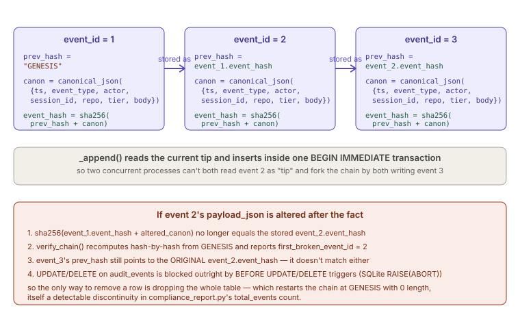
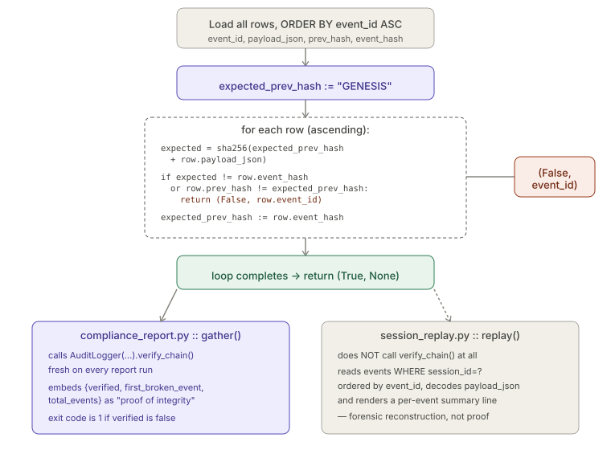

# Audit Ledger

> Relates to: [OVERVIEW.md §2 — no one knows what the agent actually did](../OVERVIEW.md#2-no-one-knows-what-the-agent-actually-did)

**Source:** [`audit/audit_logger.py`](../../audit/audit_logger.py) (215 lines),
[`audit/session_replay.py`](../../audit/session_replay.py) (112 lines),
[`audit/compliance_report.py`](../../audit/compliance_report.py) (163 lines).
**Schema:** [`sql/001_schema.sql`](../../sql/001_schema.sql) (`audit_events` + typed
projection tables).

This doc covers the three audit modules together because they form one pipeline:
`audit_logger.py` is the only writer of the ledger, `session_replay.py` is a read-only
forensic reconstruction of one session from it, and `compliance_report.py` is a
read-only aggregate export across sessions/repos that also re-verifies the chain on
every run. None of the three imports `sqlite3` directly — all persistence goes through
`lib/db.py::get_db()`, per the platform's persistence-abstraction invariant.

---

## What it does (30-second version)

Every agent action, MCP tool call, retrieval, memory op, security event, policy
violation, and human approval in claude-env is written as one row in `audit_events`,
hash-chained to the row before it — each row's `event_hash` is a function of its own
payload *and* the previous row's hash, so altering or deleting any past row breaks
every hash after it. The database itself refuses `UPDATE`/`DELETE` on the table
(`sql/001_schema.sql`) as defense in depth; the logger never issues them either.
`AuditLogger` is the single writer (typed helper methods per event kind);
`session_replay.py` reconstructs one session's timeline for debugging "why did the
agent do that?"; `compliance_report.py` aggregates across a time window/repo and
re-runs the hash-chain check to produce auditor-ready evidence that the ledger hasn't
been tampered with.

---

## Configuration / interface reference

### `audit_events` table (`sql/001_schema.sql`)

| Column | Type | Notes |
|---|---|---|
| `event_id` | `INTEGER PRIMARY KEY AUTOINCREMENT` | Monotonic row order; `verify_chain()` and `session_replay` both `ORDER BY event_id`. |
| `ts` | `TEXT NOT NULL` | ISO-8601 UTC, microsecond precision (`_now()` uses `%f`); doc comment says "millisecond" but the format string produces six fractional digits. |
| `event_type` | `TEXT NOT NULL` | `agent_action`, `tool_call`, `retrieval`, `memory_read`, `memory_write`, `security_event`, `policy_violation`, `human_approval_request`, `human_approval_resolve`. |
| `actor` | `TEXT NOT NULL` | Agent id, `"human"`, or `"system"`. |
| `session_id` | `TEXT NOT NULL` | Groups events for `session_replay.py`. |
| `repo` | `TEXT` | Nullable — global ops have no repo. |
| `tier` | `INTEGER` | Privacy tier 0-3 *at time of event* — not looked up later, so changing a repo's tier doesn't rewrite history. |
| `payload_json` | `TEXT NOT NULL` | Canonical JSON of the *full* envelope (see below), not just the caller's `payload` dict. |
| `prev_hash` | `TEXT NOT NULL` | `event_hash` of the previous row, or `"GENESIS"` for the first row ever. |
| `event_hash` | `TEXT NOT NULL UNIQUE` | `sha256(prev_hash \|\| canonical_payload)`. |

Indexes: `ix_audit_ts`, `ix_audit_type`, `ix_audit_session`, `ix_audit_repo`,
`ix_audit_actor` — all on `audit_events` (`sql/001_schema.sql`).

Append-only guard, DB-level (`sql/001_schema.sql`):

```sql
CREATE TRIGGER IF NOT EXISTS audit_events_no_update
BEFORE UPDATE ON audit_events
BEGIN SELECT RAISE(ABORT, 'audit_events is append-only'); END;

CREATE TRIGGER IF NOT EXISTS audit_events_no_delete
BEFORE DELETE ON audit_events
BEGIN SELECT RAISE(ABORT, 'audit_events is append-only'); END;
```

### `AuditLogger` (`audit/audit_logger.py`)

| Method | Signature | Event type | Projection table |
|---|---|---|---|
| `__init__` | `(session_id, actor="system", repo=None, tier=None)` | — | — |
| `agent_action` | `(agent, action, target=None, summary=None, success=True) -> int` | `agent_action` | `agent_actions` |
| `tool_call` | `(tool, args, result_kind, duration_ms=None) -> int` | `tool_call` | `tool_calls` |
| `retrieval` | `(repo, query, top_k, returned, branch=None, max_score=None, min_score=None, reranked=False, duration_ms=None) -> int` | `retrieval` | `retrieval_events` |
| `memory_read` | `(namespace, memory_type, query, hit_count) -> int` | `memory_read` | `memory_reads` |
| `memory_write` | `(namespace, memory_type, node_id, operation) -> int` | `memory_write` | `memory_writes` |
| `security_event` | `(category, severity, detail, source=None) -> int` | `security_event` | `security_events` |
| `policy_violation` | `(path, rule, decision, tier=None) -> int` | `policy_violation` | `policy_violations` |
| `human_approval_request` | `(agent, action, tier=None) -> str` | `human_approval_request` | `human_approvals` (returns generated `request_id`, not `event_id`) |
| `human_approval_resolve` | `(request_id, decision, decided_by) -> int` | `human_approval_resolve` | none via `_append` — issues a separate `UPDATE human_approvals` after logging the event |
| `verify_chain` | `() -> tuple[bool, int \| None]` | — | recomputes the whole chain; see below |

All typed helpers funnel through the private `_append(event_type, payload,
projection=None)`, which is the only method that touches `audit_events` directly.

### `session_replay.py`

| Function | Signature | Returns |
|---|---|---|
| `list_sessions` | `(limit: int = 25) -> list[dict]` | One row per `session_id`: `session_id, events, first, last, actors` (via `GROUP_CONCAT(DISTINCT actor)`), `ORDER BY MAX(ts) DESC`. |
| `replay` | `(session_id: str) -> list[dict]` | Ordered list of `{event_id, ts, type, actor, repo, summary, body}` for that session. |
| `_summarize` | `(event_type: str, body: dict) -> str` | One-line human-readable summary, dispatched by `event_type`; falls back to `json.dumps(body)[:100]` for unrecognized types. |
| CLI | `--list` / `<session_id>` / `--format {text,json}` | `python audit/session_replay.py ...` |

### `compliance_report.py`

| Function | Signature | Returns |
|---|---|---|
| `_parse_window` | `(win: str) -> datetime` | Parses `\d+[dhw]` (e.g. `24h`, `7d`, `4w`) into a UTC cutoff `datetime`; raises `SystemExit` on a bad format. |
| `gather` | `(window: str, repo: str \| None) -> dict` | The full report payload (see keys below). Re-runs `AuditLogger("report", actor="reporter").verify_chain()` every call. |
| `render_md` | `(d: dict) -> str` | Markdown tables. |
| `render_csv` | `(d: dict) -> str` | Flat CSV of raw in-window `audit_events` rows (not the aggregated `gather()` dict). |
| CLI | `--window` (default `30d`) / `--repo` / `--format {md,json,csv}` / `--out` | Exit code `1` if the chain fails verification, `0` otherwise. |

`gather()`'s return dict — every key is either directly queried or computed:

| Key | Source |
|---|---|
| `generated_at`, `window`, `since`, `repo` | Report metadata / echoed inputs. |
| `chain` | `{verified, first_broken_event, total_events}` from `verify_chain()` + a `COUNT(*)` over all of `audit_events` (not window-filtered). |
| `events_by_type` | `GROUP BY event_type` over `audit_events` in-window. |
| `actors` | `GROUP BY actor` over `audit_events` in-window. |
| `top_tools` | Top 15 from `tool_calls` by count, with an error count (`result_kind != 'ok'`); **not** repo-filtered (`tool_calls` has no `repo` column, so `rfilter` isn't applied here even though it's built for it). |
| `policy_violations` | Up to 200 most-recent rows from `policy_violations`. |
| `security_events` | Up to 200 most-recent rows from `security_events`; **never repo-filtered** — `security_events` has no `repo` column and the query doesn't include `rfilter`. |
| `approvals` | Up to 200 most-recent rows from `human_approvals`, filtered on `requested_at`. |
| `session_costs` | Up to 50 rows from `metrics_sessions`, ordered by estimated cost descending. |

---

## How to use it

```bash
# A 7-day compliance report, rendered as markdown to stdout
claude-env report --window 7d

# A JSON report scoped to one repo, written to a file for an auditor
claude-env report --repo my-service --format json --out /tmp/my-service-report.json

# List recent sessions, then replay one by id
claude-env replay --list
claude-env replay 3f9c2a1e-...-session --format text
```

Reach for `claude-env report` when you need auditor-ready evidence — window and
format default to `30d` / `md` if you omit the flags, but scoping to `--repo` and
writing straight to `--out` is the common case for handing someone a file. Reach for
`claude-env replay` when a report's `policy_violations` or `security_events` rows
point at a specific session and you need the full "why did the agent do that?"
timeline: `--list` to find the `session_id`, then `replay <session_id>` to
reconstruct it.

---

## How the logic works

### Hash-chain construction — `_append()`

```python
# audit/audit_logger.py
def _append(self, event_type: str, payload: dict,
            projection: tuple[str, dict] | None = None) -> int:
    """Append one chained event + optional typed projection, atomically."""
    with _WRITE_LOCK:
        ts = _now()
        full_payload = {
            "ts": ts, "event_type": event_type, "actor": self.actor,
            "session_id": self.session_id, "repo": self.repo,
            "tier": self.tier, "body": payload,
        }
        canon = _canon(full_payload)

        with self.db.tx(immediate=True) as cur:
            cur.execute(
                "SELECT event_hash FROM audit_events ORDER BY event_id DESC LIMIT 1")
            prev_row = cur.fetchone()
            prev_hash = prev_row["event_hash"] if prev_row else GENESIS
            event_hash = _hash(prev_hash, canon)

            cur.execute(
                "INSERT INTO audit_events "
                "(ts,event_type,actor,session_id,repo,tier,payload_json,prev_hash,event_hash) "
                "VALUES (?,?,?,?,?,?,?,?,?)",
                (ts, event_type, self.actor, self.session_id, self.repo,
                 self.tier, canon, prev_hash, event_hash),
            )
            event_id = cur.lastrowid
            if projection:
                table, cols = projection
                cols = {**cols, "event_id": event_id}
                if table != "human_approvals":
                    cols["ts"] = ts
                names = ",".join(cols.keys())
                qs = ",".join(["?"] * len(cols))
                cur.execute(f"INSERT INTO {table} ({names}) VALUES ({qs})",
                            tuple(cols.values()))
        return event_id
```

What actually gets hashed is **not** the caller's raw `payload` argument — it's
`canon`, the canonical JSON of the full envelope (`ts`, `event_type`, `actor`,
`session_id`, `repo`, `tier`, and `body: payload`). Two helpers make this
deterministic:

```python
# audit/audit_logger.py
def _canon(payload: dict) -> str:
    return json.dumps(payload, sort_keys=True, separators=(",", ":"), ensure_ascii=False)

def _hash(prev_hash: str, canon_payload: str) -> str:
    return hashlib.sha256((prev_hash + canon_payload).encode("utf-8")).hexdigest()
```

`sort_keys=True` and fixed `separators` mean the same logical payload always produces
byte-identical JSON, and therefore the same hash — required for `verify_chain()` to
recompute (not just re-check) hashes.



### Why `_append` reads-then-inserts inside `BEGIN IMMEDIATE`

`_WRITE_LOCK` (`audit/audit_logger.py`) is a plain `threading.Lock` — it only
serializes callers *within one process*. Across separate OS processes (e.g. two MCP
servers each holding their own `AuditLogger`), that lock does nothing. The
read-current-tip-then-insert sequence is therefore wrapped in `self.db.tx(immediate=True)`,
which issues `BEGIN IMMEDIATE` instead of a lazy `BEGIN` on SQLite
(`lib/db.py`):

```python
# lib/db.py (docstring)
immediate=True acquires the SQLite write lock up front (BEGIN IMMEDIATE)
instead of lazily on first write (plain BEGIN). Use this whenever a
transaction reads state that must not change before it writes based on
that state (e.g. read-current-tip-then-insert for a hash chain) -- across
separate OS processes/connections, this app's in-process locks don't
serialize anything, so without BEGIN IMMEDIATE two writers can both read
the same "current" row and then both commit, forking the chain.
```

The event row and its typed projection row are inserted inside the same `with
self.db.tx(...)` block, so they commit together or not at all — a crash between the
two inserts can't leave a `tool_calls` row with no matching `audit_events` row (or
vice versa).

### `verify_chain()` — recompute, don't just compare

```python
# audit/audit_logger.py
def verify_chain(self) -> tuple[bool, int | None]:
    """Recompute the full chain. Returns (ok, first_broken_event_id|None)."""
    rows = self.db.query(
        "SELECT event_id, payload_json, prev_hash, event_hash "
        "FROM audit_events ORDER BY event_id ASC")
    prev_hash = GENESIS
    for r in rows:
        expected = _hash(prev_hash, r["payload_json"])
        if expected != r["event_hash"] or r["prev_hash"] != prev_hash:
            return False, r["event_id"]
        prev_hash = r["event_hash"]
    return True, None
```

This is a full table scan every call — no memoization, no checkpointing of "verified
up to event N." It checks two things per row, either of which alone would catch
tampering: that the *stored* `event_hash` matches a fresh `sha256(prev_hash ||
payload_json)`, and that the row's own *stored* `prev_hash` still equals the
`event_hash` computed for the previous row in this same pass (catching a row whose
`prev_hash` column was edited to point somewhere else even if its own `event_hash`
was recomputed to match new content). The loop returns on the **first** break, not a
list of every subsequent break — everything after the first bad row will also fail to
match, but only the earliest `event_id` is reported.



### `session_replay.py` — reconstruction, not verification

`replay()` does not call `verify_chain()` at all — it trusts the rows it reads and
focuses purely on reconstructing a human-readable timeline:

```python
# audit/session_replay.py
def replay(session_id: str) -> list[dict]:
    rows = get_db().query(
        "SELECT event_id, ts, event_type, actor, repo, payload_json "
        "FROM audit_events WHERE session_id=? ORDER BY event_id", (session_id,))
    out = []
    for r in rows:
        try:
            body = json.loads(r["payload_json"]).get("body", {})
        except Exception:
            body = {}
        out.append({"event_id": r["event_id"], "ts": r["ts"],
                    "type": r["event_type"], "actor": r["actor"],
                    "repo": r["repo"], "summary": _summarize(r["event_type"], body),
                    "body": body})
    return out
```

Note it unwraps `payload_json` down to the `body` sub-object — the same `body` that
was passed as `payload` to `_append()` — discarding the outer envelope fields
(`ts`/`actor`/etc. are already available as separate columns, so this isn't a loss).
A malformed `payload_json` row degrades to an empty `body` rather than raising, so one
corrupt row doesn't kill the whole replay.

`_summarize()` is a pure dispatch table keyed on `event_type`
(`audit/session_replay.py`) — e.g. for `tool_call` it prefers
`args["file_path"]`, then `args["path"]`, then `args["command"]`, then falls back to
the first 60 characters of the JSON-dumped `args` dict; for anything it doesn't
recognize it falls back to `json.dumps(body)[:100]`.

### `compliance_report.py` — proof of integrity is a live re-check, not a cached flag

```python
# audit/compliance_report.py
chain_ok, broken_at = AuditLogger("report", actor="reporter").verify_chain()

return {
    ...
    "chain": {"verified": chain_ok, "first_broken_event": broken_at,
              "total_events": (db.query_one(
                  "SELECT COUNT(*) AS n FROM audit_events") or {}).get("n", 0)},
    ...
```

Every report — markdown, JSON, or CSV — embeds this `chain` block, and the CLI's exit
code is tied directly to it (`compliance_report.py`: `return 0 if
data["chain"]["verified"] else 1`), so a CI job or cron check can fail a build purely
on `echo $?` without parsing output. Note `AuditLogger("report", actor="reporter")` is
constructed only to call `verify_chain()` — its `session_id="report"` is never used to
write anything in this path, and `verify_chain()` itself ignores `session_id`/`actor`
entirely (it scans the whole table).

`render_csv()` is a separate, un-aggregated export — it re-queries raw
`audit_events` rows (including `prev_hash`/`event_hash` columns) rather than
flattening the `gather()` dict, making it the one format suitable for someone who
wants to independently re-verify the chain outside this codebase:

```python
# audit/compliance_report.py
def render_csv(d: dict) -> str:
    """Flat CSV of the raw in-window ledger rows (evidence-grade export)."""
    db = get_db()
    rfilter, rparams = ("AND repo=?", [d["repo"]]) if d["repo"] != "(all)" else ("", [])
    rows = db.query(
        f"SELECT event_id, ts, event_type, actor, session_id, repo, tier, "
        f"prev_hash, event_hash FROM audit_events WHERE ts>=? {rfilter} "
        f"ORDER BY event_id", [d["since"]] + rparams)
    ...
```

---

## Facts, invariants & edge cases

- **The hash covers the whole envelope, not just the caller's payload.** `_canon()` is
  called on `{ts, event_type, actor, session_id, repo, tier, body}` — so two identical
  `tool_call(...)` calls made at different timestamps or by different actors produce
  different `event_hash` values even if `body` is byte-identical. There is no way to
  hash only `body`.
- **`GENESIS` is a real, literal string, not a sentinel object.** The very first row's
  `prev_hash` column contains the seven ASCII characters `GENESIS`
  (`audit/audit_logger.py`); `verify_chain()` seeds its local `prev_hash` variable
  with the same literal so the first row's check is not special-cased.
- **`event_hash` has a `UNIQUE` constraint at the schema level**
  (`sql/001_schema.sql`) — a second row that happened to hash identically (would
  require either a SHA-256 collision or byte-identical envelopes chained from the same
  prior hash, which canonicalization with a timestamp field makes practically
  impossible) would fail the `INSERT` outright, inside the same transaction as the
  projection write.
- **`human_approval_resolve` does not use the `_append(..., projection=...)` path for
  its projection.** It logs the event with no projection tuple, then issues a
  standalone `UPDATE human_approvals SET decision=...,decided_by=...,decided_at=... WHERE
  request_id=?` (`audit/audit_logger.py`) — **outside** the `BEGIN IMMEDIATE`
  block that wrote the ledger row. This is the one write path in the module not
  covered by the same-transaction guarantee the module docstring advertises
  ("Typed projection tables ... are written in the SAME transaction so they cannot
  drift from the ledger") — a crash between the two calls could leave a resolved-event
  ledger row and a still-`pending` `human_approvals` row.
- **`human_approvals` projection rows don't get a `ts` column.** `_append()` special-cases
  the table name: `if table != "human_approvals": cols["ts"] = ts`
  (`audit/audit_logger.py`) — that table tracks `requested_at`/`decided_at`
  instead, set explicitly by `human_approval_request`/`human_approval_resolve`.
- **`verify_chain()` takes no arguments and ignores instance state.** Calling it on
  any `AuditLogger` instance — regardless of that instance's `session_id`, `actor`, or
  `repo` — verifies the *entire* `audit_events` table, not a scoped subset. This is
  why `compliance_report.py` can construct a throwaway `AuditLogger("report",
  actor="reporter")` purely to call the method.
- **Dropping the table is the only way to erase history, and it's still detectable.**
  Per the module docstring (`audit/audit_logger.py`): because `UPDATE`/`DELETE`
  are trigger-blocked, the only way to alter history is to drop `audit_events`
  entirely — which resets the chain to start from `GENESIS` again with
  `total_events=0`, a discontinuity visible in every future `compliance_report.py`
  run's `chain.total_events`.
- **`top_tools` and `security_events` in `compliance_report.py` are never repo-filtered**,
  even when `--repo` is passed — `tool_calls` and `security_events` have no `repo`
  column in the schema, so `rfilter`/`rparams` (built from the `--repo` flag) are
  applied to `events_by_type`, `actors`, `policy_violations`, and `approvals`, but
  silently skipped for these two tables. The `[: None if not repo else None]` slice on
  `top_tools` (`audit/compliance_report.py`) is a no-op either way — both branches
  of that ternary are `None`, so the slice never actually truncates anything.
- **`chain.total_events` is not window-scoped.** Every other `gather()` field is
  filtered by `WHERE ts>=?`, but `total_events` is a plain `COUNT(*)` over the whole
  table — a `--window 24h` report's chain-integrity total still reflects the entire
  ledger's history, not just the last day.
- **The module docstring's claim of "millisecond precision" is imprecise.** `_now()`
  (`audit/audit_logger.py`) uses `strftime("%Y-%m-%dT%H:%M:%S.%fZ")`, and
  Python's `%f` always renders six digits (microseconds), not three.
- **No test file exists for this module as of this writing.** There is no
  `tests/test_audit_logger.py` (or similarly named file) in `tests/` — the smoke test
  at the bottom of `audit/audit_logger.py` (`if __name__ == "__main__":`, lines
  208-215) is the only executable check in the repo, and it only exercises the happy
  path (`tool_call` + `policy_violation` + `verify_chain` all succeeding), not a
  tamper scenario.

---

## Flow diagrams


*Each event's `event_hash` folds in the previous event's `event_hash` as `prev_hash`;
altering a past row's `payload_json` makes every hash after it recompute to a
different value, and the append-only triggers block fixing it in place.*


*`verify_chain()` recomputes hashes from `GENESIS` forward and returns the first
mismatch. `compliance_report.py` calls it fresh on every report as its proof of
integrity; `session_replay.py` never calls it — it only reconstructs, it doesn't
verify.*

---

## Related docs

- [`policy-engine.md`](policy-engine.md) — the module whose `block`/`redact` decisions
  show up in the ledger as `policy_violation` events.
- [`native-tool-hooks.md`](native-tool-hooks.md) — the `PostToolUse` hook that calls
  into `AuditLogger` for native Read/Write/Edit/Bash calls.
- [OVERVIEW.md §2](../OVERVIEW.md#2-no-one-knows-what-the-agent-actually-did) — the
  product-level framing of the problem this module solves.
