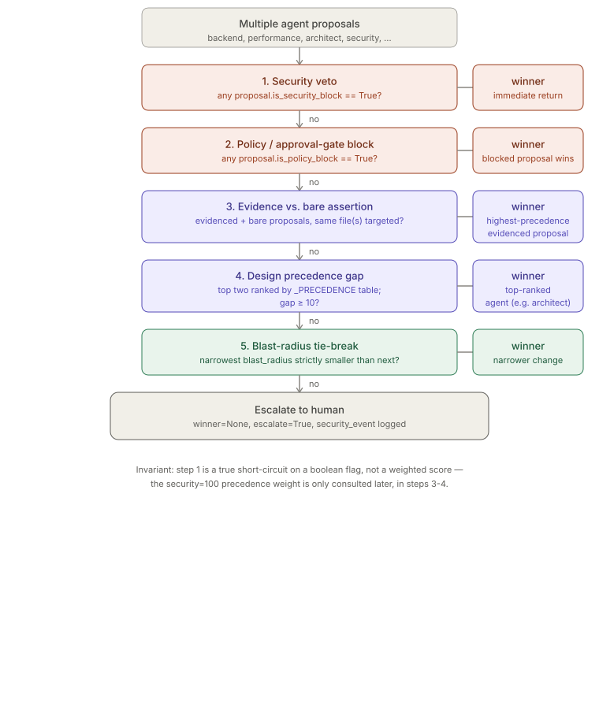

# Conflict Resolution

> ⚠ **SUPERSEDED (2026-07-09).** `conflict_resolver.py` has been retired. Conflict synthesis
> is now handled by the orchestrator agent's prompt: when two specialists produce conflicting
> outputs, the orchestrator names the conflict, chooses the more conservative option with
> explicit rationale, and flags it to the human if it affects correctness.
> This document is preserved for historical reference only.

> Relates to: [OVERVIEW.md §6 — one generalist agent doing everything, badly](../OVERVIEW.md#6-one-generalist-agent-doing-everything-badly)

**Source (retired):** `agents/orchestration/conflict_resolver.py`.

This doc covers `agents/orchestration/conflict_resolver.py` only. How proposals get
routed to specialist agents in the first place is a separate module
(`agents/orchestration/task_router.py`, `agents/orchestration/agent_handoff.py` —
not yet documented). The audit trail this module writes to is covered in
[`audit-ledger.md`](audit-ledger.md).

---

## What it does (30-second version)

When two or more specialist agents (backend, performance, security, architect, ...)
produce overlapping or contradictory proposals for the same change, the orchestrator
hands the set to `ConflictResolver.resolve()`. It is **not a vote** — it's a fixed,
ordered ladder of five checks, each of which can short-circuit and return a winner.
If nothing on the ladder produces a decisive answer, the resolver refuses to guess:
it returns no winner and sets `escalate=True`, and every escalation is also written
to the audit ledger as a `medium`-severity security event.

---

## Interface reference

### `Proposal` (dataclass, `conflict_resolver.py`)

| Field | Type | Default | Effect |
|---|---|---|---|
| `agent` | `str` | required | Agent name; looked up in `_PRECEDENCE` for ranking (unknown agents rank `0`). |
| `summary` | `str` | required | Human-readable description; not used in decision logic. |
| `files` | `list[str]` | `[]` | Used by `blast_radius` (count) and `_same_target` (overlap check). |
| `is_security_block` | `bool` | `False` | Setting this triggers the veto in step 1 — see [Facts](#facts-invariants--edge-cases). |
| `is_policy_block` | `bool` | `False` | Setting this triggers step 2 (policy/approval block). |
| `evidence` | `str \| None` | `None` | Any truthy string counts as "evidenced" in step 3 — no validation of content. |
| `reversible` | `bool` | `True` | `False` adds `+5` to `blast_radius`. |
| `additive` | `bool` | `True` | `False` adds `+3` to `blast_radius`. |
| `blast_radius` (property) | `int` | computed | `len(files)` plus the two penalties above; smaller is "safer." |

### `Resolution` (dataclass, `conflict_resolver.py`)

| Field | Type | Meaning |
|---|---|---|
| `winner` | `Proposal \| None` | `None` only when `escalate=True` or when `proposals` was empty. |
| `losers` | `list[Proposal]` | Every non-winning proposal (all of them, if no winner). |
| `rationale` | `str` | Human-readable reason, also written into the audit `summary`. |
| `escalate` | `bool` | `False` by default; `True` only from the final undecidable branch. |

### `ConflictResolver`

| Member | Signature | Effect |
|---|---|---|
| `__init__` | `(session_id, repo=None, tier=None)` | Builds an `AuditLogger(actor="orchestrator", ...)` — every resolution is attributed to `"orchestrator"`, not to any individual agent. |
| `resolve(proposals)` | `list[Proposal] -> Resolution` | Public entry point. Handles the 0- and 1-proposal trivial cases, delegates the rest to `_decide`, then always writes an `agent_action` audit row and — only if `escalate` — a `security_event` row. |
| `_decide(proposals)` | `list[Proposal] -> Resolution` | The five-step ladder (see below). Private; not called directly by callers. |
| `_same_target(proposals)` (static) | `list[Proposal] -> bool` | `True` if at least two proposals' `files` sets intersect. Requires ≥2 non-empty file sets; proposals with no `files` are ignored for this check. |

### `_PRECEDENCE` table (`conflict_resolver.py`)

| Agent | Weight |
|---|---|
| `security` | 100 |
| `architect` | 60 |
| `testing` | 55 |
| `database` | 40 |
| `performance` | 38 |
| `backend` | 30 |
| `frontend` | 30 |
| `devops` | 30 |
| `research` | 20 |
| `documentation` | 10 |
| *(anything else)* | 0 (via `.get(agent, 0)`) |

---

## How the logic works

### `resolve()` — trivial cases plus audit wiring

```python
# (superseded)
def resolve(self, proposals: list[Proposal]) -> Resolution:
    if not proposals:
        return Resolution(None, [], "no proposals", escalate=False)
    if len(proposals) == 1:
        return Resolution(proposals[0], [], "single proposal; no conflict")

    res = self._decide(proposals)
    self.audit.agent_action(
        agent="conflict_resolver", action="resolve",
        target=res.winner.agent if res.winner else None,
        summary=res.rationale + (" [ESCALATED]" if res.escalate else ""),
        success=not res.escalate)
    if res.escalate:
        self.audit.security_event(
            category="conflict_escalation", severity="medium",
            detail=res.rationale, source="conflict_resolver")
    return res
```

Note `success=not res.escalate` — an escalation is recorded as a *failed*
`agent_action` in the audit ledger, even though nothing errored; "success" here
means "the resolver reached a decision," not "no exception was raised."

### `_decide()` — the security veto is a literal short-circuit, not a score

This is the precise answer to "does security's objection short-circuit the function,
or is it weighted": **it short-circuits**. Step 1 filters on the boolean
`is_security_block` field and returns immediately if any proposal has it set — the
`_PRECEDENCE["security"] = 100` number is never consulted for this check. That
weight is only used later, in steps 3 and 4, for ranking among proposals that did
**not** trigger a block.

```python
# (superseded)
def _decide(self, proposals: list[Proposal]) -> Resolution:
    # 1. security veto: any security block kills conflicting feature proposals
    sec_blocks = [p for p in proposals if p.is_security_block]
    if sec_blocks:
        winner = sec_blocks[0]
        losers = [p for p in proposals if p is not winner]
        return Resolution(winner, losers,
                          "security veto: flagged vulnerability overrides all "
                          "competing proposals")
```

Two consequences worth being precise about:

- **`is_security_block` is not restricted to `agent == "security"`.** Nothing in the
  code checks the `agent` field here — any `Proposal`, from any agent, that has
  `is_security_block=True` set wins the veto. The field name documents intent, but
  the field is not gated by who set it.
- **`sec_blocks[0]` wins if multiple proposals set the flag**, with no further
  tie-break between them — first in the input list, not highest-precedence,
  not most-recent.

The remaining steps, read top to bottom:

```python
# (superseded)
# 2. policy / approval block wins over any feature proposal
pol_blocks = [p for p in proposals if p.is_policy_block]
if pol_blocks:
    winner = pol_blocks[0]
    losers = [p for p in proposals if p is not winner]
    return Resolution(winner, losers,
                      "policy block overrides feature proposals; the blocked "
                      "action cannot proceed without approval")

# 3. correctness: a proposal backed by failing-test evidence outranks bare claims
evidenced = [p for p in proposals if p.evidence]
bare = [p for p in proposals if not p.evidence]
if evidenced and bare and self._same_target(proposals):
    winner = max(evidenced, key=lambda p: _PRECEDENCE.get(p.agent, 0))
    losers = [p for p in proposals if p is not winner]
    return Resolution(winner, losers,
                      f"{winner.agent} proposal is backed by evidence "
                      f"({winner.evidence!r}); unevidenced proposals deferred")

# 4. design trade-off: precedence ranking, architect leads
ranked = sorted(proposals, key=lambda p: _PRECEDENCE.get(p.agent, 0),
                reverse=True)
top, second = ranked[0], ranked[1]
if _PRECEDENCE.get(top.agent, 0) - _PRECEDENCE.get(second.agent, 0) >= 10:
    losers = [p for p in proposals if p is not top]
    return Resolution(top, losers,
                      f"design precedence: {top.agent} outranks "
                      f"{second.agent} on architectural trade-offs")

# 5. tie-break on blast radius (narrower, reversible, additive wins)
by_radius = sorted(proposals, key=lambda p: p.blast_radius)
if by_radius[0].blast_radius < by_radius[1].blast_radius:
    winner = by_radius[0]
    losers = [p for p in proposals if p is not winner]
    return Resolution(winner, losers,
                      "tie on precedence; selected the narrower, more "
                      "reversible change (smaller blast radius)")

# genuinely undecidable -> escalate to human
return Resolution(None, proposals,
                  "proposals are of equal precedence and blast radius with "
                  "no decisive evidence; human decision required",
                  escalate=True)
```

Step-by-step:

1. **Security veto** — boolean short-circuit, see above.
2. **Policy/approval block** — same shape as step 1, own boolean flag
   (`is_policy_block`), same first-match-wins behavior, independent of security.
3. **Evidence vs. bare, gated by `_same_target`** — this only fires when there is
   at least one evidenced *and* one unevidenced proposal, **and** `_same_target`
   confirms at least two proposals actually overlap in `files`. Two proposals
   about unrelated files never reach this branch, no matter their evidence. Among
   evidenced proposals, the winner is the one with the highest `_PRECEDENCE`
   weight — not the first evidenced one, and not the one with the most evidence.
4. **Precedence gap ≥ 10** — proposals are sorted by `_PRECEDENCE` weight; if the
   top two are separated by 10 or more, the top one wins outright, and *every
   other* proposal becomes a loser (not just `second`). The margin exists so that
   e.g. `frontend` (30) vs `backend` (30) never auto-resolves here (gap `0`), but
   `architect` (60) vs `backend` (30) does (gap `30`).
5. **Blast-radius tie-break** — only reached if step 4's gap was `< 10`. Sorts by
   `blast_radius` ascending; wins only if the smallest is *strictly* less than the
   second-smallest. An exact tie in blast radius falls through to escalation.
6. **Escalation** — `winner=None`, `losers=proposals` (all of them), `escalate=True`.
   `resolve()` then logs this as a `medium`-severity `security_event`, so a human
   sees it even though nothing "failed" in the exception sense.


*Five ordered checks; the first to produce a decisive signal returns immediately.
Only the security-veto and policy-block steps look at a boolean flag alone — every
later step needs at least two proposals to disagree in a specific, checkable way
before it will pick a winner.*

---

## Facts, invariants & edge cases

- **The security veto is a hard short-circuit, not a weighted vote** — see
  [`_decide()`](#_decide--the-security-veto-is-a-literal-short-circuit-not-a-score)
  above. If a `security`-agent proposal is submitted *without* `is_security_block=True`,
  it gets no special treatment beyond its precedence weight of 100 (which will usually
  still win step 4, but through the ranking path, not the veto path).
- **`is_security_block` is a data flag, not an identity check** — any proposal from
  any agent can set it; the resolver does not verify `agent == "security"`. Callers
  populating `Proposal` objects are responsible for only setting the flag when a real
  security agent actually flagged something.
- **Two independent veto flags, same shape, different order.** `is_security_block`
  (step 1) and `is_policy_block` (step 2) are checked with identical logic, but
  security is checked strictly first — if both are set on different proposals in
  the same batch, the security-flagged one wins and the policy-flagged one becomes
  a loser without step 2 ever running.
- **The evidence step requires file overlap, not just presence of evidence** — see
  step 3 above; proposals with an empty `files` list are excluded from the overlap
  check entirely and can never contribute to a match.
- **The precedence-gap threshold is a literal `10`, hardcoded.** Not configurable
  via any config file — this module has no YAML/JSON config surface at all, unlike
  `policy_engine.py`. Changing the margin means editing `conflict_resolver.py`.
- **`blast_radius` penalizes irreversible and non-additive changes independently
  and additively** (`+5` and `+3`, `conflict_resolver.py`) — a destructive,
  non-additive, single-file change (`radius = 1 + 5 + 3 = 9`) can lose to a
  reversible, additive four-file change (`radius = 4`) in step 5.
- **Escalation still picks `losers = proposals`** — see step 6 above; there is no
  partial credit, `winner` is `None`, and every submitted proposal lands in `losers`.
- **An escalated resolution is logged as `success=False` in the audit `agent_action`
  row**, even though `_decide()` didn't raise or error — see the note on
  `success=not res.escalate` above. Anyone reading the audit ledger for failures will
  see conflict escalations mixed in with genuine action failures unless they also
  check the `[ESCALATED]` summary suffix.
- **0 and 1 proposals never reach `_decide()` at all.** `resolve()` special-cases
  both: zero proposals returns `Resolution(None, [], "no proposals")` with
  `escalate=False` (not an escalation — there was nothing to disagree about), and
  exactly one proposal auto-wins with `"single proposal; no conflict"`.
- **Only conflicts that reach `_decide()` write an audit row.** The 0- and 1-proposal
  early returns in `resolve()` happen *before* the `self.audit.agent_action(...)` call,
  so despite the constructor building an `AuditLogger` unconditionally, no audit row is
  written for trivial cases — it's easy to misread the method as "always audits."
- **No test file exists for this module.** A repo-wide search for
  `conflict_resolver`, `ConflictResolver`, and `Proposal(` outside the source file
  itself (including all of `tests/`) returned no matches — there is currently no
  automated coverage of the five-step ladder, the security-veto short-circuit, or
  the escalation path. The `if __name__ == "__main__":` block at
  `conflict_resolver.py` is the only runnable example in the repo, and it's
  a manual demo, not a test.

---

## Related docs

- [`audit-ledger.md`](audit-ledger.md) — the `AuditLogger.agent_action()` /
  `security_event()` calls this module writes through, and how the hash chain that
  backs them works.
- [OVERVIEW.md §6](../OVERVIEW.md#6-one-generalist-agent-doing-everything-badly) —
  the product-level framing: specialist agents instead of one generalist, and why
  their disagreements need an explainable adjudicator instead of a vote.
