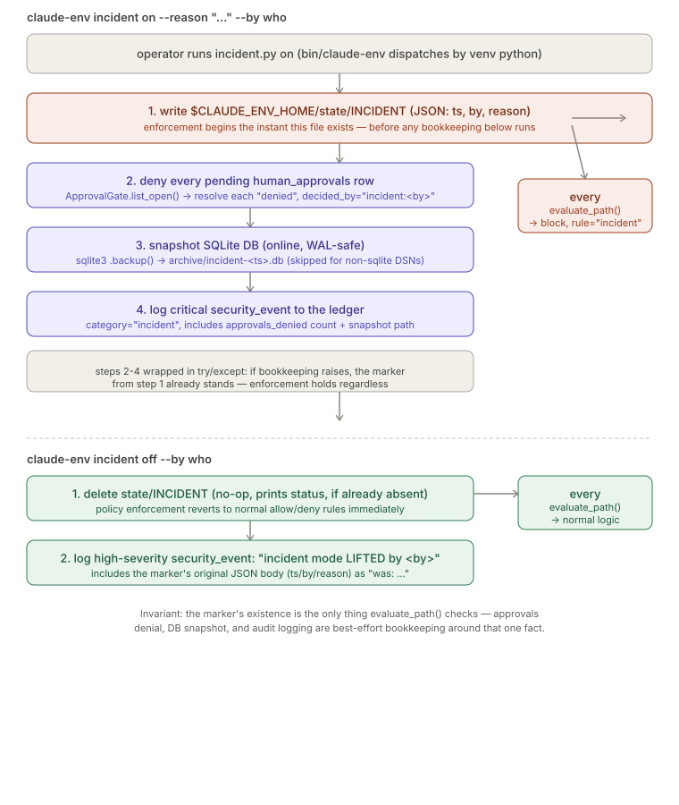

# Incident Mode

> Relates to: [OVERVIEW.md §1 — the agent could read or touch something it shouldn't](../OVERVIEW.md#1-the-agent-could-read-or-touch-something-it-shouldnt)

**Source:** [`security/incident.py`](../../security/incident.py) (141 lines).
**CLI entry:** `bin/claude-env incident on|off|status` (dispatches to `security/incident.py`
via the venv Python — `bin/claude-env:38`).

This doc covers `security/incident.py` only — how the kill switch is armed and lifted.
The check this module's marker feeds is `PolicyEngine.evaluate_path()`'s step 0, already
walked in [`policy-engine.md`](policy-engine.md#evaluate_path--the-eight-step-decision);
this doc explains how the marker gets produced, not how it's consumed.

---

## What it does (30-second version)

Incident mode is a one-file kill switch. `claude-env incident on` writes a JSON marker
at `$CLAUDE_ENV_HOME/state/INCIDENT`; while that file exists, `PolicyEngine.evaluate_path()`
returns `block` for **every** path, on **every** enforcement surface — the filesystem-policy
MCP server, the RAG indexer, and the native-tool policy hook — before any other rule runs.
Turning it on also denies every pending human approval, snapshots the SQLite database, and
writes a critical audit event. Turning it off deletes the marker and logs the lift. The
whole point, per the module's own docstring, is that "a security responder needs zero
platform knowledge" — three subcommands, no config to understand.

---

## Configuration reference

`incident.py` takes no config file; everything is a CLI arg or an environment variable.

| Name | Kind | Default | Effect |
|---|---|---|---|
| `action` | positional arg | required | One of `on`, `off`, `status` (`security/incident.py:128`). |
| `--reason` | CLI flag (`on` only) | `"unspecified"` | Free-text reason stored in the marker JSON and the audit event (`security/incident.py:129`). |
| `--by` | CLI flag (`on`/`off`) | `$USER` env var, else `"operator"` | Actor recorded in the marker and as the audit actor / `decided_by` value (`security/incident.py:130`). |
| `CLAUDE_ENV_HOME` | env var | `~/.claude-env` | Root the marker, archive, and (by extension) the DSN default live under (`security/incident.py:38`). |
| `CLAUDE_ENV_DSN` | env var | `sqlite:///$CLAUDE_ENV_HOME/state/claude-env.db` | Read by `_snapshot_db()` to find the SQLite file to back up; non-`sqlite` DSNs skip the snapshot entirely (`security/incident.py:48-51`). |

### Marker file format

Path: `$CLAUDE_ENV_HOME/state/INCIDENT` (constant `MARKER`, `security/incident.py:39`).
Plain JSON, written with `indent=2` and a trailing newline (`security/incident.py:73-74`):

```json
{
  "ts": "2026-07-07T14:32:01Z",
  "by": "John",
  "reason": "suspected token leak"
}
```

`ts` comes from `_now()`, which is `datetime.now(timezone.utc).strftime("%Y-%m-%dT%H:%M:%SZ")`
(`security/incident.py:42-43`) — always UTC, always that exact format. The file's *existence*
is the only thing any enforcement surface actually checks; its contents are read back only
for human-facing output (`status`, the hook's denial message, the `off` audit event's
`"was: ..."` detail).

---

## How to use it

```bash
# Arm the kill switch — every policy evaluation fails closed until lifted
claude-env incident on --reason "suspected token leak" --by John

# Check whether it's currently active (exit code 1 = active, 0 = inactive —
# safe to use directly in a shell conditional or monitoring check)
claude-env incident status

# Lift it once the situation is resolved
claude-env incident off --by John
```

`--reason` and `--by` are optional on `on` (defaulting to `"unspecified"` and
`$USER`/`"operator"` respectively), but supplying both is worth doing every time —
they're the only human-readable trace of *why* the platform was frozen once you're
looking at the audit ledger or compliance report later. `status`'s exit code is the
one designed for automation; `on`/`off` always exit `0` and are meant to be read from
their printed output, not branched on.

---

## How the logic works

### `cmd_on()` — arming the switch

```python
# security/incident.py:66-98
def cmd_on(reason: str, by: str) -> int:
    if MARKER.exists():
        print("incident mode is ALREADY active:")
        print(MARKER.read_text())
        return 0

    MARKER.parent.mkdir(parents=True, exist_ok=True)
    MARKER.write_text(json.dumps(
        {"ts": _now(), "by": by, "reason": reason}, indent=2) + "\n")
    print(f"INCIDENT marker written -> {MARKER}")
    print("  all policy evaluations now fail closed (MCP, indexer, hooks)")

    # deny everything pending — a frozen platform must not have live grants
    denied = 0
    try:
        from audit.audit_logger import AuditLogger
        from agents.orchestration.approval_gate import ApprovalGate
        log = AuditLogger(session_id="incident", actor=by)
        for req in ApprovalGate.list_open():
            log.human_approval_resolve(req["request_id"], "denied",
                                       decided_by=f"incident:{by}")
            denied += 1
        print(f"  pending approvals denied: {denied}")
        snap = _snapshot_db()
        if snap:
            print(f"  database snapshot: {snap}")
        log.security_event("incident", "critical",
                           f"incident mode ACTIVATED by {by}: {reason} "
                           f"(approvals_denied={denied}, snapshot={snap})")
    except Exception as exc:
        # the marker is already in place — enforcement holds even if bookkeeping fails
        print(f"  WARN: post-freeze bookkeeping incomplete: {exc}")
    return 0
```

Read top to bottom, arming does five things in a deliberate order:

1. **Idempotency guard.** If the marker already exists, `cmd_on` prints its current
   contents and returns `0` (success, not an error) rather than overwriting it — a
   second `incident on` doesn't reset the original `ts`/`by`/`reason`.
2. **Write the marker first.** The `MARKER.write_text(...)` call happens *before* any of
   the approval-denial, snapshot, or audit-logging work below it. Every enforcement
   surface starts failing closed the instant this line completes, regardless of whether
   anything after it succeeds.
3. **Deny every pending approval.** `ApprovalGate.list_open()` (`agents/orchestration/approval_gate.py:171-181`)
   returns pending rows from `human_approvals`; each is resolved via
   `AuditLogger.human_approval_resolve(request_id, "denied", decided_by="incident:<by>")`
   (`audit/audit_logger.py:184-191`) — so the `decided_by` column is always prefixed
   `incident:` for approvals killed this way, distinguishing them from a human clicking
   "deny" in the approvals UI.
4. **Snapshot the database.** `_snapshot_db()` (below) runs next; its return value (a
   path or `None`) is only used for the printed message and the audit payload — a failed
   or skipped snapshot does not stop activation.
5. **Log a critical `security_event`.** Category `"incident"`, severity `"critical"`,
   with the denied-approvals count and snapshot path folded into the detail string —
   one row, not several, summarizing the whole activation.

Steps 3-5 are wrapped in a single `try/except Exception`. If *any* of them raises — a
missing `audit` package, a locked DB, whatever — the `except` block only prints a
warning; **it does not touch or remove the marker.** The comment on
`security/incident.py:96` states the intent directly: *"the marker is already in place —
enforcement holds even if bookkeeping fails."* Freezing the platform can never be rolled
back by an internal error.

### `_snapshot_db()` — online, WAL-safe backup

```python
# security/incident.py:46-63
def _snapshot_db() -> str | None:
    """Online WAL-safe SQLite backup. Returns archive path (None for non-sqlite)."""
    dsn = os.environ.get("CLAUDE_ENV_DSN",
                         f"sqlite:///{HOME}/state/claude-env.db")
    if not dsn.startswith("sqlite"):
        return None  # PostgreSQL deployments: use pg_dump per RUNBOOK backup §
    src_path = Path(dsn.replace("sqlite:///", "")).expanduser()
    if not src_path.exists():
        return None
    dest_dir = HOME / "archive"
    dest_dir.mkdir(parents=True, exist_ok=True)
    dest = dest_dir / f"incident-{_now().replace(':', '')}.db"
    src = sqlite3.connect(str(src_path))
    dst = sqlite3.connect(str(dest))
    with dst:
        src.backup(dst)
    src.close(); dst.close()
    return str(dest)
```

It uses `sqlite3.Connection.backup()` — the same API SQLite's own `.backup` shell command
uses — which is safe to run against a live, WAL-mode database without stopping writers.
The destination filename embeds a colon-stripped timestamp
(`incident-20260707T143201Z.db`, since `_now()`'s `:` characters would be awkward in a
filename), under `$CLAUDE_ENV_HOME/archive/`, created if missing. Three ways it silently
returns `None` instead of a path: a non-SQLite DSN (PostgreSQL — the comment points at
"RUNBOOK backup §" for that case, which is a pointer to operational docs, not code in
this repo), a SQLite DSN whose file doesn't exist yet, or — implicitly — any exception
during the copy, which propagates up and is caught by `cmd_on`'s outer `try/except`
rather than by this function itself.

### `cmd_off()` — lifting the switch

```python
# security/incident.py:101-114
def cmd_off(by: str) -> int:
    if not MARKER.exists():
        print("incident mode is not active")
        return 0
    detail = MARKER.read_text().strip()
    MARKER.unlink()
    print("INCIDENT marker removed — policy enforcement back to normal rules")
    try:
        from audit.audit_logger import AuditLogger
        AuditLogger(session_id="incident", actor=by).security_event(
            "incident", "high", f"incident mode LIFTED by {by}; was: {detail}")
    except Exception as exc:
        print(f"  WARN: could not write audit event: {exc}")
    return 0
```

The mirror image of `cmd_on`, with the same "enforcement change first, bookkeeping
after" ordering: `MARKER.unlink()` runs before the audit call, so a failure writing the
lift's `security_event` still leaves the platform unfrozen — it just means the lift
wasn't recorded in the ledger (only printed as a `WARN` to stdout/stderr). The lift event
is deliberately one severity level below activation (`"high"` vs `"critical"`) and embeds
the *original* marker's full JSON body as `detail`'s `"was: ..."` suffix, so the audit
trail preserves who armed it and why even after the file is gone.

### `cmd_status()` and exit codes

```python
# security/incident.py:117-123
def cmd_status() -> int:
    if MARKER.exists():
        print("incident mode: ACTIVE")
        print(MARKER.read_text())
        return 1
    print("incident mode: inactive")
    return 0
```

`status` is the one subcommand where the return code carries meaning for scripting:
**exit `1` means incident mode is active**, exit `0` means it's not. (`on` and `off`
both always return `0` regardless of outcome — they're not meant to be branched on by
exit code, only by their printed output.) This makes `claude-env incident status`
usable directly in a shell conditional or a monitoring check without parsing stdout.

### How the marker reaches `evaluate_path()`

`incident.py` and `policy_engine.py` agree on the path by both reading the same
environment variable independently — there's no shared import of a path constant:

```python
# security/incident.py:38-39
HOME = Path(os.environ.get("CLAUDE_ENV_HOME", str(Path.home() / ".claude-env")))
MARKER = HOME / "state" / "INCIDENT"
```

```python
# security/policy_engine.py:47-49
def _incident_marker() -> Path:
    return Path(os.environ.get("CLAUDE_ENV_HOME",
                               str(Path.home() / ".claude-env"))) / "state" / "INCIDENT"
```

Both resolve to the identical path as long as `CLAUDE_ENV_HOME` (or its shared default)
matches between the process that ran `incident on` and the process that later calls
`evaluate_path()` — which is true in normal operation since both are deployed from the
same `$CLAUDE_ENV_HOME`. `policy_engine.py`'s comment at lines 43-46 states plainly that
checking this one file "covers all enforcement surfaces at once: the filesystem-policy
MCP server, the RAG indexer, and the Claude Code policy hook" — see
[policy-engine.md's evaluate_path walkthrough](policy-engine.md#evaluate_path--the-eight-step-decision)
for exactly how step 0 uses it (a bare `Path.exists()`, first check, before path
normalization even runs). The native-tool hook has its own copy of the same check for
the same reason — see [Facts](#facts-invariants--edge-cases) below.


*Arming writes the marker before any bookkeeping runs, so enforcement never depends on
the approval-denial/snapshot/audit steps succeeding. Lifting deletes the marker before
logging the lift, for the same reason.*

---

## Facts, invariants & edge cases

- **The marker's existence is the entire contract.** `evaluate_path()` only calls
  `.exists()` — it never parses the JSON. The `ts`/`by`/`reason` fields exist purely for
  human consumption (`status`, the hook's denial message, the lift's audit detail); a
  zero-byte file at the right path would freeze the platform just as effectively as a
  well-formed one.
- **Enforcement is not transactional with the bookkeeping.** Because the marker write
  happens first and the approval-denial/snapshot/audit-logging steps are best-effort
  inside one `try/except`, it's possible (if `audit.audit_logger` fails to import, say)
  for incident mode to be fully active while zero pending approvals were denied and no
  snapshot was taken — the only guarantee is the freeze itself, per the comment on
  `security/incident.py:96`.
- **`incident on` is idempotent by design, not by accident.** Calling it twice does not
  refresh the marker's timestamp or re-run the approval-denial/snapshot/audit steps a
  second time — `cmd_on` returns early and only echoes the existing marker
  (`security/incident.py:67-70`). To capture a second wave of newly-created pending
  approvals during a still-active incident, an operator must `off` then `on` again,
  which *does* re-run the full sequence (and re-snapshots the DB).
- **PostgreSQL deployments get no automatic snapshot.** `_snapshot_db()` returns `None`
  immediately for any DSN not starting with `sqlite` (`security/incident.py:50-51`); the
  inline comment points to a "RUNBOOK backup §" for `pg_dump`-based backups, which is an
  operational runbook reference, not something implemented in this file.
- **Two independent copies of the incident check exist by design, not by DRY failure.**
  `policy_engine.py::_incident_marker()` and `hooks/policy_hook.py`'s `INCIDENT_MARKER`
  constant (`hooks/policy_hook.py:61`) each resolve the same path independently and check
  it as their literal first action — `policy_hook.py:432-440` calls this out as "step 1:
  hard stop for every intercepted tool, including Bash," denying with a message that
  tells the operator to run `claude-env incident off` to lift it
  (`hooks/policy_hook.py:438-439`). This means Bash calls are blocked by the hook's own
  check even though `PolicyEngine.evaluate_path()` is never given a chance to run on
  them for that code path — both checks exist so neither enforcement surface depends on
  the other being wired correctly.
- **Activation and lift severities are asymmetric on purpose.** Activation logs at
  `"critical"`, lift at `"high"` (`security/incident.py:92-93` vs `:110-111`) — arming
  the kill switch is treated as the more severe event to see in a compliance report.
- **No test file exists for incident mode.** There is no `tests/test_incident.py` in the
  repo. The only executable verification is
  [`validation/validate_features.py:120-130`](../../validation/validate_features.py),
  which shells out to `security/incident.py on`, asserts
  `PolicyEngine.load(REPO).evaluate_path("README.md")` returns `action == "block"` and
  `rule == "incident"`, then shells out to `off` and asserts a fresh `PolicyEngine.load()`
  call now returns `"allow"` for the same path — confirming the marker is read fresh per
  `PolicyEngine.load()` rather than cached. This validation script, not a pytest test, is
  the closest thing to executable proof of this module's behavior today.
- **`claude-env incident` is one of several thin CLI wrappers.** `bin/claude-env` maps
  the `incident` subcommand straight to `security/incident.py` (`bin/claude-env:38`) and
  describes it in the grouped `--help` output as *"Kill switch: freeze everything closed
  / lift (on|off|status)"* (`bin/claude-env:80`) — there is no separate argument parsing
  or wrapping logic in `bin/claude-env` itself; `incident.py`'s own `argparse` setup
  (`security/incident.py:126-131`) handles `--reason`/`--by` directly.

---

## Related docs

- [`policy-engine.md`](policy-engine.md) — the consumer of the marker this module writes;
  see its [evaluate_path walkthrough](policy-engine.md#evaluate_path--the-eight-step-decision)
  for the exact step-0 check and why it runs before path normalization.
- [`native-tool-hooks.md`](native-tool-hooks.md) — the policy hook's own, independent
  incident check for native Read/Write/Edit/Bash calls (`hooks/policy_hook.py:432-440`).
- [`policy-simulation.md`](policy-simulation.md) — dry-running a candidate policy against
  `evaluate_path()`; unaffected by incident mode since simulation doesn't go through the
  live enforcement surfaces.
- [`audit-ledger.md`](audit-ledger.md) — the hash-chained `security_event` rows this
  module writes on activation and lift, and the `human_approvals` rows it updates.
- [`approvals-workflow.md`](approvals-workflow.md) — the `ApprovalGate.list_open()` /
  `human_approval_resolve()` calls used to deny pending approvals on activation.
- [OVERVIEW.md §1](../OVERVIEW.md#1-the-agent-could-read-or-touch-something-it-shouldnt) —
  the product-level framing: "if something looks actively wrong mid-session, a single
  incident switch denies everything, everywhere, until it's turned off."
