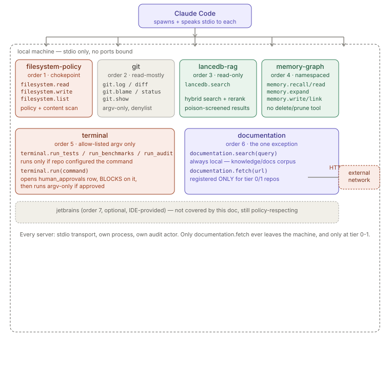
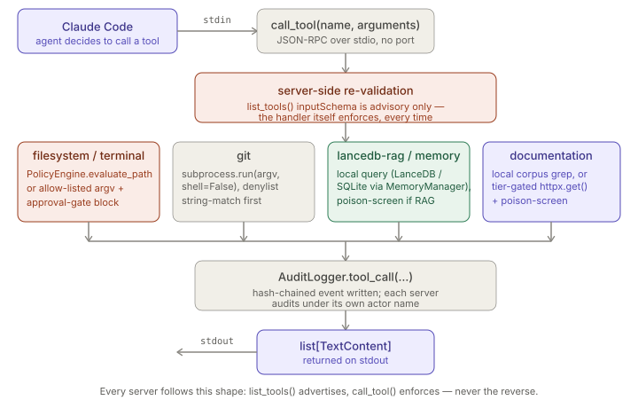

# MCP Servers

> Relates to: [OVERVIEW.md §5 — knowledge and search shouldn't leave the building](../OVERVIEW.md#5-knowledge-and-search-shouldnt-leave-the-building)
> and [§6 — one generalist agent doing everything badly](../OVERVIEW.md#6-one-generalist-agent-doing-everything-badly).

**Source:** `mcp-servers/{filesystem-policy,git,lancedb-rag,memory-graph,terminal,documentation}/server.py`
(each ~90-270 lines). **Config:** [`config/mcp-servers.json`](../../config/mcp-servers.json).

This doc covers what's common across all six servers — the stdio/MCP protocol mechanics
and the exact tool surface each one exposes — plus each server's single most important
enforcement behavior. It deliberately does **not** re-explain enforcement logic that
already has its own doc: policy evaluation is in
[`policy-engine.md`](policy-engine.md), the terminal approval flow is in
[`approvals-workflow.md`](approvals-workflow.md), and the memory graph's data model is
in [`memory-graph.md`](memory-graph.md). Read those for depth; read this doc to see the
six servers side by side.

---

## What they are (30-second version)

Claude Code talks to each server as a separate **child process over stdio** — there is
no HTTP, no port, no socket. Six server scripts live under `mcp-servers/`, registered
in [`config/mcp-servers.json`](../../config/mcp-servers.json), each launched with the
platform venv's Python so dependencies stay isolated from global site-packages. Every
server follows the same low-level `mcp` SDK shape: a `Server(name)`, an
`@server.list_tools()` handler that *advertises* tool names/schemas, an
`@server.call_tool()` handler that actually *enforces and executes*, and a
`stdio_server()` context manager wired into `server.run(...)` under `asyncio.run`. Five
of the six never touch the network at all; the sixth (`documentation`) is the one
deliberate, tier-gated exception.

---

## Startup & registration (`config/mcp-servers.json`)

```json
// config/mcp-servers.json
{
  "$schema": "internal://claude-env/mcp-servers.schema.json",
  "_comment": "... Every server runs locally over stdio; none binds a network port. The
  'command' uses the platform venv Python (${CLAUDE_ENV_HOME}/venv/bin/python) ...",
  "version": 1,
  "defaults": {
    "transport": "stdio",
    "network": "disabled",
    "audit": true,
    "env": {
      "CLAUDE_ENV_HOME": "${HOME}/.claude-env",
      "CLAUDE_ENV_DSN": "sqlite:///${HOME}/.claude-env/state/claude-env.db"
    }
  },
```

Each entry under `mcpServers` sets a numeric `startup_order` (`config/mcp-servers.json,
42,71,94,120,145`) — `filesystem-policy` (1) starts before `git` (2), `lancedb-rag` (3),
`memory-graph` (4), `terminal` (5), and `documentation` (6). A seventh, optional entry,
`jetbrains` (order 7, `config/mcp-servers.json`), is IDE-provided rather than a
script under `mcp-servers/` and isn't covered further here. The `scopes` array per
server (e.g. `config/mcp-servers.json` for filesystem-policy) is documentation of
the tool names for the registration config — it doesn't grant or restrict anything by
itself; the actual grant/deny happens inside each server's `call_tool()`. Every server
resolves `CLAUDE_ENV_HOME` the same way at the top of its script:

```python
# mcp-servers/filesystem-policy/server.py (identical pattern in all six)
_HOME = Path(os.environ.get("CLAUDE_ENV_HOME", str(Path.home() / ".claude-env")))
for p in (_HOME, _HOME / "security", _HOME / "audit", _HOME / "lib"):
    if str(p) not in sys.path:
        sys.path.insert(0, str(p))
```

This is why editing this repo's `mcp-servers/*/server.py` doesn't change live behavior —
the running process imports from `$CLAUDE_ENV_HOME`, a mirror created by
`bootstrap.py` (see the `claude-env-development` skill / root `CLAUDE.md`).

---

## The stdio/MCP mechanics every server shares

All six scripts end with the same three lines:

```python
# mcp-servers/lancedb-rag/server.py (same shape in all six)
async def _run() -> None:
    async with stdio_server() as (read, write):
        await server.run(read, write, server.create_initialization_options())

if __name__ == "__main__":
    import asyncio
    asyncio.run(_run())
```

Three things worth being precise about:

1. **`list_tools()` is advisory, not enforcing.** It returns `Tool(name, description,
   inputSchema)` objects so the client (Claude Code) knows what's callable and with
   what JSON-schema-shaped arguments. Nothing about that schema is re-validated by the
   `mcp` SDK on the server's behalf — every server's `call_tool()` re-derives required
   fields itself (`arguments["path"]`, `arguments["query"]`, etc.) and will raise a
   `KeyError`-driven error path if a required argument is missing. The schema is a
   contract for the caller's UI/validation, not a security boundary.
2. **`call_tool(name, arguments)` is the single dispatch point.** Every server does its
   own `if name == "...":` chain (or, for filesystem-policy, a `try/except` wrapper
   around it) — there is no shared base class or decorator-per-tool; each server
   hand-writes its own routing.
3. **No server binds a socket.** `stdio_server()` wires the process's own stdin/stdout
   as the JSON-RPC transport. The one exception to "no network at all" is
   `documentation.fetch`'s outbound `httpx.get()` — that's an HTTP client call the
   *server* makes outward, not an inbound port it opens.





---

## Tool reference (verified from each `server.py`)

| Server | Tool | Args (from `inputSchema`) | One key behavior |
|---|---|---|---|
| **filesystem-policy** | `filesystem.read` | `path` (required) | Resolves path inside repo root, runs `PolicyEngine.evaluate_path`, then `scan_content` on the bytes; redacts or blocks. See [`policy-engine.md`](policy-engine.md). |
| | `filesystem.write` | `path`, `content` (both required) | Re-evaluates the *destination* path AND scans the outgoing payload for secrets before writing — a write to an allowed path with secret content is still refused (`mcp-servers/filesystem-policy/server.py`). |
| | `filesystem.list` | `path` (required) | Silently omits any child path whose `evaluate_path` is `block` — blocked entries don't even appear in the listing (`server.py`). |
| **git** | `git.log` | `max_count` (int, optional), `path` (optional) | Read-only wrapper; `--oneline --decorate -n<max_count>`. |
| | `git.diff` | `ref_a`, `ref_b`, `path` (all optional) | Plain `git diff` with optional refs/pathspec appended. |
| | `git.blame` | `path` (required) | `git blame -- <path>`. |
| | `git.status` | *(none)* | `git status --porcelain`. |
| | `git.show` | `ref` (required) | `git show <ref>`. |
| **lancedb-rag** | `lancedb.search` | `query` (required), `repo`, `branch`, `top_n` (1-20, optional) | Every hit is screened by `RagPoisonDetector.scan_chunk` before being returned; blocked hits are dropped, not surfaced (`mcp-servers/lancedb-rag/server.py`). |
| **memory-graph** | `memory.recall` | `query` (required), `depth`, `top_k` | Keyword-seeded graph expansion ranked by similarity + time-decayed confidence; see [`memory-graph.md`](memory-graph.md). |
| | `memory.read` | `node_id` (required) | Single-node fetch; touches access stats. |
| | `memory.expand` | `seed_ids` (array, required), `depth`, `rels` | Walks the graph from seed nodes up to `depth` hops. |
| | `memory.write` *(conditional)* | `memory_type`, `node_kind`, `name`, `body` (all required), `repo`, `confidence` | Only registered/listed at all when `CLAUDE_ENV_MEMORY_WRITE=true` (`server.py`); `node_kind` must be one of `HALF_LIFE`'s keys and is cross-checked against `memory_type`'s taxonomy — see [`memory-graph.md`](memory-graph.md). |
| | `memory.link` *(conditional)* | `src`, `dst`, `rel` (required), `weight` | Same `WRITE_ENABLED` gate as `memory.write`. No `memory.delete`/`memory.prune` tool exists in this server at all — destructive ops live only in the `memory_pruner` CLI behind the approval gate (`server.py`). |
| **terminal** | `terminal.run_tests` | *(none)* | Runs only if `.claude/commands.json` explicitly sets `run_tests`; otherwise returns a "NOT CONFIGURED" directive and runs nothing (`mcp-servers/terminal/server.py`). |
| | `terminal.run_benchmarks` | *(none)* | Same configured-or-refuse pattern, key `run_benchmarks`. |
| | `terminal.run_audit` | *(none)* | Same pattern, key `run_audit`. |
| | `terminal.run` | `command` (required) | Opens a `human_approvals` request and **blocks the call** until a human decides or `CLAUDE_ENV_APPROVAL_WAIT_S` elapses; full flow in [`approvals-workflow.md`](approvals-workflow.md). There is no `terminal.exec_unrestricted` tool. |
| **documentation** | `documentation.search` | `query` (required) | Always registered; greps `${CLAUDE_ENV_HOME}/knowledge/docs` (`.md`/`.txt`/`.rst`) by term frequency — pure local file scan, no index. |
| | `documentation.fetch` *(conditional)* | `url` (required) | Only appended to `list_tools()`'s return value when `FETCH_ALLOWED` (`TIER in (0, 1)`, `mcp-servers/documentation/server.py,81-89`) — in tier 2/3 repos the tool doesn't exist in the schema at all, not merely "denied at call time." |

---

## The one enforcement behavior worth knowing per server

- **filesystem-policy** — it is *the* sanctioned path to disk (see
  [`policy-engine.md`](policy-engine.md) for the full decision logic); this server's own
  job on top of that is path containment: `_resolve()` does `(REPO_ROOT /
  rel_path).resolve()` then `candidate.relative_to(REPO_ROOT)` in a `try/except
  ValueError`, so any `../` escape or absolute-path trick that would land outside
  `REPO_ROOT` raises `PolicyBlocked` before `evaluate_path` is even called
  (`mcp-servers/filesystem-policy/server.py`).
- **git** — defense in depth via a plain substring denylist checked *before* any
  subprocess runs: `_DENY = ("push", "reset", "rebase", "--amend", "--force", "-f",
  "filter-branch", "remote add", "config")` (`mcp-servers/git/server.py`), matched
  against `" ".join(args).lower()`. This is deliberately blunt — it's a second net
  behind the fact that no tool exposes `push`/`amend`/`rebase` in the first place, not
  a parser. All invocations use argv lists with `shell=False`.
- **lancedb-rag** — read-only by construction: the module docstring states indexing is
  "out of band" and the server "never writes to the index"
  (`mcp-servers/lancedb-rag/server.py`); the only tool is `lancedb.search`, and
  every result is passed through `RagPoisonDetector.scan_chunk` before being handed to
  the agent, so retrieved text is data, screened, never instructions.
- **memory-graph** — namespace isolation via `CLAUDE_ENV_MEMORY_NS` /
  `CLAUDE_ENV_MEMORY_ISOLATED`, both env-driven per repo, plus a taxonomy check on
  writes (`node_kind` must belong to the declared `memory_type`'s set); full model in
  [`memory-graph.md`](memory-graph.md). Notably, **this server has no delete or prune
  tool at all** — not gated, simply absent from `call_tool()`.
- **terminal** — there is no general shell. Three tool names map to vetted, per-repo-
  configured argv templates that only run if the repo's `.claude/commands.json`
  explicitly set them (never a silently-wrong default like running `pytest` on a Go
  repo); the fourth, `terminal.run`, is the sole path to anything state-mutating, and it
  **blocks the async call** on a human decision — full sequence (approval row, UI
  auto-open, poll loop, sandboxed execution on approval) is in
  [`approvals-workflow.md`](approvals-workflow.md).
- **documentation** — the only server with any outbound network capability, and it's
  tier-gated at the *schema* level, not just the handler: `FETCH_ALLOWED = TIER in (0,
  1)` decides whether `documentation.fetch` is even appended to the list returned by
  `list_tools()` (`mcp-servers/documentation/server.py,81-89`). A tier-2/3 agent
  can't discover the tool exists, let alone call it. When fetch *is* allowed, the
  response body is still run through `RagPoisonDetector.scan_chunk` and wrapped as
  `<external_doc source="..." treat-as="data">` before being returned
  (`server.py`).

---

## Facts, invariants & edge cases

- **Every server has its own `AuditLogger` actor.** `filesystem-policy` audits as
  `filesystem-policy`, `git` as `git-mcp`, `terminal` as `terminal-mcp`, `documentation`
  as `documentation-mcp` (see each server's `AuditLogger(...)` call near the top) — a
  compliance report or session replay can attribute an event to the exact server
  process that made it, not just "an MCP call."
- **`call_tool()` never leaks a raw exception to the agent.** filesystem-policy wraps
  its whole dispatch in `try/except Exception` and returns a generic `"ERROR: request
  could not be served"` while logging the real detail via `_audit.security_event(...)`
  (`mcp-servers/filesystem-policy/server.py`); memory-graph does the same with a
  bare `except Exception as e: return [...f"ERROR: {e}"]` — slightly more detail leaks
  there than in filesystem-policy, since it returns `str(e)` directly rather than a
  generic message.
- **`terminal`'s environment is scrubbed for every execution path**, both the
  configured commands and `terminal.run`: `_ENV_ALLOW = {"PATH", "HOME", "LANG",
  "LC_ALL", "TMPDIR", "VIRTUAL_ENV", "PWD"}` (`mcp-servers/terminal/server.py`) — no
  inherited secrets, API keys, or tokens reach the child process's environment.
- **`documentation.fetch`'s tier comes from an env var the server trusts as-is.**
  `TIER = int(os.environ.get("CLAUDE_ENV_TIER", "1"))` (`server.py`) — this server
  does not itself consult `.claude/repo-policy.yaml`; whatever process launches it
  (per `config/mcp-servers.json`'s env block) is responsible for setting
  `CLAUDE_ENV_TIER` correctly. Contrast with `terminal`'s `_repo_tier()`
  (`mcp-servers/terminal/server.py`), which reads the tier directly out of
  `repo-policy.yaml` by regex for its approval record — the two servers get tier from
  different places.
- **`memory-graph` degrades gracefully without an embedder.** If `rag.config.get_embedder()`
  raises, the server catches it, writes a warning to stderr, and continues with
  `_embedder = None` — `memory.write` still stores nodes (without embeddings) and
  `memory.recall` still runs keyword/graph expansion, just without a vector query
  (`mcp-servers/memory-graph/server.py`).
- **`git.commit` does not exist as a tool in this server**, despite
  `config/mcp-servers.json` listing `git.commit` under `requires_approval`. The
  `scopes` array (`config/mcp-servers.json`) only lists `log`, `diff`, `blame`,
  `status`, `show` — `git.commit` in the config's `requires_approval` block currently
  describes an intended/future gate, not a tool `call_tool()` actually dispatches
  today. Worth knowing if you go looking for it by name.
- **No test file under `tests/` currently exercises `mcp-servers/*/server.py` directly**
  (confirmed by search — none matched); the servers are smoke-tested manually with a
  real stdio client per the `claude-env-development` skill's guidance, not by the
  pytest suite. State this as a gap rather than inventing coverage that isn't there.
- **`lancedb-rag` and `memory-graph` both cache expensive objects at module scope.**
  `lancedb-rag` keys a `_retrievers` dict by `(repo, branch)` so the embedder/reranker
  loads once per pair (`mcp-servers/lancedb-rag/server.py`); `memory-graph`
  constructs one `MemoryManager`/`MemoryRetriever` pair at import time for the whole
  process lifetime, scoped to the namespace baked in at startup — a namespace change
  requires restarting the server process, not just changing an argument.

---

## Related docs

- [`policy-engine.md`](policy-engine.md) — the `PolicyEngine.evaluate_path` /
  `scan_content` logic `filesystem-policy` calls before serving any byte.
- [`approvals-workflow.md`](approvals-workflow.md) — the full `terminal.run` blocking
  approval sequence, the approvals UI, and `ApprovalGate`.
- [`memory-graph.md`](memory-graph.md) — the memory graph's data model, namespace
  isolation, and node-kind taxonomy that `memory-graph`'s server enforces.
- [`native-tool-hooks.md`](native-tool-hooks.md) — how native Read/Write/Edit/Bash calls
  (as opposed to these MCP tool calls) reach the same `PolicyEngine`.
- [`audit-ledger.md`](audit-ledger.md) — the hash-chained event log every server writes
  to via its own `AuditLogger` actor.
- [OVERVIEW.md §5](../OVERVIEW.md#5-knowledge-and-search-shouldnt-leave-the-building) —
  the product-level framing: local RAG, poison-screened retrieval, stdio-only servers.
- [OVERVIEW.md §6](../OVERVIEW.md#6-one-generalist-agent-doing-everything-badly) — how
  specialist agents are the callers of these tool surfaces.
