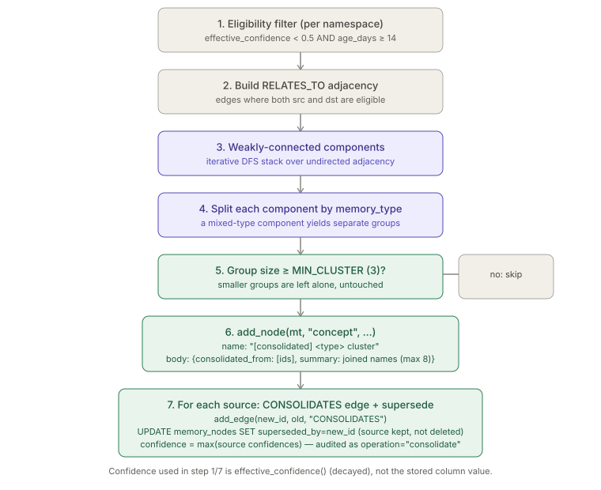
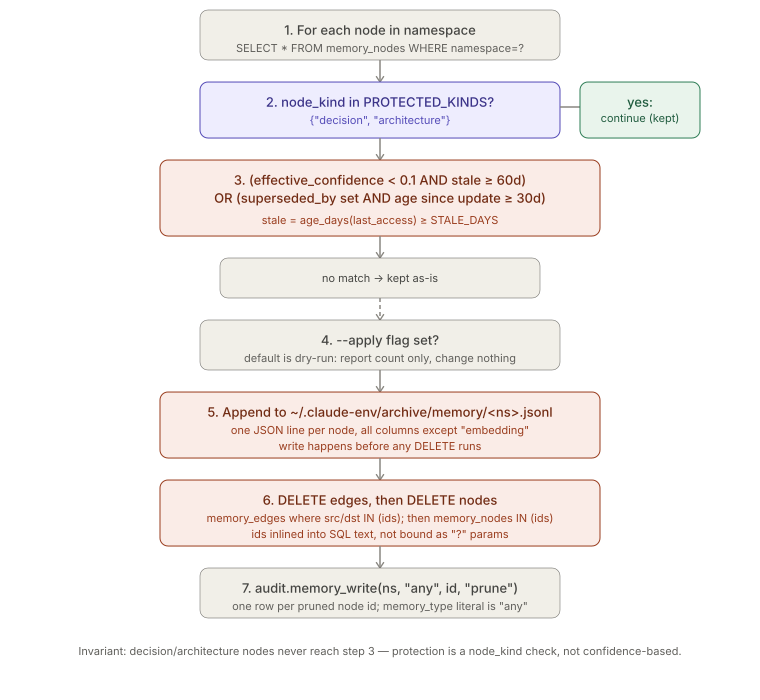

# Memory Consolidation & Pruning

> Relates to: [OVERVIEW.md §4 — the agent forgets everything, every session](../OVERVIEW.md#4-the-agent-forgets-everything-every-session)

**Source:** [`memory/memory_consolidator.py`](../../memory/memory_consolidator.py) (81 lines),
[`memory/memory_pruner.py`](../../memory/memory_pruner.py) (62 lines).

This doc covers only the maintenance jobs: how low-confidence memories get merged into
summary nodes, and how stale/decayed memories get archived and deleted. The node/edge
schema, `MemoryManager` CRUD, confidence decay math, and the `episodic/semantic/
procedural/agent` taxonomy are covered in `memory-graph.md` — this doc cross-links to
it rather than re-explaining `add_node`, `effective_confidence`, or `HALF_LIFE`.

---

## What it does (30-second version)

Both scripts are standalone, `launchd`-scheduled CLI jobs (`--namespace X` or `--all`)
that run against the same `memory_nodes` / `memory_edges` tables `MemoryManager` writes
to. **The consolidator** finds clusters of related, low-confidence, aged nodes and
merges each cluster into one new `concept` summary node — sources are marked
superseded, never deleted. **The pruner** hard-deletes nodes whose confidence has
decayed past a floor and gone stale, or that were superseded long ago — but always
archives the row to a JSONL file first, and never touches `decision`/`architecture`
nodes regardless of how low their confidence gets. Neither script touches the RAG
index or embeddings column beyond copying it into the archive line.

---

## Configuration reference

### `memory_consolidator.py` module constants

| Constant | Value | Effect |
|---|---|---|
| `CONF_CEILING` | `0.5` | A node is only cluster-eligible if `effective_confidence(...) < 0.5`. High-confidence memories are never consolidated. |
| `MIN_AGE_DAYS` | `14` | A node must be at least 14 days old (`_age_days(updated_at) >= 14`) to be eligible — freshly written low-confidence nodes are left alone. |
| `MIN_CLUSTER` | `3` | A weakly-connected, same-`memory_type` group must have **at least 3** members to be consolidated; groups of 1-2 are left untouched. |

### `memory_pruner.py` module constants

| Constant | Value | Effect |
|---|---|---|
| `PRUNE_FLOOR` | `0.1` | A node qualifies for pruning only if `effective_confidence(...) < 0.1`. |
| `STALE_DAYS` | `60` | Combined with the floor via AND: the node must also be unaccessed (`last_access`) for 60+ days. |
| `KEEP_SUPERSEDED` | `30` | A node with `superseded_by` set qualifies for pruning independently, once 30+ days have passed since its `updated_at` (i.e., since it was superseded/edited last). |
| `PROTECTED_KINDS` | `{"decision", "architecture"}` | Checked against the row's `node_kind` column. Matching rows `continue` immediately (`memory_pruner.py`) — skipped before either prune condition is even evaluated, so a decision node can never be pruned no matter how low its confidence or how stale it is. |
| `ARCHIVE` | `Path.home() / ".claude-env/archive/memory"` | Directory holding one JSONL file per namespace, e.g. `~/.claude-env/archive/memory/proj-payments.jsonl`. Created with `mkdir(parents=True, exist_ok=True)` on every run, even dry-run. |

### CLI flags

| Script | Flag | Effect |
|---|---|---|
| `memory_consolidator.py` | `--namespace <ns>` | Run against one namespace. |
| | `--all` | Run against every distinct namespace in `memory_nodes` (`SELECT DISTINCT namespace`). |
| `memory_pruner.py` | `--namespace <ns>` / `--all` | Same as above. |
| | `--apply` | Without it, the pruner **dry-runs**: it computes `to_prune` and reports the count but writes nothing and deletes nothing (`memory_pruner.py`, the archive-write/delete block is gated on `if apply and to_prune`). Dry-run is the default. |

Neither script takes a config file — all thresholds are hardcoded module constants, not
read from `config/*.yaml`. Changing them means editing and redeploying the script (see
the platform's `$CLAUDE_ENV_HOME` deploy rule).

---

## How to use it

Unlike most other platform scripts, these two are **not** wired into `bin/claude-env` —
there's no `claude-env consolidate-memory` or `claude-env prune-memory` subcommand.
They're invoked as standalone scripts through the deployed venv Python, normally by the
nightly memory-maintenance job rather than by hand:

```bash
# Consolidate one namespace's low-confidence clusters
~/.claude-env/venv/bin/python ~/.claude-env/memory/memory_consolidator.py --namespace proj-payments

# Consolidate every namespace with memory
~/.claude-env/venv/bin/python ~/.claude-env/memory/memory_consolidator.py --all

# Preview what the pruner would remove — the default, since --apply is required to
# actually archive+delete anything
~/.claude-env/venv/bin/python ~/.claude-env/memory/memory_pruner.py --namespace proj-payments

# Actually prune it, across every namespace
~/.claude-env/venv/bin/python ~/.claude-env/memory/memory_pruner.py --all --apply
```

Both scripts print one JSON object per namespace to stdout (`{"namespace": ..., "clusters_consolidated": ...}`
or `{"namespace": ..., "pruned"|"would_prune": <count>}`), so a manual run is easy to
pipe into `jq` or a log file. Run the pruner without `--apply` first if you're checking
its behavior after changing a threshold constant — it costs nothing and tells you
exactly how many nodes would be affected before you commit to deleting anything.

---

## How the logic works

### Consolidator: `_clusters()` — eligibility, adjacency, components, grouping

```python
# memory/memory_consolidator.py
def _clusters(db, ns):
    """Find weakly-connected RELATES_TO clusters of eligible nodes."""
    nodes = db.query("SELECT node_id,memory_type,confidence,half_life_days,updated_at,name,body_json "
                     "FROM memory_nodes WHERE namespace=? AND superseded_by IS NULL", (ns,))
    eligible = {n["node_id"]: n for n in nodes
                if effective_confidence(n["confidence"], n["half_life_days"], n["updated_at"]) < CONF_CEILING
                and _age_days(n["updated_at"]) >= MIN_AGE_DAYS}
    edges = db.query("SELECT src,dst FROM memory_edges WHERE namespace=? AND rel='RELATES_TO'", (ns,))
    adj = {nid: set() for nid in eligible}
    for e in edges:
        if e["src"] in eligible and e["dst"] in eligible:
            adj[e["src"]].add(e["dst"]); adj[e["dst"]].add(e["src"])
    seen, clusters = set(), []
    for nid in eligible:
        if nid in seen: continue
        stack, comp = [nid], []
        while stack:
            cur = stack.pop()
            if cur in seen: continue
            seen.add(cur); comp.append(cur)
            stack.extend(adj[cur] - seen)
        # group by memory_type within component
        by_type = {}
        for c in comp: by_type.setdefault(eligible[c]["memory_type"], []).append(c)
        for mt, members in by_type.items():
            if len(members) >= MIN_CLUSTER:
                clusters.append((mt, members, [eligible[m] for m in members]))
    return clusters
```

Read top to bottom:

1. **Fetch candidates.** Only non-superseded nodes (`superseded_by IS NULL`) in the
   namespace are queried at all — a node that's already been consolidated or corrected
   can't be re-consolidated.
2. **Eligibility filter.** `effective_confidence(...) < CONF_CEILING` (using the same
   decay function `MemoryManager` uses for reads — see `memory-graph.md`) **and**
   `_age_days(updated_at) >= MIN_AGE_DAYS`. Both conditions are AND'd; a low-confidence
   but brand-new node is not eligible.
3. **Adjacency is `RELATES_TO`-only, both eligible endpoints required.** Edges of any
   other `rel` type (`SUPERSEDES`, `CONSOLIDATES`) are not queried at all. An edge where
   only one endpoint is eligible is dropped entirely — it contributes to neither node's
   adjacency set. The graph is treated as **undirected**: both `adj[src]` and `adj[dst]`
   get each other added.
4. **Component discovery is a plain iterative DFS** over that undirected adjacency
   (explicit `stack`, not recursion — avoids Python recursion-depth limits on large
   clusters).
5. **Each component is split by `memory_type`** (`episodic`/`semantic`/`procedural`/
   `agent`) before the size check — a component that mixes types (e.g., linked
   `entity` and `decision` nodes) yields separate per-type groups, each checked against
   `MIN_CLUSTER` independently. It is **not** split further by `node_kind`; an `entity`
   and a `concept` node (both `semantic`) in the same component can end up in the same
   cluster together as long as they share `memory_type`.
6. **`MIN_CLUSTER` gate.** Only groups of 3+ become a `(memory_type, ids, members)`
   tuple in the returned list; smaller groups are silently dropped (left as individual
   nodes, untouched).

### Consolidator: `consolidate_ns()` — building the summary node

```python
# memory/memory_consolidator.py
def consolidate_ns(ns: str) -> dict:
    db = get_db(); mm = MemoryManager(ns, session_id="consolidator", actor="system")
    made = 0
    for mt, ids, members in _clusters(db, ns):
        names = [m["name"] for m in members][:8]
        summary = {"consolidated_from": ids,
                   "summary": f"Cluster of {len(ids)} related {mt} memories: " + "; ".join(names)}
        new_id = mm.add_node(mt, "concept", f"[consolidated] {mt} cluster", summary,
                             confidence=max(m["confidence"] for m in members))
        for old in ids:
            mm.add_edge(new_id, old, "CONSOLIDATES")
            db.execute("UPDATE memory_nodes SET superseded_by=? WHERE node_id=?", (new_id, old))
            mm.audit.memory_write(ns, mt, old, "consolidate")
        made += 1
    return {"namespace": ns, "clusters_consolidated": made}
```

- **The summary node's `node_kind` is always `"concept"`**, hardcoded — regardless of
  what `node_kind`s the source nodes actually had (they could be `entity`, `session`,
  `workflow`, anything valid for `mt`). Because `VALID_KINDS["semantic"]` includes
  `concept` but `VALID_KINDS["episodic"]`/`["procedural"]` do **not** (see
  `memory_manager.py`), consolidating an `episodic` or `procedural` cluster calls
  `add_node("episodic", "concept", ...)`, which raises `InvalidMemoryKind` — see
  [Facts](#facts-invariants--edge-cases) below.
- **The "consolidated" output** is a node whose `body_json` is
  `{"consolidated_from": [<source node_ids>], "summary": "Cluster of N related <type> memories: <up to 8 names, semicolon-joined>"}`,
  with `name = "[consolidated] <memory_type> cluster"`. Only the first 8 member names
  are embedded in the summary text even if the cluster is larger; `consolidated_from`
  still lists every source id.
- **Confidence of the new node is `max()` of the sources**, not an average or a fresh
  `1.0` — the summary inherits the strongest surviving signal from the cluster.
- **Provenance via `CONSOLIDATES` edges**, one per source, pointing `new_id -> old`.
- **Sources are marked, not deleted**: `UPDATE memory_nodes SET superseded_by=?`
  directly via `db.execute` (bypassing `MemoryManager.supersede()`, which would also
  create a `SUPERSEDES` edge and call `add_node` again — the consolidator only wants
  the `superseded_by` flag flipped, not a second edge type).
- **Audit**: one `memory_write(ns, mt, old, "consolidate")` call per source node
  (not one for the new node itself).



### Pruner: `prune_ns()` — selection, archive-then-delete, protection

```python
# memory/memory_pruner.py
def prune_ns(ns: str, apply: bool) -> dict:
    db = get_db(); audit = AuditLogger("pruner", actor="system")
    ARCHIVE.mkdir(parents=True, exist_ok=True)
    rows = db.query("SELECT * FROM memory_nodes WHERE namespace=?", (ns,))
    to_prune = []
    for r in rows:
        eff = effective_confidence(r["confidence"], r["half_life_days"], r["updated_at"])
        stale = _age_days(r["last_access"]) >= STALE_DAYS
        superseded_old = r["superseded_by"] and _age_days(r["updated_at"]) >= KEEP_SUPERSEDED
        if r["node_kind"] in PROTECTED_KINDS:
            continue
        if (eff < PRUNE_FLOOR and stale) or superseded_old:
            to_prune.append(r)
    if apply and to_prune:
        with (ARCHIVE / f"{ns}.jsonl").open("a") as f:
            for r in to_prune:
                f.write(json.dumps({k: r[k] for k in r if k != "embedding"}) + "\n")
        ids = [r["node_id"] for r in to_prune]
        idlist = ",".join(f"'{i}'" for i in ids)
        db.execute(f"DELETE FROM memory_edges WHERE namespace=? AND (src IN ({idlist}) OR dst IN ({idlist}))", (ns,))
        db.execute(f"DELETE FROM memory_nodes WHERE node_id IN ({idlist})")
        for i in ids: audit.memory_write(ns, "any", i, "prune")
    return {"namespace": ns, "pruned" if apply else "would_prune": len(to_prune)}
```

1. **Every row in the namespace is scanned** (`SELECT * FROM memory_nodes WHERE
   namespace=?`) — including already-superseded rows, which is how the
   `superseded_old` path finds them.
2. **Protection check comes before the prune-condition check**, and is unconditional:
   `if r["node_kind"] in PROTECTED_KINDS: continue`. This is a `node_kind` check, not a
   `memory_type` check — `PROTECTED_KINDS = {"decision", "architecture"}` are both
   `node_kind` values (`decision` lives under `episodic`, `architecture` under
   `semantic`, per `memory_manager.py`'s `VALID_KINDS`). A node of any other kind with
   arbitrarily low confidence and arbitrarily old staleness is not protected.
3. **Two independent prune conditions, OR'd:**
   - `eff < PRUNE_FLOOR and stale` — decayed **and** unaccessed. Confidence alone isn't
     enough; a low-confidence node that's still being read regularly (`last_access`
     refreshed by `MemoryManager._touch()` on every `get_node()`) survives.
   - `superseded_by and _age_days(updated_at) >= KEEP_SUPERSEDED` — a node consolidated
     or superseded 30+ days ago is prunable regardless of its own confidence/staleness
     values.
4. **Dry-run is the default control flow, not a separate code path** — `to_prune` is
   always computed; only the archive-write and the two `DELETE`s are gated behind
   `if apply and to_prune`.
5. **Archive-before-delete, verified from the code:** the `.jsonl` file is opened in
   append mode (`"a"`) and every row in `to_prune` is written as one JSON object per
   line, **before** either `DELETE` statement runs. The dict is built as `{k: r[k] for
   k in r if k != "embedding"}` — every column survives into the archive except the
   embedding vector (kept out to avoid bloating the JSONL with binary-derived floats).
   Path is `~/.claude-env/archive/memory/<namespace>.jsonl` (confirmed from the
   `ARCHIVE` constant plus the `open()` call) — appended to across runs, one
   file per namespace, never rotated or truncated by this script.
6. **Deletes are two statements, edges first:** `memory_edges` rows where the namespace
   matches and either `src` or `dst` is in the pruned id set, then `memory_nodes` rows
   by id. Edges are cleaned up first so no edge is left dangling to a deleted node id.
7. **Audit** — one `memory_write(ns, "any", i, "prune")` call per pruned id. Note the
   literal string `"any"` is passed as `memory_type`, not the row's real
   `memory_type` — see [Facts](#facts-invariants--edge-cases).



---

## Test coverage

**No dedicated test file exists for either script.** A repo-wide search
(`tests/test_memory_isolation.py` is the only memory-related test file) turned up
nothing named after or importing `memory_consolidator` or `memory_pruner`, and
`test_memory_isolation.py` itself only exercises namespace isolation in
`MemoryManager`/`memory_retriever`, not consolidation or pruning. The behavior above is
sourced entirely from reading `memory_consolidator.py` and `memory_pruner.py` directly
— there is no test to cross-check it against or to point to for runnable examples.

---

## Facts, invariants & edge cases

- **Protection is absolute, including for `superseded_old`** — the `node_kind in
  PROTECTED_KINDS` check (see [above](#pruner-prune_ns--selection-archive-then-delete-protection))
  runs before either prune condition, so a `decision`/`architecture` node superseded
  30+ days ago is still skipped, not just a floor/staleness override.
- **Consolidating an `episodic` or `procedural` cluster will raise, not silently
  degrade.** `consolidate_ns()` always calls `mm.add_node(mt, "concept", ...)`. Per
  `memory_manager.py`, `"concept"` is only valid under `memory_type="semantic"`
  (and `"agent"`, which accepts any kind). If `_clusters()` ever returns a cluster with
  `mt == "episodic"` or `mt == "procedural"` (both plausible: `session`/`decision`/
  `investigation` nodes RELATES_TO-linked, or `workflow`/`convention`/`pattern` nodes
  linked), `add_node` raises `InvalidMemoryKind` and the whole `consolidate_ns` call
  for that namespace fails with an unhandled exception — there is no
  `try/except` around the loop in `consolidate_ns()`. This is a real gap: the module
  docstring's claim of "same memory_type" clustering doesn't protect against this,
  since same-type doesn't guarantee same-taxonomy-group compatibility with a
  hardcoded `"concept"` kind.
- **The pruner's audit call hardcodes `memory_type="any"`.** `audit.memory_write(ns,
  "any", i, "prune")` (`memory_pruner.py`) never reads the row's actual
  `memory_type` column, even though the row (`r`) is right there in scope. Every prune
  audit row looks identical on that field regardless of what was actually deleted; the
  real type is only recoverable from the archive JSONL, not the audit log.
- **The pruner's `DELETE` statements build the id list via f-string interpolation, not
  `?` placeholders.** `idlist = ",".join(f"'{i}'" for i in ids)` is spliced directly
  into the SQL text for both `DELETE` statements (`memory_pruner.py`). This
  departs from the platform-wide SQL-portability convention (see the root
  `CLAUDE.md` invariant "Keep SQL portable (`?` placeholders...)"). It's not
  attacker-reachable in the current call path (`ids` come from `node_id`s the pruner
  itself generated via `MemoryManager.add_node`'s `f"mem-{uuid.uuid4().hex}"`, not from
  external input), but it's the one place in these two files that doesn't follow the
  parameterized-query pattern used everywhere else in the same functions.
- **Consolidation and pruning interact through `superseded_by`, not exclusion.** A
  cluster's sources get `superseded_by` set by the consolidator; the pruner's
  `superseded_old` branch then independently makes them prunable 30 days later. The
  consolidator does not archive or delete anything itself — cleanup of consolidated
  sources is entirely deferred to a later pruner run.
- **`_clusters()` only ever looks at non-superseded nodes** (see [fetch
  candidates](#consolidator-_clusters--eligibility-adjacency-components-grouping)
  above), so a node already consolidated into a summary cannot also be pulled into a
  second, different cluster.
- **Both scripts use `effective_confidence()`/`_age_days()` imported directly from
  `memory_manager.py`** (not reimplemented), so decay math is identical to what
  `MemoryManager.list_nodes()` uses for reads — see `memory-graph.md` for that
  function's formula (`stored * 2 ** (-age_days / half_life_days)`).
  `memory_manager.py` also exposes `MemoryManager.decay_all()`, which persists decayed
  confidence into the `confidence` column — neither the consolidator nor the pruner
  calls it; both recompute `effective_confidence` on the fly from the stored
  (possibly-undecayed) value each run.
- **`ARCHIVE.mkdir()` runs even on dry-run.** The pruner creates
  `~/.claude-env/archive/memory/` unconditionally at the top of `prune_ns()`, before
  the `apply` check — a dry-run still creates the directory (but never writes into it
  or deletes anything) if it doesn't already exist.
- **Both scripts are only ever invoked as CLI processes** (`--namespace`/`--all`,
  optionally `--apply`), scheduled nightly via `launchd` per the consolidator's module
  docstring — there's no importable "run consolidation for this namespace" API surface
  beyond calling `consolidate_ns(ns)` / `prune_ns(ns, apply)` directly in Python.

---

## Related docs

- `memory-graph.md` — node/edge schema, `MemoryManager` CRUD, the
  `episodic`/`semantic`/`procedural`/`agent` taxonomy (`VALID_KINDS`), `HALF_LIFE`
  defaults, and the `effective_confidence()` decay formula both scripts reuse. *(Not
  yet written — see `docs/guide/README.md`'s tracking table.)*
- [`policy-engine.md`](policy-engine.md) — the reference doc format this page follows.
- [OVERVIEW.md §4](../OVERVIEW.md#4-the-agent-forgets-everything-every-session) — the
  product-level framing of the memory problem this maintenance layer supports.
