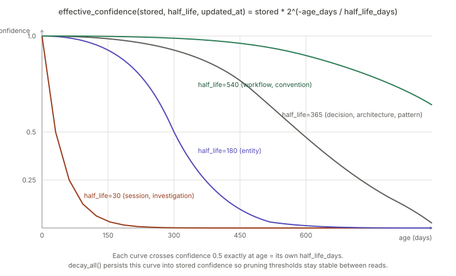
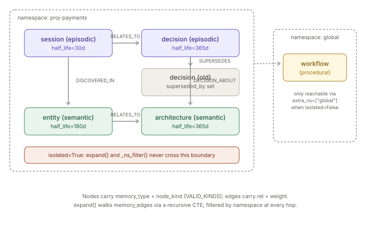

# Memory Graph

> Relates to: [OVERVIEW.md §4 — the agent forgets everything, every session](../OVERVIEW.md#4-the-agent-forgets-everything-every-session)

**Source:** [`memory/memory_manager.py`](../../memory/memory_manager.py) (181 lines),
[`memory/memory_retriever.py`](../../memory/memory_retriever.py) (146 lines).
**Schema:** [`sql/001_schema.sql`](../../sql/001_schema.sql) (`memory_nodes` / `memory_edges`).

This doc covers CRUD + retrieval over the memory graph only. How Claude Code session
transcripts become nodes automatically is `session-ingestion.md` (🔜); confidence-driven
cleanup is `memory-consolidation.md` (🔜); cross-repo/team sharing is `memory-sync.md`
(🔜) — all separate callers of the two classes documented here, not part of them.

---

## What it does (30-second version)

The memory graph is a property graph — nodes and edges — encoded relationally in
SQLite. `MemoryManager` writes nodes (`add_node`), links them (`add_edge`), and
performs append-only corrections (`supersede`). `MemoryRetriever` reads them back by
keyword, by embedding similarity, and by graph traversal (`expand`, a recursive-CTE
walk), merging all three into one ranked `recall()`. Every node belongs to a
`namespace` (`proj-<slug>`, `global`, or `agent:<id>`); when a caller sets
`isolated=True` (tier 2/3), the retriever refuses to read or traverse into any other
namespace, no matter what the graph's edges point to. Confidence isn't a static
number — it decays exponentially with age, computed at read time and periodically
persisted by `decay_all()`.

---

## Configuration reference

### Node schema — `memory_nodes` (`sql/001_schema.sql`)

| Column | Type | Notes |
|---|---|---|
| `node_id` | TEXT PK | `f"mem-{uuid4().hex}"`, generated by `add_node`. |
| `namespace` | TEXT NOT NULL | `'proj-<slug>'` \| `'global'` \| `'agent:<id>'`. The isolation boundary — see [namespace isolation](#namespace-isolation). |
| `memory_type` | TEXT NOT NULL | One of `episodic` \| `semantic` \| `procedural` \| `agent`. |
| `node_kind` | TEXT NOT NULL | See [taxonomy table](#the-memory_typenode_kind-taxonomy-valid_kinds) below; drives `HALF_LIFE` lookup. |
| `name` | TEXT NOT NULL | Short label; concatenated with `body` for embedding text. |
| `body_json` | TEXT NOT NULL | Arbitrary structured content, `json.dumps(body)` on write, `json.loads` back on read by `_rank`. |
| `repo` | TEXT | Optional; which repo this node is about. |
| `confidence` | REAL NOT NULL DEFAULT 1.0 | Stored value *at* `updated_at` — not the live value; see [decay](#confidence-decay). |
| `half_life_days` | REAL NOT NULL DEFAULT 90 | Copied from `HALF_LIFE[node_kind]` at insert time; the schema's own `DEFAULT 90` is never actually hit because `add_node` always supplies it explicitly. |
| `created_at` / `updated_at` / `last_access` | TEXT NOT NULL | ISO-8601 UTC, `%Y-%m-%dT%H:%M:%S.%fZ`, from `_now()`. |
| `access_count` | INTEGER NOT NULL DEFAULT 0 | Incremented by `_touch()` on every `get_node()`. |
| `superseded_by` | TEXT REFERENCES memory_nodes(node_id) | Set by `supersede()`; non-NULL means "don't surface this node" (filtered by default everywhere). |
| `embedding` | BLOB | `struct.pack(f"<{len(vec)}f", *vec)` — little-endian float32 array, or NULL if no embedder is configured. |

### Edge schema — `memory_edges` (`sql/001_schema.sql`)

| Column | Type | Notes |
|---|---|---|
| `edge_id` | TEXT PK | `f"edge-{uuid4().hex}"`. |
| `namespace` | TEXT NOT NULL | The namespace the edge was written under — used by `expand()`'s traversal filter. |
| `src` / `dst` | TEXT NOT NULL, FK → `memory_nodes(node_id)` | Direction matters: traversal in `expand()` only follows `src → dst`. |
| `rel` | TEXT NOT NULL | Vocabulary: `RELATES_TO` \| `DEPENDS_ON` \| `DECISION_ABOUT` \| `DISCOVERED_IN` \| `SUPERSEDES` \| `CONSOLIDATES` (`MemoryManager.VALID_RELS`, the single source of truth — the schema comment lists the same set). Enforced not by a DB CHECK but by `add_edge()`, which raises `InvalidMemoryRel` for anything outside the set; the `memory.link` MCP tool advertises the same set as a JSON-Schema `enum`. |
| `weight` | REAL NOT NULL DEFAULT 1.0 | Stored but not read by any ranking logic in either file — available for a future weighted-traversal use, currently inert. |
| `created_at` | TEXT NOT NULL | ISO-8601 UTC. |

### The `memory_type`/`node_kind` taxonomy (`VALID_KINDS`)

`memory/memory_manager.py`:

```python
# memory/memory_manager.py
HALF_LIFE = {            # days
    "session": 30, "investigation": 30, "decision": 365,
    "entity": 180, "concept": 270, "architecture": 365,
    "workflow": 540, "convention": 540, "pattern": 365,
    "preference": 270,
}

VALID_KINDS = {
    "episodic": {"session", "decision", "investigation"},
    "semantic": {"entity", "concept", "architecture", "preference"},
    "procedural": {"workflow", "convention", "pattern"},
    "agent": set(HALF_LIFE),   # agent namespace reuses any of the above kinds
}
```

| `memory_type` | Valid `node_kind` values | `half_life_days` |
|---|---|---|
| `episodic` | `session` (30), `decision` (365), `investigation` (30) | per-kind, above |
| `semantic` | `entity` (180), `concept` (270), `architecture` (365), `preference` (270) | per-kind, above |
| `procedural` | `workflow` (540), `convention` (540), `pattern` (365) | per-kind, above |
| `agent` | any of the ten kinds above (`set(HALF_LIFE)`) | same per-kind value |

`agent` is not a fourth kind namespace with its own kinds — it's a memory_type that
accepts every kind that any other type accepts, distinguished instead by *namespace*
convention (`agent:<id>`), per the module docstring
(`memory/memory_manager.py`).

### `MemoryManager` — CRUD method signatures

| Method | Signature | Effect |
|---|---|---|
| `__init__` | `(namespace: str, session_id: str = "mem", actor: str = "system", isolated: bool = False)` | Opens `get_db()`, stores `ns`/`isolated`, builds an `AuditLogger`. |
| `add_node` | `(memory_type, node_kind, name, body: dict, repo=None, confidence=1.0, embedding=None) -> str` | Validates against `VALID_KINDS`, generates `node_id`, embeds if not supplied, inserts, audits, returns `node_id`. Raises `InvalidMemoryKind` on a bad pair. |
| `add_edge` | `(src, dst, rel, weight=1.0) -> str` | Validates `rel` against `VALID_RELS` and requires both endpoints to exist in the manager's own namespace (raising `InvalidMemoryRel` / `CrossNamespaceEdge` otherwise), then inserts one `memory_edges` row and audits it as `memory_write(operation="link:<rel>")`. Returns `edge_id`. |
| `supersede` | `(old_node_id, memory_type, node_kind, name, body: dict, **kw) -> str` | Creates a new node via `add_node`, links `new → old` with `rel="SUPERSEDES"`, sets `old.superseded_by = new_id`, audits as `"supersede"`. |
| `get_node` | `(node_id: str) -> dict \| None` | Point read; calls `_touch()` (updates `last_access`, `access_count`) on a hit. **Not audited** — no `memory_read` call in this method either. |
| `list_nodes` | `(memory_type=None, min_confidence=0.0, include_superseded=False, limit=100) -> list[dict]` | Namespace-scoped list, optional type filter, excludes superseded nodes by default, computes `effective_confidence` per row and drops rows below `min_confidence`, audits once with the total count. |
| `decay_all` | `() -> int` | Recomputes and **persists** `effective_confidence` back into `confidence` for every node in the namespace; returns count updated. Used by the consolidator/pruner so decay thresholds don't keep moving between reads. |

### `MemoryRetriever` — read method signatures

| Method | Signature | Effect |
|---|---|---|
| `__init__` | `(namespace: str, session_id: str = "mem", actor: str = "system", isolated: bool = False)` | Same shape as `MemoryManager.__init__`; a separate object, not inherited. |
| `keyword_recall` | `(query: str, top_k=10, extra_ns=None) -> list[dict]` | Case-insensitive `LIKE '%query%'` over `name` and `body_json`, namespace-filtered, excludes superseded, ranked and truncated by `_rank`. |
| `embedding_recall` | `(query_vec: list[float], top_k=10, extra_ns=None) -> list[dict]` | Loads every node with a non-NULL embedding in scope, unpacks the float32 blob, scores by cosine similarity (`_cos`), sorts descending, ranks top `top_k`. |
| `expand` | `(seed_ids: list[str], depth=2, rels=None, extra_ns=None) -> list[dict]` | Recursive-CTE BFS from seeds along `memory_edges`, namespace-filtered at every hop (see below). Returns raw rows (not passed through `_rank`). |
| `recall` | `(query, depth=2, top_k=10, query_vec=None, extra_ns=None) -> list[dict]` | Orchestrates: keyword seeds (+ embedding seeds if `query_vec` given) → `expand()` from all seed ids → merge (seed rows win ties via `dict.setdefault`) → `_rank`. Single audited `memory_read` call. |
| `_rank` (static) | `(rows: list[dict], top_k: int) -> list[dict]` | Adds `effective_confidence`, parses `body_json` into `body`, strips the raw `embedding` blob, sorts by `(sim, effective_confidence)` descending, truncates to `top_k`. |

---

## How the logic works

### Confidence decay — the actual formula

`memory/memory_manager.py`:

```python
# memory/memory_manager.py
def _age_days(iso: str) -> float:
    t = datetime.fromisoformat(iso.replace("Z", "+00:00"))
    return max(0.0, (datetime.now(timezone.utc) - t).total_seconds() / 86400)


def effective_confidence(stored: float, half_life: float, updated_at: str) -> float:
    return stored * (2 ** (-_age_days(updated_at) / max(1e-6, half_life)))
```

Confirmed: it is exactly `stored * 2^(-age_days / half_life_days)` — classic
exponential half-life decay, not a linear ramp or a decay-per-access scheme. Two
details that matter:

- **Age is measured from `updated_at`, not `created_at`.** Any write that touches
  `updated_at` (a `supersede`, or `decay_all` itself) resets the decay clock. Plain
  reads (`get_node`, `list_nodes`) do **not** touch `updated_at` — only `_touch()`'s
  `last_access`/`access_count` change on read, so *reading* a memory does not refresh
  its confidence, only writing to it does.
- **The `max(1e-6, half_life)` guard** exists purely to prevent a division by zero if
  `half_life_days` were ever `0`; it has no effect at the real per-kind values (30-540).

This single function is imported and reused (not reimplemented) in the retriever:
`memory/memory_retriever.py` — `from memory.memory_manager import
effective_confidence` — so decay math lives in exactly one place.



### Namespace isolation

`MemoryRetriever._ns_filter` (`memory/memory_retriever.py`) is the single choke
point every read method calls through:

```python
# memory/memory_retriever.py
def _ns_filter(self, extra_ns: list[str] | None) -> tuple[str, list]:
    namespaces = [self.ns]
    if extra_ns and not self.isolated:
        namespaces += extra_ns
    placeholders = ",".join("?" * len(namespaces))
    return f"namespace IN ({placeholders})", namespaces
```

When `self.isolated` is `True`, `extra_ns` is silently dropped — the namespace list is
always exactly `[self.ns]`, regardless of what the caller asked for. There is no error
raised for requesting cross-namespace reads while isolated; the request is just
narrowed to the one allowed namespace.

`expand()` is the interesting case, because a graph traversal can walk *out* of a
namespace through an edge even if the seed node was in-scope. The docstring names this
exact risk (`memory/memory_retriever.py`) and the SQL guards it at three points,
not one:

```python
# memory/memory_retriever.py
sql = f"""
WITH RECURSIVE walk(node_id, hops) AS (
    SELECT node_id, 0 FROM memory_nodes
     WHERE node_id IN ({seed_ph}) AND {nsf}
    UNION
    SELECT e.dst, w.hops + 1
    FROM walk w JOIN memory_edges e ON e.src = w.node_id
    JOIN memory_nodes dn ON dn.node_id = e.dst
    WHERE w.hops < ? AND dn.{nsf} {rel_filter}
)
SELECT DISTINCT n.* FROM walk w JOIN memory_nodes n ON n.node_id = w.node_id
WHERE n.superseded_by IS NULL AND n.{nsf}
"""
```

The three `{nsf}` substitutions are the *same* `namespace IN (?,...)` fragment,
applied to: (1) the seed selection, (2) the recursive step's destination-node join
(`dn.{nsf}` — an edge is only followed if its **destination** is in-namespace), and
(3) the final projection. `params` (`memory/memory_retriever.py`) supplies the
namespace parameter list three times in the same order for the three placeholders.
Because the guard is on the destination node at the join, not just the final
projection, a same-namespace edge whose `dst` happens to be a different namespace's
node is never even added to the `walk` CTE — it doesn't leak through and then get
filtered at the end; it's excluded during the walk itself.



### `recall()` — how ranking actually merges three sources

```python
# memory/memory_retriever.py
def recall(self, query: str, depth: int = 2, top_k: int = 10,
           query_vec: list[float] | None = None,
           extra_ns: list[str] | None = None) -> list[dict]:
    seeds = self.keyword_recall(query, top_k, extra_ns)
    if query_vec:
        seeds += self.embedding_recall(query_vec, top_k, extra_ns)
    seen = {s["node_id"]: s for s in seeds}
    expanded = self.expand(list(seen.keys()), depth=depth, extra_ns=extra_ns)
    for r in expanded:
        seen.setdefault(r["node_id"], r)
    result = self._rank(list(seen.values()), top_k)
    self.audit.memory_read(self.ns, "recall", query, len(result))
    return result
```

Order of operations: keyword seeds first, then (if a query vector was supplied)
embedding seeds are appended — a node found by both keyword and embedding search
keeps whichever dict entry inserted first (`seen = {...}` then a later
`seen.setdefault`), meaning **keyword and embedding rows never overwrite each other on
collision by design of `setdefault`, but a plain dict-comprehension assignment for
`seeds` means an embedding-recall duplicate of a keyword hit is dropped silently**
rather than merged (e.g. `sim` from the embedding pass is lost if the same node also
came from keyword recall). Then `expand()` runs from *all* seed ids (keyword +
embedding combined) and any newly-discovered node is added only if not already seen —
seed rows always win over expansion-discovered rows for the same `node_id`. Finally
`_rank` sorts everything by `(sim, effective_confidence)` descending — nodes without a
computed `sim` (i.e., anything from `keyword_recall` or `expand`, which never set
`r["sim"]`) sort using `.get("sim", 0)`, so they rank purely by confidence among
themselves and always sort below any embedding-scored node with `sim > 0`.

### Kind-taxonomy enforcement — fail loud, not silent

```python
# memory/memory_manager.py
def add_node(self, memory_type: str, node_kind: str, name: str,
             body: dict, repo: str | None = None,
             confidence: float = 1.0, embedding: bytes | None = None) -> str:
    allowed = VALID_KINDS.get(memory_type)
    if allowed is None or node_kind not in allowed:
        raise InvalidMemoryKind(
            f"invalid (memory_type={memory_type!r}, node_kind={node_kind!r}); "
            f"expected one of {VALID_KINDS}")
```

This is a hard `raise`, not a fallback to a default `node_kind` — the module docstring
is explicit about why (`memory/memory_manager.py`): allowing an ad hoc kind like
`"issue"` would silently degrade that node to no `HALF_LIFE` entry and lose
prune-protection. `InvalidMemoryKind` subclasses `ValueError`
(`memory/memory_manager.py`) — callers that only catch `ValueError` still catch
this correctly.

### Best-effort embedding — writes never fail on a missing model

```python
# memory/memory_manager.py
def _embed_for(name: str, body: dict) -> bytes | None:
    try:
        import struct
        from rag.config import get_embedder
        text = (name or "") + " " + json.dumps(body)
        vec = get_embedder().embed_documents([text])[0]
        return struct.pack(f"<{len(vec)}f", *vec)
    except Exception:
        return None
```

A bare `except Exception` — any failure (no embedder configured, model load error,
malformed body) results in `embedding=None`, not a raised error. `add_node` only calls
this when the caller didn't already pass an `embedding` explicitly
(`memory/memory_manager.py`). This is the mechanism that lets `embedding_recall`
simply skip nodes with `embedding IS NOT NULL` filtering them out — a memory write with
no RAG model configured is still a fully functional graph node, just invisible to
embedding-based recall (keyword recall and graph expansion still find it).

---

## Facts, invariants & edge cases

- **The confidence-decay formula** (see [above](#confidence-decay-the-actual-formula))
  means that at `age_days == half_life_days`, effective confidence is exactly
  `stored * 0.5`.
- **`get_node` is the one unaudited access path.** Every write (`add_node`,
  `add_edge`, `supersede`) calls `self.audit.memory_write`, and `list_nodes`/`recall`
  call `memory_read` — but `get_node` does not. Only `_touch()`'s side effect
  (`last_access`/`access_count`) records that a `get_node` happened, and only in the
  database, not the audit ledger. (`add_edge` used to share this gap; it now audits as
  `memory_write(operation="link:<rel>")`.)
- **Reading doesn't reset decay; writing does** — see [age is measured from
  `updated_at`](#confidence-decay-the-actual-formula) above.
- **`decay_all()` makes decay "sticky."** Without it, `effective_confidence` is purely
  a read-time computation off the original `confidence`/`updated_at` — nothing is lost.
  Calling `decay_all()` collapses that into the new stored `confidence` and bumps
  `updated_at` to now, which (per the point above) **restarts** the decay clock at the
  freshly-lowered value rather than continuing the original exponential curve from the
  original `updated_at`. This is why the module comment calls it "persist decayed
  confidence so pruning thresholds are stable" (`memory/memory_manager.py`) —
  it's a deliberate periodic snapshot for the pruner, not a no-op refresh.
- **Namespace isolation is enforced by SQL parameterization at three join points, not
  a single post-hoc filter.** Verified directly against
  `tests/test_memory_isolation.py::test_expand_does_not_cross_namespaces`: node `a2`
  (namespace `proj-a`) has an edge to `b1` (namespace `proj-b`) stored *under*
  `proj-a`'s namespace; `MemoryRetriever(namespace="proj-a", isolated=True).expand(["a1"],
  depth=3)` reaches `a2` but never `b1` — an edge's own `namespace` column doesn't
  matter for the guard, only the **destination node's** namespace does
  (`dn.{nsf}` in the recursive step). This read-side guard is defense-in-depth:
  `add_edge()` now *also* refuses to create a cross-namespace edge in the first place
  (raising `CrossNamespaceEdge`), so the leaky edge in that test only exists because it
  is inserted via raw SQL to exercise the traversal filter directly.
- **`isolated=False` cross-namespace reads are opt-in per call, not global.**
  `tests/test_memory_isolation.py::test_expand_extra_ns_allowed_when_not_isolated`
  shows a non-isolated retriever still needs `extra_ns=["global"]` passed explicitly
  to `expand()` to reach a `global`-namespace node — omitting `extra_ns` scopes to
  `self.ns` only even when `isolated=False`.
  `tests/test_memory_isolation.py` covers `MemoryRetriever.expand()`;
  `tests/test_memory_edge_validation.py` covers `MemoryManager.add_edge()`'s
  rel/namespace/audit validation. `add_node`/`supersede`/`list_nodes` still have no
  dedicated direct test.
- **`weight` on `memory_edges` is stored but currently inert** — see the [edge schema
  table](#edge-schema--memory_edges-sql001_schemasql) above; neither `expand()` nor
  `_rank()` reads it.
- **`rel` is enforced in Python, not by a DB CHECK** — see the [edge schema
  table](#edge-schema--memory_edges-sql001_schemasql) above. Note `CONSOLIDATES` —
  emitted by `memory_consolidator` — was historically missing from the schema comment;
  `VALID_RELS` includes it.
- **A missing embedding model degrades gracefully, never fails a write** — see
  [Best-effort embedding](#best-effort-embedding--writes-never-fail-on-a-missing-model)
  above.
- **`agent` is a memory_type, not a fifth kind bucket** — see the [taxonomy
  section](#the-memory_typenode_kind-taxonomy-valid_kinds) above.
- **`supersede()` is append-only by construction, not by a DB trigger.** Unlike the
  audit ledger (which has DB-level triggers rejecting `UPDATE`/`DELETE` on
  `audit_events`), nothing in `sql/001_schema.sql` stops direct code from `UPDATE`ing
  or `DELETE`ing a `memory_nodes` row outside of `supersede()`'s own `UPDATE ...
  SET superseded_by=...` call — the append-only guarantee here is a convention
  enforced by which methods exist on `MemoryManager`, not a schema-level constraint.

---

## Related docs

- [OVERVIEW.md §4](../OVERVIEW.md#4-the-agent-forgets-everything-every-session) — the
  product-level framing of the problem this module solves.
- `session-ingestion.md` (🔜) — how Claude Code transcripts become `memory_nodes`
  automatically (`memory/session_ingestor.py`).
- `memory-consolidation.md` (🔜) — the nightly job that calls `decay_all()` and prunes
  low-confidence nodes (`memory/memory_consolidator.py`, `memory/memory_pruner.py`).
- `memory-sync.md` (🔜) — deliberate cross-repo/team sharing of `global`-namespace
  memory (`memory/memory_sync.py`).
- [`rag-pipeline.md`](rag-pipeline.md) (🔜) — `rag.config.get_embedder()`, the same
  embedder `_embed_for()` calls into for semantic recall.
- [`policy-engine.md`](policy-engine.md) — the `tier.memory_isolated` config flag
  (advisory metadata, not read by the policy engine itself) that determines whether a
  repo's `MemoryManager`/`MemoryRetriever` are constructed with `isolated=True`.
