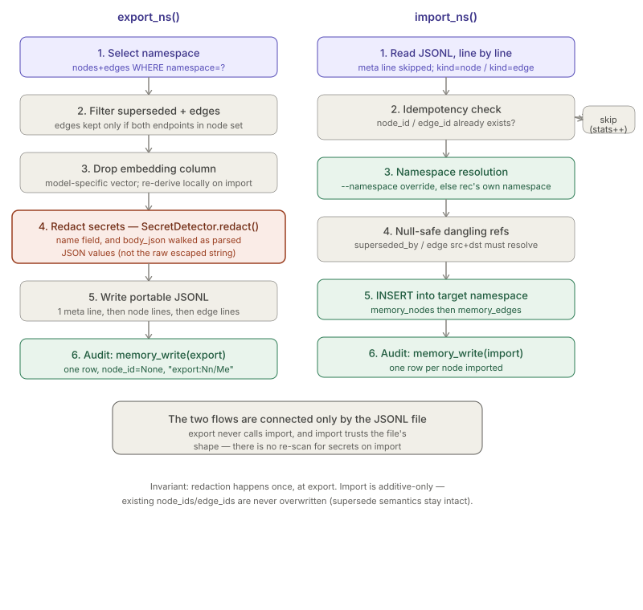

# Memory Sync (export / import)

> Relates to: [OVERVIEW.md §4 — the agent forgets everything, every session](../OVERVIEW.md#4-the-agent-forgets-everything-every-session)

**Source:** [`claudenv/domain/memory/service/maintenance.py`](../../claudenv/domain/memory/service/maintenance.py) (180 lines).

This doc covers `claudenv/domain/memory/service/maintenance.py` only. It reuses `SecretDetector.redact()`
from `claudenv/domain/security/detectors.py` for export-time redaction rather than implementing its
own scanning — see [`secret-detection.md`](secret-detection.md) for how that class
works (once written). The memory graph's own read/write paths (`memory_manager.py`,
`memory_retriever.py`) are a separate doc; this one is strictly the CLI that moves a
namespace between machines as a file.

No test file exists for this module — there is no `tests/test_memory_sync.py` in the
repo. Everything below is verified directly against the source, not against test
assertions.

---

## What it does (30-second version)

`memory_sync.py` is a standalone CLI with two subcommands: `export` dumps every node
and edge in one memory namespace to a JSONL file, redacting secrets out of every node
body along the way; `import` reads that file back in, additively, into a (possibly
different) namespace. It's how a senior engineer's accumulated decisions and
conventions become a file that's reviewable, diffable, and shareable (repo, drive,
chat) — and how a new teammate's first Claude Code session starts already knowing
them, per the module docstring (`claudenv/domain/memory/service/maintenance.py`).

---

## CLI / interface reference

| Command | Flag | Required | Effect |
|---|---|---|---|
| `export` | `--namespace` | yes | Namespace to export (e.g. `proj-payments`). |
| `export` | `--out` | yes | Output JSONL path. |
| `export` | `--include-superseded` | no (flag) | Without it, only live nodes (`superseded_by IS NULL`) are exported. |
| `import` | `--in` | yes | Input JSONL path (`dest="infile"` — note the flag is `--in`, not `--infile`, on the command line). |
| `import` | `--namespace` | no | Remap all imported rows into this namespace instead of each record's own `namespace` field. |

```
claude-env memory-sync export --namespace proj-payments --out team.jsonl
claude-env memory-sync import --in team.jsonl
claude-env memory-sync import --in team.jsonl --namespace proj-other
```

(`claudenv/domain/memory/service/maintenance.py`)

---

## How to use it

```bash
# Share a project namespace with a teammate — redacted JSONL, safe to hand off
claude-env memory-sync export --namespace proj-payments --out payments.jsonl

# Full audit dump — include superseded nodes too, not just the live set
claude-env memory-sync export --namespace proj-payments --out payments-full.jsonl \
  --include-superseded

# New machine, same namespace — import as-is
claude-env memory-sync import --in payments.jsonl

# New machine, different namespace — remap everything on the way in
claude-env memory-sync import --in payments.jsonl --namespace proj-payments-staging
```

The last example is the remap case: the export file's `meta` line still says
`namespace: proj-payments` (that field is decorative, per the JSONL format above), but
every node and edge lands under `proj-payments-staging` in the target DB because
`--namespace` on `import` overrides the per-record namespace uniformly. Omit
`--namespace` on import when you want each record to keep the namespace it was
exported from. Re-running the same `import` command twice is safe — it's idempotent by
`node_id`, so the second run just skips everything already present.

## JSONL file format

One JSON object per line, three `kind`s, always meta first:

```python
# claudenv/domain/memory/service/maintenance.py (module docstring)
{"kind":"meta", "namespace":..., "exported_at":..., "nodes":N, "edges":M}
{"kind":"node", ...row...}
{"kind":"edge", ...row...}
```

- **`meta`** — one line, written first. `namespace` is the *exported* namespace (not
  necessarily where it lands on import), plus a UTC timestamp and the node/edge
  counts. Purely informational — `import_ns()` skips `kind == "meta"` entirely
  (`memory_sync.py`); it is never validated or used to cross-check counts.
- **`node`** — the full `memory_nodes` row as a dict, spread under `"kind":"node"`,
  with `embedding` popped off and `name`/`body_json` redacted (see below).
- **`edge`** — the full `memory_edges` row as a dict, spread under `"kind":"edge"`,
  unredacted (edges only carry `src`, `dst`, `rel`, `weight` — no free text).

`default=str` is passed to every `json.dumps` call for node/edge rows
(`memory_sync.py,87`), so any non-JSON-native column value (e.g. a driver-specific
type from `claudenv/adapters/persistence/sqlite/database.py`) is coerced to its string form rather than raising.

---

## Namespace scoping

Both directions key off `memory_nodes.namespace` / `memory_edges.namespace`
(`sql/001_schema.sql,233`) — there is no other identifier for "which team/repo
does this belong to."

**Export** takes one namespace as a required argument and queries only that scope:

```python
# claudenv/domain/memory/service/maintenance.py
def export_ns(namespace: str, out_path: Path,
              include_superseded: bool = False) -> dict:
    db = get_db()
    redact = SecretDetector(session_id="mem-sync").redact
    sup = "" if include_superseded else "AND superseded_by IS NULL"
    nodes = db.query(
        f"SELECT * FROM memory_nodes WHERE namespace=? {sup}", (namespace,))
    node_ids = {n["node_id"] for n in nodes}
    edges = [e for e in db.query(
        "SELECT * FROM memory_edges WHERE namespace=?", (namespace,))
        if e["src"] in node_ids and e["dst"] in node_ids]
```

Edges are filtered twice: by `namespace=?` in SQL, and then again in Python against
`node_ids` — the exported node set (post `superseded_by` filtering). This means an
edge whose namespace matches but whose `src` or `dst` was excluded (e.g. it's
superseded and `--include-superseded` wasn't passed) is silently dropped from the
export, even though the edge row itself still exists in the source DB.

**Import** resolves the *target* namespace per record, not per file:

```python
# memory_sync.py
ns = namespace_override or rec.get("namespace")
```

This line runs inside the per-line loop, so `--namespace` (if given) applies
uniformly to every node and edge in the file; without it, each record keeps whatever
namespace it was exported from — which matters if a hand-edited JSONL mixes records
from different namespaces (nothing in the format forbids that; only the `meta` line's
single `namespace` field would look inconsistent).

---

## Secret redaction on export

Redaction is not reimplemented here — it delegates entirely to
`SecretDetector.redact()` (`claudenv/domain/security/detectors.py`), constructed once per
export run:

```python
# memory_sync.py
redact = SecretDetector(session_id="mem-sync").redact
```

Two fields are redacted per node, `name` and `body_json`, but not the same way:

```python
# memory_sync.py
n = dict(n)
n.pop("embedding", None)   # embeddings are model-specific; re-derive locally
n["name"] = redact(n["name"])
n["body_json"] = _redact_json(n["body_json"], redact)
fh.write(json.dumps({"kind": "node", **n}, default=str) + "\n")
```

`name` is a plain string, so it goes straight through `redact()`. `body_json` is a
*JSON string stored inside a JSON string* — `redact()` runs simple regex substitution,
and JSON's own `\"` escaping inside `body_json` would break the secret regexes if they
ran against the raw serialized text. `_redact_json()` exists specifically to avoid
that:

```python
# memory_sync.py
def _redact_json(body_json: str, redact) -> str:
    """Redact secrets inside the PARSED values, not the raw escaped string —
    JSON escaping (\") would otherwise defeat the secret regexes."""
    def walk(v):
        if isinstance(v, str):
            return redact(v)
        if isinstance(v, list):
            return [walk(x) for x in v]
        if isinstance(v, dict):
            return {k: walk(x) for k, x in v.items()}
        return v
    try:
        return json.dumps(walk(json.loads(body_json)))
    except Exception:
        return redact(body_json)
```

It parses `body_json` back into Python values, recursively walks every string leaf
(dict values and list elements included, dict *keys* are not redacted), applies
`redact()` to each leaf, then re-serializes. If `body_json` isn't valid JSON at all,
it falls back to redacting the raw string directly rather than failing the export.

No other column is redacted — `repo`, `node_kind`, `memory_type`, and edge `rel`
values pass through as-is, on the assumption they're structural/taxonomy values
rather than free text (see `docs/guide` taxonomy enforcement noted in the commit
history: node writes enforce `node_kind`/`memory_type` against a fixed vocabulary
elsewhere in the memory subsystem, not in this file).

For exactly which patterns `SecretDetector` matches and how `Verdict`/`scan()` differ
from `redact()`, see [`secret-detection.md`](secret-detection.md) — this module only
calls `.redact()`, it doesn't define or extend the pattern list.

---

## Import: additive, idempotent, referentially guarded

```python
# memory_sync.py
if kind == "node":
    if db.query_one("SELECT 1 FROM memory_nodes WHERE node_id=?",
                    (rec["node_id"],)):
        stats["nodes_skipped"] += 1
        continue
    rec["namespace"] = ns
    # imported references to nodes we don't have stay NULL-safe
    if rec.get("superseded_by") and not db.query_one(
            "SELECT 1 FROM memory_nodes WHERE node_id=?",
            (rec["superseded_by"],)):
        rec["superseded_by"] = None
    db.execute(
        f"INSERT INTO memory_nodes ({','.join(node_cols)}) "
        f"VALUES ({','.join('?' * len(node_cols))})",
        tuple(rec.get(c) for c in node_cols))
    audit.memory_write(ns, rec.get("memory_type", "?"),
                       rec["node_id"], "import")
    stats["nodes_imported"] += 1
```

- **Idempotent by `node_id`.** A `node_id` already present in the target DB is
  skipped outright — no update, no merge, no overwrite. Re-importing the same file
  twice is a no-op the second time. This is also how "additive" is enforced: there is
  no code path in this module that mutates an existing row.
- **`superseded_by` is nulled, not preserved, when the target doesn't resolve.** If
  the node this record claims is superseded by isn't in the target DB (e.g. it wasn't
  included in the export, or belongs to a different namespace), the reference is
  dropped to `None` rather than inserted as a dangling foreign key — required because
  `memory_nodes.superseded_by` has a `REFERENCES memory_nodes(node_id)` constraint
  (`claudenv/_data/sql/schema.sql`).
- **Edges require both endpoints to already resolve** at insert time — either
  pre-existing in the DB or already inserted earlier in the same import pass (node
  lines are expected to precede the edges that reference them in the file, since
  export writes nodes before edges):

```python
# memory_sync.py
if not (db.query_one("SELECT 1 FROM memory_nodes WHERE node_id=?",
                     (rec["src"],)) and
        db.query_one("SELECT 1 FROM memory_nodes WHERE node_id=?",
                     (rec["dst"],))):
    stats["edges_skipped"] += 1
    continue
```

  An edge whose `src` or `dst` never resolves (dropped node, wrong file order, hand
  edited file) is silently counted as skipped, not treated as an error.
- **Column lists are explicit allowlists**, not `SELECT *`-derived:
  `node_cols` (`memory_sync.py`) and `edge_cols` (`memory_sync.py`) name
  exactly the columns inserted. Any extra key in a JSONL record's node/edge dict
  (e.g. a stray `embedding` that wasn't stripped by a hand-crafted file) is silently
  ignored by `rec.get(c)` — it's never smuggled into the INSERT.
- **Every imported node writes its own audit row**; edges do not get individual audit
  rows (only the aggregate export writes one `memory_write` row for the whole batch —
  see below).

---

## Audit trail

Both directions log through `AuditLogger.memory_write(namespace, memory_type,
node_id, operation)` (`claudenv/adapters/audit.py`), which appends to the
hash-chained `audit_events` ledger and a `memory_writes` projection in the same
transaction:

| Call site | When | `memory_type` | `node_id` | `operation` |
|---|---|---|---|---|
| `memory_sync.py` | once per `export_ns()` call | `"export"` | `None` | `"export:{N}n/{M}e"` |
| `memory_sync.py` | once per imported node | `rec.get("memory_type", "?")` | `rec["node_id"]` | `"import"` |

The export row is a real gotcha if you query `memory_writes` expecting `memory_type`
to always hold a taxonomy value (`episodic|semantic|procedural|agent`): the export
call site is `AuditLogger(...).memory_write(namespace, "export", None,
f"export:{len(nodes)}n/{len(edges)}e")`, and `memory_write`'s positional signature is
`(namespace, memory_type, node_id, operation)` — so `"export"` lands in the
`memory_type` column as a sentinel, not a taxonomy value. One export produces exactly
one such row, regardless of how many nodes/edges it contains.

Both `export_ns` and `import_ns` construct their own `AuditLogger("mem-sync",
actor="memory-sync")` — the session id is always the literal string `"mem-sync"`,
not tied to any real Claude Code session.

---

## Flow diagram


*Export (left): select by namespace, drop the embedding, redact secrets from parsed
JSON values, write JSONL, log one audit row. Import (right): read line by line, skip
existing ids, null dangling references, resolve the target namespace, insert, log one
audit row per node.*

---

## Facts, invariants & edge cases

- **Redaction happens exactly once, at export.** Import does not re-scan or
  re-redact; it trusts the file's bodies as already safe. A hand-edited JSONL with
  secrets pasted back in after export would import them unchecked — there's no
  defense-in-depth re-scan on the import path.
- **`embedding` is always dropped on export, never restored on import.** `node_cols`
  doesn't include `embedding` at all (`memory_sync.py`), so an imported node's
  `embedding` column is left at the SQLite default (`NULL`) after `INSERT`, matching
  the docstring's rationale that embeddings are model-specific and should be
  re-derived locally rather than transported.
- **`--namespace` on import is all-or-nothing** — see [namespace
  scoping](#namespace-scoping) above; there is no per-record remap map.
- **The `meta` line is decorative** — see [JSONL file format](#jsonl-file-format)
  above; a hand-edited file with a stale meta count imports without complaint since the
  counts are never checked against what's actually in the file.
- **Idempotency is by primary key, not content hash.** Two different exports that
  happen to both contain a node with the same `node_id` collide the same way as
  re-importing the same file — the second one is always skipped, even if its content
  differs (e.g. an updated `body_json`). There is no "update if changed" path.
- **Dict key order in JSONL determines nothing** — `{"kind": "node", **n}` puts
  `kind` first only because of Python 3.7+ dict insertion-order semantics; `import_ns`
  never relies on key order, it always looks up `rec["field"]` by name.
- **No file locking or transaction spanning the whole import.** Each node/edge INSERT
  is a separate `db.execute()` call; there's no single wrapping transaction visible in
  this module, so a crash mid-import can leave a partially-imported namespace (though
  that's also idempotent-safe to resume — already-inserted `node_id`s will be skipped
  on a re-run).
- **CLI flag name mismatch is intentional but easy to miss** — see the [CLI/interface
  reference](#cli--interface-reference) above: the file path on the command line is
  always `--in`, never `--infile`.

---

## Related docs

- [`secret-detection.md`](secret-detection.md) — `SecretDetector.redact()` /
  `.scan()` and the underlying pattern list this module calls into for export-time
  redaction; this doc does not re-explain those patterns.
- [`memory-graph.md`](memory-graph.md) — `memory_manager.py` / `memory_retriever.py`,
  the read/write/traversal paths over the same `memory_nodes` / `memory_edges` tables
  that `memory_sync.py` bulk-moves.
- [`memory-consolidation.md`](memory-consolidation.md) — `memory_consolidator.py` /
  `memory_pruner.py`, which manage `superseded_by` and confidence decay over time;
  relevant context for why an imported node's `superseded_by` might not resolve.
- [`audit-ledger.md`](audit-ledger.md) — the hash-chained `audit_events` ledger and
  `memory_writes` projection that both `export_ns` and `import_ns` write into via
  `AuditLogger.memory_write()`.
- [OVERVIEW.md §4](../OVERVIEW.md#4-the-agent-forgets-everything-every-session) — the
  product-level framing of the problem this module solves.
