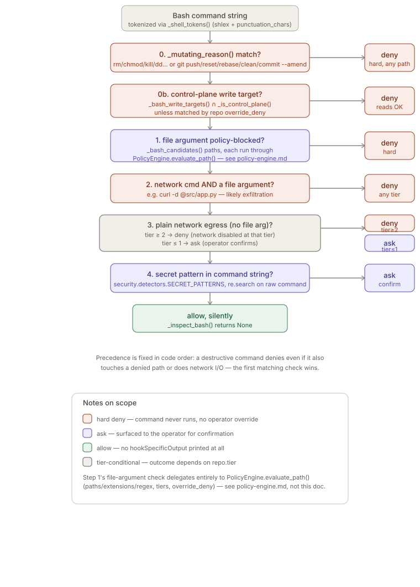
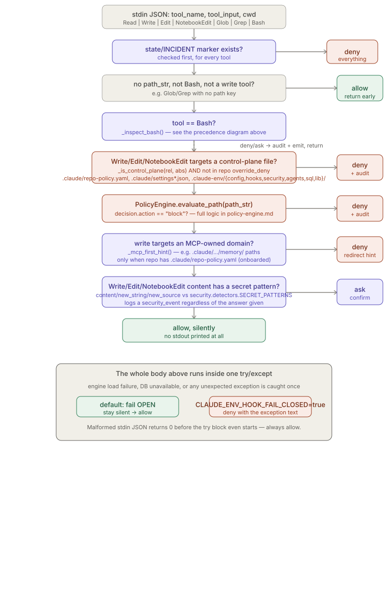

# Native Tool Hooks

> Relates to: [OVERVIEW.md §1 — the agent could read or touch something it shouldn't](../OVERVIEW.md#1-the-agent-could-read-or-touch-something-it-shouldnt)

**Source:** [`hooks/policy_hook.py`](../../hooks/policy_hook.py) (557 lines),
[`hooks/audit_hook.py`](../../hooks/audit_hook.py) (63 lines).
**Installer:** [`hooks/install_hooks.py`](../../hooks/install_hooks.py).
**Tests:** [`tests/test_policy_hook_bash.py`](../../tests/test_policy_hook_bash.py).

This doc covers the two Claude Code hooks and nothing else. The actual path
allow/deny decision — globs, extensions, regex, tiers — is
[`security/policy_engine.py`](../../security/policy_engine.py), fully documented in
[`policy-engine.md`](policy-engine.md); this doc only explains how these hooks *call*
that engine, how they extract a path out of a free-form Bash command string in the
first place, and the hook-specific guards (control plane, MCP-first) and failure
posture layered on top.

---

## What it does (30-second version)

The MCP `filesystem-policy` server only governs traffic that goes through MCP tools.
Claude Code's **native** tools — `Read`, `Write`, `Edit`, `NotebookEdit`, `Glob`,
`Grep`, `Bash` — never touch an MCP server, so without these hooks an agent could
bypass the entire policy layer just by using the built-in file tools instead. Two
hooks close that gap:

- **`policy_hook.py`** runs on `PreToolUse` for every one of those tools. It extracts
  whatever path (or, for `Bash`, command string) the call touches, runs it through the
  same `PolicyEngine`, and can `deny` or `ask` before the tool executes.
- **`audit_hook.py`** runs on `PostToolUse` for the mutating subset (`Write`, `Edit`,
  `NotebookEdit`, `Bash`) and writes a `native.<Tool>` row to the audit ledger. It never
  blocks anything — `PostToolUse` fires after the tool already ran.

Both are wired into `~/.claude/settings.json` by `hooks/install_hooks.py`, invoked as
`$CLAUDE_ENV_HOME/venv/bin/python $CLAUDE_ENV_HOME/hooks/{policy_hook,audit_hook}.py`
with the tool call's JSON piped in on stdin.

---

## Configuration reference

Neither hook reads a YAML config file — the "configuration surface" here is
environment variables read at import/run time, plus the wiring the installer writes.

| Name | Type | Default | Effect |
|---|---|---|---|
| `CLAUDE_ENV_HOME` | path | `~/.claude-env` | Where hooks add both themselves and the repo checkout to `sys.path`, and where `INCIDENT_MARKER` (`state/INCIDENT`) is looked up (`hooks/policy_hook.py,61`; `hooks/audit_hook.py`). |
| `CLAUDE_ENV_HOOK_FAIL_CLOSED` | bool-ish string | unset (`false`) | If `"true"` (case-insensitive), an internal error in `policy_hook.py`'s `main()` denies the call instead of allowing it (`hooks/policy_hook.py`, `546-550`). Recommended for tier-2+ machines per the module docstring. |
| `CLAUDE_ENV_MCP_FIRST` | bool-ish string | unset (`true`) | If `"false"`, disables the MCP-first redirect entirely — `_mcp_first_hint()` returns `None` unconditionally (`hooks/policy_hook.py`). |
| `CLAUDE_ENV_HOOK_AUDIT_ALL` | bool-ish string | unset (`false`) | If `"true"`, `audit_hook.py` writes a row for **every** intercepted tool, not just the mutating set (`hooks/audit_hook.py,36`). |

| Installer constant | Value | Effect |
|---|---|---|
| `PRE_MATCHER` (`hooks/install_hooks.py`) | `"Read\|Write\|Edit\|NotebookEdit\|Glob\|Grep\|Bash"` | Which tools trigger `policy_hook.py` on `PreToolUse`. |
| `POST_MATCHER` (`hooks/install_hooks.py`) | `"Write\|Edit\|NotebookEdit\|Bash"` | Which tools trigger `audit_hook.py` on `PostToolUse`. Note `Read`/`Glob`/`Grep` are **not** in this matcher at all — `audit_hook.py`'s own `_MUTATING` filter is a second, redundant layer of the same restriction. |

All boolean-ish env vars use the same idiom: `os.environ.get(NAME, default).lower() ==
"true"` — any other value (`"1"`, `"yes"`, unset-with-no-default-string) is falsy.

---

## How to use it

```bash
# Preview the resulting settings.json without writing anything
claude-env hooks --dry-run

# Install the policy + audit hooks into ~/.claude/settings.json
claude-env hooks

# Remove them again
claude-env hooks --uninstall

# Target a different settings file (e.g. a project-local settings.json)
claude-env hooks --settings ./.claude/settings.json
```

Running `--dry-run` before the real install is worth doing every time — it prints the
exact `hooks` block that would be merged into the target file, so you can confirm the
matchers and command paths before anything on disk changes. Whichever of `hooks`,
`--uninstall`, or a `--settings`-targeted install you run, **Claude Code must be
restarted afterward** for the change to take effect, per this repo's own deploy
workflow.

---

## How the logic works

### `PreToolUse`: extracting a path from the tool call

`main()` pulls the target path out of whichever key the tool actually uses, then falls
back to Bash's `command` string:

```python
# hooks/policy_hook.py
path_str = next((tin[k] for k in _PATH_KEYS if tin.get(k)), None)
if not path_str and tool == "Grep":
    path_str = tin.get("path")
is_bash = tool == "Bash"
bash_cmd = tin.get("command", "") if is_bash else ""
if not path_str and not is_bash and tool not in ("Write", "Edit", "NotebookEdit"):
    return 0  # pathless, non-Bash calls: no path policy to apply
```

`_PATH_KEYS = ("file_path", "path", "notebook_path")` (`hooks/policy_hook.py`) covers
`Read`/`Write`/`Edit` (`file_path`), `Glob` (`path`), and `NotebookEdit`
(`notebook_path`). `Grep`'s `path` is fetched separately because `Grep`'s primary key is
`pattern`, not a path key that would satisfy the first check. A `Write`/`Edit`/
`NotebookEdit` call with no path at all still falls through (for the secret-content
scan later), everything else with no path and no Bash command exits immediately —
that's why a bare `Glob` with only a `pattern` key and no `path` key is never
policy-checked at all.

### Bash: tokenizing around the `shlex.split()` gap

Native `Bash` has no path key — the entire command is one string — so the hook has to
parse it. The module docstring calls this the "Bash gap"
(`hooks/policy_hook.py`). The first subtlety is that plain `shlex.split()` glues
operators onto adjacent words:

```python
# hooks/policy_hook.py
def _shell_tokens(command: str) -> list[str]:
    """Tokenize a shell command, respecting quotes AND surfacing operators
    (`;` `|` `&` `&&` `||` `<` `>` `>>`) as their own tokens.

    `shlex.split()` does NOT split operators glued to a word, so `echo hi;rm x`
    tokenizes as `['echo', 'hi;rm', 'x']` — the `rm` is never seen as a command
    and the destructive/segment/redirect checks below are silently bypassed.
    A shlex.shlex with punctuation_chars fixes that while still honoring quotes
    (so `echo "a;b"` keeps `a;b` intact)."""
    try:
        lex = shlex.shlex(command, posix=True, punctuation_chars=True)
        lex.whitespace_split = True
        lex.commenters = ""            # '#' is not a comment mid-command
        return list(lex)
    except ValueError:
        return [t for t in re.split(r"\s+", command) if t]
```

This was a real, fixed bypass: `tests/test_policy_hook_bash.py`
(`test_shlex_bypass_chained_destructive_still_denied`) asserts `"echo hi;rm -rf
build"`, `"true && rm src/app.py"`, `"ls | rm x"`, and `"(rm -rf build)"` are all
denied, while a semicolon **inside a quoted string** (`echo "a;rm b"`) is correctly
left alone and allowed. `lex.commenters = ""` matters too: without it, `#` mid-command
would be treated as a shell comment and everything after it silently dropped from
tokenization.

Tokens are then split into simple-command segments on `_CMD_SEP = {";", "|", "&",
"&&", "||", "|&", "\n", "(", ")", "{", "}"}` (`hooks/policy_hook.py`) so each
segment's leading token can be checked as its own command — this is what lets `(rm -rf
build)` be caught even though `rm` is hidden behind a `(`.

### `_bash_candidates()` — conservative path/network extraction

```python
# hooks/policy_hook.py
def _bash_candidates(command: str, cwd: str) -> tuple[list[str], set[str]]:
    """Parse a Bash command into (candidate file paths, network-egress cmds).

    Conservative on purpose: a slashless bare token is only a candidate path
    when it is an argument to a file command AND exists on disk, so arbitrary
    args (grep patterns, subcommands like `git log`) are not mistaken for files
    under tier-3 default-deny.
    """
```

The key design choice is in the loop body: a token is a path candidate if it
*structurally* looks like one (`_looks_like_path`: contains `/`, or starts with `~` or
`.`), **or** — only for a token that doesn't look like a path — if the leading command
is in `_FILE_CMDS` *and* `(base / tok).exists()` on disk. That second branch is why
`grep -r pattern src/` doesn't treat `pattern` as a file
(`test_candidates_ignore_flags_and_bare_nonexistent`, `tests/test_policy_hook_bash.py`):
`pattern` has no slash and doesn't exist as a file relative to `cwd`. URLs are
explicitly excluded via `re.match(r"^[a-z][a-z0-9+.\-]*://", tok)` before the path
checks run, so `curl https://example.com` extracts zero paths, only the network
command (`test_candidates_urls_are_not_paths`, `tests/test_policy_hook_bash.py`).
Redirection targets are captured two ways — a separate `>`/`>>`/`<` token followed by
its target, or the operator glued directly to the filename (`>file`, `2>>file`) via
`re.match(r"^(?:\d*>>?|<)(.+)$", tok)`.

### `_bash_write_targets()` — narrower, for the control-plane guard

A second, stricter extractor exists specifically so the control-plane guard doesn't
fire on reads:

```python
# hooks/policy_hook.py
def _bash_write_targets(command: str, cwd: str) -> list[str]:
    """File paths a Bash command WRITES to: redirection destinations (`>`/`>>`,
    glued or spaced) plus the target args of file-writing commands. Read-only
    args (cat/grep/sed -n/…) are deliberately excluded."""
```

It reuses the same tokenizer and segmenter, but only collects redirection
destinations plus the target arguments of `_WRITE_CMDS = {"cp", "mv", "tee", "dd",
"install", "ln", "rsync"}` (`hooks/policy_hook.py`). For `cp`/`mv`/`install`/`ln`/
`rsync` only the **last** non-flag argument counts (the destination); `tee` writes
**all** of its file args; `dd` is handled separately by pulling `of=<file>` out of its
`key=value` argument style (`hooks/policy_hook.py`). This is why `cat
.claude/repo-policy.yaml` is allowed while `cp x .claude/repo-policy.yaml` is denied —
`cat` isn't in `_WRITE_CMDS` and isn't a redirection, so it never appears in this
extractor's output at all, confirmed by `test_control_plane_read_is_allowed`
(`tests/test_policy_hook_bash.py`).

### `_mutating_reason()` — the hard-deny list, independent of path

```python
# hooks/policy_hook.py
def _mutating_reason(command: str) -> str | None:
    """Return a reason if the command is a destructive/state-mutating native shell
    command that must be hard-denied, else None."""
    ...
    for s in seg:
        if not s:
            continue
        cmd = os.path.basename(s[0])
        if cmd in _MUTATING_CMDS:
            return f"state-mutating command '{cmd}'"
        if cmd == "git":
            subs = [t for t in s[1:] if not t.startswith("-")]
            if subs and subs[0] in _GIT_MUTATING:
                return f"state-mutating git subcommand '{subs[0]}'"
            if subs and subs[0] == "commit" and "--amend" in s[1:]:
                return "git commit --amend (history rewrite)"
    return None
```

`_MUTATING_CMDS` (`hooks/policy_hook.py`) is `rm rmdir unlink shred dd mkfs
truncate chmod chown chgrp chflags kill pkill killall` — this check runs **first**, in
every segment, independent of what path arguments follow. `_GIT_MUTATING =
{"push", "reset", "rebase", "clean", "filter-branch", "gc", "prune"}` singles out git
subcommands that rewrite history or touch the remote; ordinary `git status`, `git
diff`, `git log`, `git commit` (without `--amend`) are deliberately left alone
(`test_allow_readonly_and_additive_commands`, `tests/test_policy_hook_bash.py`).
Additive commands (`mkdir`, `touch`, `cp`, `ln`) are intentionally excluded from
`_MUTATING_CMDS` per the inline comment at `hooks/policy_hook.py` — "to avoid
over-blocking."

### `_inspect_bash()` — the six-step precedence chain

```python
# hooks/policy_hook.py
def _inspect_bash(command: str, engine, root: Path, cwd: str
                  ) -> tuple[str, str, str] | None:
    """Return (action, reason, denied_path_or_'') for a Bash command, or None.

    action is 'deny' or 'ask'. Precedence: destructive command > denied path >
    exfiltration > plain network egress > secret in the command string.
    """
```

The docstring's stated order — destructive > denied path > exfiltration > network >
secret — actually has one more step than listed: the control-plane write check sits
between the destructive check and the denied-path check in the real code
(`hooks/policy_hook.py`), even though the docstring's one-line summary omits
it. In full:

1. **`_mutating_reason()` match** → hard `deny`, no path involved at all.
2. **Control-plane write target** (via `_bash_write_targets()` + `_is_control_plane()`)
   → hard `deny`, unless the resolved path matches the repo's `override_deny`.
3. **Any `_bash_candidates()` path that `PolicyEngine.evaluate_path()` blocks** → `deny`
   (this is the only step that calls into `policy-engine.md`'s logic).
4. **A network command (`_NET_CMDS`) together with any file path** → `deny` as likely
   exfiltration.
5. **A network command alone** → `deny` on tier ≥ 2 (network disabled at that tier),
   `ask` on tier ≤ 1.
6. **A secret pattern found in the raw command string** (via
   `security.detectors.SECRET_PATTERNS`) → `ask`.

If none of the six match, `_inspect_bash()` returns `None` and the command is allowed
silently. See the diagram below for the same chain visually.



### The control-plane guard (`_is_control_plane`)

```python
# hooks/policy_hook.py
_CONTROL_PLANE = [
    # per-repo control plane (relative form, e.g. ".claude/repo-policy.yaml")
    re.compile(r"(^|/)\.claude/repo-policy\.ya?ml$"),
    re.compile(r"(^|/)\.claude/settings(\.local)?\.json$"),
    # the deployed platform itself ($CLAUDE_ENV_HOME): config, hooks, policy code
    re.compile(r"(^|/)\.claude-env/(config|hooks|security|agents|sql|lib)/"),
    re.compile(r"(^|/)\.claude-env/config/.*\.(ya?ml|json)$"),
]


def _is_control_plane(*path_forms: str) -> bool:
    """True if any given path form (repo-relative and/or absolute) names a
    claude-env control-plane file. Checking multiple forms closes the gap where
    a repo-relative path wouldn't reveal a $CLAUDE_ENV_HOME target."""
    for p in path_forms:
        if not p:
            continue
        norm = p.replace("\\", "/")
        for rx in _CONTROL_PLANE:
            if rx.search(norm):
                return True
    return False
```

This exists so an agent can't weaken its own guardrails by editing the files that
*define* them — `.claude/repo-policy.yaml`, `.claude/settings.json` /
`settings.local.json`, or anything under the deployed `$CLAUDE_ENV_HOME`'s
`config/hooks/security/agents/sql/lib` directories. It is checked in two independent
call sites that both must agree: the Bash write-target loop
(`hooks/policy_hook.py`) and the native `Write`/`Edit`/`NotebookEdit` path in
`main()` (`hooks/policy_hook.py`). Both call sites pass **both** the
repo-relative and the resolved-absolute form of the path — the docstring explains why:
a purely repo-relative check would miss a write aimed at
`~/.claude-env/hooks/policy_hook.py` from inside an unrelated repo. Both sites also
check `not engine._match_paths(rel, engine.repo.override_paths)` — reaching into the
`PolicyEngine`'s private `_match_paths` method and its `override_paths` — so a repo
can still explicitly opt a control-plane path back in in its own
`.claude/repo-policy.yaml` under `override_deny`, the same escape hatch documented in
`policy-engine.md`.

This is a genuinely separate guard from `evaluate_path()`'s own deny logic: the global
self-protection deny list in `global-policy.yaml` (documented in `policy-engine.md`)
covers a similar but not identical set of files by glob, evaluated as part of the
normal path-check pipeline. `_is_control_plane()` is a second, hook-level regex check
that runs *before* `evaluate_path()` is even called for native writes, and is the only
mechanism that inspects Bash's write targets at all — `evaluate_path()` never sees a
Bash command string, only whatever path the hook decides to feed it.

### MCP-first redirect

```python
# hooks/policy_hook.py
_MCP_FIRST = [
    (re.compile(r"(^|/)\.claude/.*/memory/"),
     "record or recall memory via the memory-graph MCP (memory.write / memory.recall) — "
     "do not edit Claude Code's memory files directly"),
]
```

A native `Write`/`Edit`/`NotebookEdit` targeting a path matching this list is denied
with a hint pointing at the governed MCP tool instead — so an agent can't sidestep the
memory-graph MCP's own logic (dedup, node-kind validation, hash-chained writes) by
editing Claude Code's memory files directly. It only fires in onboarded repos (checked
via `(root / ".claude" / "repo-policy.yaml").exists()` at the call site,
`hooks/policy_hook.py`) and can be switched off wholesale with
`CLAUDE_ENV_MCP_FIRST=false`. `tests/test_policy_hook_bash.py`
(`test_mcp_first_memory_redirect`) confirms both
`Users/x/.claude/projects/y/memory/MEMORY.md` and `.claude/projects/z/memory/note.md`
match, while ordinary source (`src/app.py`) and an unrelated doc that merely mentions
memory in its filename (`docs/memory-design.md`) do not — the regex requires a literal
`memory/` **path segment**, not just the substring "memory" anywhere in the path.

### `main()` — the full PreToolUse sequence

Putting it together, in the order the real code checks them (`hooks/policy_hook.py`):

1. Parse stdin JSON; malformed input returns `0` immediately (nothing to decide on).
2. Incident marker check — hard deny everything if present.
3. Extract `path_str` / `bash_cmd`; bail early (allow) if neither applies.
4. `PolicyEngine.load(root)` where `root` is found by walking up from `cwd` looking
   for `.claude/repo-policy.yaml` or `.git` (`_repo_root`, `hooks/policy_hook.py`).
5. If `Bash`: run `_inspect_bash()`; a `deny` also writes a `policy_violation` audit
   row before printing the JSON decision.
6. If a mutating native tool with a path: control-plane guard.
7. If any tool with a path: `PolicyEngine.evaluate_path()`; a block also writes a
   `policy_violation` row.
8. If a mutating native tool with a path, in an onboarded repo: MCP-first redirect.
9. If a mutating native tool: scan write content for secret patterns; a hit writes a
   `security_event` row (regardless of whether the operator later says yes) and
   returns `ask`.
10. Otherwise: allow, silently — no stdout at all.

All of steps 4-9 run inside one `try`/`except`; see [fail-open vs fail-closed](#facts-invariants--edge-cases)
below for what happens if any of them raises.



### `PostToolUse`: `audit_hook.py`

```python
# hooks/audit_hook.py
def main() -> int:
    try:
        payload = json.load(sys.stdin)
        tool = payload.get("tool_name", "")
        if tool not in _MUTATING and not _AUDIT_ALL:
            return 0
        tin = payload.get("tool_input") or {}
        resp = payload.get("tool_response")
        cwd = payload.get("cwd", "")
        session = payload.get("session_id", "hook")

        summary = {}
        for k in ("file_path", "path", "notebook_path", "command", "pattern"):
            if tin.get(k):
                summary[k] = str(tin[k])[:_MAX_ARG]
        ok = True
        if isinstance(resp, dict) and (resp.get("is_error") or resp.get("error")):
            ok = False

        from audit.audit_logger import AuditLogger
        AuditLogger(session, actor="claude-code",
                    repo=Path(cwd).name if cwd else None).tool_call(
            tool=f"native.{tool}", args=summary,
            result_kind="ok" if ok else "error")
    except Exception:
        pass  # auditing must never disturb the session
    return 0
```

This hook never emits a `hookSpecificOutput` block and never denies — `PostToolUse`
fires after the tool has already run, so there's nothing left to block. It writes one
`tool_call` audit row (via `AuditLogger.tool_call`,
`audit/audit_logger.py`) per call, with `tool` set to `f"native.{tool}"` (e.g.
`native.Write`, `native.Bash`) so ledger queries can distinguish native tool traffic
from MCP traffic (which is logged as its own tool names by the MCP servers
themselves). `_MUTATING = {"Write", "Edit", "NotebookEdit", "Bash"}`
(`hooks/audit_hook.py`) is the default filter; every arg value is truncated to
`_MAX_ARG = 400` characters before being stored, so a giant `content` write doesn't
bloat the ledger — only the five keys in the loop (`file_path`, `path`,
`notebook_path`, `command`, `pattern`) are captured, so a `Write`'s actual `content` is
**never** written to the audit row at all, only its target path.

---

## Facts, invariants & edge cases

- **The docstring's stated precedence is incomplete** — see the six-step chain
  [above](#_inspect_bash--the-six-step-precedence-chain); the control-plane write
  check between "destructive" and "denied path" isn't in the docstring's one-line
  summary. Read the code, not just the docstring, if you need the exact order.
- **Reading the control plane is always fine; only writes are guarded.** `cat
  .claude/repo-policy.yaml` and `grep tier .claude/repo-policy.yaml` are both allowed
  (`test_control_plane_read_is_allowed`, `tests/test_policy_hook_bash.py`) —
  the guard only inspects `_bash_write_targets()`, which deliberately excludes
  read-only commands like `cat`/`grep`/`sed -n`.
- **A bare slashless token is a path candidate only if the file already exists on
  disk.** This is the mechanism that keeps `grep -r pattern src/` from treating
  `pattern` as a file under tier-3 default-deny — deliberately conservative, so it can
  also mean a real file that hasn't been created yet (e.g. a `touch newfile.txt`
  target) is *not* policy-checked, because `_looks_like_path("newfile.txt")` is false
  and the file doesn't exist yet either. `touch` isn't in `_FILE_CMDS` regardless, so
  this particular example is moot, but the general gap (nonexistent bare-token targets
  of a `_FILE_CMDS` command) exists by design.
- **The hard-deny list intentionally excludes additive commands** (`mkdir`, `touch`,
  `cp`, `ln`; see [`_mutating_reason()`](#_mutating_reason--the-hard-deny-list-independent-of-path)).
  `cp src/app.py src/copy.py` is allowed outright by
  `test_allow_readonly_and_additive_commands` (`tests/test_policy_hook_bash.py`),
  even though `cp` can overwrite an existing file — the destination is still subject
  to the policy-blocked-path check and the control-plane guard, just not the hard
  "state-mutating" deny.
- **The audit row for a Bash denial happens *before* the deny is printed, and failure
  to write it is swallowed.** `hooks/policy_hook.py` wraps the
  `AuditLogger(...).policy_violation(...)` call in its own `try`/`except Exception:
  pass` — if the DB is unavailable, the deny still happens, it's just not logged. The
  same pattern repeats at every audit call site in this file
  (`hooks/policy_hook.py`, `504-511`, `534-542`); the inline comment at
  `hooks/policy_hook.py` states the intent directly: "auditing must never break the
  decision itself."
- **Fail-open is the default for the *entire* `main()` body, not just the engine
  load.** The `try` at `hooks/policy_hook.py` wraps everything from
  `PolicyEngine.load()` through the secret-content scan — any exception anywhere in
  that block (a corrupt policy YAML, a broken DB connection, a bug in `_inspect_bash`)
  falls through to `except Exception as exc:`, which allows silently unless
  `CLAUDE_ENV_HOOK_FAIL_CLOSED=true`. A malformed stdin payload is handled even earlier
  and more permissively — `json.load(sys.stdin)` failing returns `0` before the
  `try` block is ever reached, i.e. before `FAIL_CLOSED` is even consulted.
- **The `PostToolUse` matcher and the hook's own `_MUTATING` set are redundant by
  design, not accidentally duplicated.** `install_hooks.py`'s `POST_MATCHER` already
  restricts invocation to `Write|Edit|NotebookEdit|Bash`
  (`hooks/install_hooks.py`), so `audit_hook.py`'s internal `_MUTATING` check
  (`hooks/audit_hook.py,36`) only actually does work when `CLAUDE_ENV_HOOK_AUDIT_ALL`
  broadens the *installed* matcher too — otherwise Claude Code itself never invokes the
  hook for a `Read`/`Glob`/`Grep` call in the first place. Setting the env var alone,
  without changing `POST_MATCHER`, does nothing.
- **`Write` content is never stored in the audit ledger, even truncated** — the
  `summary` loop only reads the five keys listed [above](#posttooluse-audit_hookpy);
  `content`/`new_string`/`new_source` (the keys `policy_hook.py`'s secret scan
  inspects) are absent (`hooks/audit_hook.py`). The ledger records *that* a write
  happened and to *which* path, never the bytes written.
- **`_repo_root()` prefers an existing repo policy file over a bare `.git`.** Because
  the loop checks `(cand / ".claude" / "repo-policy.yaml").exists() or (cand /
  ".git").exists()` at each directory (`hooks/policy_hook.py`) walking
  *upward*, the first ancestor satisfying *either* condition wins — a nested Bash
  subshell or `cd`-ed working directory below the true repo root will still resolve
  correctly as long as no intermediate directory happens to have its own `.git` or
  policy file first.

---

## Related docs

- [`policy-engine.md`](policy-engine.md) — `PolicyEngine.evaluate_path()`, the tier
  system, glob/extension/regex matching, and `override_deny`. This doc's Bash and
  control-plane logic are callers of that engine, not a reimplementation of it.
- [`secret-detection.md`](secret-detection.md) — the `SECRET_PATTERNS` this hook
  imports from `security.detectors` for both the inline-command scan and the
  Write/Edit content scan.
- [`incident-mode.md`](incident-mode.md) — the `state/INCIDENT` marker file both
  `policy_hook.py` and `PolicyEngine.evaluate_path()` check independently.
- [`audit-ledger.md`](audit-ledger.md) — `AuditLogger`, the hash-chained ledger both
  hooks write into (`tool_call`, `policy_violation`, `security_event`).
- [OVERVIEW.md §1](../OVERVIEW.md#1-the-agent-could-read-or-touch-something-it-shouldnt) —
  the product-level framing of the problem these hooks close for native tools.
