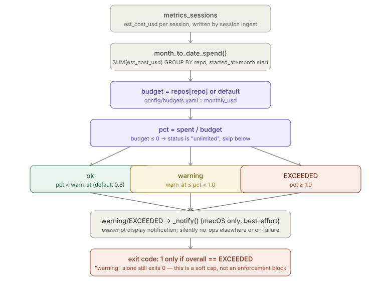
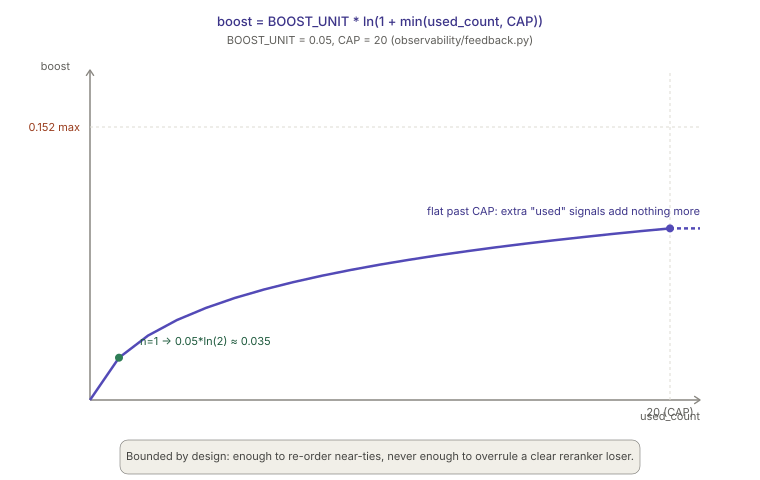

# Observability, Budgets & Feedback

> Relates to: [OVERVIEW.md §7 — you can't tell if it's working well or costing too
> much](../OVERVIEW.md#7-you-cant-tell-if-its-working-well-or-costing-too-much)

**Source:** [`observability/budgets.py`](../../observability/budgets.py) (140 lines),
[`observability/feedback.py`](../../observability/feedback.py) (92 lines),
[`observability/dashboard.py`](../../observability/dashboard.py) (161 lines).
**Config:** [`config/budgets.yaml`](../../config/budgets.yaml).
**Schema:** [`sql/001_schema.sql`](../../sql/001_schema.sql) (`metrics_sessions`,
`metrics_latency`, `metrics_retrieval_quality`),
[`sql/003_extensions.sql`](../../sql/003_extensions.sql) (`rag_chunk_feedback`).

This doc covers three independent, local-only modules that answer "is this working,
and what is it costing?": a monthly USD budget check, a retrieval-quality feedback
loop that feeds back into reranking, and a read-only dashboard over the same tables.
None of them talk to the network; all three read from the SQLite DB via
`lib.db.get_db()`.

---

## What each module does (30-second version)

- **`budgets.py`** — sums `metrics_sessions.est_cost_usd` per repo for the calendar
  month to date, compares it against a configured USD cap, and prints a status table
  (`ok` / `warning` / `EXCEEDED` / `unlimited`). It is advisory: exceeding a budget
  never blocks an agent from running, it only exits non-zero and fires a
  best-effort macOS notification, so a CI job or shell prompt can act on it.
- **`feedback.py`** — records which RAG chunks were `retrieved` and, separately (via
  `memory/session_ingestor.py`), which of the underlying files were actually `used`
  (edited soon after retrieval). It turns the `used` counts into a small logarithmic
  boost the retrieve pipeline adds after reranking, so chunks with a track record of
  being genuinely useful drift upward over time.
- **`dashboard.py`** — a read-only viewer with two modes: a terminal `summary` (costs,
  latency percentiles, retrieval quality, policy violations, security events, open
  approvals) and a `serve` mode that launches Datasette against the same SQLite file
  for ad hoc SQL browsing. Both are local-only; `serve` never exposes anything beyond
  `127.0.0.1`.

---

## Configuration reference — `config/budgets.yaml`

| Key | Type | Default in repo | Effect |
|---|---|---|---|
| `warn_at` | float | `0.8` | Fraction of budget at which status becomes `"warning"` instead of `"ok"`. Read by `load_config()` (`observability/budgets.py:52`). |
| `monthly_usd.default` | float | `0` | Budget (USD) applied to any repo with no entry in `monthly_usd.repos`. `0` (or absent) means unlimited. |
| `monthly_usd.repos` | map[str, float] | `{}` | Per-repo override, e.g. `payments: 150`. Commented-out examples are shipped in the template file but not active. |

That's the entire schema — three keys, no nesting beyond one level. `load_config()`
(`observability/budgets.py:47-54`) coerces everything to `float` defensively and
treats a missing/empty file the same as an all-defaults document:

```python
# observability/budgets.py:47-54
def load_config() -> dict:
    p = _config_path()
    doc = yaml.safe_load(p.read_text()) if p.exists() else {}
    doc = doc or {}
    monthly = doc.get("monthly_usd") or {}
    return {"warn_at": float(doc.get("warn_at", 0.8)),
            "default": float(monthly.get("default", 0) or 0),
            "repos": {k: float(v) for k, v in (monthly.get("repos") or {}).items()}}
```

`_config_path()` (`observability/budgets.py:39-44`) prefers the **deployed** copy at
`$CLAUDE_ENV_HOME/config/budgets.yaml` over the repo copy, falling back to the repo
copy only if the deployed one doesn't exist — consistent with the platform-wide rule
that config is read from `$CLAUDE_ENV_HOME`, not the source tree (see
[`CLAUDE.md`](../../CLAUDE.md) golden rule 2).

---

## How `budgets.py` works

### Cost tracking mechanism

There is no separate cost-tracking table or accumulator process. `budgets.py` does
not compute cost itself — it only *reads* `est_cost_usd`, a column already populated
per-session in `metrics_sessions` (`sql/001_schema.sql:172-180`) by whatever writes
session metrics (session ingestion). `budgets.py` is a pure aggregation + comparison
step over that existing column:

```python
# observability/budgets.py:57-65
def month_to_date_spend() -> list[dict]:
    month_start = datetime.now(timezone.utc).strftime("%Y-%m-01T00:00:00")
    return get_db().query(
        "SELECT COALESCE(repo,'(none)') AS repo, "
        "COUNT(*) AS sessions, SUM(input_tokens) AS input_tokens, "
        "SUM(output_tokens) AS output_tokens, "
        "ROUND(SUM(est_cost_usd), 4) AS spent_usd "
        "FROM metrics_sessions WHERE started_at>=? "
        "GROUP BY repo ORDER BY spent_usd DESC", (month_start,))
```

"Calendar month to date" is computed with plain UTC string formatting
(`strftime("%Y-%m-01T00:00:00")`) compared lexicographically against the ISO-8601
`started_at` column — no timezone conversion, no rolling 30-day window.

### Budget enforcement is a soft cap, not a hard block

Verified directly from `evaluate()` (`observability/budgets.py:68-91`) and `main()`
(`observability/budgets.py:107-135`): **hitting a budget never prevents an agent from
running.** There is no caller anywhere in the codebase that invokes `budgets.py`
before allowing a session to proceed — it is a standalone CLI, not a hook. What
actually happens when a cap is hit:

```python
# observability/budgets.py:73-91
statuses, worst = [], "ok"
for r in rows:
    budget = cfg["repos"].get(r["repo"], cfg["default"])
    spent = r["spent_usd"] or 0.0
    if budget <= 0:
        status, pct = "unlimited", None
    else:
        pct = spent / budget
        status = "EXCEEDED" if pct >= 1.0 else \
                 "warning" if pct >= cfg["warn_at"] else "ok"
    if status == "EXCEEDED":
        worst = "EXCEEDED"
    elif status == "warning" and worst != "EXCEEDED":
        worst = "warning"
    statuses.append({**r, "budget_usd": budget or None,
                     "pct": round(pct, 3) if pct is not None else None,
                     "status": status})
```

- `budget <= 0` (the default) short-circuits to `"unlimited"` — `pct` is never
  computed, so a repo with no configured budget can never warn or exceed.
  Note this means a *negative* budget in YAML is silently treated as unlimited too.
- Only the **process exit code** changes: `main()` returns `1` only
  `if result["overall"] == "EXCEEDED"` (`observability/budgets.py:135`) — `"warning"`
  alone still exits `0`. This is what makes it CI-gateable *if* a caller chooses to
  check the exit code; nothing in this repo currently wires that check into a hook or
  pipeline.
- On `warning` or `EXCEEDED` (and unless `--no-notify`), `_notify()` fires a macOS
  notification via `osascript`, wrapped in a bare `try/except Exception: pass` and a
  `sys.platform != "darwin"` early return — it is unconditionally best-effort and
  never raises, on any platform (`observability/budgets.py:94-104`).



### CLI usage

```
python observability/budgets.py                 # status table, all repos
python observability/budgets.py --repo payments  # filter to one repo
python observability/budgets.py --format json    # machine-readable
python observability/budgets.py --no-notify      # suppress the osascript notification
```

`--format json` dumps the exact `evaluate()` return shape: `{month, warn_at, repos:
[...], overall}`, where each repo entry carries `repo, sessions, input_tokens,
output_tokens, spent_usd, budget_usd, pct, status`.

---

## How `feedback.py` works

### The two signals and how they correlate

`rag_chunk_feedback` (`sql/003_extensions.sql:21-31`) stores one row per event, not
per chunk — the same `chunk_id` accumulates many rows over time:

| Signal | Written by | Meaning |
|---|---|---|
| `retrieved` | `record_retrieved()`, called by the retrieve pipeline for every chunk returned for a query | A chunk was shown to the agent. |
| `used` | `memory/session_ingestor.py` (not this file) | The file behind a previously retrieved chunk was edited/cited in a Claude Code session shortly after retrieval — a heuristic correlation, not a guarantee the chunk itself was read. |

`feedback.py` itself only ever **writes** `retrieved` rows; `used` rows are written
elsewhere (`memory/session_ingestor.py`) and `feedback.py` only reads them back in
`usage_boosts()` and `stats()`. The correlation logic (matching an edited file to a
prior retrieval within some time window) lives in the ingestor, outside this file's
scope — this doc doesn't cover that half.

```python
# observability/feedback.py:48-62
def record_retrieved(repo: str, branch: str, query: str,
                     chunks: list[dict], session_id: str) -> None:
    """Record one 'retrieved' row per returned chunk. Never raises."""
    try:
        db = get_db()
        qh = query_hash(query)
        ts = _now()
        db.executemany(
            "INSERT INTO rag_chunk_feedback "
            "(ts,repo,branch,chunk_id,file_path,query_hash,signal,session_id) "
            "VALUES (?,?,?,?,?,?,?,?)",
            [(ts, repo, branch, c.get("chunk_id", "?"), c.get("file_path"),
              qh, "retrieved", session_id) for c in chunks if c.get("chunk_id")])
    except Exception:
        pass  # feedback must never break retrieval
```

Every chunk lacking a `chunk_id` is silently skipped (`if c.get("chunk_id")` in the
list comprehension), and the whole function is wrapped in a bare
`try/except Exception: pass` — feedback recording can never break or slow down a
retrieval request, it can only silently fail to log one.

`query_hash()` (`observability/feedback.py:44-45`) is `sha256(query)[:16]` — a
truncated hash used only to group repeated identical queries in `rag_chunk_feedback`,
not a security control.

### The reranking boost formula — verified exact

The module docstring states the formula
(`observability/feedback.py:17-18`), and the implementation matches it exactly, with
no additional scaling, smoothing, or normalization:

```python
# observability/feedback.py:32-33
BOOST_UNIT = 0.05
CAP = 20
```

```python
# observability/feedback.py:65-75
def usage_boosts(repo: str, branch: str) -> dict[str, float]:
    """chunk_id -> boost, from historical 'used' signals. Never raises."""
    try:
        rows = get_db().query(
            "SELECT chunk_id, COUNT(*) AS n FROM rag_chunk_feedback "
            "WHERE repo=? AND branch=? AND signal='used' GROUP BY chunk_id",
            (repo, branch))
        return {r["chunk_id"]: BOOST_UNIT * math.log1p(min(r["n"], CAP))
                for r in rows}
    except Exception:
        return {}
```

So the formula is confirmed exactly as documented:

```
boost(n) = 0.05 * ln(1 + min(n, 20))
```

where `n` is the count of `used` rows for that `chunk_id` within the given
`repo`/`branch` (feedback is scoped per-branch, not global to the repo). Concretely:
`n=1` → `0.05 * ln(2) ≈ 0.0347`; `n=5` → `0.05 * ln(6) ≈ 0.0896`; `n=20` (the cap, and
anything above it) → `0.05 * ln(21) ≈ 0.1523`, the maximum possible boost. The curve is
strictly increasing but with sharply diminishing returns — the jump from 0→1 use is
larger than the jump from 19→20.

`usage_boosts()` is described by the module docstring as being called "after
reranking" by the retrieve pipeline — this file only computes the boost map, it does
not itself call into the reranker or retriever; how the boost is added to a
reranked score is outside this file (see `rag/retrievers/` if you need that wiring).

`boost_enabled()` (`observability/feedback.py:40-41`) gates this via
`CLAUDE_ENV_FEEDBACK_BOOST` — any value other than the case-insensitive string
`"false"` (including unset, which defaults to `"true"`) leaves boosting on.



### `stats()` — aggregate view for the dashboard/CLI

```python
# observability/feedback.py:78-91
def stats(repo: str | None = None) -> dict:
    """Aggregate feedback stats for the dashboard / CLI."""
    db = get_db()
    where, params = ("WHERE repo=?", (repo,)) if repo else ("", ())
    rows = db.query(
        f"SELECT signal, COUNT(*) AS n FROM rag_chunk_feedback {where} "
        f"GROUP BY signal", params)
    out = {r["signal"]: r["n"] for r in rows}
    top = db.query(
        f"SELECT file_path, COUNT(*) AS n FROM rag_chunk_feedback "
        f"{where + (' AND ' if where else 'WHERE ')} signal='used' "
        f"GROUP BY file_path ORDER BY n DESC LIMIT 10", params)
    out["top_used_files"] = [(r["file_path"], r["n"]) for r in top]
    return out
```

Returns a dict shaped like `{"retrieved": <n>, "used": <n>, "top_used_files": [(path,
n), ...]}` — the top-10 most-used files overall, or scoped to one repo. Note `stats()`
is **not** wrapped in `try/except` like the other two functions — a DB error here
propagates to the caller (dashboard/CLI), unlike `record_retrieved()` and
`usage_boosts()`, which are designed to fail silently because they sit in the
retrieval hot path.

---

## How `dashboard.py` works

Both modes confirmed directly from the source — it is **terminal summary and
Datasette, not a custom web UI**:

- **`summary(window)`** (default subcommand, `observability/dashboard.py:46-115`)
  prints six sections to stdout in this order: top-10 session costs, p50/p95/max
  latency by `metrics_latency.component`, mean top-1 retrieval quality by repo from
  `metrics_retrieval_quality`, the 10 most recent `policy_violations`, a
  severity/category breakdown of `security_events`, and any `human_approvals` rows
  with `decision='pending'` or `NULL`. It does not touch `rag_chunk_feedback` — the
  feedback stats above are not currently surfaced in this summary view.
- **`serve(port)`** (`observability/dashboard.py:118-144`) shells out to
  `python -m datasette <db> --port <port> --setting sql_time_limit_ms 5000 -o`,
  registering the port via `lib.services` so `claude-env services` can list it, and
  prints `dashboard (datasette) -> http://127.0.0.1:<port>`. If `datasette` isn't
  installed, `subprocess.run` raises `FileNotFoundError`, which is caught to print
  `"datasette not installed: pip install datasette"` and return exit code `1`. It
  requires the DB file to already exist (`_db_path()` check at
  `observability/dashboard.py:120-122`) — it refuses to launch against a missing
  database rather than creating one.

The percentile helper is a simple nearest-rank calculation over an in-memory sorted
list, not a streaming/approximate estimator:

```python
# observability/dashboard.py:38-43
def _pct(values: list[float], p: float) -> float:
    if not values:
        return 0.0
    s = sorted(values)
    k = max(0, min(len(s) - 1, int(round((p / 100) * (len(s) - 1)))))
    return s[k]
```

The `--window` filter (`observability/dashboard.py:51-53`) is deliberately
described in its own comment as "crude": it extracts digits from strings like `7d` or
`24h` with `"".join(c for c in window if c.isdigit())`, defaulting to `30` if none are
found, and picks `days` unless the string ends in `h` — `"7w"` would silently parse as
`7` and fall through to `days` (there is no `w` unit).

### CLI usage

```
python observability/dashboard.py                  # summary, last 30 days
python observability/dashboard.py --window 7d       # summary, last 7 days
python observability/dashboard.py --window 24h       # summary, last 24 hours
python observability/dashboard.py serve --port 8001  # Datasette on localhost
```

---

## Test coverage

No dedicated test file exists for these three modules as of this writing — there is
no `tests/test_budgets.py`, `tests/test_feedback.py`, or `tests/test_dashboard.py` in
`tests/`, and no other test file references `usage_boosts`, `rag_chunk_feedback`, or
`observability/budgets.py`. The formulas and behavior documented above are verified
directly by reading the source, not by an existing test suite — if you change
`BOOST_UNIT`, `CAP`, or the budget status thresholds, there is currently nothing
regression-testing the exact numbers.

---

## Facts, invariants & edge cases

- **Budgets are advisory, not enforced.** No hook or MCP server calls `budgets.py`
  before letting an agent proceed; the only consequence of `EXCEEDED` is a non-zero
  exit code (useful for CI/shell integration, but not wired into anything in this
  repo) and a best-effort local notification. This mirrors the module's own docstring
  framing it as "a local governance check," not a gate.
- **A budget of `0` or absent means unlimited, and so does a negative number.**
  `evaluate()`'s `if budget <= 0` treats both the documented "0 or absent" case and
  any accidental negative value the same way — unlimited, `pct` never computed.
- **`warn_at` and cap thresholds use `>=`, not `>`.** Spend exactly equal to the
  budget (`pct == 1.0`) already counts as `EXCEEDED`; spend exactly at `warn_at`
  already counts as `"warning"` — both boundaries are inclusive of the stricter state.
- **Feedback recording and boost lookup never raise, by design.** Both
  `record_retrieved()` and `usage_boosts()` wrap their bodies in
  `try/except Exception: pass`/`except Exception: return {}` — a DB outage degrades
  retrieval to "no boost applied," never to a hard failure. `stats()` is the one
  function in `feedback.py` without this guard, since it's only called from
  observability surfaces, not the retrieval hot path.
- **The boost formula has no negative case and no separate down-weighting signal.**
  There is only `retrieved` and `used` — nothing records "retrieved but *not* used,"
  so chunks are never actively penalized for being ignored; they simply don't
  accumulate a boost.
- **`CLAUDE_ENV_FEEDBACK_BOOST` is checked by string equality to `"false"`, case
  insensitively.** Any other value, including typos like `"False "` with trailing
  whitespace or `"0"`, leaves boosting **on** — only the exact token `false`
  (case-insensitive) disables it.
- **`dashboard.py serve` will not create a database for you.** It checks
  `Path(db).exists()` up front and exits `1` with a message to run bootstrap first,
  rather than letting Datasette fail with a less clear error.
- **The dashboard's window parsing silently degrades on unknown units.** Anything not
  ending in `h` is treated as days, and non-digit strings fall back to a hardcoded
  `30`, with no validation or error surfaced to the user.
- **All three modules resolve config/DB location the same way: prefer
  `$CLAUDE_ENV_HOME`, fall back to the repo.** `budgets.py::_config_path()` and
  `dashboard.py::_db_path()` (via `CLAUDE_ENV_DSN`, defaulting under `HOME`) both
  follow the platform convention that the deployed copy under `$CLAUDE_ENV_HOME` is
  authoritative, not the source tree.

---

## Related docs

- [`OVERVIEW.md §7`](../OVERVIEW.md#7-you-cant-tell-if-its-working-well-or-costing-too-much) —
  the product-level framing of the observability/cost problem these modules address.
- [`policy-engine.md`](policy-engine.md) — a contrasting example of a module that
  *does* hard-block (`evaluate_path()`), useful for seeing the difference between an
  enforced gate and the advisory budget check documented here.
