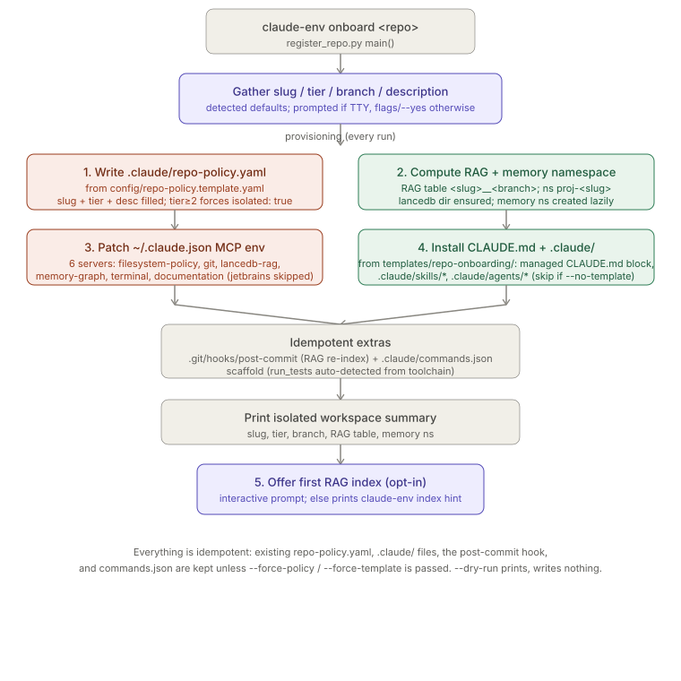

# Onboarding

> Relates to: [OVERVIEW.md §8 — how this actually gets turned on](../OVERVIEW.md#8-how-this-actually-gets-turned-on)

**Source:** [`scripts/register_repo.py`](../../scripts/register_repo.py) (558 lines).
**Payload installed into the target repo:** [`templates/repo-onboarding/`](../../templates/repo-onboarding/).
**Config templated from:** [`config/repo-policy.template.yaml`](../../config/repo-policy.template.yaml),
[`config/mcp-servers.json`](../../config/mcp-servers.json).

This doc covers `scripts/register_repo.py` and the files it copies from
`templates/repo-onboarding/`. It does not cover the policy engine's evaluation
logic (see [`policy-engine.md`](policy-engine.md)) or the RAG indexer that
`--dry-run`-safe step 5 can kick off (see the RAG pipeline doc once written).

---

## What it does (30-second version)

`claude-env onboard /abs/path/to/repo` (equivalently `claude-env register` or
`python scripts/register_repo.py`) turns an ordinary git repo into a
**claude-env-governed** one. It writes that repo's `.claude/repo-policy.yaml`
(the actual isolation boundary the policy engine enforces), computes its RAG
table name and memory namespace, patches `~/.claude.json` so every MCP server
resolves to the right repo root/slug/branch/namespace, and installs the
`CLAUDE.md` governance contract plus `.claude/skills/` and `.claude/agents/`
from the template. Everything is idempotent — re-running it never clobbers
existing files unless you pass a `--force-*` flag — and `--dry-run` prints the
full plan without writing anything.

---

## CLI reference

| Flag / arg | Type | Default | Effect |
|---|---|---|---|
| `repo_root` (positional) | path | required | Resolved to an absolute path (`Path(...).resolve()`); the script exits `1` if it's not a directory (`scripts/register_repo.py:488-491`). |
| `--repo-name` | str | directory name | Passed through `_slugify()` — lowercased, `[^a-z0-9._-]+` collapsed to a single `-`, leading/trailing `-`/`.` stripped, empty result falls back to `"repo"` (`scripts/register_repo.py:288-291`). Used for the RAG table and `proj-<slug>` memory namespace. |
| `--tier` | `{0,1,2,3}` | existing policy's tier, else `1` | If omitted, `_detect_tier()` regex-reads `tier:` from an existing `.claude/repo-policy.yaml` (`scripts/register_repo.py:178-186`); interactively it's then re-prompted with that value as the default. |
| `--description` | str | `""` | Free text; written into the generated policy's `description:` field (quotes replaced with `'` first). |
| `--branch` | str | `git rev-parse --abbrev-ref HEAD`, else `"main"` | `_detect_branch()` shells out with a 10s timeout and swallows any exception (`scripts/register_repo.py:69-77`). |
| `--yes` / `-y` | flag | off | Forces non-interactive mode even on a TTY (see `_interactive()` below). |
| `--dry-run` | flag | off | Every write-capable helper takes a `dry_run` bool and skips the actual `write_text`/`copy2`/`mkdir` call, but still computes and prints the status string. |
| `--no-template` | flag | off | Skips `_install_template()` entirely (no `CLAUDE.md`/`.claude/skills`/`.claude/agents` install) — namespaces, policy, and MCP env are still provisioned. |
| `--force-template` | flag | off | Passed to `_install_dot_claude()`; lets it overwrite existing skill/agent files it would otherwise skip. |
| `--force-policy` | flag | off | Passed to `_write_repo_policy()`; without it an existing `repo-policy.yaml` is never touched (`"kept-existing (use --force-policy to regenerate)"`). |
| `--no-post-commit` | flag | off | Skips installing the git `post-commit` hook. |

### Interactivity

```python
# scripts/register_repo.py:300-301
def _interactive(no_prompt: bool) -> bool:
    return (not no_prompt) and sys.stdin.isatty() and sys.stdout.isatty()
```

Prompts only fire when **both** stdin and stdout are TTYs and `--yes` wasn't
passed. In a script/CI context (piped stdin, or `--yes`), every value falls
back silently to its detected default — `_prompt()` itself also treats an
`EOFError` on `input()` as "use the default" (`scripts/register_repo.py:304-309`),
so even a stray interactive call in a non-TTY pipe degrades gracefully instead
of crashing.

---

## The onboarding flow, in order

`main()` runs these steps unconditionally (skipping only what a flag disables),
regardless of whether the repo has ever been onboarded before:

### 1. `.claude/repo-policy.yaml` — the isolation boundary

```python
# scripts/register_repo.py:321-347
def _write_repo_policy(repo_root: str, slug: str, tier: str, description: str,
                       force: bool, dry_run: bool) -> str:
    dst = Path(repo_root) / ".claude" / "repo-policy.yaml"
    tmpl = _HERE / "config" / "repo-policy.template.yaml"
    if not tmpl.exists():
        return "template-missing"
    existed = dst.exists()
    if existed and not force:
        return "kept-existing (use --force-policy to regenerate)"

    text = tmpl.read_text()
    text = text.replace("EXAMPLE-REPO-SLUG", slug)            # repo: + proj- namespace
    text = re.sub(r"(?m)^tier:\s*\d+", f"tier: {tier}", text, count=1)
    if description:
        safe_desc = description.replace('"', "'")
        text = re.sub(r'(?m)^description:\s*".*"',
                      f'description: "{safe_desc}"', text, count=1)
    if tier in ("2", "3"):                                    # sensitive+ -> isolate memory
        text = re.sub(r"(?m)^(\s*isolated:\s*)false", r"\g<1>true", text, count=1)
```

This confirms it **does** template from `config/repo-policy.template.yaml`
(not generate YAML from scratch): it reads the template text and does four
targeted string/regex substitutions — `EXAMPLE-REPO-SLUG` (which appears twice
in the template: `repo: "EXAMPLE-REPO-SLUG"` at line 16 and
`namespace: "proj-EXAMPLE-REPO-SLUG"` at line 157, both replaced by the same
`.replace()`), the top-level `tier:` line, the `description:` line, and — only
for tier 2/3 — flips `isolated: false` to `isolated: true` under `memory:`.
Everything else in the template (allow/deny paths, extensions, regex,
`override_deny`, `content_scan`, `rag.*`, `agent_permissions.*`) ships through
verbatim. An existing policy is never regenerated without `--force-policy`.

### 2. Namespaces — RAG table + memory namespace

```python
# scripts/register_repo.py:294-297, 350-357
def _table_name(slug: str, branch: str) -> str:
    """Mirror rag/retrievers/lance_store.table_name so we can report/pre-create."""
    safe = lambda s: s.replace("/", "-").replace(" ", "_")
    return f"{safe(slug)}__{safe(branch)}"

def _provision_storage(slug: str, branch: str, dry_run: bool) -> str:
    lancedb_dir = _HOME / "knowledge" / "lancedb"
    if not dry_run:
        lancedb_dir.mkdir(parents=True, exist_ok=True)
    return _table_name(slug, branch)
```

The RAG table name is `<slug>__<branch>` (slashes/spaces sanitized), matching
the naming `rag/retrievers/lance_store.py` uses independently — the comment
flags this as a duplicated convention to keep in sync, not a shared function
call. The memory namespace is just `f"proj-{slug}"`, computed inline in
`main()` (`scripts/register_repo.py:512`) — there's no `_provision_storage`
equivalent for memory because the memory namespace is created lazily on first
write by the memory subsystem, not by this script.

### 3. MCP env — patching `~/.claude.json`

`_build_server_blocks()` reads `config/mcp-servers.json`, skips `jetbrains` and
any server flagged `"optional": true`, and resolves `${VAR}` placeholders in
each server's `command`/`args`/`env` (merged with `defaults.env`) against a
fixed substitution set (`HOME`, `CLAUDE_ENV_HOME`, `workspaceFolder`,
`CLAUDE_ENV_REPO_ROOT`, `CLAUDE_ENV_REPO_NAME`, `CLAUDE_ENV_BRANCH`). Three
servers get extra hand-set env on top of the resolved template:
`lancedb-rag` gets `CLAUDE_ENV_REPO_NAME`/`CLAUDE_ENV_BRANCH`, `memory-graph`
gets `CLAUDE_ENV_MEMORY_NS=proj-<slug>` and
`CLAUDE_ENV_MEMORY_ISOLATED=true` (tier ≥ 2) or `false`, and `documentation`
gets a default `CLAUDE_ENV_DOCS_DIR`. `_patch_claude_json()` then merges these
blocks into `~/.claude.json`'s `projects.<repo_root>.mcpServers`, preserving
an existing server's `type`/`command`/`args` but overwriting `env`, and prints
which server names actually changed (a no-op diff prints
`"Already up-to-date"` and writes nothing). If `~/.claude.json` doesn't exist
at all, the script prints a warning and **exits 1** — it assumes `claude mcp
add` has registered the servers at least once already.

### 4. Template install — `CLAUDE.md` + `.claude/`

```python
# scripts/register_repo.py:195-231 (abridged)
def _install_claude_md(repo_root, subs, dry_run) -> str:
    src = _TEMPLATE_DIR / "CLAUDE.md"
    managed = _fill(src.read_text(), subs)          # {{KEY}} substitution
    dst = Path(repo_root) / "CLAUDE.md"
    if not dst.exists():
        ...
        return "created"
    current = dst.read_text()
    if _BLOCK_BEGIN not in current or _BLOCK_END not in current:
        merged = managed.rstrip() + "\n\n" + current.lstrip()   # prepend, keep theirs
        ...
        return "block-prepended"
    # replace only the <!-- CLAUDE-ENV:BEGIN --> ... <!-- CLAUDE-ENV:END --> span
    ...
    return "block-updated"   # or "up-to-date" if nothing changed
```

`{{KEY}}` substitution (`_fill`, distinct from the `${VAR}` substitution used
for MCP env) fills six placeholders built in `main()`
(`scripts/register_repo.py:527-531`): `REPO_NAME`, `TIER`, `BRANCH`,
`RAG_TABLE`, `MEMORY_NS`, and `MEMORY_ISOLATED` (the human string `"disabled
(isolated)"` or `"allowed"`, not a boolean). The managed-block markers
(`_BLOCK_BEGIN`/`_BLOCK_END`, lines 60-61) mean a repo's own hand-written
`CLAUDE.md` content outside the block always survives a re-register — only
the span between the markers is platform-owned and gets replaced verbatim on
every run.

`_install_dot_claude()` then `rglob("*")`s `templates/repo-onboarding/.claude/`,
skipping `.DS_Store`, `__pycache__`, and `.pyc` files, and copies each file to
the matching relative path under `<repo>/.claude/` with `shutil.copy2` —
**but only if the destination doesn't already exist**, unless
`--force-template` is passed. This is why re-onboarding a repo you've already
customized skills/agents in is safe by default.

### 5. Idempotent extras (not gated by `--no-template`)

- **`.git/hooks/post-commit`** (`_install_post_commit`) — copies
  `scripts/post-commit` into the target repo's git hooks dir, `chmod 0o755`.
  Skipped if `.git` doesn't exist or is a file (worktree/submodule). If a
  `post-commit` hook already exists and does **not** contain the literal
  string `"claude-env"`, it's left alone (`"kept existing non-claude-env
  hook"`) — the script never silently overwrites a foreign hook.
- **`.claude/commands.json`** (`_install_commands`) — a scaffold with
  `run_tests` / `run_benchmarks` / `run_audit` keys for the terminal MCP
  server. `_detect_test_command()` checks, in order, `go.mod` → `go test
  ./...`, `Cargo.toml` → `cargo test`, `package.json` → `npm test`,
  `pyproject.toml`/`setup.py`/`pytest.ini`/`tox.ini` → `pytest -q`, a
  `Makefile` with a `test:` target → `make test`; anything undetected (or a
  polyglot monorepo) leaves `run_tests: ""` for a human to fill in. Never
  overwrites an existing `commands.json`.

### 6. Optional first index

`_maybe_index()` only prompts when interactive and not `--dry-run`; otherwise
it just prints the `claude-env index <repo>` hint. On "yes" it shells out to
`rag/bootstrap_rag.py` with `CLAUDE_ENV_REPO_NAME`/`CLAUDE_ENV_BRANCH` set.



---

## What actually ships in `templates/repo-onboarding/`

Verified directly by listing the directory — three real, non-empty pieces
plus a `README.md` describing itself:

```
templates/repo-onboarding/
├── CLAUDE.md                                  # 191 lines, {{REPO_NAME}}/{{TIER}}/... placeholders
├── README.md                                  # describes this directory to a platform developer
└── .claude/
    ├── agents/
    │   ├── architecture-reviewer.md
    │   └── code-reviewer.md
    └── skills/
        ├── architecture-review/SKILL.md
        ├── code-review/SKILL.md
        ├── design-patterns/SKILL.md
        ├── principled-engineering/SKILL.md
        └── solid-design/SKILL.md
```

That's **2 subagents** (`code-reviewer`, `architecture-reviewer`) and **5
skills** — matching the docstring's list exactly
(`scripts/register_repo.py:17-20`). `CLAUDE.md` itself, once filled, is an
MCP-first operating contract: §0 golden rules, §1 a mandatory tool-routing
table (every filesystem/git/search/memory/command intent mapped to one MCP
tool, native equivalents named as denied), §2 the approval workflow for
`terminal.run`, §3 the repo's tier posture and its **own namespace table**
(`{{RAG_TABLE}}`, `{{MEMORY_NS}}`, `{{MEMORY_ISOLATED}}` filled with concrete
values — no placeholders left in the installed file), §4 the standard
recall-read-design-change-review-record loop, §5 the skills/subagents list
above, and §6 "escalate, don't improvise." Both subagents are documented in
the file itself as read-only by tool grant (`Read`/`Grep`/`Glob`, no
shell/write) — the same constraint this platform repo's own reviewers have.

---

## Test coverage

`tests/test_onboard_helpers.py` covers the helpers that don't need a model or
network, imported by loading `scripts/register_repo.py` via
`importlib.util.spec_from_file_location` (not a package import):

| Test | What it proves |
|---|---|
| `test_slugify` | `"My Cool Repo"` → `"my-cool-repo"`; `"weird  name!!"` → `"weird-name"` (collapsed, not double-hyphenated); `"keeps_underscores.ok"` passes through unchanged; `""` → `"repo"`. |
| `test_post_commit_install_and_idempotency` | First install returns `"installed"` and the hook file is executable (`st_mode & 0o111`); a second run on identical content returns `"already installed"`. |
| `test_post_commit_does_not_clobber_foreign_hook` | A pre-existing hook without the `claude-env` marker is left byte-for-byte untouched, status contains `"kept existing"`. |
| `test_post_commit_skips_non_git` | A non-git directory returns a status containing `"not a git repo"`. |
| `test_detect_test_command` | `go.mod` present → `"go test ./..."`; after removing it and adding `package.json` → `"npm test"`; a nonexistent subdirectory → `None`. |
| `test_install_commands_detected` | With `go.mod` present, the written `commands.json` has `run_tests == "go test ./..."` and `run_benchmarks`/`run_audit` left as `""`. |
| `test_install_commands_scaffold_when_undetected` | With no toolchain markers, all three keys are written but empty. |
| `test_install_commands_preserves_existing` | An existing `commands.json` (even a minimal `{"run_tests": "custom"}`) is returned as `"kept existing..."` and left byte-for-byte unchanged. |

No test in this file exercises `_write_repo_policy`, `_install_claude_md`, or
`_patch_claude_json` directly — those three are not covered by
`test_onboard_helpers.py` as of this reading.

---

## Facts, invariants & edge cases

- **The policy file is templated, not generated.** `_write_repo_policy` does
  targeted regex/string substitution on `config/repo-policy.template.yaml`'s
  actual text; it never constructs YAML from a data structure. Every other
  key in the template (allow/deny lists, `content_scan`, `rag.*`,
  `agent_permissions.*`) reaches the onboarded repo unedited — see the tier-2+
  `.sql` gotcha documented directly in the template
  (`config/repo-policy.template.yaml:43`) and in
  [`policy-engine.md`](policy-engine.md#facts--invariants).
- **`EXAMPLE-REPO-SLUG` is replaced everywhere in one pass**, which is why the
  template's `memory.namespace: "proj-EXAMPLE-REPO-SLUG"` and top-level
  `repo: "EXAMPLE-REPO-SLUG"` both end up correctly slug-filled from a single
  `.replace()` call rather than two separate substitutions.
  `--repo-name`/prompted slug goes through `_slugify()` first, so the RAG
  table, memory namespace, and `repo-policy.yaml`'s `repo:` field are always
  the same sanitized string.
  <br><br>
  **Reproducer** — `_slugify("My Cool Repo!!") == "my-cool-repo"`, but
  `repo-policy.template.yaml` line 16 shows the raw `EXAMPLE-REPO-SLUG` string
  is replaced with that already-slugified value; nothing re-validates it after
  substitution.
- **Isolation is not the default; tier drives it.** `_write_repo_policy` only
  flips `isolated: false` → `true` when tier is `"2"` or `"3"`; tiers 0/1 keep
  the template's `isolated: false`, matching the `_build_server_blocks`
  computation of `CLAUDE_ENV_MEMORY_ISOLATED` (`tier >= 2`) used for the MCP
  env patch — the two isolation flags (policy file's `memory.isolated:` and
  the `memory-graph` server's env var) are set independently but from the
  same `tier >= 2` condition, so they can only drift if one code path is
  edited without the other.
- **Idempotency is opt-out, not opt-in, and asymmetric per artifact.**
  `repo-policy.yaml` needs `--force-policy`, `.claude/skills`/`.claude/agents`
  need `--force-template`, but `CLAUDE.md`'s managed block is **always**
  refreshed on every run regardless of any force flag — there's no way to
  "pin" a `CLAUDE.md` managed block against updates short of deleting the
  markers yourself.
- **A missing `~/.claude.json` is a hard stop, not a soft warning.** Step 3
  (`_patch_claude_json`) calls `sys.exit(1)` if the file doesn't exist,
  aborting the entire `main()` before steps 4-6 run — even though repo-policy
  writing (step 1) already happened and won't be rolled back.
- **`--dry-run` still performs real read-only work.** `_provision_storage`
  skips `mkdir` under `--dry-run` but still computes and returns the real
  table name; `_detect_test_command` and `_detect_branch` always run for
  real (they're read-only by nature) — only the mutating calls
  (`write_text`, `copy2`, `chmod`, `mkdir`) are gated by the `dry_run` flag
  threaded through every helper.
- **The RAG table naming convention is duplicated, not shared.** The
  docstring on `_table_name` says outright it must "mirror
  `rag/retrievers/lance_store.table_name`" — this is a manually-kept
  convention between two modules, not a shared function call, so a change to
  one without the other would silently desync the reported table name from
  the one the indexer actually creates.
- **Post-commit hook detection is a single substring check.** Any hook
  script containing the literal text `"claude-env"` anywhere is treated as
  "ours" and eligible for silent replacement on a byte-identical check; a
  hand-written hook that happens to mention `claude-env` in a comment would
  be treated the same way.

---

## Related docs

- [`policy-engine.md`](policy-engine.md) — what `.claude/repo-policy.yaml`
  actually controls once written; the tier semantics summarized here in
  `CLAUDE.md`'s §3 table are enforced there, not in this script.
- [`native-tool-hooks.md`](native-tool-hooks.md) — how the "route through MCP,
  not native tools" rule in the installed `CLAUDE.md` §1 is actually enforced
  by the `PreToolUse` hook.
- [`approvals-workflow.md`](approvals-workflow.md) — the `terminal.run`
  approval flow the installed `CLAUDE.md` §2 describes.
- [`memory-graph.md`](memory-graph.md) — what happens with the `proj-<slug>`
  memory namespace this script computes but doesn't itself create.
- [OVERVIEW.md §8](../OVERVIEW.md#8-how-this-actually-gets-turned-on) — the
  product-level framing of turning this platform on for a given repo.
