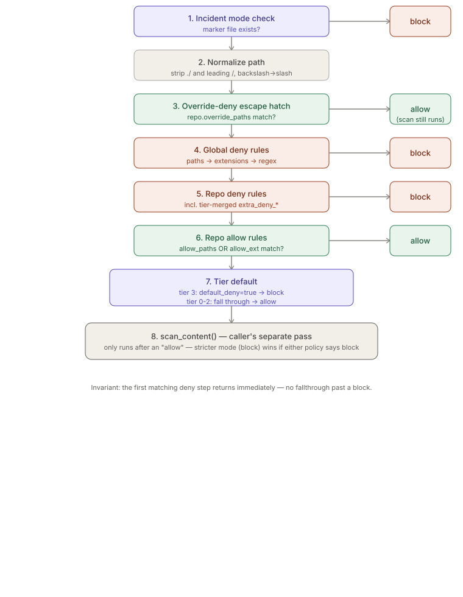
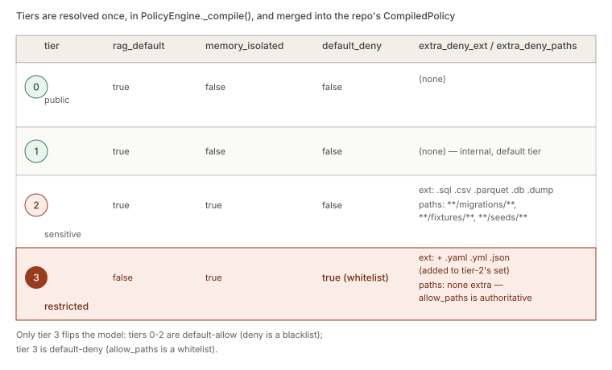

# Policy Engine

> Relates to: [OVERVIEW.md §1 — the agent could read or touch something it shouldn't](../OVERVIEW.md#1-the-agent-could-read-or-touch-something-it-shouldnt)

**Source:** [`security/policy_engine.py`](../../security/policy_engine.py) (270 lines).
**Config:** [`config/global-policy.yaml`](../../config/global-policy.yaml),
[`config/repo-policy.template.yaml`](../../config/repo-policy.template.yaml).

This doc covers `security/policy_engine.py` only. Bash command parsing, the
control-plane self-protection guard, and how native Read/Write/Edit/Bash calls reach
this module are covered in [`native-tool-hooks.md`](native-tool-hooks.md) — the hook
is a caller of this engine, not part of it. Secret/injection detection is a separate
module, covered in [`secret-detection.md`](secret-detection.md); the content-scan
patterns in this doc are simple regex-replace rules, not the detector.

---

## What it does (30-second version)

`PolicyEngine.evaluate_path(path)` answers one question — *can this file be read?* —
and returns `allow`, `block`, or (via a separate call) `redact`. It's the function the
`filesystem-policy` MCP server calls before returning any bytes to an agent. Every
repo gets a `PolicyEngine` built from two merged policy documents: the platform-wide
`global-policy.yaml` (can't be weakened per repo) and that repo's own
`.claude/repo-policy.yaml`. Deny always wins, and there's a fourth axis — tier — that
changes the default posture from "deny-listed" to "allow-listed only."

---

## Configuration reference

### `global-policy.yaml` — applies to every repo, cannot be overridden

| Key | Type | Default / example in repo | Effect |
|---|---|---|---|
| `version` | int | `1` | Schema version; only `1` is implemented. |
| `tier` | int | `1` | Tier assigned to a repo that declares none in its own `.claude/repo-policy.yaml`. |
| `deny.paths` | list[glob] | `**/secrets/**`, `**/credentials/**`, `**/.ssh/**`, `**/.gnupg/**`, `**/customer_data/**`, `**/pii/**`, `**/backups/**`, `**/production.*`, `**/prod.*`, `**/config/production.*`, `**/config/prod.*`, `**/*.production.*`, plus the **self-protection set**: `**/.claude/settings.json`, `**/.claude/settings.local.json`, `**/.claude/hooks.json`, `**/.claude/hooks/**`, `**/.claude/repo-policy.yaml`, `**/.claude/commands.json`, `**/.mcp.json`, `**/.claude-env/**` | Repo-relative glob patterns; a match blocks the read. The self-protection subset exists so an agent can't edit its own guardrails — see [Fact: self-protection is global-only](#facts--invariants). |
| `deny.extensions` | list[str] | `.env .pem .p12 .pfx .key .crt .cer .gpg .asc .keystore .jks` | Extension match (see [`_match_ext` semantics](#extension-matching-_match_ext)) blocks the read. |
| `deny.regex` | list[{pattern, reason}] | dotenv files, private SSH keys, AWS access key IDs, non-dev configs (4 entries) | Each `pattern` is compiled once and run with `re.search` against the full repo-relative path; `reason` is surfaced in the `Decision` and the audit row. |
| `content_scan.enabled` | bool | `true` | Master switch for `scan_content()`. If both global and repo have this `false`, no content scanning happens at all. |
| `content_scan.on_match` | `"redact"` \| `"block"` | `"redact"` | What happens to file *content* (not the whole-file allow/deny decision) when a pattern matches. See [stricter-mode-wins](#scan_content--content-scanning-is-a-separate-pass). |
| `content_scan.patterns` | list[{name, pattern}] | `aws_access_key`, `private_key_block`, `generic_api_key` | Named regex patterns run against file bytes after a file is already allowed. |
| `tiers.<0-3>.rag_default` | bool | see [tier table](#tier-resolution) | Whether RAG indexing defaults on for this tier. **Not read by this module** — it's advisory metadata consumed by the RAG indexer. |
| `tiers.<0-3>.memory_isolated` | bool | see tier table | Whether memory is namespace-isolated for this tier. **Not read by this module** — consumed by the memory subsystem. |
| `tiers.<0-3>.extra_deny_ext` | list[str] | tier 2 adds `.sql .csv .parquet .db .dump`; tier 3 adds those plus `.yaml .yml .json` | Merged into the repo's `deny_ext` at compile time — see [`_compile`](#_compile--merging-tier-rules-into-a-repos-policy). |
| `tiers.<0-3>.extra_deny_paths` | list[glob] | tier 2 only: `**/migrations/**`, `**/fixtures/**`, `**/seeds/**` | Merged into the repo's `deny_paths` at compile time. |
| `tiers.<0-3>.default_deny` | bool | `true` for tier 3 only | Flips the repo from default-allow (deny is a blacklist) to default-deny (allow is a whitelist). See [tier resolution](#tier-resolution). |

### `repo-policy.yaml` (per repo, at `<repo>/.claude/repo-policy.yaml`)

| Key | Type | Default | Effect |
|---|---|---|---|
| `version` | int | `1` | Schema version. |
| `tier` | int (`0`-`3`) | `1` (from global if omitted) | `0` public, `1` internal, `2` sensitive, `3` highly restricted. Selects which `tiers.<N>` row from the global policy gets merged in. |
| `repo` | str | directory name | Stable slug used for RAG index naming and memory namespacing. |
| `description` | str | `""` | Free text; not read by the engine. |
| `allow.paths` | list[glob] | `[]` | Repo-relative globs that are readable, subject to deny rules winning. For a tier-3 repo, this list *is* the entire readable surface. |
| `allow.extensions` | list[str] | `[]` | Extensions readable subject to deny. Template's own comment flags a real gotcha: `.sql` is allow-listed here but a tier-2+ repo's `extra_deny_ext` still blocks it — deny wins regardless of which list looks more specific. |
| `deny.paths` | list[glob] | `[]` | Repo-specific deny globs, evaluated in addition to global deny (both apply; neither can turn the other off). |
| `deny.extensions` | list[str] | `[]` | Repo-specific deny extensions. |
| `deny.regex` | list[{pattern, reason}] | `[]` | Repo-specific regex deny rules, `re.search`'d against the full path. |
| `override_deny` | list[glob] | `[]` (commented-out examples in the template) | Escape hatch: paths readable even though a global or repo deny rule would otherwise block them. Checked *before* deny, so it wins over deny — but content scanning still runs on the bytes. Only exists in repo policy; global policy has no equivalent. |
| `content_scan.enabled` | bool | `true` | Repo-level content-scan switch; merges with global (either `false` still lets the *other* policy's setting stand — see code below). |
| `content_scan.on_match` | `"redact"` \| `"block"` | `"redact"` | If global says `"block"`, a repo saying `"redact"` is ignored — block always wins. |
| `content_scan.patterns` | list[{name, pattern}] | `aws_access_key`, `generic_api_key`, `private_key_block`, `jwt` | Merged with global patterns by `name` (a repo pattern with the same name *replaces* the global one — see [Facts](#facts--invariants)). |
| `rag.enabled` | bool | tier-dependent | **Not read by `policy_engine.py`.** Advisory for the RAG indexer; tier 3 forces effective `false` unless the indexer's own logic opts in. |
| `rag.index_paths` / `rag.exclude_paths` / `rag.index_only_committed` | list[glob] / list[glob] / bool | see template | **Not read by this module.** RAG-indexer configuration that happens to live in the same file. |
| `memory.namespace` / `memory.isolated` / `memory.share_with_agents` | str / bool / list[str] | see template | **Not read by this module.** Memory-subsystem configuration. |
| `agent_permissions.<agent>.*` | dict | `{}` | **Not read by this module.** Per-agent overrides consumed by the agent orchestrator/registry, not the policy engine. |

The last four groups are worth calling out explicitly: `repo-policy.yaml` is a single
file shared by several subsystems, but `policy_engine.py` only ever reads `tier`,
`repo`, `allow`, `deny`, `override_deny`, and `content_scan`. The `rag`, `memory`, and
`agent_permissions` blocks pass through untouched as far as this module is concerned.

---

## How the logic works

### `evaluate_path()` — the eight-step decision

The module's own docstring states the intended order (`security/policy_engine.py:9-15`),
and the implementation follows it exactly:

```python
# security/policy_engine.py:203-236
def evaluate_path(self, path: str) -> Decision:
    # 0. incident mode: fail closed on everything until lifted
    if _incident_marker().exists():
        return Decision("block", "incident mode active (claude-env incident off to lift)",
                        "incident")

    path = path.replace("\\", "/")
    while path.startswith("./"):
        path = path[2:]
    path = path.lstrip("/")

    # 0. repo override_deny: explicit per-path allow that beats global + repo
    #    deny (incident mode above still wins; content scanning still runs on
    #    the bytes, so real secrets in an overridden file are still caught).
    m = self._match_paths(path, self.repo.override_paths)
    if m:
        return Decision("allow", "repo override_deny", m)

    # 1. global deny
    d = self._check_deny(path, self.glob, "global")
    if d:
        return d
    # 3. repo deny (tier overrides already merged into repo via _compile)
    d = self._check_deny(path, self.repo, "repo")
    if d:
        return d
    # 4. repo allow
    if self._match_paths(path, self.repo.allow_paths) or \
       self._match_ext(path, self.repo.allow_ext):
        return Decision("allow", "matched allow rule")
    # 5. fall-through
    if self.repo.default_deny:         # tier 3
        return Decision("block", "tier-3 default-deny (not in allowlist)", "default_deny")
    return Decision("allow", "no blocking rule; tier default allow")
```

Read top to bottom, this is:

1. **Incident check** — a single `Path.exists()` on a marker file. If present,
   *every* path blocks, unconditionally, before anything else runs.
2. **Path normalization** — backslashes to forward slashes, strip leading `./`
   repeatedly, strip a single leading `/`. Note this does **not** collapse `..`
   segments; that's handled one layer up, in the hook (see
   [`native-tool-hooks.md`](native-tool-hooks.md)).
3. **`override_deny` escape hatch** — checked before any deny rule, so it wins over
   deny. This is deliberate: it's how a template `.env.example` can be readable
   without loosening the global `.env` deny rule for real secrets.
4. **Global deny** (`_check_deny` against `self.glob`) — paths, then extensions, then
   regex, in that order; first match wins and returns immediately.
5. **Repo deny** (`_check_deny` against `self.repo`) — same three-stage check. By this
   point tier overrides are already folded into `self.repo.deny_paths` /
   `deny_ext` (see `_compile` below), so a tier's `extra_deny_ext` is
   indistinguishable from a hand-written repo deny rule at this stage.
6. **Repo allow** — only reached if nothing denied. A path or extension match here
   returns `allow`.
7. **Tier fall-through** — if `default_deny` is set (tier 3 only), unmatched paths
   block. Otherwise (tiers 0-2) they fall through to allow.

The **`_check_deny` helper** implements the shared "paths → extensions → regex"
sub-order used identically for both global and repo policies:

```python
# security/policy_engine.py:191-201
def _check_deny(self, path: str, pol: CompiledPolicy, scope: str) -> Decision | None:
    m = self._match_paths(path, pol.deny_paths)
    if m:
        return Decision("block", f"{scope} deny path", m)
    m = self._match_ext(path, pol.deny_ext)
    if m:
        return Decision("block", f"{scope} deny extension", m)
    for rx, reason in pol.deny_regex:
        if rx.search(path):
            return Decision("block", f"{scope} deny regex: {reason}", rx.pattern)
    return None
```



### `_compile()` — merging tier rules into a repo's policy

Tiers aren't checked as a separate step at evaluation time — they're folded into the
`CompiledPolicy` once, when the engine is built:

```python
# security/policy_engine.py:135-140
trow = (tier_doc.get("tiers", {}) or {}).get(tier, {}) \
    or (tier_doc.get("tiers", {}) or {}).get(str(tier), {})
deny_ext += list(trow.get("extra_deny_ext", []))
deny_paths += list(trow.get("extra_deny_paths", []))
default_deny = bool(trow.get("default_deny", False))
```

The `.get(tier, {}) or .get(str(tier), {})` fallback exists because YAML can parse
`tiers: {2: ...}` keys as either the integer `2` or the string `"2"` depending on how
the document is written — this line tolerates both. By the time `evaluate_path()`
runs, a tier-2 repo's `self.repo.deny_ext` already contains `.sql`, `.csv`, etc.,
indistinguishable from anything written directly in `repo-policy.yaml`'s own
`deny.extensions`.



### Glob matching (`_glob_to_regex`)

Globs are translated to anchored regex once, character by character
(`security/policy_engine.py:52-80`), not matched with `fnmatch`:

| Glob token | Regex equivalent | Meaning |
|---|---|---|
| `**/` | `(?:.*/)?` | Zero or more leading path segments — `**/c.py` matches both `c.py` and `a/b/c.py`. |
| `**` (not followed by `/`) | `.*` | Matches anything, including `/`. |
| `*` | `[^/]*` | Matches within one path segment only — does not cross `/`. |
| `?` | `[^/]` | One non-`/` character. |
| `. ( ) { } + \| ^ $ \` | escaped literally | Regex metacharacters in a glob are treated as literal text. |

Confirmed directly by `tests/test_policy_engine.py:16-21`:

```python
def test_glob_double_star():
    assert _pmatch("a/b/c.py", "**/c.py")
    assert _pmatch("c.py", "**/c.py")           # **/ matches zero segments
    assert _pmatch("src/x.py", "src/**")
    assert not _pmatch("srcx/x.py", "src/**")
    assert not _pmatch("a/b.py", "*.py")        # * does not cross '/'
```

### Extension matching (`_match_ext`)

```python
# security/policy_engine.py:181-189
@staticmethod
def _match_ext(path: str, exts: list[str]) -> str | None:
    suffix = Path(path).suffix
    name = Path(path).name
    for e in exts:
        if suffix == e or name == e or name.startswith(e + "."):
            return e
    return None
```

Three ways an extension can match, all OR'd: the file's actual suffix equals it
(`app.py` vs `.py`), the whole filename equals it (a bare dotfile like `.env`), or the
filename starts with it followed by a dot (`.env.local` matches `.env`,
`settings.prod.yaml` does *not* match `.prod` this way — that case is caught by the
`deny.regex` pattern for non-dev configs instead).

### `scan_content()` — content scanning is a separate pass

`evaluate_path()` only decides whether a file may be read at all. Once it returns
`allow`, the *caller* (the filesystem-policy MCP server) is responsible for calling
`scan_content()` on the bytes before returning them:

```python
# security/policy_engine.py:239-259
def scan_content(self, text: str) -> tuple[str, list[tuple[str, int]]]:
    if not (self.repo.content_scan_on or self.glob.content_scan_on):
        return text, []
    patterns = {n: p for n, p in self.glob.content_patterns}
    patterns.update({n: p for n, p in self.repo.content_patterns})
    hits: list[tuple[str, int]] = []
    out = text
    for name, rx in patterns.items():
        found = rx.findall(out)
        if found:
            hits.append((name, len(found)))
            mode = "block" if "block" in (self.glob.content_on_match,
                                          self.repo.content_on_match) else "redact"
            if mode == "block":
                return "", [(name, -1)]   # signal full block to caller
            out = rx.sub(f"[REDACTED:{name}]", out)
    return out, hits
```

Two details worth being precise about:

- **The enable check is an OR, not an AND.** `content_scan_on` from *either* policy
  being `true` is enough for scanning to run — a repo can't silently disable global
  content scanning by setting its own `content_scan.enabled: false`.
- **Patterns merge by name; the repo can shadow the global pattern.** `patterns.update(...)`
  means a repo pattern with the same `name` as a global one *replaces* it in the merged
  dict — this is the one place repo config can override global config, and it's a
  side effect of using a plain dict merge, not a deliberately designed escape hatch.
- **The `-1` count is a sentinel, not a real match count.** When mode is `"block"`,
  the function returns immediately with `[(name, -1)]` — callers must treat `-1` as
  "full block occurred," not "found −1 matches."

---

## Flow diagrams


*The eight-step decision chain — deny-capable steps short-circuit to `block`
immediately; only a full run to the end without a match reaches the tier
fall-through.*


*What each tier merges into the compiled policy. Tier 3 is the only tier that flips
the model from a deny-list to an allow-list.*

---

## Facts, invariants & edge cases

- **Deny always wins, with one narrow exception.** The only rule that can make a
  would-be-denied path readable is `override_deny`, and even then content scanning
  still runs on the bytes (`tests/test_policy_engine.py:68-73`,
  `test_override_deny_does_not_bypass_content_scan`).
- **Content-scan strictness cannot be downgraded by either side.** If *either* the
  global or the repo policy says `on_match: "block"`, the result is a block — a repo
  cannot soften a global block to a redact, and (symmetrically) a stricter repo
  setting overrides a looser global one. Verified directly by
  `test_content_block_not_downgraded_by_repo_redact`
  (`tests/test_policy_engine.py:57-65`), which forces global=`block`/repo=`redact`
  and asserts a full block still occurs.
- **The self-protection deny list is global-only, by design.** Paths like
  `**/.claude/settings.json` and `**/.claude-env/**` are only in
  `global-policy.yaml`, never in the repo template — a repo policy can't re-enable
  editing its own guardrails, because the global deny list can't be overridden.
  Covered by `test_blocks_guardrail_config` (`tests/test_policy_engine.py:33-39`),
  which also checks an absolute-looking path
  (`Users/me/.claude-env/hooks/policy_hook.py`) blocks the same way.
- **The engine is stateless and does zero caching.** `PolicyEngine.load()` reads and
  compiles both YAML files once, at construction; there's no re-read, no TTL, no
  memoization inside `evaluate_path()`. A policy change requires a fresh
  `PolicyEngine.load()` (a new process, or an explicit reload by the caller) to take
  effect.
- **A repo with no policy file is not the same as tier 3.** `PolicyEngine.load()`
  (`security/policy_engine.py:166-167`) falls back to `{"tier": <global tier>, "repo":
  <dirname>}` if `.claude/repo-policy.yaml` is missing — i.e., **no repo-local allow
  or deny rules at all**, just the global tier's default (usually tier 1, default-allow).
  A missing policy file is a permissive fallback, not a restrictive one.
- **`.sql` can be allowed and denied at the same time, on purpose.** The
  repo-policy template allow-lists `.sql` under `allow.extensions` with an inline
  comment noting tier ≥2's `extra_deny_ext` still blocks it
  (`config/repo-policy.template.yaml:43`) — a live example of deny-wins in the config
  itself, not just the code.
- **Path normalization doesn't collapse `..`.** `evaluate_path()` strips leading `./`
  and `/` but never resolves `..` segments — `src/../secrets/x` is normalized only to
  itself, not to `secrets/x`. Traversal collapsing happens one layer up in the native
  hook via `Path.resolve()` before this function ever sees the string; a caller that
  skips that step could be fooled. This module's docstring and comments don't call
  this out — it's only visible by reading `_normalize`'s actual behavior.
- **The module docstring references `apply_tier_rules()`, which doesn't exist as a
  separate function.** `global-policy.yaml:70`'s comment says tier behavior is
  "consumed by `policy_engine.apply_tier_rules()`" — in the current code, that logic
  is inlined directly into `_compile()` (lines 135-140), not a standalone function.
  Worth knowing if you go looking for it by name.
- **Case-sensitive matching throughout.** Both glob and extension matching rely on
  plain Python string/regex comparison — `.ENV` does not match a `.env` deny rule on
  a case-sensitive filesystem. There is no case-insensitive mode.

---

## Related docs

- [`native-tool-hooks.md`](native-tool-hooks.md) — how this engine is called for
  native Read/Write/Edit/Bash, including Bash command-string parsing and the
  control-plane guard.
- [`secret-detection.md`](secret-detection.md) — the separate, pattern-scoring
  `SecretDetector` / `PromptInjectionDetector` / `RagPoisonDetector` classes; distinct
  from this doc's simple regex-replace content scan.
- [`incident-mode.md`](incident-mode.md) — how the incident marker file this engine
  checks gets created and lifted.
- [`policy-simulation.md`](policy-simulation.md) — dry-running a candidate policy
  against `evaluate_path()` before rolling it out.
- [OVERVIEW.md §1](../OVERVIEW.md#1-the-agent-could-read-or-touch-something-it-shouldnt) —
  the product-level framing of the problem this module solves.
