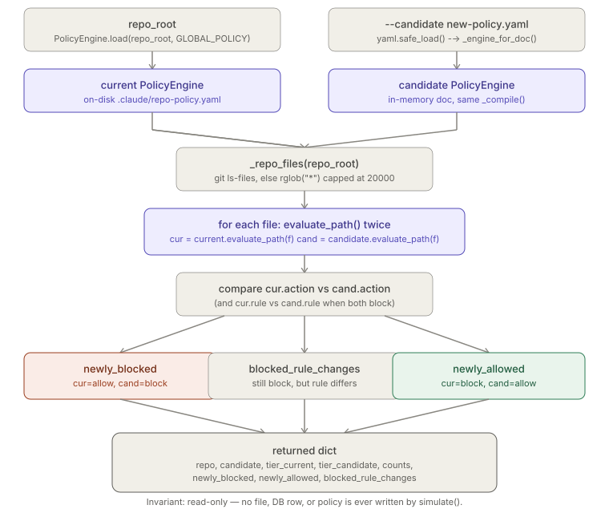

# Policy Simulation

> Relates to: [OVERVIEW.md §1 — the agent could read or touch something it shouldn't](../OVERVIEW.md#1-the-agent-could-read-or-touch-something-it-shouldnt)

**Source:** [`security/policy_sim.py`](../../security/policy_sim.py) (184 lines).

This doc covers `security/policy_sim.py` only. It is a CLI script that answers
"what would change if we rolled out this policy?" *before* anyone actually replaces
`.claude/repo-policy.yaml`. It reuses `PolicyEngine` from
[`policy-engine.md`](policy-engine.md) verbatim — `evaluate_path()`'s eight-step
decision logic is not re-explained here.

No test file exists for this module. There is no `tests/test_policy_sim.py` in the
repo at the time of writing — every example below is taken from reading
`security/policy_sim.py` directly, not from test fixtures.

---

## What it does (30-second version)

`policy_sim.py` has two independent subcommands:

- **`simulate`** — builds two `PolicyEngine`s (the repo's real, on-disk current
  policy, and a candidate YAML file that hasn't been installed yet), evaluates
  *every* committed file in the repo against both, and reports which files would
  become newly blocked, newly allowed, or blocked-by-a-different-rule. Nothing is
  written anywhere; both engines are the same stateless `PolicyEngine` from
  `policy_engine.py`, just constructed from two different documents.
- **`diff`** — a lighter, purely structural comparison of two policy YAML files
  (not tied to any repo's file tree at all) — useful for spotting drift between a
  repo's policy and a team baseline without touching disk.

---

## Configuration reference

`policy_sim.py` takes no config file of its own — it's a CLI over two other
artifacts (a repo's file tree and one or two policy YAML documents) plus one
hardcoded constant.

| Name | Type | Value | Effect |
|---|---|---|---|
| `GLOBAL_POLICY` | module constant (`security/policy_sim.py:36`) | `"~/.claude-env/config/global-policy.yaml"` | The global policy every `simulate` run merges against — same file `PolicyEngine.load()` defaults to. Not overridable from the CLI; if you need to simulate against a different global policy, edit this constant or call `simulate()` directly from Python. |

### CLI reference

| Subcommand | Positional args | Flags | Output |
|---|---|---|---|
| `simulate` | `repo_root` | `--candidate PATH` (required), `--format {text,json}` (default `text`) | The dict returned by `simulate()`, printed via `_print_sim()` or `json.dumps(..., indent=2)`. Always exits `0`. |
| `diff` | `policy_a`, `policy_b` | `--format {text,json}` (default `text`) | The dict returned by `diff_policies()`. Exits `0` if `in_sync`, `1` otherwise. |

### Function reference

| Function | Signature | Returns |
|---|---|---|
| `_repo_files` | `_repo_files(root: Path) -> list[str]` | Repo-relative path strings — `git ls-files` output if the directory is a git repo with tracked files, else a capped `rglob("*")` walk. |
| `_engine_for_doc` | `_engine_for_doc(repo_root: Path, repo_doc: dict) -> PolicyEngine` | A `PolicyEngine` built from an **in-memory** dict instead of a file on disk, using the same `PolicyEngine._compile()` the real `load()` path uses. |
| `simulate` | `simulate(repo_root: Path, candidate_path: Path) -> dict` | See [output schema](#the-simulate-output-schema) below. |
| `diff_policies` | `diff_policies(a_path: Path, b_path: Path) -> dict` | See [diff schema](#the-diff-output-schema) below. |
| `_print_sim` | `_print_sim(r: dict) -> None` | Human-readable text rendering of a `simulate()` result; truncates each of newly-blocked/newly-allowed to the first 50 rows. |
| `main` | `main() -> int` | argparse entry point; process exit code. |

---

## How to use it

```bash
# Dry-run a candidate tier-2 policy against a real repo before installing it
claude-env policy-sim simulate /path/to/repo --candidate config/candidate-policy.yaml

# Same run, machine-readable — pipe into jq or a CI gate
claude-env policy-sim simulate /path/to/repo --candidate config/candidate-policy.yaml --format json

# Check whether a repo's policy has drifted from a team baseline
claude-env policy-sim diff .claude/repo-policy.yaml config/team-baseline-policy.yaml
```

Reach for `simulate` before ever replacing a repo's live `.claude/repo-policy.yaml` —
it's the only way to see which files would become newly blocked or newly allowed
without touching the real policy or the enforcement surfaces. Reach for `diff` when
you just need to know whether two policy *documents* disagree (e.g. a repo's policy
vs. a team baseline) and don't care about a specific repo's file tree at all; its
non-zero exit code on drift also makes it usable as a CI gate.

---

## How the logic works

### `_repo_files()` — git-first, capped rglob fallback

```python
# security/policy_sim.py:39-51
def _repo_files(root: Path) -> list[str]:
    """Committed files when it's a git repo, else a bounded rglob."""
    r = subprocess.run(["git", "-C", str(root), "ls-files"],
                       capture_output=True, text=True)
    if r.returncode == 0 and r.stdout.strip():
        return [f for f in r.stdout.splitlines() if f]
    out = []
    for p in root.rglob("*"):
        if p.is_file() and ".git" not in p.parts:
            out.append(str(p.relative_to(root)))
            if len(out) >= 20000:
                break
    return out
```

`git -C <root> ls-files` runs unconditionally first. Only if it fails (non-git
directory, or `git` itself errors) *or* returns an empty stdout does the function
fall back to walking the filesystem directly with `Path.rglob("*")`. Two details
worth being precise about:

- **The fallback is capped at exactly 20,000 files**, checked inside the loop right
  after each file is appended — the walk stops the instant the 20,000th file is
  added, not before. There's no such cap on the git path; `git ls-files` output is
  taken in full no matter how large the repo.
- **The git path only sees *tracked* (committed/staged) files.** An untracked file
  that would be blocked or allowed by the candidate policy is invisible to
  `simulate` unless the directory falls back to `rglob`. This mirrors the RAG
  indexer's `index_only_committed` semantics conceptually, but `policy_sim.py`
  doesn't read that config key — the git-vs-rglob choice here is unconditional,
  not driven by any policy setting.
- The rglob fallback's only exclusion is literally `".git" not in p.parts`; there is
  no `.gitignore` awareness in that branch, so an ignored file *will* show up in a
  non-git or empty-git-index run but not in a normal tracked-file run.

### `_engine_for_doc()` — building a `PolicyEngine` without a file on disk

```python
# security/policy_sim.py:54-59
def _engine_for_doc(repo_root: Path, repo_doc: dict) -> PolicyEngine:
    """Build an engine from an in-memory candidate doc (same path load() takes)."""
    gdoc = PolicyEngine._read_yaml(GLOBAL_POLICY)
    slug = repo_doc.get("repo", repo_root.name)
    return PolicyEngine(repo=PolicyEngine._compile(repo_doc, gdoc, slug),
                        glob=PolicyEngine._compile(gdoc, gdoc, slug))
```

This deliberately reaches into `PolicyEngine`'s "private" (underscore-prefixed)
`_read_yaml` and `_compile` staticmethods/classmethods rather than calling the
public `PolicyEngine.load()`, because `load()` only knows how to read a repo policy
*from a path* (`Path(repo_root) / ".claude" / "repo-policy.yaml"`) — there's no
public constructor that takes an already-parsed candidate dict. The candidate
policy file never has to be written into `.claude/repo-policy.yaml` for this to
work; it can live anywhere the CLI caller points `--candidate` at.

Both the `current` and `candidate` engines in `simulate()` are compiled against the
*same* `gdoc` (global policy) — only the repo half of the merge differs between
them. This means a `simulate` run cannot show you the effect of a global-policy
change, only a repo-policy change; the global side is always today's on-disk
`GLOBAL_POLICY`.

### `simulate()` — the diff loop

```python
# security/policy_sim.py:62-90
def simulate(repo_root: Path, candidate_path: Path) -> dict:
    current = PolicyEngine.load(repo_root, GLOBAL_POLICY)
    cdoc = yaml.safe_load(candidate_path.read_text()) or {}
    candidate = _engine_for_doc(repo_root, cdoc)

    files = _repo_files(repo_root)
    newly_blocked, newly_allowed, changed_rule = [], [], []
    counts = {"files": len(files), "blocked_now": 0, "blocked_candidate": 0}

    for f in files:
        cur = current.evaluate_path(f)
        cand = candidate.evaluate_path(f)
        if cur.action == "block":
            counts["blocked_now"] += 1
        if cand.action == "block":
            counts["blocked_candidate"] += 1
        if cur.action != cand.action:
            entry = {"path": f, "current": cur.action, "candidate": cand.action,
                     "candidate_rule": cand.rule or cand.reason}
            (newly_blocked if cand.action == "block" else newly_allowed).append(entry)
        elif cur.action == "block" and (cur.rule != cand.rule):
            changed_rule.append({"path": f, "rule_now": cur.rule,
                                 "rule_candidate": cand.rule})

    return {"repo": str(repo_root), "candidate": str(candidate_path),
            "tier_current": current.repo.tier, "tier_candidate": candidate.repo.tier,
            "counts": counts,
            "newly_blocked": newly_blocked, "newly_allowed": newly_allowed,
            "blocked_rule_changes": changed_rule}
```

Every file gets exactly two `evaluate_path()` calls (current, candidate) — no
short-circuiting across files, no caching between calls, consistent with
`PolicyEngine` doing zero caching internally (see
[policy-engine.md's stateless fact](policy-engine.md#facts--invariants--edge-cases)).
The classification logic, read literally:

1. **Action changed and the new action is `block`** &rarr; `newly_blocked`.
2. **Action changed and the new action is anything else** (i.e. `allow`, since
   `evaluate_path()` never returns `"redact"` — that's only from `scan_content()`)
   &rarr; `newly_allowed`.
3. **Action did *not* change, but it's a block whose matched rule string differs**
   &rarr; `blocked_rule_changes`. This branch only fires for `cur.action == "block"`
   — a file that stays `allow` under both policies is never inspected for a
   changed *reason*, even though `Decision.reason` could theoretically differ. Only
   `.rule` (the short matched-pattern string) is compared, not `.reason` (the
   human-readable sentence).
4. Every other case (stays `allow`/`allow`, or stays `block`/`block` with an
   identical `.rule`) produces no entry in any list — it's silently equal.

`candidate_rule` in a `newly_blocked`/`newly_allowed` entry falls back from
`cand.rule` to `cand.reason` (`cand.rule or cand.reason`) — because an `allow`
`Decision` frequently has an empty `rule` string (e.g. `Decision("allow", "no
blocking rule; tier default allow")` from `policy_engine.py:236` sets no `rule` at
all), so the display always has *something* non-empty to show.



### The `simulate` output schema

Verified directly against `security/policy_sim.py:86-90` — every key that exists,
nothing invented:

| Key | Type | Description |
|---|---|---|
| `repo` | str | `str(repo_root)` as passed in. |
| `candidate` | str | `str(candidate_path)` as passed in. |
| `tier_current` | int | `current.repo.tier` — the tier the on-disk repo policy resolves to. |
| `tier_candidate` | int | `candidate.repo.tier` — the tier the candidate document resolves to. |
| `counts` | dict | `{"files": int, "blocked_now": int, "blocked_candidate": int}`. |
| `newly_blocked` | list[dict] | Each entry: `{"path", "current", "candidate", "candidate_rule"}`. |
| `newly_allowed` | list[dict] | Same shape as `newly_blocked`. |
| `blocked_rule_changes` | list[dict] | Each entry: `{"path", "rule_now", "rule_candidate"}` — note the different key names from the other two lists (no `current`/`candidate` action keys, since the action didn't change). |

### `diff_policies()` — structural drift, no file tree involved

```python
# security/policy_sim.py:93-126
def diff_policies(a_path: Path, b_path: Path) -> dict:
    """Structural drift between two policy files (e.g. repo vs team baseline)."""
    a = yaml.safe_load(a_path.read_text()) or {}
    b = yaml.safe_load(b_path.read_text()) or {}

    def section(doc: dict, *keys) -> set:
        cur = doc
        for k in keys:
            cur = (cur or {}).get(k, {})
        if isinstance(cur, list):
            return {json.dumps(x, sort_keys=True) if isinstance(x, dict) else str(x)
                    for x in cur}
        return set()
```

`diff_policies()` never constructs a `PolicyEngine` and never touches a repo's file
tree — it's a pure YAML-to-YAML structural comparison, deliberately decoupled from
`simulate()`. `section()` is the key primitive: it walks a dotted key path (e.g.
`("deny", "paths")`) into the doc and, if what it finds is a `list`, turns it into a
`set` of stringified elements (dict elements are `json.dumps(..., sort_keys=True)`,
everything else is `str()`). **If what it finds is anything other than a list —
including a dict, a scalar, or a missing key — it silently returns an empty
`set()`.** That means `diff_policies` on two malformed documents where e.g.
`deny.paths` is accidentally a string instead of a list will report "no drift" on
that field rather than erroring.

The six compared sections and the two scalar fields, exactly as coded
(`security/policy_sim.py:108-124`):

| Compared field | Keys walked | Comparison |
|---|---|---|
| `tier` | `doc.get("tier")` | Direct scalar `!=` check, not part of `section()`. |
| `deny.paths` | `("deny", "paths")` | Set difference both ways. |
| `deny.extensions` | `("deny", "extensions")` | Set difference both ways. |
| `deny.regex` | `("deny", "regex")` | Set difference both ways — each `{pattern, reason}` dict is JSON-serialized for comparison, so reordering keys inside one entry doesn't cause a false drift (`sort_keys=True`), but changing whitespace inside a `pattern` string does. |
| `allow.paths` | `("allow", "paths")` | Set difference both ways. |
| `allow.extensions` | `("allow", "extensions")` | Set difference both ways. |
| `content_scan.patterns` | `("content_scan", "patterns")` | Set difference both ways. |
| `content_scan.on_match` | `doc.get("content_scan", {}).get("on_match")` | Direct scalar `!=` check, outside the `section()`/list-drift loop entirely. |

Fields **not** compared at all: `repo`, `override_deny`, `content_scan.enabled`,
`rag.*`, `memory.*`, `agent_permissions.*`. A drift in any of those is invisible to
`diff_policies`, even though several of them (`override_deny`,
`content_scan.enabled`) materially change `evaluate_path()`'s behavior — this
function only looks at the eight fields listed above, nothing more.

### The `diff` output schema

| Key | Type | Description |
|---|---|---|
| `a` | str | `str(a_path)`. |
| `b` | str | `str(b_path)`. |
| `drift` | list[dict] | One entry per differing field. Scalar fields (`tier`, `content_scan.on_match`) produce `{"field", "a", "b"}`; set fields produce `{"field", "only_in_a", "only_in_b"}` (both sorted lists). |
| `in_sync` | bool | `not out["drift"]` — `True` only if the `drift` list ended up empty. |

---

## Facts, invariants & edge cases

- **`simulate` is fully read-only.** No file is written, no `PolicyEngine` state is
  mutated, no audit row is created — this is the one place in the security stack
  that deliberately does **not** touch the audit ledger, because it isn't a real
  enforcement decision, just a forecast. Confirmed by reading the entire function:
  the only I/O is two YAML reads and a `git ls-files`/`rglob` walk.
- **The candidate engine is compiled from a dict, not loaded from
  `.claude/repo-policy.yaml`.** `_engine_for_doc()` never writes the candidate file
  into the repo's real policy location — you can point `--candidate` at a file
  anywhere on disk, including outside the repo entirely, and `simulate` never
  touches the repo's actual `.claude/repo-policy.yaml`.
- **Both engines share one global policy — always today's on-disk one.** `simulate`
  cannot forecast a *global*-policy change; `GLOBAL_POLICY` is read once and reused
  for both the current and candidate `PolicyEngine`. Only the repo-side document
  differs between them.
- **`blocked_rule_changes` only tracks `.rule`, not `.reason`, and only when the
  action stays `block`.** A file whose action is `allow` under both policies is
  never checked for anything having changed, even if the matched-allow-rule string
  differs between runs (`evaluate_path()`'s `allow` decisions don't always populate
  `rule` anyway — see the `.rule` vs `.reason` fallback above).
- **`_repo_files`'s 20,000-file cap only applies to the non-git fallback path.** A
  git repo with more than 20,000 tracked files gets all of them via `git ls-files`;
  a non-git directory (or one with an empty index) silently truncates at 20,000
  during the `rglob` walk, with no warning printed that truncation occurred.
- **`_print_sim`'s 50-row cap is display-only.** The full `newly_blocked` and
  `newly_allowed` lists are always complete in the returned dict (and in
  `--format json` output); only the human-readable `text` format truncates each
  list to 50 rows with a `... and N more` line.
- **`diff_policies` treats a non-list value at a compared key as "empty", not as an
  error or a drift signal.** If someone mistypes `deny.paths` as a single string in
  YAML instead of a list, `section()` returns `set()` for it silently — the field
  reads as if it were unset, and a real difference between "a string" and "a list"
  is not reported as drift at all.
- **Exit codes differ by subcommand.** `simulate` always returns `0` regardless of
  how many files became newly blocked — it's advisory, not a gate. `diff` returns
  `1` when `in_sync` is `False`, which makes it usable directly as a CI drift-check
  gate (`policy_sim.py diff current.yaml baseline.yaml || fail-the-build`), unlike
  `simulate`.
- **No test coverage exists for this module.** There is no `tests/test_policy_sim.py`
  in the repository — everything in this document was verified by reading
  `security/policy_sim.py` directly, not by reading test fixtures or asserted
  examples.

---

## Related docs

- [`policy-engine.md`](policy-engine.md) — the `PolicyEngine` / `evaluate_path()` /
  `_compile()` logic this module drives twice per file; not re-explained here.
- [`native-tool-hooks.md`](native-tool-hooks.md) — the live enforcement path this
  module exists to de-risk changes to, before they're rolled out.
- [`incident-mode.md`](incident-mode.md) — note that `evaluate_path()`'s incident-mode
  check (`_incident_marker().exists()`) still applies inside a simulation: if
  incident mode is active while you run `simulate`, both engines will report every
  file as `block`, masking any real policy drift until incident mode is lifted.
- [OVERVIEW.md §1](../OVERVIEW.md#1-the-agent-could-read-or-touch-something-it-shouldnt) —
  the product-level framing of the problem this module solves.
