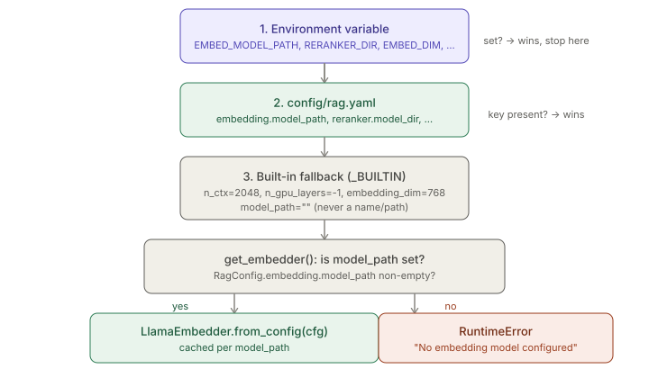
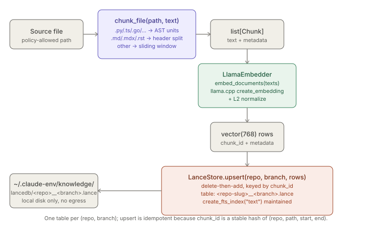

# RAG Pipeline — Config, Chunking, Embedding, Reranking, Storage

> Relates to: [OVERVIEW.md §5 — knowledge and search shouldn't leave the
> building](../OVERVIEW.md#5-knowledge-and-search-shouldnt-leave-the-building)

**Source:** [`rag/config.py`](../../rag/config.py),
[`rag/chunkers/chunkers.py`](../../rag/chunkers/chunkers.py),
[`rag/embeddings/llama_embedder.py`](../../rag/embeddings/llama_embedder.py),
[`rag/rerankers/cross_encoder.py`](../../rag/rerankers/cross_encoder.py),
[`rag/retrievers/lance_store.py`](../../rag/retrievers/lance_store.py).
**Config:** [`config/rag.yaml`](../../config/rag.yaml).

This doc covers the modules that turn a repo's files into a searchable local index:
model configuration, chunking, embedding, reranking, and the LanceDB store. It does
**not** cover how a query is screened, fused, and returned end-to-end — that's
[`retrieval-poison-screening.md`](retrieval-poison-screening.md), which owns
`rag/pipelines/retrieve.py`. It also doesn't cover the six MCP servers (including
`lancedb-rag`) that expose these modules to agents — that's `mcp-servers.md`.

---

## What it does (30-second version)

A file becomes searchable in four steps: `chunk_file()` splits it into
semantically coherent pieces (AST units for code, header sections for markdown, a
sliding window otherwise); `LlamaEmbedder` turns each chunk's text into a
normalized vector with a local GGUF model via llama.cpp; `LanceStore` upserts the
vectors + metadata into a per-`(repo, branch)` LanceDB table on local disk; at query
time the same store runs a hybrid vector+FTS search and `CrossEncoderReranker`
re-orders the top candidates with a local ONNX cross-encoder. Every model is
configured — never hardcoded — in `config/rag.yaml` or an env var, resolved by
`rag/config.py`. Nothing leaves the machine.

---

## Configuration reference (`config/rag.yaml`)

Resolution order for every field (highest priority first): **1. environment
variable → 2. `config/rag.yaml` → 3. built-in numeric fallback.** Model *paths*
have no fallback — they default to `""` and the code fails loud rather than
guessing (`rag/config.py`).

| Key | Env override | Type | Built-in fallback | Effect |
|---|---|---|---|---|
| `embedding.model_path` | `EMBED_MODEL_PATH` | str | `""` (none) | Path to a local GGUF embedding model. Empty means unconfigured; `get_embedder()` raises `RuntimeError` rather than picking a default. |
| `embedding.model_name` | `EMBED_MODEL_NAME` | str | derived | Label stored in `rag_index_state.embed_model`. If unset, derived as `Path(model_path).stem` (`rag/config.py`); empty path → empty name. |
| `embedding.document_prefix` | `EMBED_DOC_PREFIX` | str | `""` | Prepended verbatim to text before embedding a document (some models need a task prefix, e.g. nomic-embed-text's `"search_document: "`). |
| `embedding.query_prefix` | `EMBED_QUERY_PREFIX` | str | `""` | Prepended verbatim to text before embedding a query. |
| `embedding.n_ctx` | `EMBED_CTX` | int | `2048` | llama.cpp context window in tokens. |
| `embedding.n_gpu_layers` | `EMBED_GPU_LAYERS` | int | `-1` | `-1` offloads all layers to Metal on Apple Silicon; `0` forces CPU only. |
| `embedding.embedding_dim` | `EMBED_DIM` | int | `768` | Output vector dimension; must match the configured model. Changing it requires a full re-index (it's baked into the LanceDB table schema). |
| `reranker.model_dir` | `RERANKER_DIR` | str | `""` (disabled) | Directory containing an ONNX cross-encoder (`model.onnx` + tokenizer files). Empty disables reranking; the pipeline falls back to fusion order. |
| `RAG_CONFIG_YAML` | (this **is** the env var) | path | — | Explicit override for where `rag.yaml` itself is read from; see resolution order below. |
| `LANCEDB_PATH` | (this **is** the env var) | path | `~/.claude-env/knowledge/lancedb` | Where LanceDB tables live on disk (`rag/retrievers/lance_store.py`). |

Where `config/rag.yaml` itself is found (`_resolve_yaml_path`, `rag/config.py`):

1. `RAG_CONFIG_YAML` env var, if set (`~` and env vars expanded).
2. `<repo_root>/config/rag.yaml` — one level up from `rag/config.py`, i.e. this
   works identically whether running from the platform repo or the mirrored
   `$CLAUDE_ENV_HOME` tree.
3. `$CLAUDE_ENV_HOME/config/rag.yaml` (defaults to `~/.claude-env/config/rag.yaml`).
4. If none exist, falls back to option 2's path anyway (so a well-defined path is
   always returned, and `_load_yaml` just returns `{}` for a missing file).



---

## How to use it

```bash
# Sanity-check what would be indexed before running a full index — no model
# load, just policy-allowed vs. blocked file paths
claude-env scan /abs/path/to/my-service

# Build the full RAG index for the repo (loads the configured embedder,
# chunks every scanned file, upserts into the repo's LanceDB table)
claude-env index /abs/path/to/my-service

# Incrementally re-index just the files that changed since a given git ref
# (internally runs `git diff --name-only <ref> HEAD` to build the file list)
claude-env reindex /abs/path/to/my-service --since HEAD~1

# Incrementally re-index specific files by name instead
claude-env reindex /abs/path/to/my-service src/app.py docs/guide/rag-pipeline.md
```

`scan`, `index`, and `reindex` are raw `sys.argv` scripts, not `argparse` — they
take **no flags beyond what's shown above** (a bare positional `repo_root` for
`scan`/`index`; `repo_root` plus either a variadic file list or `--since <ref>`
for `reindex`). There's no `--help` output beyond a one-line usage string, so
this section is the actual reference for their arguments. Running `scan` before
the first `index` is worth doing on any new repo — it surfaces policy-driven
surprises (a large vendored directory that isn't actually excluded, say) before
paying the cost of loading the embedding model.

---

## `rag/config.py` — the one place models get chosen

```python
# rag/config.py
def get_embedder(cfg: RagConfig | None = None):
    global _EMBEDDER, _EMBEDDER_KEY
    from rag.embeddings.llama_embedder import LlamaEmbedder
    cfg = cfg or get_config()
    if not cfg.embedding.model_path:
        raise RuntimeError(
            "No embedding model configured. Set `embedding.model_path` in "
            "config/rag.yaml (or the EMBED_MODEL_PATH env var) to point at a local "
            "model file. See README §4 'Install local models' for download "
            "instructions and suggested models.")
    if _EMBEDDER is None or _EMBEDDER_KEY != cfg.embedding.model_path:
        _EMBEDDER = LlamaEmbedder.from_config(cfg.embedding)
        _EMBEDDER_KEY = cfg.embedding.model_path
    return _EMBEDDER
```

`get_embedder()` and `get_reranker()` (`rag/config.py`) are the **only**
sanctioned way to construct these classes — every caller (indexer, retriever,
memory writes) goes through them, so a model swap is a one-line yaml/env change,
never a code change. The embedder instance is cached at module level keyed by
`model_path` (`_EMBEDDER` / `_EMBEDDER_KEY`, `rag/config.py`) because
loading a GGUF file is expensive; `get_reranker()` has no such cache — it's cheap
enough (or disabled) that `CrossEncoderReranker.__init__` runs fresh each call.
`RagConfig.load()` itself is memoized too (`_CONFIG` singleton, `get_config()`,
`rag/config.py`) and only re-reads yaml when called with `reload=True`.

---

## Chunking — `rag/chunkers/chunkers.py`

One file, one function per file-type strategy, dispatched by extension in
`chunk_file()` (`rag/chunkers/chunkers.py`):

| Extension | Strategy | Function |
|---|---|---|
| `.md`, `.mdx`, `.rst` | Header-hierarchy split | `_chunk_markdown` |
| `.py .js .ts .tsx .go .java .kt .cs .rs .c .h .cpp .hpp` | AST-aware (tree-sitter), falls back to window if parsing fails or no unit nodes found | `_chunk_code` |
| anything else | Sliding window | `_split_window` (called directly with `TARGETS["fallback"]`) |

Target/overlap token budgets (`TARGETS`, `rag/chunkers/chunkers.py`), in
`(target_tokens, overlap_tokens)`:

| Strategy key | Target | Overlap |
|---|---|---|
| `code` | 512 | 64 |
| `markdown` | 384 | 48 |
| `section` | 256 | 32 (defined but not referenced by any current caller) |
| `fallback` | 400 | 50 |

Tokens are approximated as `len(text) // 4` (`approx_tokens`,
`rag/chunkers/chunkers.py`) — there is no real tokenizer wired in.

### AST-aware code chunking

```python
# rag/chunkers/chunkers.py
def get_parser(lang: str):
    if _TSParser is None or _get_language is None:
        return None
    if lang not in _PARSER_CACHE:
        try:
            _PARSER_CACHE[lang] = _TSParser(_get_language(lang))
        except Exception:
            _PARSER_CACHE[lang] = None
    return _PARSER_CACHE[lang]
```

The module deliberately builds the parser from the stable core `tree_sitter.Parser`
plus a grammar from `tree_sitter_language_pack`, rather than that pack's own
`get_parser()` — the comment at `rag/chunkers/chunkers.py` explains the
pack's own parser has a divergent API (`parse()` rejects bytes, `root_node` is a
method not a property) that would break the byte-offset walk below. Unsupported or
failing languages cache as `None` and every later call for that language falls
straight to window chunking — the cache means that failure is paid once per
language, not once per file.

`_chunk_code` (`rag/chunkers/chunkers.py`) walks the tree looking for
per-language "unit" node types (`UNIT_NODES`, e.g. `{"function_definition",
"class_definition"}` for Python) and does **not** descend into a node once it's
captured as a unit — nested functions/methods become part of their parent's chunk
text, not separate chunks. Two edge cases baked into `walk()`:

- A unit larger than `1.5x` the code target (768 tokens) gets sub-windowed with
  `_split_window` instead of kept whole (`rag/chunkers/chunkers.py`).
- If the walk finds zero unit nodes at all (e.g. a config-ish file that happens to
  have a supported extension), the whole file falls back to window chunking
  (`rag/chunkers/chunkers.py`) — same as if tree-sitter were unavailable.

`symbol_name` is extracted by scanning direct children for an
`identifier`/`name`/`type_identifier` node (`name_of`, `rag/chunkers/chunkers.py`);
if none is found the node's own type string is used as the name.

### Markdown sectioning

```python
# rag/chunkers/chunkers.py
def _chunk_markdown(text: str) -> list[tuple[str, str, int, int, str]]:
    lines = text.splitlines()
    out, buf, header, start = [], [], "preamble", 0
    target, overlap = TARGETS["markdown"]
    tok = 0

    def flush(end):
        if buf:
            out.append(("section", header, start + 1, end, "\n".join(buf)))

    for i, ln in enumerate(lines):
        if ln.startswith("#"):
            flush(i)
            header = ln.lstrip("# ").strip()[:80] or "section"
            buf, start, tok = [ln], i, approx_tokens(ln)
            continue
        buf.append(ln)
        tok += approx_tokens(ln)
        if tok >= target:
            flush(i + 1)
            buf, start, tok = [], i, 0
    flush(len(lines))
    return out
```

Every `#`-prefixed line starts a new section named after that heading text
(truncated to 80 chars); content before the first heading is labeled `"preamble"`.
A section that grows past the 384-token markdown target is flushed mid-section too
(without waiting for the next heading), so one long section can still produce
multiple chunks — there's no overlap applied between these token-triggered splits
(the `overlap` value is unpacked but unused in this function, unlike
`_split_window`).

### Chunk identity and metadata

```python
# rag/chunkers/chunkers.py
def _cid(repo: str, path: str, start: int, end: int) -> str:
    return hashlib.sha1(f"{repo}:{path}:{start}:{end}".encode()).hexdigest()

def _mk(repo, branch, commit, path, ftype, stype, name, s, e, text) -> Chunk:
    return Chunk(
        chunk_id=_cid(repo, path, s, e), repo=repo, branch=branch,
        commit_sha=commit, file_path=path, file_type=ftype, symbol_type=stype,
        symbol_name=name, start_line=s, end_line=e, text=text,
        content_hash=hashlib.sha256(text.encode()).hexdigest(),
    )
```

`chunk_id` is a SHA-1 of `repo:path:start:end` — stable across re-indexing runs as
long as line ranges don't shift, which is what makes `LanceStore.upsert`'s
delete-then-add idempotent. `content_hash` (SHA-256 of the chunk text) is separate
metadata, presumably for an indexer to skip re-embedding unchanged chunks — but
`chunkers.py` itself never reads it back; that comparison, if it happens, lives in
the indexer, not here. Empty/whitespace-only parts are dropped before becoming
`Chunk`s (`if t.strip():`, `rag/chunkers/chunkers.py`).

---

## Embedding — `rag/embeddings/llama_embedder.py`

```python
from rag.config import get_embedder
emb = get_embedder()
vecs = emb.embed_documents(["def f(): ..."])
qv   = emb.embed_query("how is jwt validated")
```

Constructor signature (`rag/embeddings/llama_embedder.py`):

```python
def __init__(self, model_path: str, model_name: str, embedding_dim: int,
             n_ctx: int = 2048, n_gpu_layers: int = -1,
             n_threads: int | None = None,
             document_prefix: str = "", query_prefix: str = ""):
```

It wraps `llama_cpp.Llama(model_path=..., embedding=True, n_ctx=..., n_threads=...,
n_gpu_layers=..., verbose=False)`. If `llama_cpp` isn't importable, `Llama` is set
to `None` at import time and the constructor raises `RuntimeError` with the exact
install command (`CMAKE_ARGS='-DLLAMA_METAL=on' pip install llama-cpp-python`) —
this is a hard failure, not a silent no-op embedder. `n_threads` defaults to
`os.cpu_count() or 8` when not given.

```python
# rag/embeddings/llama_embedder.py
def _embed(self, text: str) -> list[float]:
    out = self.llm.create_embedding(text)
    vec = out["data"][0]["embedding"]
    # L2 normalize for cosine == dot
    norm = sum(x * x for x in vec) ** 0.5 or 1.0
    return [x / norm for x in vec]

def embed_documents(self, texts: list[str]) -> list[list[float]]:
    return [self._embed(self._doc(t)) for t in texts]

def embed_query(self, text: str) -> list[float]:
    return self._embed(self._query(text))
```

Every vector is L2-normalized before it's returned (the `or 1.0` guards a
theoretical all-zero vector from dividing by zero), so LanceDB's cosine similarity
and a plain dot product are interchangeable downstream. `embed_documents` and
`embed_query` differ only in which configured prefix
(`self._doc_prefix`/`self._query_prefix`) gets prepended — the model itself is not
inspected to decide whether a prefix is needed; that's a config decision, per the
module's own docstring (`rag/embeddings/llama_embedder.py`). Two static
helpers, `to_blob`/`from_blob` (`rag/embeddings/llama_embedder.py`), pack/unpack
a vector as little-endian float32 — for storing raw vectors in a SQLite BLOB
column if a caller needs that instead of LanceDB.

---

## Reranking — `rag/rerankers/cross_encoder.py`

```python
from rag.config import get_reranker
rr = get_reranker()
if not rr.ok:
    print(rr.status())   # explains why reranking is inactive
```

Construction never raises — `CrossEncoderReranker.__init__` catches everything and
sets `self.ok = False` with `self._load_error` on any failure (missing
`model_dir`, missing `onnxruntime`/`transformers`, missing `model.onnx`, bad
tokenizer files):

```python
# rag/rerankers/cross_encoder.py
if not model_dir:
    self._load_error = "reranker disabled (no model_dir configured)"
    return
try:
    import onnxruntime as ort
    from transformers import AutoTokenizer
    self.tok = AutoTokenizer.from_pretrained(model_dir)
    self.sess = ort.InferenceSession(
        str(Path(model_dir) / "model.onnx"),
        providers=["CPUExecutionProvider"])
    self.ok = True
except Exception as exc:
    self._load_error = str(exc)
    self.ok = False  # identity fallback
```

`rerank(query, candidates, top_n=8, text_key="text")`
(`rag/rerankers/cross_encoder.py`) is the one entry point:

- Empty candidates → `[]` immediately.
- `not self.ok` → identity fallback: `candidates[:top_n]`, unchanged order — this
  is how a missing/disabled reranker degrades to "just trust fusion order" instead
  of erroring the whole query.
- Otherwise: tokenizes `(query, candidate_text)` pairs together (`padding=True,
  truncation=True, max_length=512`), runs the ONNX session with
  `providers=["CPUExecutionProvider"]` (CPU-only, no GPU dependency), sorts by
  descending logit with `np.argsort(-logits)`, and returns the top `top_n`
  candidates each with an added `rerank_score` float field.

`status()` (`rag/rerankers/cross_encoder.py`) returns `{ok, model_dir,
model_name, error}` — `error` is `None` whenever `ok` is `True`, otherwise the
caught exception's string. Per the module docstring, reranking improves top-3
precision roughly 15-25% over fusion alone (a stated claim from the source
comments — not independently re-verified in this doc).

---

## Storage & hybrid search — `rag/retrievers/lance_store.py`

### Schema

```python
# rag/retrievers/lance_store.py
def _schema(self) -> "pa.Schema":
    return pa.schema([
        pa.field("chunk_id", pa.string()),
        pa.field("vector", pa.list_(pa.float32(), self.dim)),
        pa.field("text", pa.string()),
        pa.field("repo", pa.string()),
        pa.field("branch", pa.string()),
        pa.field("commit_sha", pa.string()),
        pa.field("file_path", pa.string()),
        pa.field("file_type", pa.string()),
        pa.field("symbol_type", pa.string()),
        pa.field("symbol_name", pa.string()),
        pa.field("start_line", pa.int32()),
        pa.field("end_line", pa.int32()),
        pa.field("content_hash", pa.string()),
        pa.field("tier", pa.int32()),
    ])
```

`self.dim` (default `768`, matching `embedding.embedding_dim`) is baked directly
into the `vector` field's fixed-size list type — changing `embedding_dim` means
every existing table's schema is now wrong, which is why the config comment calls
out that a dimension change needs a full re-index.

### One table per (repo, branch)

```python
# rag/retrievers/lance_store.py
def table_name(repo: str, branch: str) -> str:
    safe = lambda s: s.replace("/", "-").replace(" ", "_")
    return f"{safe(repo)}__{safe(branch)}"
```

On disk this is `~/.claude-env/knowledge/lancedb/<repo-slug>__<branch>.lance/`
(default `LANCE_PATH`, overridable via `LANCEDB_PATH`). `open()`
(`rag/retrievers/lance_store.py`) creates the table with the schema above if
it doesn't exist yet and immediately tries `tbl.create_fts_index("text",
replace=True)`, swallowing any exception — so a LanceDB build without FTS support
still works, just without hybrid search (see below).

### Upsert, delete, count

```python
# rag/retrievers/lance_store.py
def upsert(self, repo: str, branch: str, rows: list[dict]) -> int:
    if not rows:
        return 0
    tbl = self.open(repo, branch)
    ids = [r["chunk_id"] for r in rows]
    # delete-then-add = idempotent upsert keyed by chunk_id
    id_list = ",".join(f"'{i}'" for i in ids)
    try:
        tbl.delete(f"chunk_id IN ({id_list})")
    except Exception:
        pass
    tbl.add(rows)
    return len(rows)
```

LanceDB has no native upsert, so this is delete-by-id-list then add — idempotent
because `chunk_id` is a deterministic hash of `(repo, path, start_line,
end_line)` (see chunking section above). `delete_file()`
(`rag/retrievers/lance_store.py`) removes all rows for a `file_path`,
escaping embedded single quotes (`replace("'", "''")`) so a real path like
`docs/what's-new.md` doesn't break the generated SQL filter mid-run. `count()`
(`rag/retrievers/lance_store.py`) returns `0` on any failure rather than
raising.

### Hybrid search

```python
# rag/retrievers/lance_store.py
def search(self, repo: str, branch: str, query_vector: list[float],
           query_text: str, top_k: int = 40) -> list[dict]:
    tbl = self.open(repo, branch)
    try:
        res = (tbl.search(query_type="hybrid")
                  .vector(query_vector).text(query_text)
                  .limit(top_k).to_list())
    except Exception:
        res = tbl.search(query_vector).limit(top_k).to_list()
    for r in res:
        r.pop("vector", None)
    return res
```

The primary path asks LanceDB itself for `query_type="hybrid"` — dense cosine
vector search fused with BM25-style full-text search via reciprocal-rank fusion,
per the module docstring (`rag/retrievers/lance_store.py`). If that raises
for any reason (most commonly: no FTS index exists because `create_fts_index`
failed silently in `open()`), the `except` falls back to plain vector-only search
with the same `top_k`. Either way, the raw `vector` field is stripped from every
result row before returning — callers get metadata + score fields, never the
1536-plus raw floats back. Downstream, `rag/pipelines/retrieve.py` is what
interprets whichever score fields a given path produced (`rerank_score`,
`_relevance_score` from the hybrid path, or `_distance` from the vector-only
path) — see [`retrieval-poison-screening.md`](retrieval-poison-screening.md) and
its regression coverage in `tests/test_retrieve_ranking.py`, which exists
specifically because the hybrid path's `_relevance_score` field was once dropped
by an incomplete sort key. **No dedicated test file exists for the chunkers,
embedder, reranker, or `LanceStore` themselves** — this doc's code excerpts are
the closest thing to verified behavior beyond the source itself; don't assume
coverage that isn't there.



---

## Flow diagrams


*A file is chunked by extension-driven strategy, each chunk is embedded and
L2-normalized, and the vector + metadata is upserted into a per-(repo, branch)
LanceDB table that also maintains a full-text index.*


*Every embedding/reranker setting resolves env var → `rag.yaml` → built-in
fallback, except the model path itself, which has no fallback and fails loud via
`RuntimeError` when unconfigured.*

---

## Facts, invariants & edge cases

- **No model name or path is ever hardcoded** (see `rag/config.py` above) — every
  constructor only accepts paths/dirs from config, and grepping the
  embedder/reranker source for a literal model filename turns up none.
- **An unconfigured embedding model fails loud, not silently** — `get_embedder()`
  raises `RuntimeError` with setup instructions when `embedding.model_path` is
  empty (shown above); no default/example model is shipped or assumed.
- **An unconfigured or broken reranker degrades gracefully instead** — unlike the
  embedder, `CrossEncoderReranker` never raises on construction; `ok=False` plus
  identity-order passthrough in `rerank()` is the designed fallback (see above),
  since reranking is explicitly optional.
- **The embedder instance is cached; the reranker is not** (see above) — worth
  knowing if `get_reranker()` runs per-query in a hot path, since it reloads the
  ONNX session on every call.
- **Vectors are always L2-normalized before storage or query**, so LanceDB's
  cosine metric and a raw dot product agree (`rag/embeddings/llama_embedder.py`,
  see above).
- **Changing `embedding_dim` requires a full re-index** — the dimension is fixed
  into the LanceDB `vector` field type at table-creation time (see above); an
  existing table isn't migrated.
- **`chunk_id` is a hash of `(repo, path, start_line, end_line)`, not of the text
  itself** (see above) — if a file's content changes but chunk boundaries don't
  shift, the old chunk_id is reused and the row is overwritten; `content_hash`
  is stored alongside for an indexer to notice the change, but
  `chunkers.py`/`lance_store.py` don't themselves compare it to skip work.
- **A large AST unit is sub-windowed, not truncated** (see above) — anything over
  1.5x the 512-token code target (768 tokens) is split with the same
  sliding-window logic as the fallback path, rather than embedded whole or cut
  off.
- **tree-sitter parser failures are cached as `None` per language** (see above),
  so a broken or unsupported grammar only pays the failed-import/build cost
  once, not per file.
- **The pack's own `get_parser()` is deliberately not used**, because its API is
  incompatible with this module's byte-offset walk (see above) — a maintenance
  trap if "simplified" later without reading that comment.
- **Nested functions don't get their own chunk** — `walk()` returns immediately
  after capturing a unit node without descending into its children (see above),
  so an inner function is embedded only as part of its enclosing chunk.
- **Markdown section overlap is defined but unused** — `TARGETS["markdown"]`
  unpacks an `overlap` value in `_chunk_markdown`, but nothing in that function
  re-includes trailing lines across a token-triggered mid-section flush (see
  above); only heading boundaries get a clean section start.
- **LanceDB has no native upsert; this module fakes one** via delete-by-id-list
  then `add()` (see above) — a crash between the two would leave rows missing
  until the next successful run; there is no transaction wrapping them.
- **Hybrid search silently degrades to vector-only** on any exception from the
  `query_type="hybrid"` path, most commonly a missing FTS index (see above) —
  callers can't distinguish "hybrid ran" from "fell back to vector-only" from
  the return value alone.
- **File paths with single quotes are escaped for `delete_file()`** (see above)
  — without it, a path like `docs/what's-new.md` would break the generated
  filter and crash indexing mid-run.
- **No test file exists for chunkers, embedder, reranker, or `LanceStore`.** The
  only RAG-adjacent test in `tests/` is `test_retrieve_ranking.py`, which covers
  `rag/pipelines/retrieve.py::_relevance` (the score-selection helper used after
  `LanceStore.search()` returns), not any module in this doc directly.

---

## Related docs

- [`retrieval-poison-screening.md`](retrieval-poison-screening.md) — how a query
  actually flows through `rag/pipelines/retrieve.py`: fusion/rerank orchestration,
  and how retrieved text is screened as untrusted data before reaching an agent.
- [OVERVIEW.md §5](../OVERVIEW.md#5-knowledge-and-search-shouldnt-leave-the-building) —
  the product-level framing: local-only knowledge and search.
- `mcp-servers.md` *(planned)* — the `lancedb-rag` MCP server that exposes this
  pipeline's search to agents, alongside the other five servers.
- [`policy-engine.md`](policy-engine.md) — `rag.index_paths` is a subset of what
  the policy engine already allows to be read; deny always wins over index scope.
