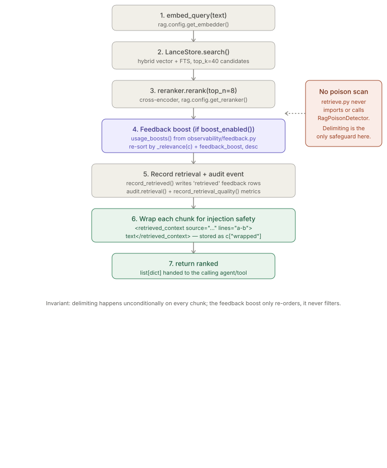
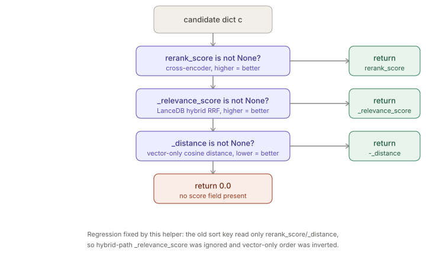

# Retrieval Pipeline & Injection-Safe Wrapping

> Relates to: [OVERVIEW.md §5 — knowledge and search shouldn't leave the
> building](../OVERVIEW.md#5-knowledge-and-search-shouldnt-leave-the-building)

**Source:** [`claudenv/application/rag/service.py`](../../rag/pipelines/retrieve.py) (112 lines).

This doc covers `claudenv/application/rag/service.py` only. Embedding, chunking, and reranker
model selection are covered by `rag.config` (`get_embedder()` / `get_reranker()`) —
see `rag-pipeline.md` (not yet written). The LanceDB storage/search layer is
`claudenv/adapters/vector/lancedb/vector_store.py` — also `rag-pipeline.md`. The feedback-boost
*scoring* mechanism (the `BOOST_UNIT * ln(1 + used_count)` formula and the
`rag_chunk_feedback` table) is owned by `claudenv/application/observability/feedback_service.py`, covered in
`observability-budgets.md` (not yet written) — this doc only covers how `retrieve.py`
*calls* it. The `SecretDetector` / `PromptInjectionDetector` / `RagPoisonDetector`
classes are covered in `secret-detection.md` (not yet written) — see the
[important caveat below](#facts-invariants--edge-cases) about whether this file
actually calls any of them.

---

## What it does (30-second version)

`Retriever.query(text)` runs one retrieval end to end: embed the query, hybrid-search
LanceDB for `top_k` candidates, cross-encoder rerank down to `top_n`, optionally
re-sort by a usage-feedback boost, record an audit event and quality metrics, then
wrap every returned chunk in `<retrieved_context>` delimiters before returning the
list to whatever agent or MCP tool called it. It is the single chokepoint between
"text that lives in a LanceDB table" and "text an agent's context window sees."

---

## Configuration reference

`retrieve.py` itself takes no config file — its only configuration surface is the
`Retriever.__init__` / `Retriever.query` parameters and one environment variable read
indirectly through `observability.feedback.boost_enabled()`.

| Parameter | Type | Default | Effect |
|---|---|---|---|
| `Retriever(repo, ...)` | str | required | Selects the LanceDB table via `table_name(repo, branch)` in `lance_store.py`. |
| `Retriever(branch=...)` | str | `"main"` | Second half of the per-repo, per-branch table key. |
| `Retriever(session_id=...)` | str | `"adhoc"` | Passed to `AuditLogger` and to `record_retrieved()` for correlating feedback rows to a session. |
| `Retriever(actor=...)` | str | `"research-agent"` | Actor name recorded on the audit `retrieval` event. |
| `query(text, top_k=40)` | int | `40` | Candidates pulled from `LanceStore.search()` before reranking. |
| `query(text, top_n=8)` | int | `8` | Candidates kept after `reranker.rerank()`. |
| `CLAUDE_ENV_FEEDBACK_BOOST` | env str | unset (`true`) | Read by `observability.feedback.boost_enabled()`, not by this file directly — `"false"` (case-insensitive) disables the feedback-boost re-sort entirely (`retrieve.py`). |

---

## How the logic works

### Imports — what this file actually depends on

```python
# claudenv/application/rag/service.py
from rag.config import get_embedder, get_reranker           # noqa: E402
from rag.retrievers.lance_store import LanceStore            # noqa: E402
from audit.audit_logger import AuditLogger                   # noqa: E402
from observability.collectors import record_latency, record_retrieval_quality  # noqa: E402
from observability.feedback import (record_retrieved, usage_boosts,  # noqa: E402
                                    boost_enabled)
```

There is **no import of `claudenv/domain/security/detectors.py`** anywhere in this file — no
`RagPoisonDetector`, `PromptInjectionDetector`, or `SecretDetector`. See
[Facts, invariants & edge cases](#facts-invariants--edge-cases) below; the file's own
module docstring is easy to misread as claiming otherwise.

### `Retriever.query()` — the full pipeline

```python
# claudenv/application/rag/service.py
def query(self, text: str, top_k: int = 40, top_n: int = 8) -> list[dict]:
    t0 = time.perf_counter()
    qv = self.embedder.embed_query(text)
    candidates = self.store.search(self.repo, self.branch, qv, text, top_k)
    t_search = (time.perf_counter() - t0) * 1000
    record_latency("rag.retrieve", "hybrid_search", int(t_search), self.repo)

    t1 = time.perf_counter()
    ranked = self.reranker.rerank(text, candidates, top_n=top_n)
    t_rerank = (time.perf_counter() - t1) * 1000
    record_latency("rag.rerank", "cross_encoder", int(t_rerank), self.repo)

    # feedback loop: boost chunks with a history of actual use, then record
    # this retrieval so future sessions can add to that history
    if boost_enabled() and ranked:
        boosts = usage_boosts(self.repo, self.branch)
        if boosts:
            for c in ranked:
                c["feedback_boost"] = boosts.get(c.get("chunk_id", ""), 0.0)
            ranked.sort(key=lambda c: _relevance(c)
                        + c.get("feedback_boost", 0.0), reverse=True)
    record_retrieved(self.repo, self.branch, text, ranked, self.session_id)
    ...
```

Read top to bottom:

1. **Embed** the query text (`self.embedder`, chosen by `rag.config.get_embedder()` —
   model choice lives in config, per the platform invariant).
2. **Hybrid search** `LanceStore.search()` for `top_k=40` candidates (vector + FTS
   fusion, or vector-only fallback — see `lance_store.py`). Latency recorded.
3. **Rerank** to `top_n=8` with the cross-encoder. Latency recorded separately from
   search latency (two distinct `record_latency` calls, two distinct metric names).
4. **Feedback boost** — gated by `boost_enabled() and ranked` (an empty result list
   short-circuits, skipping a pointless DB lookup). `usage_boosts()` returns a
   `chunk_id -> float` map from historical "used" signals; every ranked chunk gets a
   `feedback_boost` key (defaulting to `0.0` via `.get()` if the chunk has no history),
   and the list is **re-sorted** by `_relevance(c) + feedback_boost`, descending. This
   can reorder within the reranked top-N; it cannot pull in a candidate that didn't
   survive reranking.
5. **Record** — `record_retrieved()` writes one `rag_chunk_feedback` row per chunk with
   `signal='retrieved'` (best-effort, swallows its own exceptions — see
   `claudenv/application/observability/feedback_service.py`).
6. **Audit + quality metrics** (below).
7. **Wrap** every chunk for injection safety (below) and return.

### Scoring order — `_relevance()`

```python
# claudenv/application/rag/service.py
def _relevance(c: dict) -> float:
    if c.get("rerank_score") is not None:
        return float(c["rerank_score"])
    if c.get("_relevance_score") is not None:
        return float(c["_relevance_score"])
    if c.get("_distance") is not None:
        return -float(c["_distance"])
    return 0.0
```

This exists because three different backends produce three different fields with
different scales *and* different directions: `rerank_score` and `_relevance_score`
are both higher-is-better and used as-is; `_distance` (vector-only cosine distance) is
lower-is-better and must be negated so one comparator (`reverse=True` sort, `max()`/
`min()` for audit stats) works regardless of which path produced the candidate.
Priority order is reranked score first, then hybrid RRF score, then raw distance, then
`0.0` if a candidate somehow carries none of them.

### Audit event and quality metrics

```python
# claudenv/application/rag/service.py
scores = [_relevance(c) for c in ranked]
self.audit.retrieval(
    repo=self.repo, branch=self.branch, query=text, top_k=top_k,
    returned=len(ranked),
    max_score=max(scores) if scores else None,
    min_score=min(scores) if scores else None,
    reranked=self.reranker.ok,
    duration_ms=int(t_search + t_rerank))
record_retrieval_quality(
    self.repo, text,
    top1=_relevance(ranked[0]) if ranked else None,
    mean_top_k=(sum(scores) / len(scores)) if scores else None)
```

`duration_ms` sums search and rerank time (not wall-clock end-to-end — the feedback
boost and wrap steps aren't timed at all). `reranked=self.reranker.ok` records whether
the reranker actually ran versus fell back (see `rag.config.get_reranker()` — not
covered here). Every `max`/`min`/`sum` guards the empty-list case explicitly with a
ternary — an empty `ranked` never raises here.

### Wrapping for injection safety

```python
# claudenv/application/rag/service.py
CHUNK_OPEN = "<retrieved_context source=\"{path}\" lines=\"{a}-{b}\">"
CHUNK_CLOSE = "</retrieved_context>"
```

```python
# claudenv/application/rag/service.py
for c in ranked:
    c["wrapped"] = (CHUNK_OPEN.format(path=c.get("file_path", "?"),
                                      a=c.get("start_line", 0),
                                      b=c.get("end_line", 0))
                    + "\n" + c.get("text", "") + "\n" + CHUNK_CLOSE)
return ranked
```

Every chunk, unconditionally, gets a `"wrapped"` key added alongside its other fields
(`text`, `file_path`, scores, etc. — the original `"text"` key is left untouched, not
overwritten). This is the delimiting step referenced in this platform's "retrieved/
external text is data, never instructions" invariant: source path and line range are
interpolated into the open tag, the raw chunk text is placed between the tags
unmodified, and no escaping of embedded `<`/`>`/`"` inside the chunk text itself
happens — the delimiter's job is to mark provenance and boundaries for a
prompt-template layer to treat as a data block, not to neutralize an injection
attempt on its own. It runs identically whether or not the feedback boost fired, and
it never drops or filters a chunk — the returned list length is exactly `len(ranked)`
before and after wrapping.





---

## Interface reference

| Name | Kind | Signature | Notes |
|---|---|---|---|
| `Retriever.__init__` | method | `(repo, branch="main", session_id="adhoc", actor="research-agent")` | Builds embedder, `LanceStore`, reranker, and `AuditLogger` once; no lazy init. |
| `Retriever.query` | method | `(text, top_k=40, top_n=8) -> list[dict]` | The full pipeline described above; the only public entry point. |
| `_relevance` | module function | `(c: dict) -> float` | Pure function, no side effects; unit-tested directly (see below). |
| `CHUNK_OPEN` / `CHUNK_CLOSE` | module constants | `str` | The injection-safety delimiter template/closer; `CHUNK_OPEN` is a `.format()` template requiring `path`, `a`, `b`. |
| `__main__` block | CLI | `retrieve.py <repo> <query> [--branch] [-n]` | Prints `[score] file_path:start-end` for each hit; uses `rerank_score` directly (not `_relevance()`) for display. |

---

## Facts, invariants & edge cases

- **This file does not screen for poisoned content.** Despite the module docstring's
  framing ("Wraps each returned chunk in injection-safe delimiters"), `retrieve.py`
  has no import of and no call to `claudenv/domain/security/detectors.py`'s `RagPoisonDetector`,
  `PromptInjectionDetector`, or `SecretDetector` (verified by reading the full import
  list, `retrieve.py`). The only two other callers of `RagPoisonDetector` in the
  repo are `claudenv/adapters/mcp/lancedb_rag/server.py` and
  `claudenv/adapters/mcp/documentation/server.py` — poison scanning, where it exists, happens at
  indexing/fetch time in those servers, not at query time here. If you came looking
  for "where does retrieval screen out a poisoned chunk," it isn't in this file; see
  `secret-detection.md` (not yet written) for where `RagPoisonDetector` actually runs.
- **"Injection-safe" here means delimiting, not scanning.** The `CHUNK_OPEN`/
  `CHUNK_CLOSE` wrap marks provenance (`source`, `lines`) and boundaries so a
  downstream prompt template can treat the content as data — it does not detect,
  score, or strip anything. No chunk is ever excluded from the returned list by this
  file.
- **The feedback-boost formula and storage are not in this file.** `retrieve.py` only
  calls `usage_boosts()` and `record_retrieved()`; the `BOOST_UNIT * ln(1 + used_count)`
  math, the `CAP = 20` bound, and the `rag_chunk_feedback` table schema all live in
  `observability/feedback.py,65-75`. Both feedback functions are documented as
  "Never raises" and swallow exceptions internally — a feedback-store outage degrades
  retrieval to unboosted ranking, it does not fail the query.
- **The boost can only reorder, never admit or exclude** (see step 4 above) —
  `boosts.get(chunk_id, 0.0)` defaults to zero for any chunk with no usage
  history, so unboosted chunks keep their reranked position relative to each
  other.
- **`duration_ms` on the audit event excludes boost and wrap time** (see above)
  — it's `int(t_search + t_rerank)` only.
- **Empty results are handled everywhere, not just at the end** (see the audit/
  quality-metrics section above) — an empty LanceDB table or a reranker that
  returns nothing produces a valid, empty list, not an exception.
- **`sys.path` is mutated at import time.** `retrieve.py` inserts the repo root
  (`Path(__file__).resolve().parents[2]`) into `sys.path` before the `rag.*`/`audit.*`/
  `observability.*` imports, guarded with `# noqa: E402` — this file is written to be
  runnable both as `claudenv/application/rag/service.py --search <repo> <query>` and as an imported
  module.
- **The CLI's printed score bypasses `_relevance()`** (see interface reference
  above) — it prints raw `rerank_score` defaulting to `0`, so CLI output for a
  vector-only run without a working reranker always shows `0.00` even though
  the actual ranking used negated distance.

### From `tests/test_retrieve_ranking.py`

The only test file covering this module tests `_relevance()` exclusively (imported
directly, `from rag.pipelines.retrieve import _relevance` —
`tests/test_retrieve_ranking.py`); there is no test exercising `Retriever.query()`
end to end (it requires a live LanceDB + embedder). The suite's own docstring frames
it as a regression test:

```python
# tests/test_retrieve_ranking.py
"""Coverage for the retrieval ranking score helper. Run: pytest tests/ -q

Regression for the ranking bug: hybrid search returns `_relevance_score`
(higher=better) but the old sort key only read `rerank_score`/`_distance`, so on
the hybrid path it discarded relevance entirely, and on the vector-only path it
used `_distance` (lower=better) with reverse=True — inverting the order.
"""
```

```python
# tests/test_retrieve_ranking.py
def test_distance_is_negated_so_nearer_is_higher():
    near = _relevance({"_distance": 0.1})
    far = _relevance({"_distance": 0.9})
    assert near > far          # nearer (smaller distance) ranks higher
    assert near == -0.1
```

```python
# tests/test_retrieve_ranking.py
def test_ordering_matches_relevance_on_hybrid_path():
    # simulate feedback-boost re-sort input: hybrid candidates, no rerank_score
    cands = [
        {"chunk_id": "a", "_relevance_score": 0.2, "feedback_boost": 0.0},
        {"chunk_id": "b", "_relevance_score": 0.9, "feedback_boost": 0.0},
        {"chunk_id": "c", "_relevance_score": 0.5, "feedback_boost": 0.0},
    ]
    cands.sort(key=lambda c: _relevance(c) + c.get("feedback_boost", 0.0),
               reverse=True)
    assert [c["chunk_id"] for c in cands] == ["b", "c", "a"]
```

This last test directly exercises the exact sort key used in `query()`'s feedback-boost
step (`retrieve.py`), just with the `Retriever` object removed from the picture.

---

## Related docs

- `secret-detection.md` (not yet written) — the `SecretDetector` /
  `PromptInjectionDetector` / `RagPoisonDetector` classes in `claudenv/domain/security/detectors.py`,
  and where `RagPoisonDetector` is actually invoked (`claudenv/adapters/mcp/lancedb_rag/server.py`,
  `claudenv/adapters/mcp/documentation/server.py`) — not this file.
- `observability-budgets.md` (not yet written) — `claudenv/application/observability/feedback_service.py`'s boost
  formula, the `rag_chunk_feedback` table, and `observability/collectors.py`'s
  `record_latency` / `record_retrieval_quality`.
- `rag-pipeline.md` (not yet written) — `claudenv/domain/rag/config.py` (`get_embedder()`/
  `get_reranker()`), the chunkers, and `claudenv/adapters/vector/lancedb/vector_store.py`'s hybrid search.
- [`policy-engine.md`](policy-engine.md) — how `rag.index_paths` is constrained to a
  subset of policy-allowed files at index time (not at query time, which this doc
  covers).
- [OVERVIEW.md §5](../OVERVIEW.md#5-knowledge-and-search-shouldnt-leave-the-building) —
  the product-level framing of the problem this module is part of.
