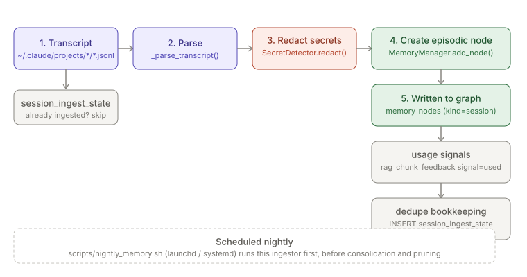

# Session Ingestion

> Relates to: [OVERVIEW.md §4 — the agent forgets everything, every session](../OVERVIEW.md#4-the-agent-forgets-everything-every-session)

**Source:** [`memory/session_ingestor.py`](../../memory/session_ingestor.py) (212 lines).
**Schema:** [`sql/003_extensions.sql`](../../sql/003_extensions.sql) (`session_ingest_state`).
**Scheduling:** [`scripts/nightly_memory.sh`](../../scripts/nightly_memory.sh).

This doc covers `memory/session_ingestor.py` only. The node schema it writes into
(`memory_nodes`, `add_node`, half-life, taxonomy validation) is covered in
[`memory-graph.md`](memory-graph.md) — this doc treats `MemoryManager.add_node()` as a black
box. Secret redaction is a separate module, covered in
[`secret-detection.md`](secret-detection.md); this ingestor is a *caller* of
`SecretDetector.redact()`, not a reimplementation of it.

---

## What it does (30-second version)

Claude Code writes every session as a JSONL transcript to
`~/.claude/projects/<munged-cwd>/<session>.jsonl`. `session_ingestor.py` walks that directory,
parses each new transcript into a compact summary (task, files touched, tools used, outcome),
redacts secrets from the free-text fields, and writes one **episodic `session` memory node**
per transcript via `MemoryManager.add_node()`. It also closes a retrieval feedback loop: if a
file the RAG pipeline previously served (`rag_chunk_feedback` row with `signal='retrieved'`)
was edited in that session, it records a `signal='used'` row the retriever later turns into a
ranking boost. A `session_ingest_state` row per transcript makes the whole thing idempotent —
already-ingested transcripts are skipped on every subsequent run.

---

## Configuration reference

There is no YAML config file for this module — its "configuration" is a handful of module-level
constants and CLI flags.

| Name | Type | Value | Effect |
|---|---|---|---|
| `DEFAULT_TRANSCRIPTS` | `Path` | `~/.claude/projects` | Default root scanned for `*/*.jsonl` transcripts; overridable with `--transcripts`. |
| `MIN_EVENTS` | int | `3` | Transcripts with fewer than 3 parsed JSONL records are treated as trivial and skipped (`_parse_transcript` returns `None`). |
| `MAX_OUTCOME` | int | `400` | Number of trailing characters of the last assistant message kept as the session `outcome`. |
| `USED_WINDOW_HOURS` | int | `24` | How far back `_record_usage_signals` looks in `rag_chunk_feedback` for a matching `signal='retrieved'` row when correlating an edited file to a prior retrieval. |
| `--transcripts <dir>` | CLI flag | `DEFAULT_TRANSCRIPTS` | Override the scanned root, e.g. for tests or a non-standard Claude Code home. |
| `--dry-run` | CLI flag | off | Parses and reports what *would* be ingested (counts files/tools) without writing memory nodes, usage signals, or `session_ingest_state` rows for successfully-parsed sessions — though skipped/unparseable sessions still get a dedupe row written (see [Facts](#facts-invariants--edge-cases)). |

### `session_ingest_state` columns (`sql/003_extensions.sql`)

| Column | Type | Meaning |
|---|---|---|
| `session_id` | TEXT PRIMARY KEY | Transcript file stem — the Claude Code session UUID. |
| `transcript_path` | TEXT NOT NULL | Absolute path to the `.jsonl` file at ingest time. |
| `repo` | TEXT | The `repo-policy.yaml` slug for the transcript's `cwd`, or `NULL` if `cwd` was missing/unusable OR the repo is not onboarded (no ancestor `.claude/repo-policy.yaml`). |
| `node_id` | TEXT | The `memory_nodes.node_id` created for this session; `NULL` if the session was skipped. |
| `events` | INTEGER NOT NULL DEFAULT 0 | Count of JSONL records parsed (0 for unparseable files). |
| `ingested_at` | TEXT NOT NULL | UTC timestamp of the ingest run that processed this transcript. |

This table is the sole dedupe mechanism: `ingest()` does `SELECT 1 FROM session_ingest_state
WHERE session_id=?` before doing any parsing work, so a transcript is only ever fully parsed
once regardless of how many times the nightly job runs.

---

## How to use it

The ingestor normally runs unattended as the first step of `scripts/nightly_memory.sh` (see
[Scheduling](#scheduling) below) — the CLI below is for manual/ad-hoc invocation, e.g. catching
up outside the nightly window or checking what a run would do before it does it.

```bash
# Manually catch up on new sessions right now, without waiting for the nightly job
claude-env ingest-sessions

# Preview what would be ingested — no memory nodes, usage signals, or
# session_ingest_state rows written for successfully-parsed sessions
claude-env ingest-sessions --dry-run

# Point at a different transcripts directory, e.g. a test fixture or a
# non-standard Claude Code home
claude-env ingest-sessions --transcripts /path/to/other/projects
```

`--dry-run` is the safe way to sanity-check a large backlog of transcripts (or a change to
the parsing logic) before letting a real run write nodes — it still respects the dedupe table
for already-ingested sessions, so it reports only what's actually new. Combine both flags
(`--transcripts ... --dry-run`) to preview ingestion against a fixture directory without
touching the real memory graph at all.

---

## How the logic works

### Locating and parsing a transcript

`ingest()` globs one level of session directories deep and skips anything already recorded:

```python
# memory/session_ingestor.py
for tpath in sorted(transcripts_dir.glob("*/*.jsonl")):
    sid = tpath.stem
    stats["scanned"] += 1
    if db.query_one("SELECT 1 FROM session_ingest_state WHERE session_id=?", (sid,)):
        continue

    summary = _parse_transcript(tpath)
```

`_parse_transcript()` reads the file line by line (`errors="ignore"` on decode, and a bare
`except Exception` around `json.loads` per line) rather than parsing the whole file as one JSON
document — a single malformed line is silently dropped, not fatal to the transcript:

```python
# memory/session_ingestor.py
cwd = rec.get("cwd") or cwd
ts = rec.get("timestamp") or ""
...
msg = rec.get("message") or {}
role = msg.get("role") or rec.get("type")
content = msg.get("content")
if role == "user" and not first_task:
    t = _text_of(content).strip()
    if t and not t.startswith(("<", "Caveat:")):
        first_task = t[:300]
if role == "assistant":
    ...
    if isinstance(content, list):
        for b in content:
            if isinstance(b, dict) and b.get("type") == "tool_use":
                name = b.get("name", "?")
                tools[name] = tools.get(name, 0) + 1
                tin = b.get("input") or {}
                fp = tin.get("file_path") or tin.get("path") \
                    or tin.get("notebook_path")
                if fp:
                    files.add(str(fp))
                    if name in ("Write", "Edit", "NotebookEdit"):
                        edited.add(str(fp))
```

Notable extraction rules:
- **`first_task`** is the first *user* message whose text doesn't start with `<` (XML-ish
  system content, e.g. tool result wrappers) or `Caveat:` — a heuristic to skip
  Claude-Code-injected preamble rather than the user's real first prompt. Truncated to 300 chars.
- **`outcome`** is overwritten by every assistant message seen, so it ends up as the *last*
  assistant text in the transcript, truncated to the trailing `MAX_OUTCOME` (400) characters.
- **Tool/file extraction** only happens for `assistant`-role messages whose content is a list of
  blocks; a `tool_use` block's `input` is checked for `file_path`, `path`, or `notebook_path` in
  that order. Any file path seen this way goes into `files`; only `Write`, `Edit`, and
  `NotebookEdit` calls also add it to `edited`.
- **`repo`** is derived later, in `ingest()`, via `lib.repo_policy.repo_slug(cwd,
  fallback_to_basename=False)` — it walks up from `cwd` looking for a
  `<root>/.claude/repo-policy.yaml` and reads its `repo:` field. If no ancestor
  directory has a repo-policy.yaml (the transcript's `cwd` is not inside an
  onboarded repo), `repo` is `None` and the session is skipped — never a
  directory-basename guess.
- `files` and `edited` are each capped at 50 entries (`sorted(...)[:50]`) before being stored.

A transcript is discarded (`_parse_transcript` returns `None`) if fewer than `MIN_EVENTS` (3)
JSONL records parsed successfully — this filters out near-empty or aborted sessions.

### Secret redaction — delegates to `SecretDetector`

```python
# memory/session_ingestor.py, 140
from security.detectors import SecretDetector      # noqa: E402
...
redact = SecretDetector(session_id="ingest").redact
```

The ingestor does not implement its own scrubbing; it constructs one `SecretDetector` per run
(`session_id="ingest"`) and calls its bound `.redact` method against every free-text field
before it reaches storage:

```python
# memory/session_ingestor.py, 180
body = {
    "task": redact(summary["task"]),
    "outcome": redact(summary["outcome"]),
    ...
}
name = f"session {sid[:8]}: {redact(summary['task'])[:80] or 'untitled'}"
```

Both the `task`/`outcome` body fields *and* the human-readable node `name` are redacted
independently (redacting `summary["task"]` twice — once for `body["task"]`, once inline for
`name` — is mildly duplicated work, not a bug). `files_touched`, `files_edited`, `tools_used`,
and `transcript` (the path) are stored as-is, unredacted — see
[Facts](#facts-invariants--edge-cases). See [`secret-detection.md`](secret-detection.md) for what
patterns `SecretDetector.redact()` actually matches and replaces.

### Creating the episodic memory node

One node per successfully-parsed, non-trivial session, written into a per-repo namespace:

```python
# memory/session_ingestor.py
mgr = MemoryManager(namespace=f"proj-{repo}", session_id="ingest",
                    actor="session-ingestor")
body = {
    "task": redact(summary["task"]),
    "outcome": redact(summary["outcome"]),
    "files_touched": summary["files"],
    "files_edited": summary["edited"],
    "tools_used": summary["tools"],
    "events": summary["events"],
    "started": summary["started"], "ended": summary["ended"],
    "transcript": str(tpath),
}
name = f"session {sid[:8]}: {redact(summary['task'])[:80] or 'untitled'}"
node_id = mgr.add_node("episodic", "session", name, body, repo=repo,
                       confidence=0.9)
```

The `memory_type`/`node_kind` pair is hardcoded to `("episodic", "session")` and the
`confidence` is a fixed `0.9` — this module never chooses a different kind or tier. The node
schema, taxonomy validation, embedding generation, and half-life those arguments feed into are
`memory_manager.py` concerns, not this module's — see
[`memory-graph.md`](memory-graph.md).

### The retrieval → edit feedback loop

After the node is written, `ingest()` calls `_record_usage_signals()` to correlate this
session's edited files against recent RAG retrievals:

```python
# memory/session_ingestor.py
def _record_usage_signals(db, repo: str, edited: list[str], session_id: str) -> int:
    n = 0
    for fp in edited:
        rows = db.query(
            "SELECT DISTINCT chunk_id, file_path, branch FROM rag_chunk_feedback "
            "WHERE repo=? AND signal='retrieved' "
            f"AND ts >= datetime('now', '-{USED_WINDOW_HOURS} hours') "
            "AND ? LIKE '%' || file_path", (repo, fp))
        for r in rows:
            db.execute(
                "INSERT INTO rag_chunk_feedback "
                "(ts,repo,branch,chunk_id,file_path,query_hash,signal,session_id) "
                "VALUES (?,?,?,?,?,?,?,?)",
                (_now(), repo, r["branch"], r["chunk_id"], r["file_path"],
                 None, "used", session_id))
            n += 1
    return n
```

The join is a suffix match (`? LIKE '%' || file_path`) because transcripts store absolute paths
while the RAG index stores repo-relative ones — an edited file matches any `retrieved` row whose
`file_path` is a suffix of the transcript's absolute path, within the last 24 hours
(`USED_WINDOW_HOURS`). Each match inserts a new `signal='used'` row rather than mutating the
original `retrieved` row — `rag_chunk_feedback` is append-only in this module's usage. This
signal is a pure write-side effect; how the retriever later weights `used` vs. `retrieved` rows
is outside this module.


*Locate transcript → parse → redact task/outcome text → create one episodic session node →
dedupe row written. Usage-signal correlation runs as a side effect after the node is created.*

### Scheduling

The module is invoked with no arguments as the first step of the nightly maintenance script:

```bash
# scripts/nightly_memory.sh
# 1. ingest new Claude Code session transcripts into the memory graph
#    (also records retrieval->edit usage signals for the feedback loop)
"$PY" "${H}/memory/session_ingestor.py"                   >> "$LOG" 2>&1 || true
```

It runs *before* `memory_validator.py`, `memory_consolidator.py`, and `memory_pruner.py` in the
same script, using the deployed venv at `$CLAUDE_ENV_HOME/venv/bin/python` — so freshly-ingested
session nodes are present for that same night's consolidation/pruning pass. `nightly_memory.sh`
itself is scheduled via launchd on macOS or systemd user units on Linux
(`scripts/launchd.README.md`, `scripts/systemd/claude-env-nightly.service`); the ingestion step
is wrapped in `|| true` so a failure here doesn't abort the rest of the nightly run.

---

## Facts, invariants & edge cases

- **Idempotent by transcript, not by content** — see [the dedupe
  check](#locating-and-parsing-a-transcript) above. A transcript is never re-parsed or
  re-ingested once a `session_ingest_state` row exists for its `session_id`, even
  across `--dry-run` and real runs interleaved (dry-run mode still checks this table,
  it just doesn't write to it — see below).
- **Skipped/unparseable sessions still get a dedupe row — but only outside `--dry-run`.**
  If `_parse_transcript` returns `None` or the transcript has no `cwd` (so no `repo`), the code
  still inserts a `session_ingest_state` row with `node_id=NULL` when not in dry-run mode
  (`memory/session_ingestor.py`), so a permanently-unparseable transcript is not retried
  forever. Under `--dry-run`, this insert is skipped entirely — only the counter increments — so
  a dry run of a broken transcript will report it as skipped on every future dry run too.
- **`--dry-run` never calls `MemoryManager` or `SecretDetector.redact` on the write path.** The
  dry-run branch (`memory/session_ingestor.py`) prints file/tool counts straight from the
  parsed summary and returns before constructing a `MemoryManager` — no node is created, no
  usage signals are recorded, and nothing is written to `session_ingest_state` for
  successfully-parsed sessions.
- **Not everything in the stored node body is redacted.** Only `task`, `outcome`, and the
  derived `name` string pass through `SecretDetector.redact()`. `files_touched`, `files_edited`,
  `tools_used`, and the raw `transcript` file path are stored verbatim — a secret embedded in a
  file *path* (not the task/outcome text) would not be caught by this step.
- **A missing/empty `cwd` silently drops the session.** If no JSONL record in the transcript sets
  a `cwd` field, `repo` resolves to `None`/empty and the session is routed into the
  skip-and-record-dedupe branch, regardless of how many events it had — a valid, event-rich
  session with no `cwd` is never turned into a memory node.
- **Onboarding gate (fixed 2026-07-09).** This ingestor bypasses the per-repo native-tool hooks
  entirely — it walks `~/.claude/projects/*.jsonl` directly on a nightly schedule, so narrowing
  hook install to onboarded repos (the repo-local hooks change) did nothing to limit its scope.
  Before the fix, `repo` was derived as a bare directory-name (`Path(cwd).name`) with no
  onboarding check, so **every** session on the machine — onboarded or not — was ingested into
  the memory graph, keyed by whatever the last path segment happened to be. The fix (this
  module now calling `lib.repo_policy.repo_slug(cwd, fallback_to_basename=False)`) makes the
  onboarding check explicit: a transcript is only ingested if an ancestor of its `cwd` has a
  `.claude/repo-policy.yaml`, and the `repo` used for the memory namespace is that file's
  `repo:` slug, not a basename guess. Un-onboarded sessions are recorded in
  `session_ingest_state` (repo=NULL, node_id=NULL) so they are not rescanned every night, but
  never reach `memory_nodes`. `stats["not_onboarded"]` in `ingest()`'s return value counts them.
- **`ingest()` is safe to run concurrently with itself for the same transcript only insofar as
  the dedupe check protects it** — there is no row-level locking or transaction wrapping the
  check-then-parse-then-insert sequence; two simultaneous runs could both pass the `SELECT 1
  ... WHERE session_id=?` check for the same new transcript before either inserts, producing two
  memory nodes for one session. The nightly script is the only scheduled caller, so this is a
  latent rather than an observed issue.
- **Test coverage:** `tests/test_session_ingestor_onboarding.py` covers the onboarding gate (an
  un-onboarded repo's session is skipped with no memory node; an onboarded repo's session is
  ingested and keyed by its `repo-policy.yaml` slug, not its directory basename) and the shared
  `lib.repo_policy.repo_slug()` helper (walk-up behavior, no-fallback vs fallback-to-basename).

---

## Related docs

- [`memory-graph.md`](memory-graph.md) — the `memory_nodes`/`memory_edges` schema, taxonomy
  validation, half-life, and what `MemoryManager.add_node()` does with the arguments this module
  passes it.
- [`secret-detection.md`](secret-detection.md) — the `SecretDetector` class this module calls for
  redaction; this doc treats it as a black box.
- [`memory-consolidation.md`](memory-consolidation.md) — `memory_validator.py`,
  `memory_consolidator.py`, and `memory_pruner.py`, run immediately after this ingestor in the
  same nightly script.
- [OVERVIEW.md §4](../OVERVIEW.md#4-the-agent-forgets-everything-every-session) — the
  product-level framing of the problem this module solves.
