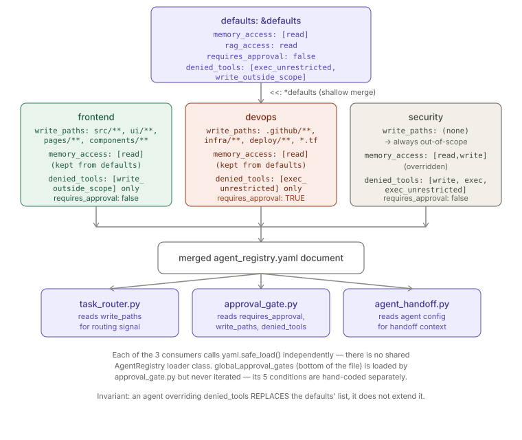

# Specialist Agents

> Relates to: [OVERVIEW.md §6 — one generalist agent doing everything, badly](../OVERVIEW.md#6-one-generalist-agent-doing-everything-badly)

**Source:** [`agents/agent_registry.yaml`](../../agents/agent_registry.yaml) (121 lines).
**Consumed by:** [`agents/orchestration/task_router.py`](../../agents/orchestration/task_router.py),
[`agents/orchestration/approval_gate.py`](../../agents/orchestration/approval_gate.py),
[`agents/orchestration/agent_handoff.py`](../../agents/orchestration/agent_handoff.py).

This doc covers the registry file itself: its schema, its 11 agent entries (orchestrator
+ 10 specialists), and how each consumer reads it. How a task actually gets scored and
assigned to an agent is [`task-routing.md`](task-routing.md); how competing agent
proposals get resolved is [`conflict-resolution.md`](conflict-resolution.md) — this doc
does not duplicate either.

---

## What it does (30-second version)

`agent_registry.yaml` is the single source of truth for "which agents exist, what can
each one touch, and does it need a human to sign off." It is not executable — it's data.
Three separate modules load it independently with plain `yaml.safe_load()` and each
reads only the fields relevant to their job: `task_router.py` reads `write_paths` for
path-based routing signal, `approval_gate.py` reads `requires_approval`, `write_paths`,
and `denied_tools` to decide whether an action needs a human, and `agent_handoff.py`
loads it to pass agent context between handoffs. There is no shared loader class or
schema validator at runtime — [`validation/validate_agents.py`](../../validation/validate_agents.py)
is the only place that checks the file's internal consistency, and it's a standalone
script, not a test enforced by `pytest`.

---

## Configuration reference

### Top-level structure

| Key | Type | Effect |
|---|---|---|
| `version` | int | Schema version; `1` (`agent_registry.yaml:7`). Not checked by any loader — purely documentary today. |
| `defaults` | mapping, YAML-anchored `&defaults` | Merged into every agent via YAML's `<<: *defaults` merge-key syntax — not a runtime default-filling step in Python. |
| `agents` | mapping of name → agent config | 11 entries: `orchestrator` + 10 specialists. |
| `global_approval_gates` | list[str] | Free-text descriptions of actions that always require approval, regardless of agent (`agent_registry.yaml:115-120`). **Not machine-checked against this list** — `approval_gate.py`'s `ApprovalGate.evaluate()` re-implements each of these five conditions in code (tier ≥2, state-mutating terminal, git rewrite, memory prune, out-of-scope write); this list is the human-readable index of that logic, not something the gate iterates over. |

### `defaults` anchor (`agent_registry.yaml:9-15`)

```yaml
defaults: &defaults
  memory_access: ["read"]            # read | write | none
  rag_access: "read"                 # read | none
  requires_approval: false
  denied_tools:
    - "terminal.exec_unrestricted"
    - "filesystem.write_outside_scope"
```

Every agent entry starts with `<<: *defaults` and then overrides individual keys. Because
YAML merge keys perform a **shallow key-level merge**, an agent that sets its own
`denied_tools:` (e.g. `architect`, `backend`, `security`) fully **replaces** the defaults'
`denied_tools` list rather than appending to it — the two universal denials
(`terminal.exec_unrestricted`, `filesystem.write_outside_scope`) are not automatically
carried forward once an agent declares its own list. Inspecting the file confirms every
agent that overrides `denied_tools` re-lists `terminal.exec_unrestricted` (or
`terminal.exec`, which is broader) by hand — so the replacement is consistent in
practice, but it is not enforced by the YAML mechanism itself.

### Per-agent fields

| Field | Type | Present on | Effect |
|---|---|---|---|
| `prompt` | path str | all 11 | Path to the agent's system prompt under `agents/prompts/`. Verified to exist by `validate_agents.py:54-56`; all 11 files exist on disk. |
| `role` | str | all 11 | One-line free-text description. Not read by any loader shown here — documentary. |
| `allowed_tools` | list[str] | all 11 | Tool-id allow-list, dotted `server.tool` or `server.*` glob form (see [tool-id note](#tool-ids-are-documentary-glue-not-an-enforced-allow-list) below). |
| `denied_tools` | list[str] | all 11 (via defaults or override) | Explicit deny list. `approval_gate.py` matches `action` against each pattern with `fnmatch.fnmatch` and, on a match, adds a reason to the verdict (`approval_gate.py:111-113`) — a "denial" surfaces as an approval requirement, not a hard block, at this layer. |
| `memory_access` | list[str] | all 11 (via defaults or override) | `["read"]`, `["read","write"]`, or `["none"]`. 4 of 11 agents (`orchestrator`, `architect`, `security`, `research`) override to `["read","write"]`; the rest keep the read-only default. |
| `rag_access` | `"read"` \| `"none"` | all 11 (via defaults) | Every agent keeps the default `"read"`; none override it in the current file. |
| `requires_approval` | bool | all 11 (via defaults or override) | Only `devops` overrides this to `true` — every devops action is approval-gated, with the inline comment `# every action gated` (`agent_registry.yaml:67`). |
| `write_paths` | list[glob] | `backend`, `frontend`, `database`, `devops`, `testing`, `documentation` (6 of 11) | Repo-relative globs the agent may write inside. Read by both `task_router.py` (as a routing signal, via `fnmatch`) and `approval_gate.py` (as the scope check for write actions). Agents without this key (`orchestrator`, `architect`, `security`, `performance`, `research`) are treated by `ApprovalGate._within_scope()` as having **no writable scope at all** — any write action from them is automatically out-of-scope (`approval_gate.py:124-127`, `if not scopes: return False`). |
| `notes` | str | `database`, `security`, `testing` (3 of 11) | Free-text operational caveats (e.g. no live DB connections, no production fixtures). Documentary only — not read by any loader. |
| `can_spawn` | list[str] | `orchestrator` only | The 10 specialist names the orchestrator may delegate to. Checked by `validate_agents.py:59-60` to equal the `SPECIALISTS` set exactly. |
| `tier_limits.web_search_allowed_tiers` | list[int] | `research` only | `[0, 1]` — the inline comment states no external fetch for tier 2/3 repos (`agent_registry.yaml:111-112`). **Not read by `task_router.py` or `approval_gate.py`** — this is the only field in the file with no confirmed runtime consumer among the three loaders read for this doc; tier-gated fetch enforcement lives in the `documentation.fetch` tool path instead (see [OVERVIEW.md §5](../OVERVIEW.md#5-knowledge-and-search-shouldnt-leave-the-building)), not in this registry. |

#### Tool ids are documentary glue, not an enforced allow-list

`allowed_tools` values like `"lancedb.search"` or `"git.*"` are dotted `server.tool`
identifiers matching entries in [`config/mcp-servers.json`](../../config/mcp-servers.json)
(per the file header comment, `agent_registry.yaml:5`). Neither `task_router.py` nor
`approval_gate.py` reads `allowed_tools` at all — only `write_paths`, `denied_tools`, and
`requires_approval` are consumed at runtime by the two orchestration modules read for
this doc. `allowed_tools` functions as a declared contract for whoever wires an agent's
actual tool grants (e.g. an `.claude/agents/*.md` frontmatter `tools:` list, per the
pattern `tests/test_subagent_tools.py` enforces for the platform's own reviewer
subagents — see [Facts](#facts-invariants--edge-cases) below), not as a field the
registry loaders themselves gate on.

---

## All 11 agents

| Agent | Role (abridged) | `allowed_tools` | `write_paths` | `memory_access` | `requires_approval` | Notable `denied_tools` / notes |
|---|---|---|---|---|---|---|
| `orchestrator` | Decompose, route, gate, synthesize | `memory.*`, `lancedb.search`, `git.log`, `git.diff` | *(none)* | `read`, `write` | `false` | Defaults; `can_spawn` lists all 10 specialists. |
| `architect` | System design, ADRs, dependency analysis | `lancedb.search`, `git.log`, `git.blame`, `filesystem.read`, `memory.read`, `memory.write` | *(none)* | `read`, `write` | `false` | Denies `filesystem.write`, `terminal.exec`, `terminal.exec_unrestricted` — read-only on source. |
| `backend` | API design, business logic, data modeling | `lancedb.search`, `git.*`, `filesystem.read`, `filesystem.write`, `terminal.run_tests`, `memory.read` | `src/**`, `tests/**` | `read` (default) | `false` | Denies `filesystem.write_outside_scope`, `terminal.exec_unrestricted`. |
| `frontend` | UI components, state, accessibility, styling | `lancedb.search`, `git.*`, `filesystem.read`, `filesystem.write`, `terminal.run_tests`, `memory.read` | `src/**`, `ui/**`, `pages/**`, `components/**`, `tests/**` | `read` (default) | `false` | Denies `filesystem.write_outside_scope` only. |
| `database` | Schema, migrations, query optimization | `lancedb.search`, `git.*`, `filesystem.read`, `filesystem.write`, `memory.read` | `migrations/**`, `schema/**`, `db/**` | `read` (default) | `false` | Denies `terminal.exec`, `terminal.exec_unrestricted`, `filesystem.read_secrets`. Notes: "No live DB connections; no connection strings; no seed data access." |
| `devops` | CI/CD, container configs, IaC, monitoring | `lancedb.search`, `git.*`, `filesystem.read`, `filesystem.write`, `terminal.run`, `memory.read` | `.github/**`, `infra/**`, `deploy/**`, `Dockerfile`, `docker-compose*.yml`, `*.tf` | `read` (default) | **`true`** | Only agent with blanket approval; denies `terminal.exec_unrestricted`. |
| `security` | Threat modeling, SAST, dependency audit, secret scan | `lancedb.search`, `git.*`, `filesystem.read`, `terminal.run_audit`, `memory.read`, `memory.write` | *(none)* | `read`, `write` | `false` | Denies `filesystem.write`, `terminal.exec`, `terminal.exec_unrestricted`. Notes: "Read-only on source. Output goes to security log + memory only." |
| `performance` | Profiling, complexity analysis, benchmarks | `lancedb.search`, `git.*`, `filesystem.read`, `terminal.run_benchmarks`, `memory.read` | *(none)* | `read` (default) | `false` | Denies `filesystem.write`, `terminal.exec_unrestricted`. |
| `testing` | Unit/integration/E2E authoring, coverage | `lancedb.search`, `git.*`, `filesystem.read`, `filesystem.write`, `terminal.run_tests`, `memory.read` | `tests/**`, `src/**` | `read` (default) | `false` | Denies `filesystem.write_outside_scope`, `terminal.exec_unrestricted`. Notes: "Mock data only; no production fixtures; no network calls in tests." |
| `documentation` | API docs, ADRs, READMEs, changelogs | `lancedb.search`, `git.log`, `filesystem.read`, `filesystem.write`, `memory.read` | `docs/**`, `ADRs/**`, `RFCs/**`, `README.md`, `CHANGELOG.md` | `read` (default) | `false` | Denies `filesystem.write_source`, `terminal.exec`, `terminal.exec_unrestricted`. |
| `research` | Library evaluation, RFC analysis, dependency research | `lancedb.search`, `filesystem.read`, `documentation.fetch`, `memory.read`, `memory.write` | *(none)* | `read`, `write` | `false` | Denies `filesystem.write`, `terminal.exec`, `terminal.exec_unrestricted`. Only agent with `tier_limits`. |

`backend` and `testing` both declare `src/**` as a write path — this overlap is real in
the file (`agent_registry.yaml:41` and `:91`) and is exactly the kind of ambiguity
`task_router.py`'s intent-keyword scoring (not path matching alone) is meant to break;
see [`task-routing.md`](task-routing.md).

---

## How the registry is loaded

There is no dedicated `AgentRegistry` class — three modules each open and parse the YAML
independently with the standard library pattern:

```python
# agents/orchestration/task_router.py:71-73
def __init__(self, registry_path: str | Path):
    reg = yaml.safe_load(Path(registry_path).read_text())
    self.agents: dict = reg.get("agents", {})
```

```python
# agents/orchestration/approval_gate.py:76-79
self.registry_path = Path(registry_path)
reg = yaml.safe_load(self.registry_path.read_text())
self.agents: dict = reg.get("agents", {})
self.global_gates: list[str] = reg.get("global_approval_gates", [])
```

`agent_handoff.py:78` follows the identical one-line `yaml.safe_load(Path(registry_path).read_text())`
pattern. All three default their CLI `--registry` argument to
`agents/agent_registry.yaml` resolved from the repo root (e.g.
`approval_gate.py:199`, `task_router.py:133`), but all accept an explicit path — so a
caller can point at a different registry file entirely; nothing hardcodes the filename
beyond the CLI default.

`ApprovalGate.evaluate()` reads exactly three fields off an agent's config dict at
decision time — `requires_approval`, `write_paths` (via `_within_scope`), and
`denied_tools` — plus the top-level `global_approval_gates` list is loaded but, as noted
above, never iterated; the five conditions it documents are hand-coded checks in
`evaluate()` (tier, state-mutating terminal keywords, git-rewrite keywords, memory
destructive-op keywords, and out-of-scope write) that happen to correspond 1:1 with the
five bullet points at `agent_registry.yaml:116-120`.

`validate_agents.py` is the only script that treats the registry as something to
validate rather than just consume — it re-parses the YAML itself (it does not import a
shared loader either) and checks: the orchestrator and all 10 specialists are present,
every `prompt` path resolves to a real file, `orchestrator.can_spawn` equals the
specialist set exactly, and then exercises `TaskRouter` and `ApprovalGate` end-to-end
against six representative routing cases and six approval scenarios (`validate_agents.py:35-96`).



---

## Facts, invariants & edge cases

- **The registry is pure data with three independent readers, not one.** There is no
  `AgentRegistry` abstraction — `task_router.py`, `approval_gate.py`, and
  `agent_handoff.py` each call `yaml.safe_load()` on the file separately. A field added
  to the YAML does nothing until some consumer is written to read it (see
  `tier_limits.web_search_allowed_tiers` below).
- **`tier_limits.web_search_allowed_tiers` (research agent only) has no confirmed
  runtime reader among the three orchestration loaders.** It's documented intent
  (`agent_registry.yaml:111-112`) but neither `TaskRouter` nor `ApprovalGate` reads
  `tier_limits`. Don't assume declaring a limit here enforces it — verify the actual
  enforcement point (likely the `documentation.fetch` tool / tier-gated fetch path)
  before relying on it.
- **YAML merge-key (`<<: *defaults`) semantics are shallow, not deep.** An agent that
  overrides `denied_tools` replaces the whole list rather than extending the defaults'
  two-item baseline. Every agent that overrides it in the current file re-adds
  `terminal.exec_unrestricted` (or the broader `terminal.exec`) by hand — this is
  consistent by convention, not enforced by YAML or by any loader.
- **An agent with no `write_paths` key cannot pass a write-scope check at all.**
  `ApprovalGate._within_scope()` returns `False` immediately if `cfg.get("write_paths")`
  is falsy (`approval_gate.py:125-127`) — `orchestrator`, `architect`, `security`,
  `performance`, and `research` are therefore always "out of scope" for any write
  action, which in turn always adds an approval reason via `evaluate()`'s scope check.
  This is presumably intentional (these five are meant to be read-only/advisory) but it
  is enforced as a side effect of an empty list, not a dedicated read-only flag.
- **`devops` is the only agent with blanket `requires_approval: true`.** Every other
  agent relies on the other four gate conditions (tier ≥2, out-of-scope write,
  state-mutating terminal keywords, git rewrite, memory-destructive keywords) rather
  than an unconditional flag.
- **`global_approval_gates` is documentation, not executable policy.** `ApprovalGate`
  loads the list into `self.global_gates` but never iterates it in `evaluate()` — the
  five behaviors it names are separately hand-implemented as keyword/tier/scope checks.
  If someone edits the five bullet points at `agent_registry.yaml:116-120` expecting
  gate behavior to change, it won't; the corresponding Python in `approval_gate.py` has
  to change too.
- **`tests/test_subagent_tools.py` does not test `agent_registry.yaml`.** It enforces a
  related but separate invariant: the platform's actual Claude Code subagent
  definitions under `.claude/agents/*.md` (and the onboarding template's copies under
  `templates/repo-onboarding/.claude/agents/*.md`) must declare an explicit `tools:`
  frontmatter allow-list and must never include `Bash`, `Write`, `Edit`, or
  `NotebookEdit` (`tests/test_subagent_tools.py:15,35-45`). This is the mechanism that
  actually constrains the `code-reviewer` / `architecture-reviewer` / `governance-reviewer`
  subagents referenced in the platform's own `CLAUDE.md` — it's the enforcement layer for
  those three specific agents, not a generic check over every entry in this registry.
  No test file in `tests/` parses `agent_registry.yaml` itself; `validate_agents.py`
  (a standalone script, not collected by `pytest`) is the only consistency check for
  this file.
- **`backend` and `testing` overlap on `src/**` as a write path.** Both declare it
  (`agent_registry.yaml:41`, `:91`); routing between them for a `src/**` target falls to
  `task_router.py`'s intent-keyword scoring, not the path match alone — see
  [`task-routing.md`](task-routing.md) for how the tie is broken.

---

## Related docs

- [`task-routing.md`](task-routing.md) — how `TaskRouter` scores and ranks agents
  against a task description and target path; the consumer of `write_paths` for routing.
- [`conflict-resolution.md`](conflict-resolution.md) — how competing agent proposals
  (e.g. a security veto) are resolved; a separate module from both the registry and the
  router.
- [`approvals-workflow.md`](approvals-workflow.md) — the human-approval UI and gate that
  `ApprovalGate.evaluate()` feeds into once a verdict requires approval.
- [`policy-engine.md`](policy-engine.md) — the filesystem-level allow/deny engine that
  still applies underneath any agent's `write_paths`; the registry's scope is a routing
  and approval concern, not a replacement for policy enforcement.
- [OVERVIEW.md §6](../OVERVIEW.md#6-one-generalist-agent-doing-everything-badly) — the
  product-level framing of the problem this registry solves.
