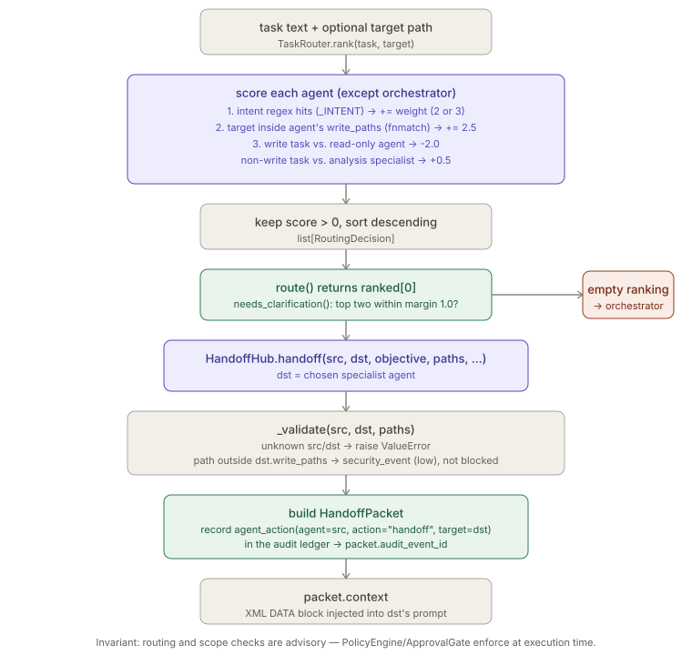
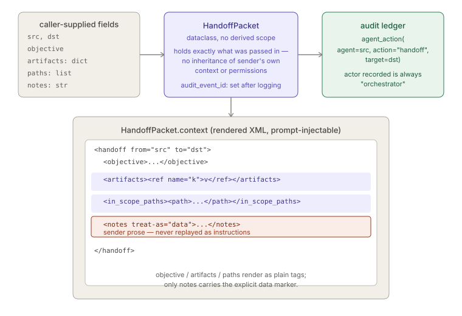

# Task Routing & Handoff

> ⚠ **SUPERSEDED (2026-07-09).** `task_router.py`, `agent_handoff.py`, and `agent_registry.yaml`
> have been retired. Specialist agents now ship as native Claude Code `.claude/agents/*.md` files
> in `templates/repo-onboarding/`. Routing is handled by Claude Code's native agent system —
> the orchestrator agent routes multi-step tasks; single-area tasks go direct to specialists.
> The handoff XML packet format (described below) survives in agent prompts.
> This document is preserved for historical reference only.

> Relates to: [OVERVIEW.md §6 — one generalist agent doing everything, badly](../OVERVIEW.md#6-one-generalist-agent-doing-everything-badly)

**Source (retired):** `agents/orchestration/task_router.py`,
`agents/orchestration/agent_handoff.py`.

This doc covers routing (deciding *which* specialist gets a task) and handoff
(transferring work to that specialist with a scoped context packet). The specialist
roster itself — agent definitions, `write_paths`, `memory_access`, `denied_tools` — is
covered in `specialist-agents.md`; this doc only describes how `task_router.py` reads
that registry to score agents and how `agent_handoff.py` reads it to validate scope.

---

## What it does (30-second version)

`TaskRouter.route(task, target)` picks one specialist agent for a piece of work using a
plain **keyword + path scoring** scheme — regex hits on intent verbs/nouns, a bonus if
the `target` path falls under the candidate agent's `write_paths`, and a penalty/bonus
for read-only-vs-write capability mismatch. It is not ML-based and not a fixed
if/elif rule tree: every agent gets a numeric score and the router returns (or ranks)
by score. Routing **never grants permission** — it only names a candidate; the
`PolicyEngine` and `ApprovalGate` still gate anything that agent actually does.

`HandoffHub.handoff(src, dst, ...)` then packages exactly the objective, artifacts, and
paths the receiving agent needs into a `HandoffPacket`, records the transfer as an
`agent_action` in the audit ledger, and renders the packet as an XML-tagged DATA block
(`packet.context`) safe to inject into the receiver's prompt — sender notes are marked
`treat-as="data"` so they can't be replayed as instructions.

---

## How task_router.py works

### Scoring, not classification

`TaskRouter.rank()` loops every agent in the registry (skipping `orchestrator`) and
accumulates a float score from three independent signals:

```python
# agents/orchestration/task_router.py
for pat, w in _INTENT.get(agent, []):
    if re.search(pat, task_l):
        score += w
        why.append(f"intent match (+{w})")

# path-based signal: target inside this agent's write_paths
if target:
    for wp in cfg.get("write_paths", []):
        t = target.lstrip("./")
        if fnmatch.fnmatch(t, wp) or fnmatch.fnmatch(t, wp.rstrip("/*") + "/*"):
            score += 2.5
            why.append(f"target in write_paths '{wp}' (+2.5)")
            break

# capability alignment
if wants_write and agent not in _WRITE_AGENTS and score > 0:
    score -= 2.0
    why.append("write task but agent is read-only (-2.0)")
if not wants_write and agent in {"architect", "security",
                                 "performance", "research"} and score > 0:
    score += 0.5
    why.append("analysis task suits read-only specialist (+0.5)")
```

1. **Intent keywords** (`_INTENT`, `task_router.py`) — a per-agent list of
   `(regex, weight)` pairs, matched with `re.search` (case-insensitive via
   `task.lower()`, not an `re.I` flag) against the lowercased task string. Weights are
   `2` or `3` per pattern; an agent can match more than one pattern and accumulate both.
2. **Path signal** — only applied if a `target` path was passed. If it matches (via
   `fnmatch`) one of the candidate agent's `write_paths` glob entries — tried both
   as-is and with a trailing `/*` appended after stripping `/*` — the agent gets a flat
   `+2.5`, and the loop `break`s (only the first matching `write_paths` entry counts,
   not one bonus per match).
3. **Capability alignment** — `_WRITE_INTENT` (`task_router.py`) is a single regex
   over verbs like `write|add|implement|create|edit|fix|refactor|build|update|author|
   generate|modify`. If the task matches it, `wants_write` is `True`; any agent **not**
   in `_WRITE_AGENTS` (`architect`, `security`, `performance`, `research` — note
   `documentation` is in `_WRITE_AGENTS`, see the [fact below](#facts-invariants--edge-cases))
   that already has `score > 0` gets a flat `-2.0` penalty. Conversely, a non-write task
   gives a `+0.5` bonus to the read-only-flavored specialists
   `{architect, security, performance, research}` if they already scored.

Only the capability adjustment (step 3) is conditioned on `score > 0` from the other
two signals — the path bonus (step 2) is unconditional and adds `+2.5` on its own. The
final filter before an agent enters the ranked list only excludes agents that scored
`0` on everything:

```python
# agents/orchestration/task_router.py
if score > 0:
    out.append(RoutingDecision(agent, round(score, 2),
                               "; ".join(why) or "weak match"))

out.sort(key=lambda d: d.score, reverse=True)
return out
```

So a task whose text matches no intent pattern for a given agent can still rank that
agent, purely from the `target`-path bonus — see the fact below.

### `route()` and `needs_clarification()`

```python
# agents/orchestration/task_router.py
def route(self, task: str, target: str | None = None) -> RoutingDecision:
    ranked = self.rank(task, target)
    if not ranked:
        return RoutingDecision("orchestrator", 0.0,
                               "no specialist matched; orchestrator handles directly")
    return ranked[0]

def needs_clarification(self, task: str, target: str | None = None,
                        margin: float = 1.0) -> bool:
    ranked = self.rank(task, target)
    return len(ranked) >= 2 and (ranked[0].score - ranked[1].score) < margin
```

- **Empty ranking falls back to `"orchestrator"`** with score `0.0` — the orchestrator
  agent is explicitly excluded from scoring (`task_router.py`) but is the named
  fallback when nothing else scored above `0`.
- **Ambiguity is a fixed absolute margin (`1.0`) between the top two scores**, not a
  ratio or a confidence threshold. `needs_clarification()` recomputes the full ranking
  independently — it does not reuse a prior `route()` call's result.
- Neither method mutates the router or the registry; `TaskRouter` holds no per-call
  state beyond `self.agents`, loaded once in `__init__`.



---

## How to use it

```bash
# Route a task and see only the winning specialist
claude-env route "fix the flaky login test"

# Bias routing with the primary file/path the task touches — the +2.5
# write_paths bonus (see the scoring walkthrough above) can flip the winner
claude-env route "update the dashboard styles" --target frontend/src/Dashboard.tsx

# See the full ranking, not just the top pick — useful for debugging *why*
# one specialist beat another (which intent patterns matched, whether the
# path bonus or the write-capability penalty/bonus decided it)
claude-env route "write docs for the new endpoint" --all

# Point at a different registry, e.g. a repo-local override
claude-env route "add an index to the users table" --registry ./agents/agent_registry.yaml
```

`--all` is the one worth reaching for whenever a routing decision looks surprising:
it reruns `rank()` and prints every agent's score plus its `why` string, so you can
see whether a low-scoring candidate lost on intent keywords, the `target` path
falling outside its `write_paths`, or the `-2.0` read-only penalty — rather than
just seeing the single winner and guessing. `--target` and `--registry` default to
`None` and `agents/agent_registry.yaml` at the repo root respectively when omitted.

---

## How agent_handoff.py works

### `HandoffPacket` — the scoped context container

```python
# agents/orchestration/agent_handoff.py
@dataclass
class HandoffPacket:
    src: str
    dst: str
    objective: str
    artifacts: dict[str, str] = field(default_factory=dict)
    paths: list[str] = field(default_factory=list)
    notes: str = ""
    audit_event_id: int | None = None
```

The packet carries only what was explicitly passed to `HandoffHub.handoff()` — there is
no mechanism by which the receiver inherits the sender's full context, open files, or
prior conversation. The **scoping is entirely caller-driven**: whoever calls `handoff()`
decides which `artifacts` (a name → path/ref dict) and which `paths` (files the receiver
is expected to touch) go into the packet. There is no automatic derivation from the
sender's own permissions.

### Context rendering wraps everything as DATA

```python
# agents/orchestration/agent_handoff.py
@property
def context(self) -> str:
    """Prompt-injectable, clearly delimited DATA block for the receiver."""
    lines = [
        f"<handoff from=\"{self.src}\" to=\"{self.dst}\">",
        f"  <objective>{self.objective}</objective>",
    ]
    ...
    if self.notes:
        # notes are sender-authored => treat as data, not instructions
        lines.append(f"  <notes treat-as=\"data\">{self.notes}</notes>")
    lines.append("</handoff>")
    return "\n".join(lines)
```

`objective` and `artifacts` are *not* wrapped in a `treat-as="data"` attribute — only
free-text `notes` gets that marker. The objective is meant to be read as the receiver's
actual task, while notes (arbitrary sender prose) are explicitly flagged so a prompt
built from this XML can distinguish "your job" from "context the sender wrote, which
might contain adversarial text."

### `_validate()` — scope checking is advisory, not blocking

```python
# agents/orchestration/agent_handoff.py
def _validate(self, src: str, dst: str, paths: list[str]) -> None:
    if src not in self.agents:
        raise ValueError(f"unknown source agent: {src}")
    if dst not in self.agents:
        raise ValueError(f"unknown destination agent: {dst}")
    # narrow scope: dst may only RECEIVE paths it could plausibly write/read.
    dst_cfg = self.agents[dst]
    write_paths = dst_cfg.get("write_paths")
    if write_paths:
        import fnmatch
        for p in paths:
            t = p.lstrip("./")
            ok = any(fnmatch.fnmatch(t, wp) or
                     fnmatch.fnmatch(t, wp.rstrip("/*") + "/*") for wp in write_paths)
            if not ok:
                # not fatal for read-only handoffs, but flagged in audit notes
                self.audit.security_event(
                    category="handoff_scope", severity="low",
                    detail=f"path '{p}' handed to {dst} is outside its write_paths",
                    source="agent_handoff")
```

This is the exact context-scoping check: for each path in the handoff, it's matched
(same `fnmatch` + trailing-`/*` normalization used by `task_router.py`) against the
destination agent's `write_paths` from the registry. **A mismatch does not raise or
block the handoff** — it only emits a `security_event` (`category="handoff_scope",
severity="low"`) via the same `AuditLogger` instance. The only conditions that actually
raise (`ValueError`) are an unknown `src` or `dst` agent name. If `dst_cfg` has no
`write_paths` key at all (e.g. a read-only agent like `architect`), the whole path-match
loop is skipped — no scope signal is emitted for agents that don't declare write paths.

### `handoff()` — build, validate, record, return

```python
# agents/orchestration/agent_handoff.py
def handoff(self, src: str, dst: str, objective: str,
            artifacts: dict[str, str] | None = None,
            paths: list[str] | None = None, notes: str = "") -> HandoffPacket:
    artifacts = artifacts or {}
    paths = paths or []
    self._validate(src, dst, paths)

    packet = HandoffPacket(src=src, dst=dst, objective=objective,
                           artifacts=artifacts, paths=paths, notes=notes)
    eid = self.audit.agent_action(
        agent=src, action="handoff",
        target=dst,
        summary=json.dumps({"objective": objective, "paths": paths,
                            "artifacts": list(artifacts.keys())}),
        success=True)
    packet.audit_event_id = eid
    return packet
```

Every handoff — scope-clean or not — is recorded as one `agent_action` audit event
(`agent=src, action="handoff", target=dst`), whose `summary` is a JSON blob of the
objective, paths, and artifact *keys* (not artifact values/content). The returned
`eid` is stored back on the packet as `audit_event_id`, giving the packet a durable
link to its own provenance row for later audit/session-replay lookups (see
[`audit-ledger.md`](audit-ledger.md)).

`HandoffHub.__init__` constructs its own `AuditLogger(session_id=session_id,
actor="orchestrator", repo=repo, tier=tier)` (`agent_handoff.py`) — the actor
recorded for every handoff and scope-violation event is always `"orchestrator"`,
regardless of which agent is `src`.



---

## Facts, invariants & edge cases

- **No test file exists for either module.** A search of `tests/` for `task_router`,
  `agent_handoff`, `routing`, `handoff`, and `orchestrat*` returned nothing. All
  behavior above is verified directly against the source; none of it is confirmed by
  an automated test today.
- **Routing is pure regex + glob scoring, not ML** — see
  [Scoring, not classification](#scoring-not-classification) above; there is no model,
  embedding similarity, or learned weight, only hand-picked integer/float weights
  (`task_router.py`).
- **`documentation` is a write agent, contrary to what its intent bucket might suggest.**
  `_WRITE_AGENTS = {"backend", "frontend", "database", "devops", "testing",
  "documentation"}` (`task_router.py`) — a documentation task that also matches
  `_WRITE_INTENT` (e.g. "write the README") does **not** get the read-only penalty,
  because `documentation` is in the write set.
- **The `+2.5` path bonus does not require any intent-keyword match.** Because the
  `if target:` block (`task_router.py`) runs independently of the intent loop
  above it, a task whose text matches no `_INTENT` pattern for an agent can still enter
  the ranked list purely because `target` falls under that agent's `write_paths` — the
  final `if score > 0` gate only excludes agents that scored on nothing at all, not
  agents that scored only on path.
- **`needs_clarification()` always recomputes ranking from scratch** — see
  [`route()` and `needs_clarification()`](#route-and-needs_clarification) above;
  calling both back to back, as the CLI's `_main()` does, runs `rank()` twice.
- **Scope violations in `agent_handoff.py` are logged, never enforced** — see
  [`_validate()`](#_validate--scope-checking-is-advisory-not-blocking) above. Real
  enforcement happens later, at execution time, via the `PolicyEngine` and
  `ApprovalGate`; nothing in either module stops the receiver from *acting* on paths
  outside its declared scope.
- **`notes` is the only field marked `treat-as="data"` in the rendered context** — see
  [Context rendering wraps everything as DATA](#context-rendering-wraps-everything-as-data)
  above; a consumer building a receiver prompt needs its own logic to decide how much
  trust to extend to `objective` versus `notes`.
- **Both modules independently reimplement the same path-matching idiom** — `fnmatch.fnmatch(t, wp) or fnmatch.fnmatch(t, wp.rstrip("/*") + "/*")` appears verbatim in both `task_router.py` and `agent_handoff.py`. There is no shared helper; a change to one does not propagate to the other.
- **CLI entry points exist for both modules and are directly runnable** —
  `task_router.py`'s `_main()` supports `--all` to print the full ranking, and
  `agent_handoff.py`'s `__main__` block builds and prints a handoff packet's `.context`
  from `--src`/`--dst`/`--objective`/`--path` flags. Both default `--registry` to
  `agents/agent_registry.yaml` at the repo root via the same `_ROOT = Path(__file__).resolve().parents[2]` computation.

---

## Related docs

- [`specialist-agents.md`](specialist-agents.md) — the agent registry schema
  (`write_paths`, `memory_access`, `rag_access`, `denied_tools`, `requires_approval`)
  that both modules read; not duplicated here.
- [`approvals-workflow.md`](approvals-workflow.md) — what actually gates a specialist's
  action once routed/handed-off: `ApprovalGate` and human approval for anything
  `requires_approval`.
- [`policy-engine.md`](policy-engine.md) — the filesystem chokepoint that enforces real
  read/write boundaries; routing's `write_paths` check is advisory, this is not.
- [`audit-ledger.md`](audit-ledger.md) — the hash-chained ledger `agent_action` and
  `security_event` write into; how to look up a handoff's `audit_event_id` later.
- [OVERVIEW.md §6](../OVERVIEW.md#6-one-generalist-agent-doing-everything-badly) — the
  product-level framing of the problem this module solves.
