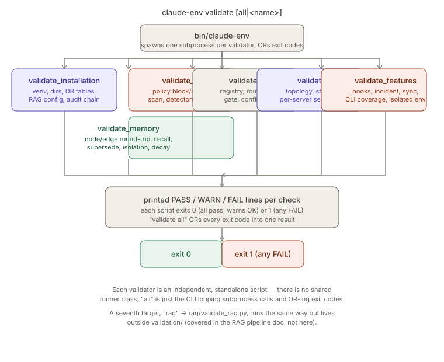

# Validation Suite

> Relates to: [OVERVIEW.md §7 — you can't tell if it's working well or costing too
> much](../OVERVIEW.md#7-you-cant-tell-if-its-working-well-or-costing-too-much)

**Source:** [`validation/validate_installation.py`](../../validation/validate_installation.py) (174 lines),
[`validation/validate_security.py`](../../validation/validate_security.py) (123 lines),
[`validation/validate_memory.py`](../../validation/validate_memory.py) (107 lines),
[`validation/validate_agents.py`](../../validation/validate_agents.py) (124 lines),
[`validation/validate_mcp.py`](../../validation/validate_mcp.py) (132 lines),
[`validation/validate_features.py`](../../validation/validate_features.py) (324 lines).
**Invoked by:** [`bin/claude-env`](../../bin/claude-env) (`validate` command).

This doc covers everything under `validation/` only. A seventh validator target,
`rag` → [`rag/validate_rag.py`](../../rag/validate_rag.py), is dispatched the same way
by the CLI but lives outside `validation/` and isn't covered here.

---

## What it does (30-second version)

`claude-env validate [all|<name>]` runs one or more standalone Python scripts, each
of which exercises a slice of the platform end-to-end and prints `PASS`/`WARN`/`FAIL`
per check, then exits `0` (all checks passed, warnings are non-fatal) or `1` (at
least one hard failure). There is no shared runner class or test framework — each
script is `if __name__ == "__main__": raise SystemExit(main())`, and `bin/claude-env`
just spawns them as subprocesses and ORs the exit codes together for `validate all`.
This is smoke-testing/health-checking, not `pytest`: it targets a real (or, for
`validate_features`, a hermetically isolated) `$CLAUDE_ENV_HOME` and database rather
than mocks.

---

## Invocation

```python
# bin/claude-env:51
VALIDATORS = ["installation", "security", "rag", "memory", "agents", "mcp", "features"]
```

```python
# bin/claude-env:136-145
if cmd == "validate":
    which = rest[0] if rest else "all"
    targets = VALIDATORS if which == "all" else [which]
    rc = 0
    for v in targets:
        script = (ROOT / "rag" / "validate_rag.py") if v == "rag" \
                 else (ROOT / "validation" / f"validate_{v}.py")
        args = rest[1:] if v == "rag" else []
        rc |= subprocess.run([PYTHON, str(script), *args]).returncode
    return rc
```

```bash
claude-env validate                 # same as `validate all` — runs all 7, ORs exit codes
claude-env validate security        # run just one
python validation/validate_memory.py   # or invoke a script directly
```

Each script can also be run directly with the deployed venv's Python
(`~/.claude-env/venv/bin/python validation/validate_installation.py`), which is how
their own docstrings document usage — the CLI wrapper adds nothing but subprocess
dispatch and exit-code aggregation.

---

## Reference table — one row per validator

| Validator | What it checks (function-level) | Failure surface |
|---|---|---|
| `validate_installation.py` | `main()` only (no helper functions besides `check()`): Python ≥3.13; `$CLAUDE_ENV_HOME/venv/` exists and its `python`/`pip` run; required dirs (`state`, `knowledge/lancedb`, `models`, `config`, `archive`, `logs`); DB reachable via `lib.db.get_db()` and all 15 expected tables present; `import yaml` (hard-required); soft-checks `lancedb`, `onnxruntime`, `mcp`, `llama_cpp`; RAG embedding-model file presence and reranker load via `rag.config.get_config()`; `AuditLogger(...).verify_chain()`. | Printed `PASS/WARN/FAIL` per line to stdout; exit `1` if `_failures > 0`, else `0` (warnings alone don't fail it — see [Facts](#facts-invariants--edge-cases)). |
| `validate_security.py` | `main()` only: `PolicyEngine.evaluate_path()` must `block` a known-bad set (`.env`, `secrets/key.pem`, `deploy/id_rsa`, `backups/dump.sql`, etc.) and `allow` a known-good set (`src/app.py`, `docs/adr/0001.md`, ...); `scan_content()` flags + redacts/blocks a planted AWS key; `PromptInjectionDetector.scan()` flags a classic injection and leaves a benign prompt unblocked; `SecretDetector.scan()` flags a planted credential; `RagPoisonDetector.scan_chunk()` flags an instruction-laden chunk; direct `UPDATE`/`DELETE` on `audit_events` must raise (DB trigger). | Same PASS/FAIL-per-line + exit `1`/`0` pattern; no soft warnings in this script — every check is hard. |
| `validate_memory.py` | `main()` only, all against a throwaway `test:<uuid>` namespace: `add_node`/`get_node` round-trip; `add_edge` + `MemoryRetriever.expand()` reaches the linked node; `keyword_recall()` finds a node by name; `supersede()` creates a new node and marks the old one's `superseded_by`; an `isolated=True` retriever's `keyword_recall(..., extra_ns=[other_ns])` returns nothing from a different namespace; `effective_confidence()` decays a 1.0-confidence, 26-year-old node below 1.0; `memory_validator.validate_ns(ns, repair=False)` reports zero dangling edges. | Exit `1`/`0`; a `memory_validator` import/run exception is itself turned into a `FAIL` line rather than crashing the script. |
| `validate_agents.py` | `main()` only: `agent_registry.yaml` parses and defines `orchestrator` + all 10 named specialists (`architect`, `backend`, `frontend`, `database`, `devops`, `security`, `performance`, `testing`, `documentation`, `research`); every agent's `prompt` path exists on disk; `orchestrator.can_spawn` equals the specialist set exactly; `TaskRouter.route()` sends 6 representative tasks to the expected specialist; `ApprovalGate.evaluate()` requires approval for tier-2 writes, devops actions unconditionally, out-of-scope writes, state-mutating terminal commands, git history rewrites, and memory prune, but *not* for an in-scope tier-0 backend edit; `ConflictResolver.resolve()` gives a security veto (`is_security_block=True`) precedence and marks a genuine two-agent stalemate `escalate=True`. | Exit `1`/`0`; no soft warnings. |
| `validate_mcp.py` | `main()` only: `config/mcp-servers.json` parses and declares all 7 expected servers; `startup_order` values are unique and `filesystem-policy` has the minimum; every non-optional server's `server.py` file exists (`jetbrains` is IDE-provided, skipped); `filesystem-policy.security.{enforces_policy_engine,content_scan}`; `lancedb-rag.security.{read_only,wraps_results_as_data}`; `terminal.security.allowlist_only` and `"terminal.exec_unrestricted"` present in its `denies` list; `memory-graph.security.namespace_isolation`; `documentation.security.external_fetch_tiers == [0, 1]`; each server module can be `importlib`-loaded and exposes a `server` attribute (soft-checked — skipped/WARN if the `mcp` package isn't installed). | Exit `1`/`0`; the import-and-expose-`server` checks are the only soft (`WARN`, non-fatal) checks in this script. |
| `validate_features.py` | One `main()` plus a `_make_fixture()` helper that builds a tiny real git repo (`src/engine.py`, matching test, a doc referencing both a real and a missing file) so repo-quality tools have something realistic to scan. Runs entirely inside a freshly created temp `$CLAUDE_ENV_HOME` + SQLite DB (set via env vars **before** any platform import, since `get_db()` is a singleton) so it never touches the real ledger/memory/settings. Exercises, as subprocess or in-process calls: `hooks/policy_hook.py` (deny/allow/ask-on-secret decisions), `hooks/install_hooks.py --dry-run`; `security/incident.py on/off` + `PolicyEngine` block/restore; `memory/session_ingestor.ingest()` (session-node creation, retrieval→edit "used" signal via `observability.feedback`, re-run dedup); `audit/compliance_report.py` and `audit/session_replay.py --list`; `memory/memory_sync.py export/import` (secret redaction, same-DB idempotent skip, cross-namespace remap on import); `security/policy_sim.py simulate` against a candidate policy; `observability/budgets.py` (exceeded-budget exit code 1); `rag/test_impact.py`, `rag/doc_drift.py`, `rag/context_pack.py`, `agents/analysts/nightly_analyst.py` against the fixture repo; `agents/orchestration/approvals_ui._pending_html()`; `rag/pipelines/know.py`; `claude-plugin/` manifest JSON validity (skipped with a printed `SKIP` line if the plugin dir is absent, e.g. in a deployed mirror); and a static string-scan of `bin/claude-env`'s source confirming 15 named CLI subcommands are present. | Exit `1`/`0`; the plugin-manifest check degrades to a printed `SKIP` (not `WARN`/`FAIL`) rather than failing when `claude-plugin/` doesn't exist in the current tree. |

No dedicated `tests/test_validate_*.py` files exist for the validation suite itself —
these scripts *are* the tests (for the rest of the platform), not a target of the
`pytest` suite.

---

## How the checks work

### The shared `check()` idiom

Every script defines its own module-level `check(label, cond, soft=False)` — there is
no shared base class or imported helper; the near-identical function is duplicated
five times (six, counting `validate_features.py`'s slightly different two-argument
`check(label, cond, detail="")`):

```python
# validation/validate_installation.py:37-46
def check(label: str, cond: bool, soft: bool = False) -> None:
    global _failures, _warnings
    if cond:
        print(f"{GREEN}PASS{RESET} {label}")
    elif soft:
        _warnings += 1
        print(f"{YELLOW}WARN{RESET} {label}")
    else:
        _failures += 1
        print(f"{RED}FAIL{RESET} {label}")
```

`validate_security.py`, `validate_memory.py`, and `validate_agents.py` use a stripped
two-color (`GREEN`/`RED`) variant with no `soft` parameter at all — every check in
those three scripts is hard-fail. Only `validate_installation.py`, `validate_mcp.py`,
and (implicitly, via printed `SKIP` lines rather than a `soft` flag)
`validate_features.py` have a non-fatal outcome.

### `validate_features.py` isolates itself before importing platform code

Because `lib.db.get_db()` is a module-level singleton, the script sets
`CLAUDE_ENV_HOME` and `CLAUDE_ENV_DSN` to a fresh `tempfile.mkdtemp()` path **before**
any `from lib.db import ...` or other platform import runs, then applies the schema
files directly:

```python
# validation/validate_features.py:30-36, 77-82
_TMP = tempfile.mkdtemp(prefix="claude-env-features-")
os.environ["CLAUDE_ENV_HOME"] = _TMP
os.environ["CLAUDE_ENV_DSN"] = f"sqlite:///{_TMP}/state/test.db"
(Path(_TMP) / "state").mkdir(parents=True, exist_ok=True)
...
db = get_db()
db.apply_schema(str(REPO / "sql" / "001_schema.sql"),
                str(REPO / "sql" / "002_retention.sql"),
                str(REPO / "sql" / "003_extensions.sql"))
```

This is the only validator that spins up an isolated environment; the other five
(`installation`, `security`, `memory`, `agents`, `mcp`) run directly against whatever
`$CLAUDE_ENV_HOME` and database are already configured — which is why
`validate_memory.py` and `validate_security.py` go out of their way to use throwaway
namespaces / non-destructive probes (a `test:<uuid>` namespace; an inserted-then-
UPDATE/DELETE-attempted audit row) instead of a sandboxed DB.

### The fixture repo behind the repo-quality checks

`validate_features.py`'s repo-quality checks (`policy_sim`, `test_impact`, `doc_drift`,
`context_pack`, `nightly_analyst`) don't run against the platform's own working tree.
A comment explains why: the *deployed* copy at `$CLAUDE_ENV_HOME` is a mirror with no
`tests/`, `docs/`, or `.git`, so those tools need a real, minimal, committed git repo
to have anything meaningful to analyze:

```python
# validation/validate_features.py:51-56
def _make_fixture() -> Path:
    """A tiny committed git repo so the repo-quality tools (policy-sim, test-impact,
    doc-drift, nightly analyst) run hermetically — independent of where this
    validator lives (source checkout vs the mirrored $CLAUDE_ENV_HOME, which has no
    tests/docs/.git). Contains a doc that references code, a source file, and a
    name-matching test."""
```

The fixture deliberately includes a doc reference to a file that does **not** exist
(`docs/guide.md` mentions `src/missing.py`) so `doc_drift.py`'s "reference_pairs > 0"
check has real drift to find, not just a clean bill of health.

---

## Flow diagram


*`bin/claude-env` spawns each validator as its own subprocess and ORs their exit
codes; each validator is independently PASS/WARN/FAIL-per-check and independently
exits 0 or 1 — there is no shared runner, only the CLI's loop.*

---

## Facts, invariants & edge cases

- **Warnings never fail a script — except when they silently don't exist.**
  `validate_installation.py` and `validate_mcp.py` explicitly separate `_warnings`
  from `_failures` and only `return 1` on `_failures` (`validation/validate_installation.py:164-169`,
  `validation/validate_mcp.py:122-127`). `validate_security.py`, `validate_memory.py`,
  and `validate_agents.py` have no `soft` concept at all — every failed check in those
  three is fatal.
- **`validate_features.py` is the only validator that never touches the real
  `$CLAUDE_ENV_HOME`.** It redirects `CLAUDE_ENV_HOME`/`CLAUDE_ENV_DSN` to a fresh
  `tempfile.mkdtemp()` before importing anything platform-related, specifically to
  avoid polluting the real audit ledger, memory graph, or settings
  (`validation/validate_features.py:5-6, 30-34`).
  `validate_memory.py` and `validate_security.py` instead protect the real
  environment by using disposable namespaces / reversible probes rather than a
  sandboxed DB — two different isolation strategies for the same underlying concern.
- **`validate_mcp.py` resolves server paths against the *repo*, not the deployed
  mirror, even though the config uses `${CLAUDE_ENV_HOME}`.** `_server_path()`
  strips everything up to `mcp-servers/` from the configured arg and re-joins it
  under `REPO`, specifically so this validator works from a source checkout
  (`validation/validate_mcp.py:47-53`).
- **The `mcp` package is optional for `validate_mcp.py`'s import checks but not for
  its config-shape checks.** If `import mcp` fails, every per-server "does it import
  and expose `server`" check downgrades to `WARN` instead of `FAIL`
  (`validation/validate_mcp.py:99-119`); the JSON-shape and security-posture
  assertions earlier in the same script are unaffected and remain hard failures.
- **`validate_features.py`'s plugin-manifest check is conditionally skipped, not
  soft-failed.** If `claude-plugin/` doesn't exist in the current tree (true for a
  deployed `$CLAUDE_ENV_HOME` mirror, since the plugin is a distribution artifact),
  the script prints a `SKIP` line and does not increment `_failures` at all — a third
  outcome distinct from both `PASS`/`FAIL` and the `WARN` used elsewhere
  (`validation/validate_features.py:289-303`).
  The CLI-dispatcher-coverage check at the end of the same script is a static string
  scan of `bin/claude-env`'s source text for 15 literal quoted subcommand names, not
  an actual invocation of each subcommand (`validation/validate_features.py:305-312`).
- **`validate_agents.py` hardcodes the 10-specialist set as a Python literal**, not
  derived from the registry file:
  `{"architect", "backend", "frontend", "database", "devops", "security",
  "performance", "testing", "documentation", "research"}`
  (`validation/validate_agents.py:35-36`). Adding an 11th specialist to
  `agent_registry.yaml` without also updating this set will make
  `"registry defines all 10 specialists"` and `"orchestrator can_spawn == specialists"`
  fail even though the registry itself is internally consistent.
- **`validate_memory.py`'s decay check uses a fixed ancient timestamp, not "now minus
  N days."** It calls `effective_confidence(1.0, half_life=30,
  updated_at="2000-01-01T00:00:00Z")` and only asserts the result is `< 1.0`
  (`validation/validate_memory.py:84-86`) — it doesn't assert a specific decayed
  value, so it would still pass even if the half-life math changed, as long as *some*
  decay occurs over a 26-year gap.
- **`rag` is a seventh `VALIDATORS` entry that structurally doesn't belong to this
  directory.** `bin/claude-env:51` lists it alongside the six covered here, but its
  script lives at `rag/validate_rag.py`, not `validation/validate_rag.py`
  (`bin/claude-env:141-142` special-cases the path). `claude-env validate all` runs
  all seven; this doc only covers the six under `validation/`.
- **None of the six scripts import each other or share a base module** beyond
  standard library and the platform modules they're testing — each is a fully
  standalone `if __name__ == "__main__"` entry point, confirmed by re-reading every
  file's imports; the duplicated `check()`/color-constant boilerplate is a real,
  acknowledged-in-passing seam (not called out in the source itself) rather than a
  designed one.

---

## Related docs

- [`policy-engine.md`](policy-engine.md) — the `PolicyEngine` behavior
  `validate_security.py` and `validate_features.py`'s incident-mode checks exercise.
- [`native-tool-hooks.md`](native-tool-hooks.md) — `policy_hook.py`/`install_hooks.py`,
  exercised by `validate_features.py`'s hooks section.
- [`memory-graph.md`](memory-graph.md) — `MemoryManager`/`MemoryRetriever`, exercised
  end-to-end by `validate_memory.py`.
- [`memory-sync.md`](memory-sync.md) — `memory_sync.py` export/import/redaction,
  exercised by `validate_features.py`.
- [`approvals-workflow.md`](approvals-workflow.md) — `ApprovalGate` and the approvals
  UI internals, exercised by `validate_agents.py` and `validate_features.py`.
- [`audit-ledger.md`](audit-ledger.md) — the append-only trigger `validate_security.py`
  fires directly, and `compliance_report.py`/`session_replay.py` exercised by
  `validate_features.py`.
- [OVERVIEW.md §7](../OVERVIEW.md#7-you-cant-tell-if-its-working-well-or-costing-too-much) —
  the product-level framing: these validators are how you know the platform (and its
  cost/observability surfaces) actually still work, on demand.
